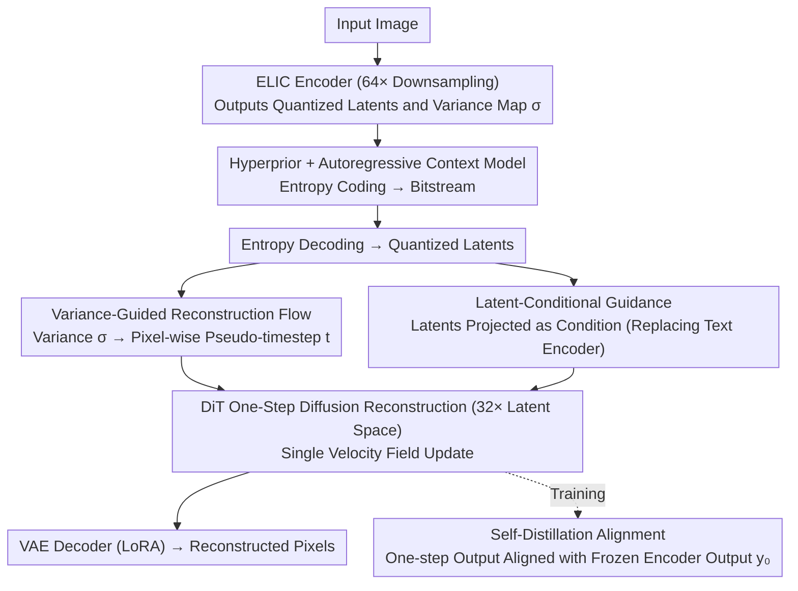

# DiT-IC: Aligned Diffusion Transformer for Efficient Image Compression

**Conference**: CVPR 2026  
**arXiv**: [2603.13162](https://arxiv.org/abs/2603.13162)  
**Code**: [Project Page](https://njuvision.github.io/DiT-IC/)  
**Area**: Image Compression / Generative Models  
**Keywords**: diffusion transformer, image compression, one-step diffusion, flow matching, latent alignment, variance-guided

## TL;DR

This work adapts a pretrained text-to-image DiT (SANA) into an efficient one-step image compression decoder. Through three alignment mechanisms—variance-guided reconstruction flow (pixel-adaptive denoising intensity), self-distillation alignment (using encoder latents as distillation targets), and latent-conditional guidance (replacing text encoders)—it achieves SOTA perceptual quality (BD-rate DISTS -87.88%) in a 32× downsampled deep latent space. It is 30× faster in decoding and can reconstruct 2K images within 16GB of laptop VRAM.

## Background & Motivation

**Background**: Diffusion-based image compression excels in perceptual fidelity (e.g., PerCo, DiffEIC, ResULIC, StableCodec) but is limited by multi-step sampling overhead and high memory consumption. Existing methods generally use U-Net architectures, whose hierarchical downsampling forces diffusion to operate in shallow latent spaces (8× downsampling). Conventional VAE codecs can operate in much deeper latent spaces (16×-64×).

**Limitations of Prior Work**: 

1. U-Net multi-step diffusion in 8× shallow latent space imposes heavy computational and memory burdens (e.g., DiffEIC takes 12.4s for 50 steps).
2. One-step methods (StableCodec, OSCAR) still rely on U-Net and cannot natively perform diffusion in deep latent spaces.
3. Direct porting of generative DiTs to compression latent spaces leads to severe degradation due to the fundamental mismatch between the generative goal (from pure noise) and the reconstruction goal (from structured quantized latents).

**Key Challenge**: The generative prior of diffusion models favors perceptual reconstruction, but the "iterative denoising from pure noise" paradigm is fundamentally mismatched with the "one-step reconstruction from known structured latents" requirement of compression.

**Goal**: Enable diffusion to work efficiently in extremely compact deep latent spaces (32×), folding multi-step iterations into a deterministic one-step transformation.

**Key Insight**: Three "alignment" mechanisms bridge generation and compression: aligning denoising intensity (variance $\to$ timestep), aligning multi-step to single-step (self-distillation), and aligning conditioning methods (text $\to$ latents).

**Core Idea**: Compressed quantized latents already reside near the data manifold, and their spatial variance naturally encodes local "denoising requirements." Mapping variance to pseudo-timesteps allows folding iterative denoising into one-step adaptive reconstruction.

## Method

### Overall Architecture

The goal is to transform a pretrained text-to-image model (SANA, a DiT) into a compression decoder that performs "one-step reconstruction from known quantized latents." The pipeline is as follows: an image is compressed into a 64× downsampled space using an ELIC-style encoder, followed by entropy coding with a hyperprior and a lightweight DepthConvBlock-based autoregressive context model. At the decoder, latents are fed into a DiT operating in a 32× deep latent space to complete diffusion reconstruction in **one step**, then mapped back to pixels by the VAE decoder. Adaptation involves minimal parameters: LoRA rank 32 for the VAE decoder, LoRA rank 64 for the DiT, and the use of NoPE (No Position Embedding) in the DiT to support arbitrary resolution generalization (stable up to $4096^2$).

### Key Designs

**1. Variance-Guided Reconstruction Flow: Using encoder variance as "pixel-wise denoising intensity" to compress multi-step denoising into one**

Standard diffusion requires gradual denoising from a uniform global timestep, but quantization noise on compression latents is spatially heterogeneous—flat regions have less noise and need slight correction, while textured regions have more noise and require stronger denoising. Using a single global timestep either over-smooths details or fails to clean noise. The key observation is that the encoder already predicts a variance map $\boldsymbol{\sigma}$ for entropy modeling, which happens to encode how far each position is from the "clean manifold." By mapping variance through a differentiable projection into pixel-wise pseudo-timesteps $t = \mathcal{F}(\text{proj}_\theta(\boldsymbol{\sigma})) \in \mathbb{R}^{H \times W}$, reconstruction is achieved via a single deterministic update: $\hat{\mathbf{y}} = \tilde{\mathbf{y}} - \mathbf{v}_\theta(\tilde{\mathbf{y}}, t)$. Since variance is a byproduct of the encoder, this step adds zero additional cost while making "denoising intensity" spatially adaptive.

**2. Self-Distillation Alignment: Using frozen encoder outputs as one-step targets in the absence of multi-step teacher trajectories**

Distilling generative diffusion into a single step usually requires a multi-step teacher trajectory as supervision, which does not exist in compression scenarios. Instead, the quantized latent $\mathbf{y}_0$ output by the frozen encoder is already very close to the data manifold and can serve as a self-supervision target. During training, the encoder is fixed while the DiT and decoder are jointly optimized using a cosine alignment loss with a margin $m$:

$$\mathcal{L}_{\text{distil}} = \mathbb{E}\Big[1 - m - \frac{\langle \hat{\mathbf{y}}, \mathbf{y}_0 \rangle}{\lVert\hat{\mathbf{y}}\rVert_2 \,\lVert\mathbf{y}_0\rVert_2}\Big]$$

The margin $m$ allows for tolerance to prevent over-fitting and preserve generative priors. This stabilizes one-step training without requiring an external teacher model.

**3. Latent-Conditional Guidance: Using compressed latents as conditions to discard the text encoder during inference**

SANA originally relies on text prompts for conditioning. In reconstruction, text is inefficient and introduces randomness. This method uses a lightweight projection to map compressed latents into the text embedding space $c_{\text{lat}} = \text{Proj}_\psi(\hat{y})$, allowing the latents to act as their own condition. To ensure the projection learns meaningful semantics, the training phase uses InternVL to generate text for images and obtain text embeddings $c_{\text{text}}$. A CLIP-style contrastive loss $\mathcal{L}_{\text{cond}}$ aligns $c_{\text{lat}}$ with $c_{\text{text}}$. During inference, only the latent condition is used, eliminating the need to run the text encoder while preserving conditional information.

### Loss & Training

Two-stage Implicit Bitrate Pruning (IBP): Stage 1 uses $\lambda_{\text{base}} \in \{0.1, 0.5\}$ for 100K iterations on $256^2$ patches (batch 32); Stage 2 uses $\lambda_{\text{target}} \in \{0.5-16.0\}$ for 60K iterations on $512^2$ patches (batch 16) with adversarial loss. Total loss $= \lambda\mathcal{R} + \mathcal{D} + \mathcal{L}_{\text{align}} + \lambda_{\text{adv}}\mathcal{L}_{\text{adv}}$, where $\mathcal{D} = \lambda_1\text{MSE} + \lambda_2\text{LPIPS} + \lambda_3\text{DISTS}$. Optimization with AdamW, lr=1e-4, EMA 0.999, using two RTX Pro 6000 GPUs.

## Key Experimental Results

### Main Results

**BD-rate Comparison (vs. PerCo baseline, ↓ better, average across three datasets)**

| Method | Diffusion Steps | Latent Space | Latency (1024²) | LPIPS BD-rate↓ | DISTS BD-rate↓ |
|------|---------|--------|------------|----------------|----------------|
| PerCo (ICLR'24) | 20 | f8 | 8.8s | 0.00% | 0.00% |
| DiffEIC (TCSVT'24) | 50 | f8→f16 | 12.4s | -36.14% | -33.72% |
| ResULIC (ICML'25) | 4 | f8→f32 | 0.83s | -62.27% | -65.64% |
| StableCodec (ICCV'25) | 1 | f8→f64 | 0.34s | -79.19% | -83.95% |
| OSCAR (NeurIPS'25) | 1 | f8→f64 | 0.32s | -19.04% | -58.38% |
| **DiT-IC** | **1** | **f32→f64** | **0.15s** | **-83.65%** | **-87.88%** |

### Ablation Study

**Ablation of Key Designs (BD-rate DISTS, relative to full DiT-IC)**

| Configuration | DISTS BD-rate | Description |
|------|-------------|------|
| Full DiT-IC | 0.00% | Baseline |
| w/o Adv. Loss | -1.80% | Adversarial loss enhances perceptual sharpness |
| w/o DISTS Loss | +5.69% | DISTS is crucial for human perception alignment |
| DiT from Scratch | +32.45% | Pretrained weights are extremely critical |
| LoRA rank 16/16 | +13.92% | Insufficient rank limits adaptation |
| Full Fine-tuning | +8.05% | Small batch disturbs pretrained distribution |

### Key Findings

- Comprehensive lead in perceptual metrics (LPIPS and DISTS) across three datasets.
- Diffusion latency reduced by 95% at $4096^2$ resolution compared to StableCodec (10.3s $\to$ 0.47s).
- Pretrained weights are vital: training from scratch results in a 32.45% worse DISTS BD-rate.
- LoRA rank 32/64 is optimal; full fine-tuning performs worse due to distribution shift from small batches.
- User study shows 56.8% preference for DiT-IC vs. 27.5% for StableCodec.
- INT8 quantization allows deployment on consumer GPUs with 4GB VRAM.

## Highlights & Insights

- First instance of using DiT for image compression while operating entirely in a 32× deep latent space, breaking U-Net architecture bottlenecks.
- Three alignment mechanisms solve practical issues with elegant designs: variance-to-timestep utilizes existing encoder info, self-distillation avoids external teachers, and latent conditioning removes the text encoder.
- The pixel-adaptive mapping of variance to timesteps is highly intuitive—spatial heterogeneity of quantization noise naturally encodes local "denoising needs."
- The NoPE design inherently supports resolution generalization, remaining stable even at $4096^2$.

## Limitations & Future Work

- At extremely low bitrates (<0.01 bpp), information from latents alone may be insufficient; auxiliary text priors might be beneficial.
- Training limited to 150K images; larger datasets could yield further improvements.
- Joint fine-tuning of the encoder was not explored; current frozen encoder approach leaves room for potential gain.
- Adversarial distillation (e.g., ADD) not yet integrated; could further enhance perceptual realism.
- Semantic consistency at low bitrates still has room for improvement.

## Related Work & Insights

- **vs. StableCodec**: Both are one-step diffusion compression. StableCodec uses U-Net in f8 space; DiT-IC uses DiT in f32 deep space, reaching 25× faster speeds at $4096^2$ resolution.
- **vs. ResULIC**: Reduces 4 steps to 1 while improving BD-rate, validating the sufficiency of single-step diffusion.
- **vs. OSCAR**: OSCAR uses image-level bitrate-to-timestep mapping; DiT-IC extends this to finer pixel-level variance-to-timestep mapping.
- **Insight**: The "alignment" paradigm is promising for low-level vision tasks like super-resolution and inpainting. The self-distillation idea provides a reference for accelerating diffusion inference.

## Rating

- Novelty: ⭐⭐⭐⭐ First DiT image compression framework; creative alignment mechanisms; elegant variance-to-timestep mapping.
- Experimental Thoroughness: ⭐⭐⭐⭐⭐ Multiple datasets, baselines, ablations, user studies, latency analysis, and resolution generalization.
- Writing Quality: ⭐⭐⭐⭐ Clear structure; designs supported by ablations; intuitive illustrations.
- Value: ⭐⭐⭐⭐⭐ SOTA perceptual compression with low latency and memory footprints; high potential for real-world deployment.

<!-- RELATED:START -->

## Related Papers

- [\[CVPR 2026\] MMFace-DiT: A Dual-Stream Diffusion Transformer for High-Fidelity Multimodal Face Generation](mmface-dit_a_dual-stream_diffusion_transformer_for_high-fidelity_multimodal_face.md)
- [\[CVPR 2026\] MPDiT: Multi-Patch Global-to-Local Transformer Architecture for Efficient Flow Matching](mpdit_multi-patch_global-to-local_transformer_architecture_for_efficient_flow_ma.md)
- [\[CVPR 2026\] Denoising, Fast and Slow: Difficulty-Aware Adaptive Sampling for Image Generation](denoising_fast_and_slow_difficulty-aware_adaptive_sampling_for_image_generation.md)
- [\[CVPR 2026\] DDT: Decoupled Diffusion Transformer](ddt_decoupled_diffusion_transformer.md)
- [\[CVPR 2026\] Guiding a Diffusion Transformer with the Internal Dynamics of Itself](guiding_a_diffusion_transformer_with_the_internal_dynamics_of_itself.md)

<!-- RELATED:END -->
