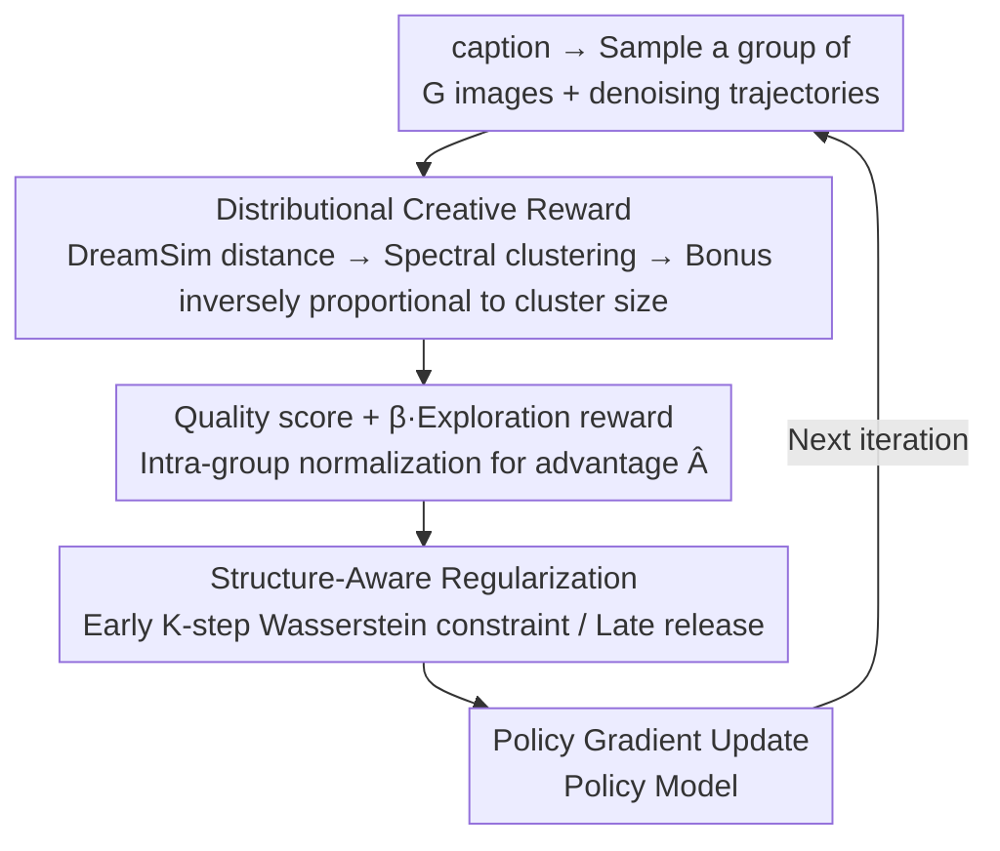

# DiverseGRPO: Mitigating Mode Collapse in Image Generation via Diversity-Aware GRPO

**Conference**: CVPR 2026  
**Paper**: [CVF Open Access](https://openaccess.thecvf.com/content/CVPR2026/html/Liu_DiverseGRPO_Mitigating_Mode_Collapse_in_Image_Generation_via_Diversity-Aware_GRPO_CVPR_2026_paper.html)  
**Code**: The paper only provides a Project Page; no specific repository link is public (to be confirmed)  
**Area**: Diffusion Models / Alignment RLHF  
**Keywords**: GRPO, mode collapse, image diversity, spectral clustering reward, Wasserstein regularization  

## TL;DR
Addressing the "mode collapse" (uniform faces and compositions) that occurs after applying GRPO to diffusion models for RLHF, DiverseGRPO tackles the issue from both reward modeling and denoising dynamics. It groups samples of the same caption using spectral clustering to issue "exploration rewards" inversely proportional to cluster size, and replaces the late-stage uniform KL regularization with a Wasserstein constraint applied only to early denoising steps. This improves semantic diversity by 13%–18% while maintaining quality, establishing a new Pareto frontier for quality-diversity.

## Background & Motivation
**Background**: Works such as Flow-GRPO and DanceGRPO have adapted GRPO from LLMs to flow matching/diffusion models for preference alignment. These methods drive generation quality improvements by leveraging relative scoring within a group of samples and have become the mainstream approach for image RLHF. Subsequent works (MixGRPO, Flow-CPS, TempFlowGRPO, BranchGRPO) mostly focus on optimization efficiency, dense rewards, or sampling consistency.

**Limitations of Prior Work**: These methods tend to suffer from "increasing similarity" in the later stages of training—faces, poses, and compositions generated for the same prompt become highly homogenized, making them nearly unusable for creative scenarios (digital art, advertising, game design). This is the phenomenon of mode collapse, which the existing GRPO pipeline generally ignores.

**Key Challenge**: The authors decompose collapse into two independent root causes. First, in **Reward Modeling**: Traditional GRPO uses single-sample quality scores as reward signals. Since the reward model scores in isolation without seeing the distributional relationship between samples, the model is pushed toward a few high-scoring modes. Decomposing the conditional distribution into $K$ semantic modes $\pi_\theta(x\mid p)=\sum_{k=1}^K w_k\pi_\theta^k(x\mid p)$, the expected reward $J(\theta)=\sum_k w_k\bar r_k$ follows replicator dynamics under optimization: $\frac{dw_k}{dt}=w_k(\bar r_k-\mathbb{E}_j[\bar r_j])$. Modes with slightly higher average rewards reinforce themselves, eventually leaving only one high-reward mode ($w_k\to 1$), collapsing the distribution into a single peak. Second, in **Generation Dynamics**: The sensitivity of diffusion denoising trajectories to diversity is highly uneven. The authors measured that the first 1/3 of denoising steps contribute approximately 66% of the diversity variation. However, the early-stage variance $\sigma_t^2$ is the largest, meaning the KL penalty is most diluted by the variance exactly when the constraint should be strongest.

**Goal**: To push the reachable boundary of the quality-diversity trade-off without changing sampling strategies or architectures, by fixing both the "reward signal" and the "regularization budget."

**Core Idea**: Replace single-sample rewards with **distribution-level** rewards (exploration bonuses based on semantic cluster size) and replace **uniform** KL regularization with a structure-aware Wasserstein constraint that is **heavy in the early stages and relaxed in the late stages**.

## Method

### Overall Architecture
DiverseGRPO follows the training framework of Flow-GRPO (prompt → sample a group of $G$ images → calculate intra-group relative advantage → policy gradient update), but introduces two modifications: a "Distributional Creative Reward" is inserted during the post-sampling scoring stage, and the KL regularization is replaced with a "Structure-Aware Regularization" during the policy loss calculation stage. The data flow for one iteration is: given a caption, sample a group of images → calculate pairwise perceptual distances using DreamSim and perform spectral clustering into several semantic clusters → issue exploration rewards for each image inversely proportional to the cluster size, added to the quality score → normalize intra-group to obtain advantages → apply Wasserstein constraints to the first $K$ early denoising steps in the policy loss and fully release them in later steps → update the policy.

### Key Designs

**1. Distribution-Level Creative Reward: Making rewards see the "entire group" rather than isolated samples**

This item directly addresses the root cause of "single-sample reward-driven mode collapse." The process involves three steps. First, **perceptual distance**: For a group of images $\{x_1,\dots,x_n\}$ generated from the same caption, pairwise distances are calculated using DreamSim (a model aligned with human visual similarity judgment) to obtain an $n\times n$ distance matrix $D$. Second, **spectral clustering**: Distances are converted to affinities using a Gaussian kernel $A_{ij}=\exp(-d_{ij}^2/2\sigma^2)$. The degree matrix $D_{ii}=\sum_j A_{ij}$ and the normalized Laplacian $L=D^{-1/2}AD^{-1/2}$ are constructed. Eigen-decomposition of $L$ is performed to take eigenvectors corresponding to the smallest eigenvalues, followed by k-means to slice the images into $k$ semantic clusters, each representing a visual mode. Third, **reward allocation**: Smaller clusters represent rarer modes and should be encouraged. The exploration reward for image $x_i$ in cluster $C_k$ is inversely proportional to the cluster size:

$$E_i=\sqrt{\frac{N}{n_k}}$$

where $n_k$ is the number of samples in that cluster and $N$ is the total number of samples for the same caption. The square root is used to soften this weight and strike a balance between "rewarding diversity" and "training stability." The final reward linearly combines the quality score and the exploration reward: $R_i=Q_i+\beta\cdot E_i$, where $\beta$ controls the intensity of the diversity bonus. This is then processed via standard intra-group normalized advantage $\hat A_t^i=(R(x_0^i,c)-\text{mean})/\text{std}$. The advantage is that instead of forcing noise at the sampling end, it rewrites the replicator dynamics at the reward source—rare modes are continuously "subsidized" so they aren't swallowed by high-reward modes.

**2. Structure-Aware Wasserstein Regularization: Spending the regularization budget on the early denoising steps where it matters most**

This targets the mismatch where "early denoising determines diversity, but the KL penalty is most diluted by variance." The original KL regularization (Eq. 6) takes the form $D_{KL}=\frac{\|\bar x_{t+\Delta t,\theta}-\bar x_{t+\Delta t,\mathrm{ref}}\|^2}{2\sigma_t^2\Delta t}$, where the denominator contains $\sigma_t^2$. The problem lies in this denominator: in the early stages of denoising, $\sigma_t^2$ is large, which reduces the penalty exactly when diversity should be preserved. In later stages, $\sigma_t^2$ is small, amplifying the penalty and excessively restricting the reward-driven improvement when the focus should be on refining details. The authors' fix simply removes the variance from the denominator and switches to a Wasserstein distance constraint for the first $K$ steps:

$$L_{\text{reg}}(t)=\begin{cases}\|\bar x_{t+\Delta t,\theta}-\bar x_{t+\Delta t,\mathrm{ref}}\|_2^2, & t\le K,\\[2pt] 0, & t>K.\end{cases}$$

This applies a strong constraint in the early $K$ steps that is not weakened by variance, forcing the model to maintain semantic coverage and structural diversity. Regularization is fully removed in later steps, allowing the policy to optimize freely for high reward and high fidelity. This spends the "diversity budget" efficiently: the early phase manages the mode distribution, and the later phase manages image quality.

> ⚠️ The original text mixes $x_t>K$ and $t>K$ in Eq. 14. This summary uses a unified description: "apply constraint to the first K denoising steps and release thereafter." Please refer to the original paper for precise notation.

### Loss & Training
The overall objective remains the clipped form used in Flow-GRPO (Eq. 1–2), with $-\beta D_{KL}$ replaced by the $L_{\text{reg}}(t)$ described above. Advantages are normalized intra-group (Eq. 3). SDE sampling follows Flow-GRPO by converting deterministic ODEs into stochastic SDEs that preserve marginal density (Eq. 5) to introduce exploration noise. LoRA finetuning is used throughout: rank $r=32$, $\alpha=64$, learning rate $3\times10^{-4}$, clip range $1\times10^{-4}$. SD3.5-M is trained for 10 steps / evaluated for 40 steps, CFG 4.5; Flux.1-dev is trained for 6 steps / evaluated for 28 steps, CFG 3.5.

## Key Experimental Results

### Main Results
On two diffusion backbones (SD3.5-M, Flux.1-dev) and two preference rewards (PickScore, HPSv3), the method is compared against the baseline Flow-GRPO (the baseline removes the KL term; otherwise, quality improvement is too slow for a Pareto comparison). Diversity metrics DreamSim/BeyondFID/SSIM (higher is better) and FID (lower is better) are reported alongside quality scores (CLIP, ImageReward, PickScore, UnifiedReward).

| Backbone / Reward | Method | DreamSim↑ | FID↓ | BeyondFID↑ | PickScore↑ |
|------------|------|-----------|------|-----------|-----------|
| SD3.5-M / PickScore | Flow-GRPO | 0.1278 | 56.21 | 0.0667 | 0.8809 |
| SD3.5-M / PickScore | **Ours** | **0.1517** | **43.12** | **0.1895** | 0.8837 |
| Flux.1-dev / PickScore | Flow-GRPO | 0.1382 | 68.75 | 0.0766 | 0.8750 |
| Flux.1-dev / PickScore | **Ours** | **0.1575** | **62.51** | **0.1059** | 0.8779 |
| SD3.5-M / HPSv3 | Flow-GRPO | 0.1625 | 34.04 | 0.0971 | 0.8445 |
| SD3.5-M / HPSv3 | **Ours** | **0.1851** | **29.82** | **0.1646** | 0.8462 |

Key points: DreamSim diversity increases by +13.9%–+18.8%, FID decreases simultaneously (less collapse), and BeyondFID jumps significantly (+184% on SD3.5/PickScore). At the same time, quality scores like PickScore do not drop but slightly increase—diversity gains are not at the expense of quality.

### Ablation Study

| Configuration | Quality-Diversity Performance | Description |
|------|----------------|------|
| Flow-GRPO (baseline) | Rapid diversity collapse | Single-sample reward + uniform/no KL |
| Only SA-Reg | Improved diversity | Early Wasserstein constraint already mitigates collapse |
| SA-Reg + Creative Reward (Full) | Optimal Quality-Diversity | Both together push diversity significantly higher |

### Key Findings
- **Complementary Designs**: SA-Reg alone can increase diversity, but adding the creative reward pushes diversity metrics to a significantly higher tier. The former preserves mode distribution from the denoising dynamics side, while the latter actively encourages the discovery of new modes from the reward side.
- **Hyperparameter Trends**: A larger creative coefficient $\beta$ leads to higher diversity, but the gains for $\beta=5$ relative to $\beta=3$ saturate later (exploration-exploitation balance). A larger $K$ for SA-Reg yields better diversity but increases computational cost and shows diminishing marginal returns.
- **Efficiency and Stability**: Clustering overhead is minimal (group size ~24, DreamSim features pre-calculated). Overall efficiency is comparable to PickScore. Under the same regularization budget, the proposed method reaches the quality of the baseline (which requires 1280 iterations) in just 400 iterations, with 9% less collapse. After 700 steps, diversity stabilizes at ~0.15, while the baseline drops from 0.13 to 0.10.

## Highlights & Insights
- **Formalizing "mode collapse" via replicator dynamics**: Using $\frac{dw_k}{dt}=w_k(\bar r_k-\mathbb{E}_j[\bar r_j])$ clearly explains why single-sample rewards inevitably lead to a single peak. The conclusion is solid—collapse is an intrinsic flaw of the reward objective rather than a sampling issue, making it necessary to change the reward itself. This perspective is transferable to any RLHF scenario using intra-group relative rewards.
- **Clever observation of the "diversity budget"**: The realization that early denoising steps contribute 66% of diversity change yet are least constrained due to the $\sigma_t^2$ in the KL denominator points out a structural mismatch ("loose where it should be tight"). Removing the variance denominator (KL → Wasserstein) is a minimal but highly effective change.
- **Cluster-based reward + square root softening**: $\sqrt{N/n_k}$ rewards rare modes while avoiding extreme weights that could destabilize training, providing a reusable "distribution-aware reward" recipe.

## Limitations & Future Work
- The authors admit a temporary drop in diversity at the start of training due to the discarding of low-quality samples, stabilizing only after 700 steps; the trade-off in the early stage is not specifically handled.
- Diversity determination relies entirely on DreamSim and spectral clustering for semantic slicing. Hyperparameters like the number of clusters $k$, Gaussian kernel width $\sigma$, $\beta$, and $K$ significantly impact results. The paper shows trends but provides no adaptive scheme—re-tuning may be required for different data domains.
- Evaluation was primarily on SD3.5-M / Flux and PickScore/HPSv3; validity for larger models or video generation has not been verified (a self-identified limitation).
- Future directions: Make the "cluster-based reward" an adaptive budget schedule during training, or tie the Wasserstein transition point $K$ to the actual diversity sensitivity of the denoising trajectory rather than using a fixed constant.

## Related Work & Insights
- **vs. Flow-GRPO / DanceGRPO**: They adapted GRPO to flow matching and focused on efficiency but used single-sample rewards and uniform KL, leading to inevitable collapse. This work functions as a "patch" for them by swapping rewards and regularization within the same framework.
- **vs. DivPO (LLM-side anti-collapse)**: DivPO maintains diversity by picking "high-quality rare" samples as positives and "common low-quality" samples as negatives. This work reshapes the reward directly using the distribution structure from spectral clustering, which is better suited for continuous visual modes in images.
- **vs. DiADM / Ding et al. (Image Diversity)**: DiADM decouples quality and diversity using pseudo-unconditional features, and Ding et al. use multi-stage contrastive learning to infer diversity metrics; both are heavy and complex to train. This work uses lightweight modifications to reward and regularization without needing additional multi-stage training.

## Rating
- Novelty: ⭐⭐⭐⭐⭐ Decouples collapse from both reward modeling and denoising dynamics perspectives; both the replicator dynamics and "diversity budget" analyses are novel and lead to specific designs.
- Experimental Thoroughness: ⭐⭐⭐⭐ Complete cross-validation on two backbones and two rewards, with full ablation and hyperparameter analysis, though lacking larger models/video scenarios and human evaluation.
- Writing Quality: ⭐⭐⭐⭐ Clear derivation of motivation and full formulas provided; some slight notation inconsistencies in regularization conditions.
- Value: ⭐⭐⭐⭐⭐ Directly addresses a practical pain point in image RLHF with GRPO, significantly improving diversity without quality loss, while being more training-efficient and highly transferable.

<!-- RELATED:START -->

## Related Papers

- [\[CVPR 2026\] GRPO-Guard: Mitigating Implicit Over-Optimization in Flow Matching via Regulated Clipping](grpo-guard_mitigating_implicit_over-optimization_in_flow_matching_via_regulated_.md)
- [\[CVPR 2026\] Taming Preference Mode Collapse via Directional Decoupling Alignment in Diffusion Reinforcement Learning](taming_preference_mode_collapse_via_directional_decoupling_alignment_in_diffusio.md)
- [\[CVPR 2026\] Style-GRPO: Semantic-Aware Preference Optimization for Image Style Transfer Guided by Reward Modeling](style-grpo_semantic-aware_preference_optimization_for_image_style_transfer_guide.md)
- [\[ICML 2026\] Escaping Mode Collapse in LLM Generation via Geometric Regulation](../../ICML2026/image_generation/escaping_mode_collapse_in_llm_generation_via_geometric_regulation.md)
- [\[CVPR 2026\] Fine-Grained GRPO for Precise Preference Alignment in Flow Models](fine-grained_grpo_for_precise_preference_alignment_in_flow_models.md)

<!-- RELATED:END -->
