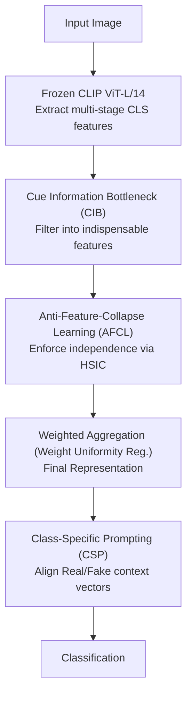

# Diversity over Uniformity: Rethinking Representation in Generated Image Detection

**Conference**: CVPR 2026  
**arXiv**: [2603.00717](https://arxiv.org/abs/2603.00717)  
**Code**: [GitHub](https://github.com/Yanmou-Hui/DoU)  
**Area**: Image Forensics / AI-Generated Image Detection  
**Keywords**: Generated Image Detection, Feature Collapse, Representation Diversity, Information Bottleneck, CLIP

## TL;DR

The Anti-Feature-Collapse Learning (AFCL) framework is proposed to maintain the diversity and complementarity of discriminative representations. By filtering irrelevant features via an information bottleneck and suppressing excessive overlap between different forgery cues, the method achieves significant improvements in cross-model generated image detection.

## Background & Motivation

The core issue with existing generated image detectors is not a lack of features, but **representation homogenization**: during training, models tend to compress multi-source information into a few prominent discriminative patterns, leading to "shortcut" decision-making. This feature collapse phenomenon results in:

- Discriminative capacity concentrated in a few principal component directions (effective rank only 1-2).
- Detection accuracy saturating after a few principal components, failing to utilize additional features.
- Sharp performance degradation when the generation method or image distribution changes.

The authors verify this hypothesis through UMAP visualization and Principal Component Analysis (PCA): the feature space of pre-trained models inherently contains rich discriminative cues, but these are compressed into an extremely low-rank subspace after training. By introducing representation heterogeneity constraints, the detector effectively utilizes more principal components, significantly enhancing generalization.

## Method

### Overall Architecture

The starting point of AFCL is that the bottleneck of detection is the compression of multi-source cues into limited discriminative directions (effective rank 1-2). Based on a frozen CLIP ViT-L/14, multi-stage CLS features are extracted. Each stage's features pass through a CIB module for information bottleneck filtering, followed by an AFCL module to enforce decorrelation. Finally, weighted aggregation and Class-Specific Prompting complete the classification. The core mechanism is to preserve representation diversity and complementarity throughout the pipeline.

### Key Designs

**1. Cue Information Bottleneck (CIB): Filtering cues into indispensable discriminative information**

To avoid feature collapse, every cue must be "clean and irreplaceable." CIB applies an information bottleneck to each stage's features by maximizing mutual information with the label $y$ while minimizing mutual information with the input $x$:

$$\max_{\{\mathrm{CIB}_i\}} \sum_{i=1}^{N} [I(\tilde{v}_i; y) - \beta I(\tilde{v}_i; x)]$$

Derived via variational lower bounds, the optimized CIB loss is:

$$\mathcal{L}_{\mathrm{CIB}} = \sum_{i=1}^{N} D_{\mathrm{KL}}[p(y|\tilde{\mathcal{V}}) \| p(y|\tilde{\mathcal{V}} \setminus \tilde{v}_i)]$$

It measures "how much the prediction degrades if the $i$-th cue is removed," forcing each cue to carry indispensable discriminative information and resulting in a purified, complementary set of features.

**2. Anti-Feature-Collapse Learning (AFCL): Enforcing independence via HSIC**

Post-purification, it is necessary to prevent cues from different stages from overlapping into the same direction. AFCL utilizes the Hilbert-Schmidt Independence Criterion (HSIC) to enforce statistical independence across stages:

$$\mathcal{L}_{\mathrm{AFCL}} = \frac{1}{N(N-1)} \sum_{i \neq j} \mathrm{HSIC}(\tilde{v}_i, \tilde{v}_j)$$

where $\mathrm{HSIC}(\tilde{v}_i, \tilde{v}_j) = \frac{1}{(B-1)^2} \mathrm{Tr}(K_i H K_j H)$. Kernel methods are more flexible than simple orthogonality constraints as they capture non-linear dependencies. Additionally, a weight uniformity regularization $\mathcal{L}_{\mathrm{reg}} = (\sum_{i=1}^{N} \alpha_i^2 - 1/N)^2$ is added to prevent aggregation weights from collapsing onto a few cues.

**3. Class-Specific Prompt Learning (CSP): Aligning context vector pairs**

Instead of a fixed classification head, CSP learns sets of trainable context vectors for both "Real" and "Fake" classes. The final visual representation $\tilde{v}_{\mathrm{final}}$ is aligned with the corresponding text prototype $e_c$ via cosine similarity:

$$s_c = \frac{\tilde{v}_{\mathrm{final}} \cdot e_c}{\|\tilde{v}_{\mathrm{final}}\| \|e_c\|}$$

The objective $\mathcal{L}_{\mathrm{CSP}}$ optimizes this alignment, allowing diverse cues to flexibly map to class semantics.

### Loss & Training

The total loss is optimized jointly:

$$\mathcal{L} = \mathcal{L}_{\mathrm{CSP}} + \lambda_1 \mathcal{L}_{\mathrm{CIB}} + \lambda_2 \mathcal{L}_{\mathrm{AFCL}} + \lambda_3 \mathcal{L}_{\mathrm{reg}}$$

- Backbone: CLIP ViT-L/14 (Frozen)
- Optimizer: Adam, LR $1 \times 10^{-4}$, batch size 512
- Training Data: GenImage SD v1.4 subset
- Early stopping is employed to prevent overfitting.

## Key Experimental Results

### Main Results

| Dataset/Metric | Ours (AFCL) | VIB-Net | CLIPping | Gain (vs VIB-Net) |
|------------|-----------|---------|----------|-----------------|
| Mean AP | 99.52% | 96.13% | 87.32% | +3.39% |
| Mean ACC | 92.81% | 87.13% | 87.81% | +5.68% |
| Cross-Model ACC | 90.02% | — | — | — |

Evaluation covers 21 generative models (11 from UniversalFakeDetect + 7 from GenImage + 6 from AIGI-Holmes), spanning both GAN and Diffusion paradigms.

### Ablation Study

| Config | Mean ACC | Cross-Model ACC | Mean AP | Description |
|------|---------|----------|--------|------|
| Baseline | 87.81% | 85.56% | 87.32% | w/o CIB/AFCL/reg |
| +CIB | 89.72% | 85.99% | 99.38% | IB Filtering |
| +AFCL+reg | 91.60% | 91.15% | 99.40% | Decorrelation + Reg |
| Full | **92.81%** | **90.02%** | **99.52%** | All components |

### Key Findings

- The effective rank of this method reaches **67.38**, significantly higher than CNNDet (1.37) and VIB-Net (1.92).
- The number of principal components required to explain 90% variance is only 26 fewer than the pre-trained backbone, whereas other detectors reduce this by hundreds.
- Using only 0.1% of data (320 samples) achieves 80.98% ACC / 90.81% AP.
- Superior robustness is maintained under JPEG compression and Gaussian blur.

## Highlights & Insights

- **Precise Diagnosis**: Quantitatively reveals "feature collapse" as the fundamental generalization bottleneck rather than lack of information through effective rank and PCA.
- **HSIC Decorrelation**: Uses kernel methods to measure independence, providing more flexibility than simple orthogonal constraints in capturing non-linear dependencies.
- **Dual Strategy**: Purification (CIB) and Diversity (AFCL) work complementarily to remove noise and ensure distinct feature directions.

## Limitations & Future Work

- Trained only on SD v1.4; whether advantages persist with larger-scale multi-source training is unverified.
- The impact of the number of stages $N$ on performance requires deeper discussion.
- Detection capabilities for video generation (e.g., Sora) have not been addressed.

## Related Work & Insights

- Complements the variational information bottleneck of VIB-Net: VIB-Net compresses redundancy but does not address cross-layer collapse.
- While DRCT/Bias-Free mitigates bias indirectly, this work addresses the representation structure directly.
- Insight: The anti-collapse approach of AFCL can be transferred to other discriminative tasks requiring generalization (e.g., deepfake video detection, cross-domain classification).

## Rating

- Novelty: ⭐⭐⭐⭐ Re-examines detection through the lens of representation collapse with theoretical support.
- Experimental Thoroughness: ⭐⭐⭐⭐ Evaluated on 21 models; complete ablation and robustness/few-shot experiments.
- Writing Quality: ⭐⭐⭐⭐ Convincing motivation analysis and clear visualization.
- Value: ⭐⭐⭐⭐ Provides significant insights for generated image detection; AFCL concepts are broadly applicable.

<!-- RELATED:START -->

## Related Papers

- [\[CVPR 2026\] Training-free Detection of Generated Videos via Spatial-Temporal Likelihoods](training-free_detection_of_generated_videos_via_spatial-temporal_likelihoods.md)
- [\[AAAI 2026\] CausalCLIP: Causally-Informed Feature Disentanglement and Filtering for Generalizable Detection of Generated Images](../../AAAI2026/image_generation/causalclip_causally-informed_feature_disentanglement_and_filtering_for_generaliz.md)
- [\[NeurIPS 2025\] Epistemic Uncertainty for Generated Image Detection](../../NeurIPS2025/image_generation/epistemic_uncertainty_for_generated_image_detection.md)
- [\[AAAI 2026\] Aggregating Diverse Cue Experts for AI-Generated Image Detection](../../AAAI2026/image_generation/aggregating_diverse_cue_experts_for_ai-generated_image_detec.md)
- [\[CVPR 2026\] SynthRGB-T: Language-Vision Guided Image Translation for Diversity Synthesis](synthrgb-t_language-vision_guided_image_translation_for_diversity_synthesis.md)

<!-- RELATED:END -->
