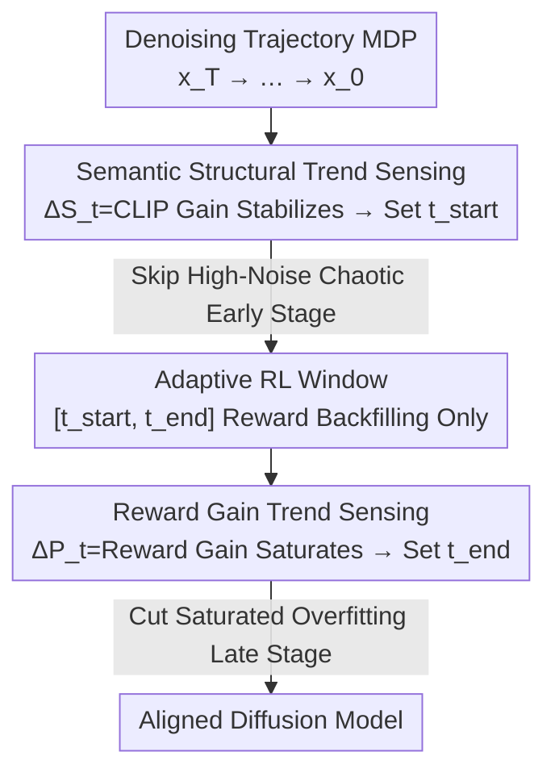

# Do Less, Achieve More: Do We Need Every-Step Optimization for RL Fine-tuning of Diffusion Models?

**Conference**: CVPR 2026  
**Paper**: [CVF Open Access](https://openaccess.thecvf.com/content/CVPR2026/html/Yan_Do_Less_Achieve_More_Do_We_Need_Every-Step_Optimization_for_CVPR_2026_paper.html)  
**Code**: None  
**Area**: Diffusion Models / RLHF Alignment  
**Keywords**: Diffusion RL Fine-tuning, Adaptive Timesteps, Reward Backfilling, Reward Hacking, Plug-and-play  

## TL;DR
Addressing high variance and reward hacking in diffusion RL fine-tuning caused by "uniformly backfilling the final reward to every denoising step," this paper proposes AdaScope. By sensing semantic structural evolution and reward gain trends during denoising, it adaptively performs RL only on middle timesteps where "structure is formed but rewards are still increasing," achieving a 66% performance gain over SOTA while cutting computational costs by 59%.

## Background & Motivation

**Background**: Diffusion models, trained on reconstruction objectives to fit data distributions, generate high-quality images but lack goal-oriented constraints like "human preferences" or "task intent." Current mainstream approaches use RL fine-tuning: treating aesthetic scores or PickScore as rewards, modeling denoising as an MDP, and using policy gradients (e.g., DDPO, DPOK, D3PO, TDPO) to push generation toward high rewards.

**Limitations of Prior Work**: Preference rewards can only be calculated **after full denoising and final image generation** ($reward$ at $t=T-1$, while $reward=0$ for all intermediate steps), a typical sparse reward problem. To obtain gradients for every step, almost all methods use a compromise: backfilling the final scalar reward **identically to all denoising steps**, i.e., $R_{\text{real}}(s_t,a_t)\triangleq r(x_0,z),\ \forall t$.

**Key Challenge**: This "uniform frequency backfilling" creates two major issues. First, **temporal causal mismatch**: early-stage denoised images are just noise with volatile structures, yet are assigned a final reward unrelated to their actual contribution, leading to extreme policy gradient variance and near-random gradient directions. Second, **amplified reward hacking**: late-step denoising has already converged with highly correlated latent variables; continuing to optimize preference rewards yields near-zero marginal benefit and instead causes the model to overfit loopholes in the reward model (e.g., excessive contrast or sharpening), yielding high scores but distorted images. Combined, these factors hurt quality and waste compute—"doing more but achieving less."

**Goal**: Instead of treating the entire denoising trajectory equally, this work asks: which specific timesteps make RL truly effective? The goal is to adaptively identify this "high-value interval" $[t_{\text{start}}, t_{\text{end}}]$.

**Key Insight**: The authors observe that RL fine-tuning effectiveness varies significantly across denoising stages (Fig. 1). The early stage has chaotic structure and extreme uncertainty; the middle stage has stable structure with improving rewards; the late stage reflects saturated rewards and high overfitting risk. Only the middle "moderate uncertainty" window is worth training.

**Core Idea**: Use **semantic structural trends** to decide when to intervene (skipping the chaotic early phase) and **reward gain trends** to decide when to stop (cutting the saturated late phase). Concentrating RL on this middle window allows the model to "do less" (fewer denoising steps optimized) to "achieve more" (win-win in quality and efficiency).

## Method

### Overall Architecture
AdaScope is a **plug-and-play plugin** compatible with existing diffusion RL methods (DDPO, DPOK, D3PO, TDPO). It does not change the underlying policy gradient algorithm but modifies "which denoising steps receive reward backfilling." After formalizing denoising as an MDP, the framework **online** monitors two signals along the sampled trajectory: semantic alignment between the reconstructed image and prompt, and the preference reward of the reconstructed image. The evolution of the former determines the RL start point $t_{\text{start}}$, and the latter determines the end point $t_{\text{end}}$. Policy gradient updates are executed only within the window $[t_{\text{start}}, t_{\text{end}}]$, skipping steps outside it. This is theoretically supported by the fact that latent variable uncertainty decreases monotonically during generation (Lemma 1).

### Key Designs

**1. Pearson Correlation Perspective: Theoretical Basis for Staged Training**

To justify skipping early and late stages, the authors characterize the correlation between adjacent latents. Theorem 1 (Forward-Backward Consistency) shows that for a well-trained diffusion model, the forward noise process and backward generation process share consistent marginal and joint distributions. Thus, **easily calculated forward process correlations can represent the generation process.** Theorem 2 provides a closed-form correlation coefficient, leading to Lemma 1:

$$1-\mathrm{Corr}\!\left(x^{r,(i)}_t,\ x^{r,(i)}_{t+\tau}\right)\ \text{decreases monotonically during generation}$$

As denoising progresses, adjacent latents become more correlated and "uncertainty" decreases (validated by the green curve in Fig. 1). This supports the staged strategy: early stages have high uncertainty and chaotic reward attribution; late stages have zero uncertainty and saturated rewards.

**2. Semantic Structural Trend Sensing: Adaptive RL Start Point $t_{\text{start}}$**

To address "chaotic structure and mismatched attribution," RL must **skip the early stage where structure has not formed.** The method reconstructs clean estimates $\hat x_0(x_t)$ for adjacent steps $x_t, x_{t-1}$ using Eq. 1 and measures semantic alignment with prompt $z$ via CLIP Score $f(x_t)\triangleq \mathrm{CLIP}(\hat x_0(x_t), z)$. The **structural gain** is:

$$\Delta S_t = f(x_{t-1}) - f(x_t)$$

The start point is triggered when the second-order change of $\Delta S_t$ approaches zero, indicating the semantic structure has stabilized for the current prompt:

$$t_{\text{start}} = \min\Big\{t \ \Big|\ \lim_{\Delta t\to 0}\tfrac{\Delta S_{t+\Delta t}-\Delta S_t}{\Delta t}\to 0\Big\}$$

Starting RL from $t_{\text{start}}$ ensures the semantic skeleton is ready for reward backfilling, minimizing "action-reward attribution mismatch." Crucially, this point is **prompt-adaptive**.

**3. Reward Gain Trend Sensing: Adaptive RL End Point $t_{\text{end}}$**

To address "reward saturation and amplified hacking," RL must **automatically stop when marginal benefits reach zero.** Similarly, preference scores are calculated for reconstructions $g(x_t)\triangleq \mathrm{Reward}(\hat x_0(x_t), z)$. The **preference gain** is:

$$\Delta P_t = g(x_{t-1}) - g(x_t)$$

When the change in $\Delta P_t$ stabilizes, it implies the model can no longer extract significant preference gains, and further optimization acts as a breeding ground for reward hacking. The process terminates at:

$$t_{\text{end}} = \min\Big\{t \ \Big|\ \lim_{\Delta t\to 0}\tfrac{\Delta P_{t+\Delta t}-\Delta P_t}{\Delta t}\to 0\Big\}$$

The RL fine-tuning interval is set to $[t_{\text{start}}, t_{\text{end}}]$, focusing policy gradients on the high-value segment where "structure is formed and rewards are growing."

## Key Experimental Results

Experiments used SD v1.5 (main), v1.4, v2.1-turbo, and XL across HPSv2-photo, Pick-a-Pic (500 prompts), and simple animals prompt sets. Metrics include AES, PickScore (PS), ImageReward, CLIP (alignment), and IS/LPIPS (diversity). Baselines: DDPO, DPOK, D3PO, TDPO. Hardware: 8×H20 GPUs.

### Main Results: Efficiency and Quality as a Plugin (SD v1.5, simple animal)

| Base Method | Time-PB (min) ↓ | Time to PS=22 (h) ↓ | AES ↑ | LPIPS ↑ |
|:---|:---:|:---:|:---:|:---:|
| DDPO | 4.55 | 13.2 | 0.624 | 0.294 |
| **DDPO + Ours** | **2.65** | **5.37** | **0.679** | **0.295** |
| DPOK | 5.63 | 14.0 | 0.639 | 0.301 |
| **DPOK + Ours** | **3.71** | **6.76** | 0.651 | 0.300 |
| D3PO | 5.06 | 15.9 | 0.599 | 0.294 |
| **D3PO + Ours** | **3.19** | **9.07** | **0.647** | **0.297** |
| TDPO | 6.37 | 12.7 | 0.529 | 0.287 |
| **TDPO + Ours** | **4.17** | **7.14** | **0.624** | 0.287 |

Adding AdaScope cut single-batch time and "time to reach target reward" by approximately half while improving quality metrics like AES and LPIPS. The summary figures report a +66% performance gain and computational costs reduced to 59%.

### Ablation Study: Adaptive vs. Fixed Window (Table 2 + Fig. 7)

| Config | Start Step | End Step | Time | Description |
|:---|:---:|:---:|:---:|:---|
| V1 | 5 | 32 | 2.45 | Fixed window (mean of Ours) |
| V2 | 5±5 | 35 | 2.27–3.18 | Fluctuating start, fixed end |
| V3 | 5 | 35±5 | 2.27–3.18 | Fixed start, fluctuating end |
| **Ours** | **5.3** | **31.8** | **2.62** | **Prompt-adaptive window** |

No fixed window could match the performance of the adaptive strategy, proving that the **optimal optimization window must vary by specific prompt**.

### Key Findings
- **Sample Efficiency**: Fig. 4 shows that for the **same number of optimized samples**, AdaScope achieves better reward learning. Discarding excessively uncertain (early) and certain (late) samples benefits reward learning itself.
- **Diversity and Distribution**: Fig. 8 (DINOv2 + t-SNE) shows DDPO results forming tight clusters (mode collapse), whereas AdaScope maintains a wider distribution, indicating suppression of reward hacking.
- **Transferability**: Improvements were consistent across SD v1.4/v2.1/XL, though SDXL showed slightly smaller gains due to its inherent robustness.

## Highlights & Insights
- **Inverting the "Sparse Reward" Problem**: While others backfill all steps to compensate for sparsity, this paper argues "not every step should be trained." Using second-order trends to prune ineffective steps leads to a rare "win-win" in quality and compute.
- **Zero-Intrusion Plugin**: Does not modify underlying policy gradients; it only modifies reward backfilling logic. It is highly reusable and easy to deploy.
- **No Extra Training Required**: The criteria use CLIP and Reward model gains directly via a unified trigger mechanism (second-order rate of change) with near-zero hyperparameters.
- **Theory-Phenomenon Alignment**: Lemma 1's "monotonicity of uncertainty" aligns with empirical observations, anchoring engineering intuition in derivational conclusions.

## Limitations & Future Work
- **Dependency on Scorers**: $t_{\text{start}}$ and $t_{\text{end}}$ depend on CLIP and Reward models. Their biases influence window selection; if the reward model has flaws, "gain saturation" may not equal "peak quality."
- **Threshold for Zero Derivative**: The practical implementation of detecting "rate of change approaching zero" on discrete steps (thresholds, smoothing) is not detailed in the main text.
- **Diminishing Returns on Large Models**: Gains are less pronounced on SDXL, potentially indicating that "step pruning" has less marginal value for highly robust base models.
- **Future Directions**: Moving beyond scalar trends to fine-grained step-wise value estimation or combining window selection with KL regularization.

## Related Work & Insights
- **vs. Uniform Backfilling (DDPO/D3PO)**: These violate temporal causality and amplify noise; AdaScope resolves this by focusing only on high-value segments.
- **vs. DPOK (KL Regularization)**: DPOK suppresses reward hacking via KL constraints but doesn't reduce compute; AdaScope achieves both and is orthogonal to KL constraints.
- **vs. TDPO (Step-wise Preference)**: TDPO still covers all steps; AdaScope proves focus on the middle stage is more effective.

## Rating
- Novelty: ⭐⭐⭐⭐⭐ Counter-intuitive insight supported by correlation theory.
- Experimental Thoroughness: ⭐⭐⭐⭐ Extensive across baselines, datasets, and bases, though some threshold details are in the supplement.
- Writing Quality: ⭐⭐⭐⭐ Logical chain from motivation to theory to mechanism.
- Value: ⭐⭐⭐⭐⭐ A zero-intrusion plugin with significant efficiency and quality gains.

<!-- RELATED:START -->

## Related Papers

- [\[CVPR 2026\] Reward Sharpness-Aware Fine-Tuning for Diffusion Models](reward_sharpness-aware_fine-tuning_for_diffusion_models.md)
- [\[CVPR 2026\] RealUnify: Do Unified Models Truly Benefit from Unification? A Comprehensive Benchmark](realunify_do_unified_models_truly_benefit_from_unification_a_comprehensive_bench.md)
- [\[ICCV 2025\] Less is More: Improving Motion Diffusion Models with Sparse Keyframes](../../ICCV2025/image_generation/less_is_more_improving_motion_diffusion_models_with_sparse_keyframes.md)
- [\[CVPR 2026\] CRAFT: Aligning Diffusion Models with Fine-Tuning Is Easier Than You Think](craft_aligning_diffusion_models_with_finetuning_is_easier_than_you_think.md)
- [\[CVPR 2026\] Towards Fine-Grained Attribution: Instance-Aware Preference Optimization for Aligning Diffusion Models](towards_fine-grained_attribution_instance-aware_preference_optimization_for_alig.md)

<!-- RELATED:END -->
