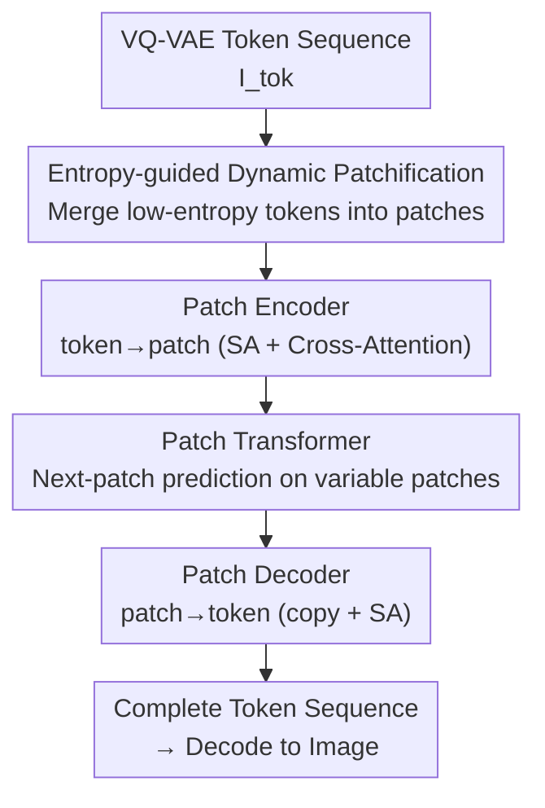

# DPAR: Dynamic Patchification for Efficient Autoregressive Visual Generation

**Conference**: CVPR 2026  
**Paper**: [CVF Open Access](https://openaccess.thecvf.com/content/CVPR2026/html/Srivastava_DPAR_Dynamic_Patchification_for_Efficient_Autoregressive_Visual_Generation_CVPR_2026_paper.html)  
**Code**: https://github.com/dsrivastavv/DPAR  
**Area**: Image Generation  
**Keywords**: Autoregressive Image Generation, Dynamic Patchification, Entropy-guided Token Merging, Efficient Transformer, VQ-VAE  

## TL;DR
DPAR utilizes a lightweight entropy model to compute the "next-token prediction entropy" for each image token. Adjacent tokens in low-information regions (e.g., sky, walls) are dynamically merged into variable-length patches, while high-information regions maintain token-level granularity. This allows the decoder-only autoregressive Transformer to perform next-patch prediction on a "reduced number of patches," decreasing token counts by 1.81×/2.06× and training FLOPs by up to 40.4% on ImageNet 256/384, while simultaneously improving FID by up to 29.6%.

## Background & Motivation

**Background**: Decoder-only autoregressive (AR) image generation is matching or exceeding diffusion models. The mainstream approach (e.g., LlamaGen) uses a VQ-VAE to encode images into a 2D discrete token grid, flattens them into 1D sequences in raster order, and generates them via next-token prediction (NTP). This roadmap is attractive for its seamless integration with language models into unified multimodal frameworks.

**Limitations of Prior Work**: The number of tokens in fixed-length tokenization grows **quadratically** with resolution—256×256 at 16× downsampling yields 256 tokens, while 1024×1024 requires 4096 tokens. This leads to a 16× increase in token count and attention context length, causing computational and memory explosions. Existing mitigation strategies have drawbacks: 1D tokenizers (TiTok, One-D-Piece) reduce token counts but lose 2D spatial structure, which is critical for zero-shot editing tasks like outpainting/inpainting. Token merging methods (Token-Shuffle, etc.) use **fixed-ratio** static merging, which compresses high-information regions and leads to detail loss and degraded generation quality.

**Key Challenge**: There is a trade-off between "reducing token count" and "retaining 2D structure without damaging high-information regions." Static merging cannot distinguish between uniform regions (sky) and dense textures, resulting in either insufficient compression or over-compression (blurred details).

**Key Insight**: A large portion of an image consists of redundant, low-information regions that can be represented with fewer tokens. Inspired by the Byte Latent Transformer (BLT) in NLP—which uses "next-byte prediction entropy" to merge bytes—the authors apply this to VQ-VAE tokens. In uniform regions, the next-token choices are limited and highly predictable, resulting in low entropy. In texture-dense regions, uncertainty is high, resulting in high entropy. Entropy thus serves as a natural, unsupervised detector of information density.

**Core Idea**: DPAR uses the **next-token prediction entropy** of a lightweight unsupervised AR model as the merging criterion. Adjacent low-entropy tokens are merged into variable-length patches, while high-entropy regions retain token-level granularity. The autoregressive Transformer then operates on the variable-length patch sequence, preserving 2D structure while adaptively allocating computation based on information content.

## Method

### Overall Architecture

The input to DPAR is a 1D token sequence $I_{tok}=[x_0,\dots,x_{T-1}]$ from a VQ-VAE and a condition $C$. The output is the reconstructed token sequence. The pipeline consists of four components: an **Entropy Model** calculates prediction entropy → **Dynamic Patchification** partitions tokens into patches based on entropy → a **Patch Encoder** aggregates tokens into a patch representation → a **Patch Transformer** (the core compute engine) performs next-patch prediction → a **Patch Decoder** restores patches to individual tokens.

Key Mechanism: The main Transformer only runs attention on the "reduced number of patches" (e.g., 256 tokens become ~142 patches). Since attention complexity is quadratic, this saves significant computation. The encoder and decoder are kept lightweight (1-layer encoder, 3-6 layer decoder) to reserve the budget for the patch transformer.

### Key Designs

**1. Entropy-guided Dynamic Patchification: Decisions by Prediction Entropy**

The authors train a **lightweight, unconditional** GPT-style model as the entropy model $\mathcal{E}_\phi$ (a 111M LlamaGen-B). For each token, it computes the next-token prediction entropy:

$$e_i = \mathcal{H}(x_{<i};\,\mathcal{E}_\phi) = -\sum_{c=0}^{V-1}\mathcal{E}_\phi(x_i=c\mid x_{<i})\,\log\mathcal{E}_\phi(x_i=c\mid x_{<i})$$

Patching follows a greedy rule: tokens are merged into a patch $P_m$ if $e_i \le H_{Th}$. Once $e_i > H_{Th}$, a new patch begins. Two constraints are added: ① **Maximum patch length** $P_{max}$ to prevent information loss via unlimited merging; ② **Row boundary reset**, forcing distinct patches at the end of each row. At 256 resolution with $H_{Th}=7.8, P_{max}=4$, the average patch length is $P_{avg}=1.81$.

**2. Patch Encoder: Compressing Tokens into a Patch Representation**

To aggregate tokens, a 1-layer local encoder is used. It first applies Causal Self-Attention with 2D RoPE to obtain hidden representations $h_{x_i}$. Then, a **Cross-Attention** layer uses the patch as the query and the tokens within its span as key/values:

$$h_{P_m} = \mathrm{CA}\!\bigl(z_{P_m},\, H^{tok}_{s_m:f_m}\bigr),\quad \forall P_m\in I_{patch}$$

This allows the model to adaptively extract informative content from merged tokens.

**3. Patch Transformer + Dynamic RoPE: Autoregression on Variable-length Patches**

This is the primary computational component, utilizing the LLaMA architecture. It operates on patch representations $H_{patch}$ to predict encoded representations $\hat{H}_{patch}$ for the next patch. The reduced sequence length leads to a significant drop in attention complexity. Since patches represent variable token spans, **Dynamic RoPE** is used to encode positions (refer to original text for details).

**4. Patch Decoder: Restoring Tokens from Patches**

The Patch Decoder performs a **copy operation**, replicating the predicted patch state $\hat{h}_{P_m}$ to all corresponding token positions. These are normalized, linearly projected, and added to the encoder's original token representations:

$$\tilde{h}_{x_i} = h_{x_i} + \mathrm{Linear}\!\bigl(\mathrm{Norm}(\hat{h}_{P_m})\bigr),\quad \forall i\in P_m$$

Causal Self-Attention is then applied between tokens to refine the "intra-patch" details before mapping to next-token probabilities $\hat{P}_{tok}$.

### Loss & Training

The objective is standard token-level cross-entropy:

$$\mathcal{L}_{CE} = -\sum_{t=0}^{T-1}\log\hat{p}_t(x_t)$$

Loss is calculated on the **full token sequence**, with patches serving as efficient intermediate representations. Training uses 8×A100, batch size 256, 300 epochs, and AdamW. Tokens and entropy values are pre-computed offline to save overhead. During inference, tokens are generated one by one, and patching is determined dynamically.

## Key Experimental Results

Experiments were conducted on ImageNet class-conditional generation, evaluated with FID-50K.

### Main Results

| Model | #Params | FID↓ | IS↑ | Steps | Note |
|------|---------|------|-----|-------|------|
| LlamaGen-B | 111M | 5.46 | 193.6 | 256 | 256 Baseline |
| DPAR-B (cfg=2.1) | 120M | **3.98** | 250.6 | 142 | Fewer tokens |
| LlamaGen-XL | 775M | 3.39 | 227.1 | 256 | 256 Baseline |
| DPAR-XL (cfg=2.0) | 789M | **2.67** | 281.7 | 142 | — |
| LlamaGen-384-B | 111M | 6.09 | 182.5 | 576 | 384 Baseline |
| DPAR-384-B (cfg=2.1) | 120M | **4.29** | 254.5 | 280 | -29.6% FID |
| LlamaGen-384-XXL | 1.4B | 2.34 | 253.9 | 576 | 384 Baseline |
| DPAR-384-XXL (cfg=1.75) | 1.4B | **2.30** | 287.4 | 280 | — |

DPAR outperforms LlamaGen across all sizes and resolutions. At 384 resolution, DPAR-XL reduces training FLOPs by **40.4%** while delivering a significant FID improvement. Token counts are compressed by 1.81×/2.06× at 256/384 resolutions, respectively.

### Ablation Study

Ablation of patching designs (DPAR-L, 256px, 50 epochs; "All off" = Static merging):

| Entropy Gating | Max Patch Len | Row Reset | FID↓ |
|:---:|:---:|:---:|:---:|
| × | × | × | 3.58 |
| ✓ | × | × | 3.91 |
| ✓ | ✓ | × | 3.45 |
| ✓ | ✓ | ✓ | **3.32** |

### Key Findings

- **Entropy gating alone is insufficient** (3.58→3.91): Relying solely on entropy causes over-merging in uniform regions, losing too much information. Combining it with $P_{max}$ and row reset is essential for optimal performance (3.32).
- **$P_{max}$ sweet spot**: FID improves as $P_{max}$ increases to 4 but degrades beyond that (6/8/16) due to detail loss.
- **Robust representations for patch boundaries**: DPAR trained with $H^{train}_{Th}=7.8$ maintains a low FID (3.39) even when increasing the inference threshold to 8.1. Static models fail completely (FID jumping to 25.59) under similar changes.
- **Stronger global features**: Linear probing of DPAR-L features yields 37.82% top-1 accuracy, roughly 5pp higher than LlamaGen-L (32.62%), suggesting that variable-length patch prediction forced more robust global representation learning.

## Highlights & Insights
- **Entropy-based migration from NLP**: DPAR demonstrates that "next-token prediction entropy" is a domain-agnostic measure for information density, successfully transferring the concept from byte-level NLP to VQ-VAE image tokens.
- **Improved quality despite less computation**: This counter-intuitive result stems from the stronger global representations learned by forcing the model to track future tokens across variable patch spans.
- **Training/Inference Decoupling**: DPAR’s ability to adjust patch size during inference without retraining provides a practical mechanism for scalable deployment based on available compute budgets.

## Limitations & Future Work
- **Dependency on Entropy Model**: Requires pre-calculating entropy with an external model, adding pipeline complexity and pre-processing costs.
- **Raster Order Limitation**: The method has only been verified for raster order and ImageNet class-conditional tasks, not for text-to-image or random-order generation (e.g., RAR).
- **Inference Acceleration**: While training FLOPs drop significantly, specific KV-cache strategies for this architecture are required to realize full wall-clock inference speedups in practice.

## Related Work & Insights
- **vs LlamaGen**: DPAR acts as a modular upgrade to LlamaGen, adding lightweight encoder/decoders to allow the backbone to operate on variable patches, saving FLOPs while lowering FID.
- **vs 1D Tokenizers**: Unlike TiTok, DPAR retains 2D structure, making it compatible with zero-shot spatial editing tasks.
- **vs Static Merging**: DPAR avoids the detail loss inherent in fixed-ratio merging by adaptively allocating computation to high-entropy regions.

## Rating
- Novelty: ⭐⭐⭐⭐⭐ 
- Experimental Thoroughness: ⭐⭐⭐⭐ 
- Writing Quality: ⭐⭐⭐⭐⭐ 
- Value: ⭐⭐⭐⭐⭐ 

<!-- RELATED:START -->

- LlamaGen: Autoregressive Model is All You Need for Visual Generation (CVPR 2024)
- BLT: Byte Latent Transformer for Language Modeling (arXiv 2024)

<!-- RELATED:END -->

## Related Papers

- [\[CVPR 2026\] DDiT: Dynamic Patch Scheduling for Efficient Diffusion Transformers](ddit_dynamic_patch_scheduling_for_efficient_diffusion_transformers.md)
- [\[ICLR 2026\] Pyramidal Patchification Flow for Visual Generation](../../ICLR2026/image_generation/pyramidal_patchification_flow_for_visual_generation.md)
- [\[CVPR 2026\] Mirai: Autoregressive Visual Generation Needs Foresight](mirai_autoregressive_visual_generation_needs_foresight.md)
- [\[CVPR 2026\] Depth Adaptive Efficient Visual Autoregressive Modeling](depthvar_depth_adaptive_var.md)
- [\[CVPR 2026\] Memory-Efficient Fine-Tuning Diffusion Transformers via Dynamic Patch Sampling and Block Skipping](memory-efficient_fine-tuning_diffusion_transformers_via_dynamic_patch_sampling_a.md)

<!-- RELATED:END -->
