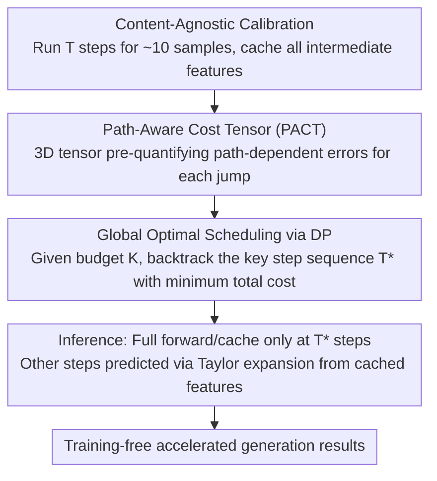

# Denoising as Path Planning: Training-Free Acceleration of Diffusion Models with DPCache

**Conference**: CVPR 2026  
**arXiv**: [2602.22654](https://arxiv.org/abs/2602.22654)  
**Code**: [https://github.com/argsss/DPCache](https://github.com/argsss/DPCache)  
**Area**: Diffusion Models  
**Keywords**: Diffusion model acceleration, feature caching, dynamic programming, path planning, training-free

## TL;DR
Ours formulates diffusion model sampling acceleration as a global path planning problem. By constructing a Path-Aware Cost Tensor (PACT) and using dynamic programming to select the optimal sequence of key timesteps, ours achieves 4.87× training-free acceleration with generation quality exceeding the full-step baseline.

## Background & Motivation

1. **Background**: Diffusion models (especially DiT architectures) have achieved great success in image and video generation, but the massive computational overhead of multi-step iterative sampling severely hinders practical deployment. Caching methods have gained attention as training-free acceleration solutions—the core idea being to reuse or predict highly similar intermediate features between adjacent timesteps.

2. **Limitations of Prior Work**: Existing caching methods face two fundamental issues: (1) **Fixed scheduling strategies** (e.g., DeepCache) do not consider local feature dynamics, causing significant deviation in critical transition regions; (2) **Local adaptive strategies** (e.g., TeaCache, SpeCa) make greedy, short-sighted decisions, which may skip critical timesteps and lead to irreversible trajectory drift and error accumulation.

3. **Key Challenge**: The critical decision in cache acceleration—"at which timesteps to perform full computation and at which to use cache prediction"—is essentially a global optimization problem. However, existing methods make this decision locally, completely ignoring the global structure of the denoising trajectory.

4. **Goal**: Design a globally optimal sampling scheduling strategy such that, given a computational budget ($K$ steps), the selected sequence of key timesteps minimizes the total deviation of the entire denoising trajectory.

5. **Key Insight**: The authors observe that the shape of the denoising trajectory is largely independent of the generated content and is primarily determined by the diffusion model itself. Therefore, the optimal schedule can be pre-computed on a few calibration samples and applied to any input.

6. **Core Idea**: Reformulate diffusion sampling acceleration as a path planning problem, using a 3D Path-Aware Cost Tensor to capture the path-dependency of skipping errors, and then using dynamic programming to solve for the globally optimal schedule precisely.

## Method

### Overall Architecture
DPCache aims to answer the most critical question in cache acceleration that has previously been handled locally: in $T$-step denoising, exactly which steps should undergo full forward passes and which should use cached features to minimize total trajectory deviation under a fixed budget? It elevates this decision from "step-wise greedy" to "global planning." The pipeline consists of three stages. First is **Calibration**: run full $T$-step denoising on approximately 10 samples and cache all intermediate features to calculate a Path-Aware Cost Tensor (PACT), pre-quantifying the error introduced by jumping from one step to another. Next is **Optimal Schedule Selection**: given a target budget $K < T$, use dynamic programming on PACT to pick a sequence of key timesteps $\mathcal{T}$ that minimizes the total path cost. Finally, **Inference**: during actual generation, full forward passes and caching are only performed at timesteps in $\mathcal{T}$, while other steps use methods like Taylor expansion to predict outputs from cached features. Crucially, the schedule only needs to be calculated once during calibration and is reused for any subsequent input.

### Key Designs

**1. Path-Aware Cost Tensor (PACT): Adding "Antecedents" to Jump Errors**

Existing caching methods use a 2D cost matrix to measure "the loss of jumping from $j$ to $k$," but this ignores the fact that predicted features depend on which step's state was previously cached—jump errors are **path-dependent**. DPCache therefore upgrades the cost to a 3D tensor $\mathcal{C} \in \mathbb{R}^{(T+1) \times (T+1) \times (T+1)}$, where $\mathcal{C}[i,j,k]$ ($i>j>k$) represents the error accumulated from "jumping from $j$ to $k$ given that the previous key timestep was $i$." Instead of looking only at the endpoint deviation, it sums the prediction deviations of every intermediate step crossed by this jump:

$$\mathcal{C}[i,j,k] = \sum_{\tau=k}^{j-1} \|h_\tau^L - h_{pred,\tau}^L(i,j)\|_1$$

This cumulative form naturally imposes a higher cost for large jumps—the further the jump and the more intermediate predictions it crosses, the larger the accumulated deviation, automatically penalizing large jumps that might derail the trajectory. The extra dimension $i$ is precisely the "antecedent" missing from 2D matrices; without it, schedule optimization would rely on inaccurate error estimates.

**2. Global Optimal Scheduling via DP: Precise Solution in Exponential Space**

The number of combinations for selecting $K$ key steps is exponential; greedy or heuristic methods can only approximate. DPCache notes that PACT already provides the cost for every jump conditioned on the previous key step, which is exactly a shortest-path-style sequential decision problem solvable via dynamic programming. It maintains a cost table $D[m,k]$ (minimum cumulative cost to reach timestep $k$ using $m$ key steps) and a backtracking table $P[m,k]$, with the recurrence:

$$D[m,k] = \min_{j>k}\; D[m-1,j] + \mathcal{C}[P[m-1,j],\, j,\, k]$$

Note that the recurrence uses $P[m-1,j]$ (the previous key step) to select the cost, integrating the path-dependency dimension of PACT. Simultaneously, the first $M=3$ timesteps are forced into the selection to protect the critical early denoising dynamics that determine global structure. The overall complexity is $O(KT^2)$ and space is $O(KT)$, which is negligible for typical settings like $K<T=50$ and is only run once during calibration.

**3. Content-Agnostic Calibration: One-time Pre-computation, Universal Reuse**

For the first two steps to be valid, the schedule calculated on a few samples must generalize to arbitrary inputs. Authors base this on an empirical observation: the **shape** of the denoising trajectory is primarily determined by the diffusion model itself and has little to do with specific content. Thus, calibration requires only ~10 random samples—experiments show even 1 sample yields nearly identical schedules and generation quality. Switching the calibration prompt dataset from DrawBench to PartiPrompts also does not change the selected key steps. This reduces calibration overhead to a one-time, negligible cost.

### Loss & Training
DPCache is completely training-free. The calibration phase only runs standard forward inference to collect features, involving no gradients or parameter updates. The prediction step is decoupled from the specific cache prediction method and can use Taylor expansion (from TaylorSeer), Hermite polynomials (from HiCache), etc. Ours defaults to 2nd-order Taylor prediction—meaning DPCache handles "when to predict" while leaving "what to predict" to existing methods.

## Key Experimental Results

### Main Results (FLUX.1-dev, DrawBench)

| Method | Gain | ImageReward↑ | CLIP Score↑ | PSNR↑ | SSIM↑ |
|------|--------|-------------|-------------|-------|-------|
| 50 steps (baseline) | 1.00× | 0.979 | 17.40 | - | - |
| DPCache (K=13) | 3.54× | **1.007** | **17.34** | **21.65** | **0.8106** |
| DPCache (K=9) | 4.87× | **0.958** | **17.33** | **18.77** | **0.7117** |
| TeaCache (vs K=13) | 3.42× | 0.934 | 17.17 | 16.31 | 0.6812 |
| TaylorSeer (vs K=13) | 3.51× | 0.939 | 17.31 | 16.95 | 0.6922 |
| SpeCa (vs K=13) | 3.62× | 0.975 | 17.27 | 18.35 | 0.6773 |

### HunyuanVideo (VBench)

| Method | Gain | VBench Score↑ | PSNR↑ | Memory (GB) |
|------|--------|--------------|-------|----------|
| 50 steps | 1.00× | 80.93 | - | 60.22 |
| DPCache (K=11) | 4.05× | **80.35** | **23.11** | 60.58 |
| DPCache (K=9) | 4.75× | **80.23** | **21.04** | 60.58 |
| TaylorSeer | 3.87× | 80.33 | 18.53 | 84.47 |
| SpeCa | 4.05× | 80.26 | 20.09 | 84.47 |

### Ablation Study (PACT, FLUX K=13)

| Cost Dimension | Cumulative Error | ImageReward↑ | PSNR↑ | SSIM↑ |
|---------|---------|-------------|-------|-------|
| 2D | ✘ | 1.001 | 20.87 | 0.7881 |
| 2D | ✔ | 0.977 | 19.46 | 0.7605 |
| 3D | ✘ | 0.998 | 21.05 | 0.7952 |
| **3D** | **✔** | **1.007** | **21.65** | **0.8106** |

### Key Findings
- **Surpassing Full-Step Baseline**: At 3.54× acceleration on FLUX, ImageReward increases (+0.028), and at 4.87× acceleration, ours remains significantly superior to other methods (+0.031). This suggests the global optimal schedule effectively "purifies" redundant steps in the original trajectory.
- **3D Path-Dependency of PACT is Crucial**: 3D+Cumulative error improves PSNR by 0.78 compared to 2D, confirming the necessity of path-dependency modeling. However, 2D+Cumulative error performed worst (0.977) because inaccurate 2D error estimates mislead the scheduling choice when accumulated.
- **Extremely Robust Calibration**: Just 1 sample yields competitive results, and the scheduling schemes across different datasets are consistent—denoising trajectory shapes are indeed content-agnostic.
- **Significant Memory Advantage**: DPCache only caches the last layer of features, adding only 0.36GB on HunyuanVideo, whereas TaylorSeer/SpeCa need to cache all layers, adding 24.25GB.

## Highlights & Insights
- **Reformulating sampling acceleration as a path planning problem** is the most critical contribution. More than just a framework change, it reveals the qualitative leap from "fixed/local scheduling → global scheduling"—improving PSNR by 2-5 dB and SSIM by 0.1+. This path planning perspective can be transferred to any acceleration scenario involving sequential decisions.
- The finding that **generalization works with minimal calibration samples** is highly practical—it indicates the global structure of the denoising trajectory is an inherent property of the model rather than the data, laying the theoretical foundation for one-time pre-computation.
- The comparative ablation of **3D Cost Tensor vs. 2D Cost Matrix** is elegantly designed, clearly proving that path dependency cannot be ignored.

## Limitations & Future Work
- The current construction complexity of PACT is $O(T^3)$, which might become a bottleneck for models with many steps (T >> 50), although it is a one-time calculation.
- The method hinges on the assumption that denoising trajectory shapes are content-agnostic; validity under extreme out-of-distribution prompts requires further verification.
- Only the last layer of features is cached; using different scheduling strategies for different layers (layer-wise adaptive scheduling) might further improve performance.
- Integration with training-based methods like distillation (e.g., DMD, Consistency Models) has not been explored; the two could be complementary.

## Related Work & Insights
- **vs DeepCache**: DeepCache uses fixed-interval caching and ignores importance differences between timesteps. DPCache automatically identifies key timesteps via global optimization.
- **vs TeaCache**: TeaCache's local adaptive strategy is better than fixed versions, but greedy decisions skip critical steps causing irreversible drift; DPCache's global perspective solves this.
- **vs TaylorSeer**: TaylorSeer proposed feature prediction based on Taylor expansion; DPCache reuses its prediction method but replaces the scheduling strategy, proving "when to predict" is more important than "what to predict."

## Rating
- Novelty: ⭐⭐⭐⭐ The path planning perspective is novel; the 3D design of PACT has theoretical depth.
- Experimental Thoroughness: ⭐⭐⭐⭐⭐ Three models (DiT/FLUX/HunyuanVideo), three tasks, complete ablations; overwhelmingly superior to all baselines.
- Writing Quality: ⭐⭐⭐⭐ Clear logic, intuitive illustrations, and standard algorithmic descriptions.
- Value: ⭐⭐⭐⭐⭐ A plug-and-play training-free acceleration framework that balances efficiency and quality; highly practical.

<!-- RELATED:START -->

## Related Papers

- [\[CVPR 2026\] Just-in-Time: Training-Free Spatial Acceleration for Diffusion Transformers](just-in-time_training-free_spatial_acceleration_for_diffusion_transformers.md)
- [\[CVPR 2026\] ResCa: Residual Caching for Diffusion Transformers Acceleration](resca_residual_caching_for_diffusion_transformers_acceleration.md)
- [\[CVPR 2026\] Adaptive Spectral Feature Forecasting for Diffusion Sampling Acceleration](adaptive_spectral_feature_forecasting_for_diffusion_sampling_acceleration.md)
- [\[CVPR 2026\] TAP: A Token-Adaptive Predictor Framework for Training-Free Diffusion Acceleration](tap_a_token-adaptive_predictor_framework_for_training-free_diffusion_acceleratio.md)
- [\[CVPR 2026\] TC-Padé: Trajectory-Consistent Padé Approximation for Diffusion Acceleration](tc-padé_trajectory-consistent_padé_approximation_for_diffusion_acceleration.md)

<!-- RELATED:END -->
