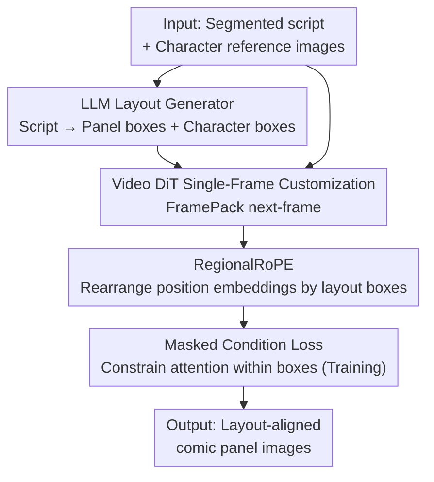

# DreamingComics: A Story Visualization Pipeline via Subject and Layout Customized Generation using Video Models

**Conference**: CVPR 2026  
**Paper**: [CVF Open Access](https://openaccess.thecvf.com/content/CVPR2026/html/Kwon_DreamingComics_A_Story_Visualization_Pipeline_via_Subject_and_Layout_Customized_CVPR_2026_paper.html)  
**Code**: Project Page https://yj7082126.github.io/dreamingcomics/  
**Area**: Image Generation / Story Visualization  
**Keywords**: Story Visualization, Comic Generation, Layout Control, Multi-subject Customization, Video Diffusion Models

## TL;DR
DreamingComics repurposes a pretrained **video DiT** (HunyuanVideo-I2V + FramePack) into a single-frame image customizer. It utilizes RegionalRoPE and masked condition loss to guide multiple character reference images into their designated layout boxes. Coupled with a fine-tuned VLM that automatically generates comic layouts from scripts, it enables controllable story/comic visualization while maintaining consistent character identities and artistic styles. It achieves a 29.2% improvement in character consistency and a 36.2% improvement in style similarity over the previous best method.

## Background & Motivation
**Background**: Story visualization aims to generate a sequence of coherent images from a textual narrative and character identities. With advances in DiT diffusion models and various image customization methods, this field has progressed rapidly, especially meeting strong demands in sequential panel scenarios like comics.

**Limitations of Prior Work**: Existing methods still provide insufficient visual control required for "storytelling". First, **spatial positioning**—pure text prompts lack pixel-level precision, failing to specify both "who appears" and "where they appear". Existing DiT customization methods either control only "who" (e.g., UNO, DreamO) or only "where" (e.g., Eligen, Regional Prompting), often leading to overlapping characters or mismatched appearances when trying to handle both. Second, **style consistency**—image generation models inherently favor realistic rendering and tend to "correct" or overwrite artistic styles like cartoons and flat illustrations desired by users. Third, **data gap**—there is a scarcity of paired datasets containing both "subject identity + spatial signals", limiting the development of layout-aware customization.

**Key Challenge**: Identity control (who) and spatial control (where) are entangled in the unified attention space of DiT. By default, all reference images share the same positional coordinates, causing the model to treat different subjects as originating from "the exact same location," which leads to spatial entanglement and identity collapse. Maintaining style consistency also requires a visual prior that is less biased towards photorealism.

**Goal**: To support both multi-subject identity/style preservation and explicit layout control within a **single generative model**, while minimizing the user's burden of manual layout specification.

**Key Insight**: The authors observe that while video generation models may have weaker single-frame perceptual quality compared to dedicated image models, they are trained on vast sequences of "semantically continuous frames." Consequently, they possess strong **spatiotemporal training priors**, which naturally benefit cross-frame identity and style consistency. Thus, the video model is "borrowed" for image customization.

**Core Idea**: Utilize a video DiT as a next-frame predictor for single-frame image customization, employ RegionalRoPE to "remap" the positional embeddings of each reference subject to its target layout box, apply a masked condition loss to constrain its attention within the designated box, and finally use a fine-tuned VLM to automatically generate the comic layout.

## Method

### Overall Architecture
The pipeline of DreamingComics is as follows: given a segmented script $T=\{T_1,...,T_n\}$ and several character reference images, a **fine-tuned LLM layout generator** first predicts the comic layout for each panel (panel bounding boxes $D_i$ within the page + character bounding boxes $\text{BOX}_{i,j}$ within the panel). These boxes serve as spatial conditions fed into the core generative model, **Dream-Illustrator**. Built upon a video DiT (HunyuanVideo-I2V + FramePack), Dream-Illustrator encodes reference images into tokens, rearranges their positional coordinates via **RegionalRoPE** based on the layout boxes, and applies a **masked condition loss** during training to bind each subject's cross-attention within its designated box. Ultimately, it generates a single target frame (i.e., one comic panel) at a time. This inherits the spatiotemporal priors of the video model to ensure style and identity consistency while maintaining image-level computational overhead.

The paper unifies these two layers of positioning using a comic-specific representation: the $i$-th panel is represented as the tuple $(T_i, D_i, \{\text{BOX}_{i,1},...,\text{BOX}_{i,n}\})$, where $D_i\in\mathbb{R}^4$ is the bounding box of the panel on the page, and $\text{BOX}_{i,j}\in\mathbb{R}^4$ is the bounding box of the character inside the panel. This enables reasoning about both "how panels are arranged on the page" and "how characters are placed within each panel."

### Key Designs

**1. LLM Layout Generator: Letting the model draw a "proper comic layout" for the user**

The limitation of prior work is that comic layouts are difficult to describe in text, and asking users to manually specify boxes for each panel and character is tedious and unprofessional. Existing works that use LLMs to predict layouts (e.g., TheaterGen) only target single images and do not predict **multi-panel** page-level layouts sufficient for comic generation. The authors fine-tune an LLM (Qwen2.5-VL 7B) using Supervised Fine-Tuning (SFT) on a self-built comic layout dataset. Given script $T$, the LLM outputs a structured page layout parsed into panel and character boxes $(D_i,(\text{BOX}_{i,1},...,\text{BOX}_{i,n}))$, which serve as spatial conditions for the subsequent generation stage. The paper highlights that the model learns comic-specific sparse visual regularities: spreading layouts across the panel area, organizing panels in the correct "top-to-bottom, right-to-left" reading order, and drawing reasonable character boxes. This looks much more like a "good comic layout" compared to directly asking GPT-4 to generate layouts. This treats layouts as a **first-class design signal** rather than a post-hoc auxiliary constraint, while reducing the user's effort to simply providing the script.

**2. Video DiT for Single-Frame Image Customization: Borrowing spatiotemporal priors without paying the computational cost of videos**

Addressing the limitation that image models lean towards photorealism and struggle with stylistic consistency, the authors do not directly use an image generator. Instead, they build upon the video DiT backbone, HunyuanVideo-I2V, and integrate FramePack. HunyuanVideo-I2V consists of a causal 3D-VAE, an MLLM text encoder, and a DiT with unified full attention across space and time, trained with a flow matching loss $\mathcal{L}=\|v_\theta(\mathbf{y}_t,t,C_I,T_P)-(\epsilon-\mathbf{y})\|^2$. The key lies in reformulating the generation as a **next-frame prediction** task: treating reference images as the first frame at $t=0$ to generate a **temporally distant** target frame $X$. Generating standard two-frame videos (generating at $t=1$) often produces stiff, "copy-paste" artifacts with minimal variation and poor alignment with the text prompt. On the contrary, FramePack is naturally designed to produce distant frames, such as $t=9$, from $t=0$ references. The authors leverage this property: given target timestep $t'$ and $N$ reference images $F_1,...,F_n$, each reference is encoded into $c_i=E(F_i)$ via VAE and concatenated with the noisy latent $z_t$ and text latent $z_p$ to form the input sequence, **generating only one frame at a time**. This reaps the benefits of the video model's spatiotemporal prior (yielding higher style/identity consistency) while keeping the computational cost at the image level—generating a $1280\times720$ image in 17 seconds, which is over 3 times faster than the video-based DRA-Ctrl. The paper also deliberately removes the original image projection module to support multi-subject inputs and reduce copy-paste artifacts.

**3. RegionalRoPE: Remapping the positional embeddings of each reference to its target box**

By default, 3D RoPE assigns the identical starting coordinates $(0,0)$ to all reference frames, causing the model to assume all subjects originate from "the exact same region," leading to spatial entanglement and identity collapse (where reference content is forced into the top-left corner). RegionalRoPE is a **deterministic mapping** that aligns each reference's RoPE indices with its target layout box. For a box $\text{BOX}_i=[w_\text{start},h_\text{start},w_\text{end},h_\text{end}]$ and reference latent $c_i\in\mathbb{R}^{h_i\times w_i\times d}$, the scaling factor $s=\min(W_\text{box}/w_i,\,H_\text{box}/h_i)$ is computed based on the box dimensions $(W_\text{box},H_\text{box})$ to preserve the aspect ratio and fit it inside the box, resulting in an adjusted grid size of $(W',H')=(s\,w_i,\,s\,h_i)$. The adjusted grid is then positioned inside the box (horizontally centered, while vertical alignment is controlled by $a\in[0,1]$, with $a{=}0$ for top-aligned and $a{=}0.5$ for centered). Finally, each latent pixel $(i,j)$ is mapped to coordinates $(t',i',j')=\big(0,\;w'_\text{start}+\tfrac{W'}{w_i}i,\;h'_\text{start}+\tfrac{H'}{h_i}j\big)$. Each reference is encoded independently with its own coordinates and concatenated into the input stream. Unlike UNO or OminiControl, which modify RoPE for **decorrelation** to reduce reference copying, this work uses RoPE for **explicit spatial anchoring**. Moreover, it operates on native-resolution cropped latents (unlike DRA-Ctrl/RealGeneral which downscale inputs to a fixed frame size), better preserving subject details with higher efficiency. This step **requires no training**.

**4. Masked condition loss: Keeping each subject's attention locked inside its box during training**

RegionalRoPE aligns positions without training, but using it in isolation can still lead to identity distortion and copy-paste artifacts. The authors introduce a masked condition loss to supervise each subject's spatial attention. First, cross-attention maps between the reference $c_i$ and the generated target are extracted from the diffusion process: $\text{CAM}_{c_i,t,\text{block}_j}=\tfrac{Q_{c_i,t,\text{block}_j}K_{t,\text{block}_j}^T}{\sqrt{d}}$ (where $Q$ is the token of the $i$-th reference and $K$ is the noisy latent token). These maps are averaged across timesteps and normalized to $[0,1]$ to obtain the attention region of each subject. Then, a binary mask $\text{MASK}_i$ (1 inside the box, 0 outside) is generated from $\text{BOX}_i$. A ReLU-based loss is defined (applied to the 2nd layer of the DiT): $\mathcal{L}_\text{mask}=\tfrac{1}{n_c}\sum_{i=1}^{n_c}\text{ReLU}(\text{CAM}_{c_i,\text{block}_2}-\text{MASK}_i)$. The ReLU function only penalizes **out-of-bounds** attention leakage without suppressing normal attention within the box. The final objective is $\mathcal{L}=\mathcal{L}_\text{diff}+\lambda_\text{mask}\mathcal{L}_\text{mask}$. This is gentler than the "hard attention masking" used in Eligen/Regional Prompting, as it guides the model to respect boundaries and preserve dedicated attention for each subject during training, thereby mitigating identity bleeding. The paper also adds an attention masking layer for multiple subjects to prevent information leakage by making reference latents invisible to each other (details in the supplementary material).

### Loss & Training
The two modules are trained separately. **Layout Generator**: Qwen2.5-VL (7B) is fine-tuned on 25K annotated comic layouts, represented as normalized bounding-box dictionaries under a fixed number of panels; using LoRA (rank 8, $\alpha{=}16$, dropout 0.05) with AdamW (lr 5e-4). **Dream-Illustrator**: Built by attaching FramePack LoRA weights to HunyuanVideo-I2V, removing the original image projection, and using LoRA (rank 32) with AdamW (lr 2e-4), batch size 8, mixed precision on 2×H100; $\lambda_\text{mask}{=}0.05$. It is first trained on single-subject samples for 6K steps, followed by 3K steps on multi-subject samples.

The **data generation pipeline** is also a major contribution. Comic layout dataset: Compiled and annotated from three comic datasets (COMICS, Manga109, and PopManga). Missing annotations are extracted using the MagiV2 detector (panel/character boxes), and Qwen2.5-VL is used to generate panel and page descriptions. Paired subject dataset: Since public data rarely contains "reference + layout" paired samples, the authors sample from the video dataset OpenS2V-Nexus, which has structured annotations. They select videos with stable human subjects, use the first-frame segmentation map to derive the target character box layout, and retrieve source frames from distant timestamps (ensuring subject continuity via face matching), keeping only samples meeting target (TopIQ) and source face (TopIQ-Face) quality thresholds. A similar process is applied to the anime dataset Anime-Shooter to cover diverse art styles, and a high-quality subset of Subject200K is processed following DreamO (using LISA for mask prediction). This yields 55K single-subject + 20K multi-subject paired samples.

## Key Experimental Results

### Main Results
Evaluated on ViStoryBench. The primary metrics are character similarity (CIDS) and style similarity (CSD) (where "cross" refers to reference $\leftrightarrow$ generated, and "self" refers to consistency among generated frames). The paper also reports OCCM (presence-character count match), layout accuracy, Inception score, and Aesthetic score.

| Method | Backbone | CIDS-Cross↑ | CSD-Cross↑ | OCCM↑ | Layout Accuracy↑ |
|------|------|------|------|------|------|
| DiffSensei | SDXL | 47.5 | 31.5 | 85.9 | 42.0 |
| Eligen | FLUX | 35.9 | 29.7 | 78.5 | 39.7 |
| UNO | FLUX | 46.2 | 39.3 | 83.8 | - |
| DreamO | FLUX | 51.6 | 38.3 | 85.7 | - |
| DRA-Ctrl | HunyuanVid | 36.2 | 39.0 | 74.9 | - |
| **Ours** | FramePack | **66.6** | **53.6** | **86.7** | **61.6** |

CIDS-cross of 66.6 is 29.2% higher than the runner-up DreamO (51.6). CSD-cross of 53.6 represents a substantial lead (an improvement of around 36.2% in style similarity). The layout accuracy of 61.6 validates that characters are placed correctly according to the layout. Aesthetic and Inception scores are comparable to copy-paste baselines; the authors explain that this is because they deliberately preserve stylized, non-realistic aesthetics, which are often penalized by default aesthetic metrics that favor photorealism rather than indicating poor image quality. On DreamBench++ for single-subject generation, the proposed method also achieves the highest DINO (60.50) and CLIP-I (79.50) scores, with CLIP-T comparable to other methods.

### Ablation Study
The contribution of RegionalRoPE and masked condition loss (Note: this ablation table is based on a setup that does not rely on additional regional attention masking; values may slightly differ from the main table's 66.6):

| Configuration | CIDS (Cross/Self) | CSD (Cross/Self) | Description |
|------|------|------|------|
| w/o RegionalRoPE (masked loss only) | 38.7 / 50.3 | 41.0 / 52.9 | Most significant performance drop |
| w/o masked loss (RegionalRoPE only) | 56.6 / 61.2 | 50.5 / 56.3 | Slight decline in layout fidelity |
| Full (ours, both used) | **58.5 / 63.0** | **52.9 / 62.4** | Full model |

Removing RegionalRoPE results in the most severe performance drop, demonstrating that it is the primary driver for spatial de-entanglement. Omitting the masked loss also degrades layout fidelity, confirming that "soft constraints with layout conditions" outperform "hard attention masking." The ablation on target timestep $t$ (Table 6) shows that $t=3$ is optimal (58.5/63.0); smaller values lead to stiff generation, while larger values introduce style/identity drift.

Layout Generator Comparison vs. GPT-4 (Table 4):

| Method | Page Coverage | Valid Panels | Character Count Ratio | Reading Order | Character Count |
|------|------|------|------|------|------|
| **Ours** | **100.0** | **79.14** | **99.00** | **100.0** | **86.30** |
| GPT-4 | 87.67 | 29.25 | 66.67 | 57.67 | 76.47 |

The proposed layout generator significantly outperforms GPT-4 in panel validity and reading order. A 26-respondent user study (Table 7) shows that 80.0%, 83.8%, 86.2%, and 69.2% of participants preferred the proposed method across character identity, style consistency, story consistency, and layout rationality, respectively.

### Key Findings
- **RegionalRoPE is the largest contributor**: Removing it causes CIDS-cross to drop from 58.5 to 38.7, which indicates it is the core mechanism for spatial de-entanglement (since the default RoPE's shared $(0,0)$ origin causes multi-subject attention to collapse together).
- **Soft constraints > Hard masking**: The masked condition loss uses ReLU to only penalize out-of-boundary leakage, which is more beneficial for maintaining identity and style than the hard regional attention masking in Eligen/Regional Prompting.
- **Video priors excel in stylized scenes**: For non-realistic art styles like cartoons and flat illustrations, video models exhibit strong style consistency despite lower single-frame sharpness. Although aesthetic metrics bias towards photorealism, resulting in lower scores on paper, our results remain much more faithful to the reference style.

## Highlights & Insights
- **Repurposing the "video model" as an image customizer**: Leveraging FramePack's "distant frame generation" to treat multiple reference images as the starting frame and outputting only one target frame at a time allows the model to exploit spatiotemporal priors while only paying the computational cost of image generation (17s/image, 3× faster than DRA-Ctrl). This idea of "borrowing video priors without paying video costs" is highly transferable to other image generation tasks requiring strong consistency.
- **Using RoPE for "explicit spatial anchoring" rather than "decorrelation"**: While works like UNO/OminiControl modify RoPE to reduce copying via decorrelation, this paper goes the opposite way, applying it for deterministic regional mapping—treating positional embeddings as a controllable spatial addressing tool.
- **Layout as a first-class citizen**: Transforming abstract scripts into structured panels/character boxes via a fine-tuned VLM beforehand, then feeding them to the generation model, decouples the "who + where" problem into two clean phases. This is far more controllable than pure text prompts and lighter than complex multi-agent plan-and-render pipelines.
- **"Mining" paired training data from video**: Automatically constructing "reference $\leftrightarrow$ target + layout box" pairs from video frames at distant timestamps elegantly bypasses the scarcity of paired datasets.

## Limitations & Future Work
- The authors acknowledge that **improperly specified** layouts (such as poorly positioned boxes) can lead to incoherent outputs and decreased fidelity. When there are conflicts between text, image, and layout conditions, prompt-following instructions can suffer. Future improvements lie in enhancing layout generation robustness and scaling model capacity.
- Self-read note: The ablation study's full model CIDS-cross is 58.5, whereas the main table reports 66.6 (the two setups differ; the former excludes the extra regional attention masking). Readers should be careful not to compare these numbers directly. ⚠️ Refer to the original text.
- Many crucial details (e.g., multi-subject attention masking, inference time/VRAM comparison, selection of $\lambda_\text{mask}$, and evaluation details) are placed in the supplementary material, making the main text incomplete. The dataset, while released, is limited to research use.
- The single-frame execution strategy means it is essentially "independent panel generation + shared reference." Long-range narrative coherence across panels relies heavily on the layout and reference, rather than direct modeling of inter-panel temporal actions.

## Related Work & Insights
- **vs. DiffSensei**: Also focuses on comics and integrates MLLMs, but DiffSensei's MLLM only acts as an identity adapter without generating layouts, and is largely limited to black-and-white manga. DreamingComics' VLM directly outputs page-level layouts and supports diverse artistic styles.
- **vs. TheaterGen**: Also supports multi-subject layout control, but TheaterGen generates subjects **sequentially** and merges them using ControlNet, which degrades inter-subject interaction. DreamingComics processes multi-subject + layout jointly within a single generative model.
- **vs. UNO / DreamO**: These methods offer strong identity customization but only control *who*, not *where* (relying on implicit spatial cues). DreamingComics uses RegionalRoPE for explicit layout control, preventing character overlapping and duplication.
- **vs. Eligen / Regional Prompting**: They apply hard regional attention masking to control location but often fail to maintain identity/style consistency. DreamingComics employs a soft masked condition loss + video priors to balance both location and style preservation.
- **vs. MovieAgent (plan-and-render)**: Uses multi-agent setups to explicitly plan layouts and narratives before rendering. DreamingComics **internalizes** narrative/layout consistency within a single generative model, relying on a lightweight, optional VLM pass for layout planning.
- **vs. DRA-Ctrl / RealGeneral**: Also use video models for controllable image generation, but they require generating multiple frames and downscaling to a fixed frame size. DreamingComics uses a single-frame pipeline with native-resolution cropping, which is faster, produces higher fidelity, and is the first to target multi-subject spatial layout generation.

## Rating
- Novelty: ⭐⭐⭐⭐⭐ Repurposing a video DiT as a single-frame image customizer + using RegionalRoPE for explicit spatial anchoring + layout generation via VLM is a highly novel combination.
- Experimental Thoroughness: ⭐⭐⭐⭐ Solid results on two benchmarks with multiple ablation studies and user research, though some crucial parameters and multi-subject details are left in the supplementary materials, and table configurations vary slightly.
- Writing Quality: ⭐⭐⭐⭐ Clear motivation, well-developed methodology, comprehensive formulas, and intuitive illustrations.
- Value: ⭐⭐⭐⭐⭐ An elegant, unified layout-aware framework solving the "who + where + style" bottleneck in story/comic generation with highly practical pipeline viability.

<!-- RELATED:START -->

## Related Papers

- [\[CVPR 2026\] ViStoryBench: Comprehensive Benchmark Suite for Story Visualization](vistorybench_comprehensive_benchmark_suite_for_story_visualization.md)
- [\[ICLR 2026\] LogiStory: A Logic-Aware Framework for Multi-Image Story Visualization](../../ICLR2026/image_generation/logistory_a_logic-aware_framework_for_multi-image_story_visualization.md)
- [\[ICLR 2026\] Story-Iter: A Training-free Iterative Paradigm for Long Story Visualization](../../ICLR2026/image_generation/story-iter_a_training-free_iterative_paradigm_for_long_story_visualization.md)
- [\[CVPR 2026\] Unified Customized Generation by Disentangled Reward Modeling](unified_customized_generation_by_disentangled_reward_modeling.md)
- [\[CVPR 2026\] Taming Video Models for 3D and 4D Generation via Zero-Shot Camera Control](taming_video_models_for_3d_and_4d_generation_via_zero-shot_camera_control.md)

<!-- RELATED:END -->
