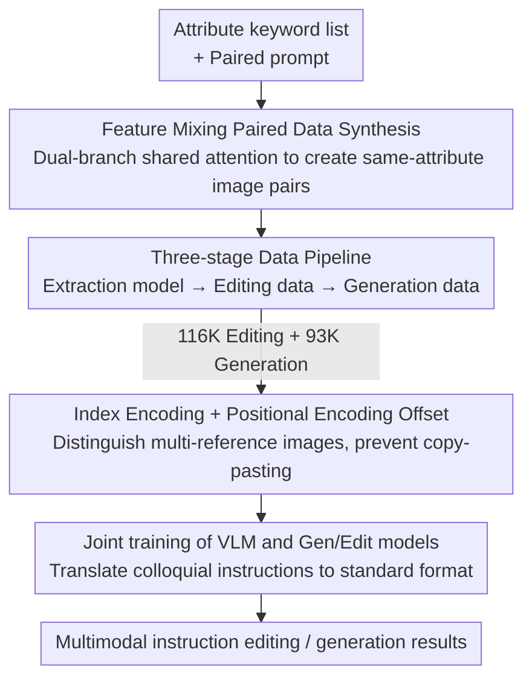

# DreamOmni2: Multimodal Instruction-based Generation and Editing

**Conference**: CVPR 2026  
**Paper**: [CVF Open Access](https://openaccess.thecvf.com/content/CVPR2026/html/Xia_DreamOmni2_Multimodal_Instruction-based_Generation_and_Editing_CVPR_2026_paper.html)  
**Code**: https://github.com/dvlab-research/DreamOmni2 (Available)  
**Area**: Image Generation / Diffusion Models  
**Keywords**: Multimodal Instruction Editing, Subject-driven Generation, Abstract Attributes, Feature Mixing Data Synthesis, Unified Generation and Editing Model

## TL;DR
DreamOmni2 upgrades "instruction-based editing" and "subject-driven generation" into **multimodal instruction tasks with reference images**, capable of referencing both specific objects and abstract attributes (e.g., texture, pose, hairstyle, style). It generates training pairs via a three-stage synthetic data pipeline and equips the unified editing model Flux Kontext with index encoding, positional encoding offsets, and joint VLM training. This allows the model to ingest multiple reference images and understand complex colloquial instructions, outperforming GPT-4o and Nano Banana in human evaluations on its self-constructed benchmark.

## Background & Motivation
**Background**: Unified image generation and editing models (e.g., Flux Kontext, Qwen-Image-Edit) are gaining popularity. A single model can perform instruction-based image editing and subject-driven generation, simplifying the user workflow and reducing deployment costs.

**Limitations of Prior Work**: Current mainstream approaches face two complementary limitations. First, **text-only instruction editing**: when a user says "change the pattern of this bag to match that dress," the "complex pattern of the dress" cannot be described clearly with text, requiring a reference image. Moreover, users often want to reference **abstract attributes**—such as materials, poses, hairstyles, or design styles—rather than just objects, which are even harder to describe. Second, **subject-driven generation**: existing methods (DreamBooth, IP-Adapter, UNO, etc.) focus almost exclusively on transferring **specific objects/people** to new images, with little research on referencing abstract attributes.

**Key Challenge**: The real bottleneck for these new tasks is not model architecture but the **non-existence of training data**. Traditional editing pipelines only produce "instruction + source image + target image" triplets, failing to use reference images as conditions. Traditional subject generation pipelines rely on segmentation/detection to crop objects, which cannot handle abstract attributes or occluded objects.

**Goal**: To formally propose two tasks—**multimodal instruction editing** and **multimodal instruction generation** (both supporting text+image instructions and covering both objects and abstract attributes)—while simultaneously solving: (1) how to synthesize the data and (2) how to modify the model framework to ingest multiple reference images and understand complex instructions.

**Key Insight**: Use a **Feature Mixing** scheme to leverage a base T2I model's own capabilities to synthesize paired data, then use the resulting "extraction model" to bootstrap a three-stage data pipeline. On the framework side, use index/positional encoding to distinguish multiple reference images and jointly train a VLM with the generation/editing model as an "instruction translator."

## Method

### Overall Architecture
DreamOmni2 consists of two main components: **Data side**—a three-stage synthetic pipeline that creates 116K multimodal editing data and 93K generation data from scratch; **Model side**—LoRA fine-tuning on the unified base Flux Kontext, introducing index encoding, positional encoding offsets, and joint VLM training. The key to the data side is "Feature Mixing to create paired images → training an extraction model for arbitrary attributes → using the extraction and editing models to bootstrap editing/generation pairs," a process of **step-by-step bootstrapping**. The model side addresses the engineering gaps where the base model could only ingest a single image and lacked understanding of colloquial instructions.

### Key Designs

**1. Feature Mixing Paired Data Synthesis: Letting the T2I Model Create "Same-Attribute Image Pairs"**

To train an "attribute extraction" model, one needs a large collection of **image pairs sharing the same abstract attribute or object**, but generating such pairs directly is difficult. This work uses a dual-branch structure (source branch + target branch) running the same DiT simultaneously, where features from both branches are **mixed** in the attention layers. The target branch attention uses concatenated K and V, with the formula:

$$\text{Attn}_{tar}(\vec{Q},\vec{K},\vec{V})=\text{softmax}\!\left(\frac{\vec{Q}\vec{K}^{\top}}{\sqrt{d}}\right)\vec{V}$$

where $\vec{Q}=[\vec{Q}^{n}_{tar};\vec{Q}^{t}_{tar}]$, and $\vec{K}=[\vec{K}^{n}_{tar};\vec{K}^{t}_{tar};\vec{K}^{n}_{src}]$, $\vec{V}=[\vec{V}^{n}_{tar};\vec{V}^{t}_{tar};\vec{V}^{n}_{src}]$ — i.e., the target branch additionally ingests the **noise features from the source branch** at the same layer $\vec{K}^{n}_{src}, \vec{V}^{n}_{src}$ (superscript $n$ for noise, $t$ for text, and $[;]$ denotes token-wise concatenation). This way, the target image is "pulled" by the visual features of the source image during generation, ensuring they share the same attribute. Paired prompts are synthesized by LLMs (DouBao) from attribute keywords. Compared to UNO's "diptych" approach (squeezing two images into one), Feature Mixing produces **two independent branches**: it does not sacrifice resolution, avoids color bleeding at the seam, and achieves higher success rates—forming the foundation for the entire data pipeline.

**2. Three-stage Bootstrapping Data Pipeline: Rolling Out Editing/Generation Data with the Extraction Model**

Paired images alone are insufficient; multimodal editing requires "source image + instruction + reference image + target image" quadruplets. The pipeline is split into three levels, each reusing the outputs of the previous. **Stage 1** uses the Stage 0 paired data to train an **extraction model**: given a source image and a simple description ("referencing [attribute/person] from source image"), it learns to migrate that attribute/appearance to the target image, acting as a general extractor for **abstract concepts and occluded objects**. **Stage 2** creates editing data: target images are obtained via T2I or real datasets, the extraction model pulls a reference image based on a keyword, an existing editing model [Kontext] modifies the target image into a source image, and finally an LLM generates editing instructions. **Stage 3** creates generation data: the extraction model pulls multiple reference images from Stage 2 source images, combined with Stage 2 reference images to form "multi-reference images + instruction → target image" tuples. The entire chain is bootstrapped from the base model without manual annotation, covering diverse scenarios with 1-5 reference images.

**3. Index Encoding + Positional Encoding Offset: Ingesting Multi-reference Images without "Copy-Pasting"**

The unified base Kontext can only process a single input image. In multi-reference tasks, users typically say "image 1" or "image 2," but native positional encoding in DiTs cannot distinguish the **index** of the reference images. This work adds an **index encoding** to the positional encoding channels: the encoding for the $n$-th image is $(x, y, n)$, allowing the model to know which image corresponds to which index in the instruction. However, if multiple images share the same $(x, y)$ coordinates, the model may copy pixels directly, causing artifacts. Thus, **positional encoding offsets** are applied: the x-coordinate of the $n$-th image is offset by the cumulative width of all previous images, encoded as $(x+w_1+\dots+w_{n-1}, y, n)$, **spacing out** the reference images in the positional space. Ablations (Tab. 5) show that index encoding manages "image identification" while positional offsets manage "pixel copying prevention," both being indispensable.

**4. Joint VLM and Gen/Edit Training: Translating Colloquial Instructions**

Training instructions use a rigid format, but real users provide colloquial or logically jumpy instructions, creating a distribution gap that causes performance drops. A **Qwen2.5-VL 7B** is **jointly trained** with the generation/editing models: the VLM learns to translate complex user instructions into the **predefined standard format** used during training. For editing, it outputs "user instruction + refined image description"; for generation, it outputs the refined description directly. Ablation (Tab. 4) shows that training only the generation model (Scheme 2) or only the VLM (Scheme 3) is significantly worse than joint training (Scheme 4), indicating that "generating data" and "translating instructions" provide independent, additive gains.

## Loss & Training
The base model is Flux Kontext. Two separate **LoRAs** are trained for editing and generation (as the primary difference is whether to maintain source image consistency, and user instructions often don't specify the intent). LoRA is activated upon detecting a reference image, preserving the native editing capabilities of Kontext. Qwen2.5-VL 7B is fine-tuned with lr $=1\times10^{-5}$ for ~10 A100 hours; the two LoRAs are trained with batch size 16 and lr $=5\times10^{-6}$ for approximately 384 A100 hours.

## Key Experimental Results

Evaluations were conducted on the self-built **DreamOmni2 benchmark** (real images, covering specific objects + global/local abstract attributes). Success rates were judged by Gemini 2.5, Doubao 1.6, and professional engineers (Success = >3/5 passes on "instruction following," "consistency," and "no obvious distortion").

### Main Results: Multimodal Instruction Editing Success Rate

| Method | Specific Object Human↑ | Abstract Attribute Human↑ | Specific Object Gemini↑ | Abstract Attribute Gemini↑ |
|------|------|------|------|------|
| GPT-4o (Closed-source) | 0.561 | 0.579 | 0.683 | 0.720 |
| Nano Banana (Closed-source) | 0.537 | 0.329 | 0.683 | 0.646 |
| Qwen-Image-Edit-2509 | 0.220 | 0.043 | 0.268 | 0.049 |
| Omnigen2 | 0.293 | 0.031 | 0.220 | 0.043 |
| Kontext (Base) | 0.098 | 0.012 | 0.049 | 0.018 |
| **DreamOmni2 (Ours)** | **0.610** | **0.683** | 0.585 | 0.585 |

Open-source models almost entirely failed on abstract attributes (Human scores near 0). DreamOmni2 achieved a Human success rate of 0.683 on abstract attributes, **surpassing GPT-4o and Nano Banana**. It also ranked first among all open-source models for specific objects, outperforming both commercial models in human evaluation. Generation results (Tab. 3) follow a similar trend.

### Ablation Study 1: Data vs. VLM Joint Training (Doubao Success Rate)

| Scheme | Train Gen/Edit Model | Train VLM | Edit·Specific | Edit·Abstract | Gen·Specific | Gen·Abstract |
|------|:---:|:---:|------|------|------|------|
| Scheme 1 (Base Kontext) | ✗ | ✗ | 0.122 | 0.012 | 0.375 | 0.122 |
| Scheme 2 (Ours Data Only) | ✓ | ✗ | 0.366 | 0.317 | 0.458 | 0.344 |
| Scheme 3 (VLM Translation Only) | ✗ | ✓ | 0.244 | 0.342 | 0.542 | 0.478 |
| **Scheme 4 (Joint, Ours)** | ✓ | ✓ | **0.659** | **0.628** | **0.667** | **0.633** |

### Ablation Study 2: Multi-image Encoding Schemes (Doubao Success Rate)

| Scheme | Index Enc | Pos Offset | Edit·Specific | Edit·Abstract | Gen·Specific | Gen·Abstract |
|------|:---:|:---:|------|------|------|------|
| Scheme 1 | ✗ | ✗ | 0.244 | 0.281 | 0.292 | 0.222 |
| Scheme 2 | ✗ | ✓ | 0.463 | 0.543 | 0.542 | 0.511 |
| Scheme 3 | ✓ | ✗ | 0.342 | 0.390 | 0.417 | 0.456 |
| **Scheme 4 (Ours)** | ✓ | ✓ | **0.659** | — | — | — |

### Key Findings
- **Abstract attributes represent the real edge**: Open-source SOTA models have nearly zero Human success rates in abstract attribute editing. DreamOmni2 reaches 0.68—the explicit coverage of materials, poses, styles, and fonts during data synthesis is the root cause.
- **Data and VLM gains are orthogonal**: Adding only data (Scheme 2) or only VLM translation (Scheme 3) results in partial improvements; only the joint approach jumps to 0.66, proving that "model capability" and "instruction understanding" are independent bottlenecks.
- **Division of labor for Index Encoding and Positional Offset**: The former ensures the model "recognizes the correct image index," while the latter ensures it "does not copy pixels." Removing either significantly degrades multi-image tasks.
- The authors note that GPT-4o and Nano Banana often introduce unintended changes or cause yellowing, which VLM scorers do not always catch, making Human evaluation a better indicator of DreamOmni2's consistency.

## Highlights & Insights
- **Feature Mixing vs. Diptych for Data Synthesis**: Using dual-branch shared attention K/V to "pull" target image generation avoids the resolution and color bleeding issues of UNO's diptych method. This "letting T2I create paired supervision" idea is transferable to any attribute migration task lacking paired data.
- **Bootstrapping Data Pipeline with Extraction Model**: Training a general extractor and using it to iteratively crop reference images turns a "segmentation/detection required" data bottleneck into a self-sufficient process powered by the base model.
- **Plug-and-play LoRAs**: Activating LoRAs only when reference images are detected preserves native capabilities, and separating editing/generation LoRAs provides practical flexibility for source consistency.
- **VLM as an Instruction Translation Layer**: Instead of changing the generation model's format, the VLM translates colloquial inputs into standard ones, bridging the gap between training and real-world distributions. This decoupling is universally applicable to systems with noisy online instructions.

## Limitations & Future Work
- **Strong Dependence on External Models**: The pipeline relies on DouBao for prompts, Kontext as the editor, and Qwen2.5-VL as the translator; overall performance is capped by these components.
- **High Computational Cost**: Training two LoRAs requires ~384 A100 hours.
- **Semi-reliance on VLM Scoring**: VLM scorers may miss subtle artifacts (e.g., yellowing or fine inconsistency), necessitating human evaluation on a smaller scale. ⚠️ Specific templates for standard formats are in the supplementary material, not the main text.
- The boundaries between local/global abstract attributes and the degradation patterns when using 1-5 reference images were not fully analyzed.

## Related Work & Insights
- **vs. InstructPix2Pix / DreamVE (Instruction Editing)**: These rely only on language instructions, which struggle with fine details like textures. Ours adds reference images and extends the scope to abstract attributes.
- **vs. DreamBooth / IP-Adapter / UNO (Subject-driven Generation)**: Previous methods require per-subject fine-tuning or use visual encoders/diptychs for injection, mostly focusing on **specific objects**. Ours extends reference objects to arbitrary abstract attributes and replaces diptychs with Feature Mixing.
- **vs. OmniContext / Kontext (Unified Model Benchmarks)**: While OmniContext supports multi-reference, it only tests object combinations. Ours introduces the first benchmark covering "Editing+Gen × Specific+Abstract × Multi-reference."

## Rating
- Novelty: ⭐⭐⭐⭐⭐ Introducing abstract attributes to instruction-based editing/gen is a real-world problem, and Feature Mixing + bootstrapping is a solid approach.
- Experimental Thoroughness: ⭐⭐⭐⭐ Comprehensive results and ablations with three-way evaluation, though some key formats are in supplementary materials.
- Writing Quality: ⭐⭐⭐⭐ Clear motivation and data pipeline descriptions; math notation is dense but clear with diagrams.
- Value: ⭐⭐⭐⭐⭐ The data bootstrapping and plug-and-play LoRA designs are practical, and the benchmark advances the field.

<!-- RELATED:START -->

## Related Papers

- [\[CVPR 2026\] OmniGen2: Towards Instruction-Aligned Multimodal Generation](omnigen2_towards_instruction-aligned_multimodal_generation.md)
- [\[CVPR 2026\] CompBench: Benchmarking Complex Instruction-guided Image Editing](compbench_benchmarking_complex_instruction-guided_image_editing.md)
- [\[CVPR 2026\] SliderEdit: Continuous Image Editing with Fine-Grained Instruction Control](slideredit_continuous_image_editing_with_fine-grained_instruction_control.md)
- [\[CVPR 2026\] Kontinuous Kontext: Continuous Strength Control for Instruction-based Image Editing](kontinuous_kontext_continuous_strength_control_for_instruction-based_image_editi.md)
- [\[CVPR 2026\] Proxy-Tuning: Tailoring Multimodal Autoregressive Models for Subject-Driven Image Generation](proxy-tuning_tailoring_multimodal_autoregressive_models_for_subject-driven_image.md)

<!-- RELATED:END -->
