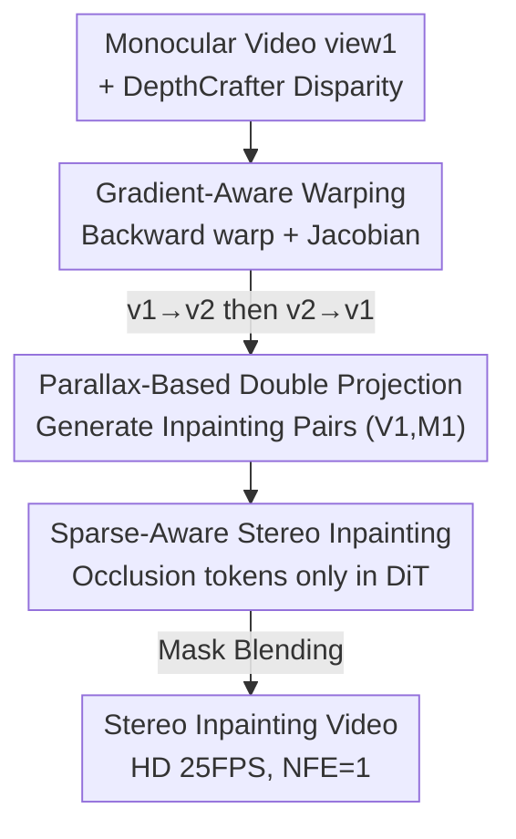

# DreamStereo: Towards Real-Time Stereo Inpainting for HD Videos

**Conference**: CVPR 2026  
**Paper**: [CVF Open Access](https://openaccess.thecvf.com/content/CVPR2026/html/Huang_DreamStereo_Towards_Real-Time_Stereo_Inpainting_for_HD_Videos_CVPR_2026_paper.html)  
**Code**: None (ByteDance, not yet public as of the paper release)  
**Area**: Diffusion Models / Video Generation / Stereo Video  
**Keywords**: Monocular-to-Stereo, Stereo Inpainting, Backward Warping, Sparse Token, Real-Time Diffusion  

## TL;DR
DreamStereo models the "monocular-to-stereo video" conversion as an **occlusion inpainting** problem. It utilizes gradient-aware backward warping to generate clean training data and a sparse strategy that limits diffusion calculations solely to tokens in occluded regions. This achieves 25 FPS real-time HD stereo inpainting (768×1280) on a single A100 GPU (NFE=1, PSNR 30.5 dB).

## Background & Motivation
**Background**: The rise of AR/VR devices has increased the demand for stereo content (with binocular parallax). However, multi-view devices for capturing stereo video are expensive, and legacy content remains monocular. The mainstream "monocular-to-stereo" approach involves estimating depth, warping the left view to the right based on disparity, and then using a diffusion model to **inpaint** the resulting holes (occlusions hidden by foreground objects).

**Limitations of Prior Work**: 
1. **Data Generation Bottleneck**: These methods rely on stereo inpainting datasets. Real stereo videos are costly, and binocular projection rules across datasets are inconsistent. TrajectoryCrafter proposed generating data from monocular videos via double reprojection, but it uses **forward warping**, which maps source pixels to target coordinates. This causes misalignments in multi-layer backgrounds and scattered "fly-points" at object edges, leading to fragmented masks that degrade both data quality and downstream inpainting.
2. **Computational Redundancy**: Occluded regions occupy only a small fraction of each frame. However, existing methods treat the **entire frame equally**, performing $O(N^2)$ attention calculations for all pixels. This results in slow inference, making real-time performance impossible.

**Key Challenge**: Stereo inpainting is inherently a "local task" (modifying only a small set of occluded pixels) but is treated as a "global task" by current methods. Simultaneously, traditional forward warping breaks edge continuity, damaging both training data and inference quality.

**Goal**: (a) Generate geometrically consistent stereo inpainting pairs with clean masks from monocular data without relying on real stereo videos; (b) Confine diffusion calculations to relevant areas to achieve real-time HD stereo inpainting.

**Core Idea**: Utilize **backward warping + coordinate mapping gradients** to obtain smooth edges and accurate occlusion masks (GAPW). This mask is used to generate data (PBDP) and to **sparsify DiT tokens** (SASI), linking data quality and computational efficiency through a single mask.

## Method

### Overall Architecture
DreamStereo is a serial three-stage pipeline: **GAPW (Warping) → PBDP (Data Generation) → SASI (Fast Inpainting)**. Given a monocular video, disparity is estimated using DepthCrafter. GAPW warps it to a second view and back to obtain an occlusion mask in the input view, forming training pairs (PBDP). During training/inference, the occluded video is fed into a Wan2.1-based diffusion DiT, but only tokens within the occlusion mask (and its dilated boundary) participate in computation (SASI). Finally, the inpainted results are blended with the original via the mask.

### Key Designs

**1. Gradient-Aware Disparity Warping (GAPW): Smooth pixels and accurate masks via backward warping Jacobian.**

To solve the "fly-point + fragmented mask" issues of forward warping, GAPW uses backward warping. For each target pixel $(x',y')$, it finds the source coordinates via the inverse transform $T^{-1}$ and interpolates: $I'(x',y')=\mathrm{Interpolate}(I,x,y)$. This ensures continuity. Occlusion is determined by the **Jacobian matrix** $\mathbf{J}_T(x',y')$ of the mapping. In a stereo system, this simplifies to $M(x',y')=\left|\frac{\partial x'}{\partial x}\right|>\delta$. Since the gradient is continuous, the resulting occlusion mask is smooth and contiguous.

**2. Parallax-Based Double Projection (PBDP): Generating data without real stereo videos.**

Addressing "expensive and inconsistent stereo data," PBDP adopts the reprojection idea from TrajectoryCrafter but replaces forward warping with GAPW. Given monocular video $V_1$ and disparity $D_1$, the first projection yields $\mathbf{V}_2,\mathbf{D}_2=\mathrm{GAPW}(\mathbf{V}_1,\mathbf{D}_1;v1\!\to\!v2)$. A second projection back yields $\mathbf{V}_1',\mathbf{M}_1=\mathrm{GAPW}(\mathbf{V}_2,\mathbf{D}_2;v2\!\to\!v1)$, recreating $V_1$ with its **input-view occlusion mask** $M_1$. This generates high-quality training pairs $(V_1, M_1)$ from massive monocular video sources.

**3. Sparse-Aware Stereo Inpainting (SASI): 10.7× acceleration by processing only occlusion tokens.**

Built upon WanVideo, this uses a DiT denoiser $D_\theta$ and a 3D VAE. Latents $\mathbf{z}_0=\mathcal{E}(\mathbf{V})$ and $\mathbf{z}^m=\mathcal{E}(\mathbf{V}^m)$ are generated, and the mask is downsampled to $m$. **Mask-based token selection** applies a dilation $\Phi(m,k)$ to the mask $m$ to cover occlusions and a buffer zone. A selection function $\mathcal{S}$ extracts only the relevant tokens: $(\hat{\mathbf{z}}_0,\hat{\mathbf{z}}^m,\hat{m})=\mathcal{S}((\mathbf{z}_0,\mathbf{z}^m,m)$, $\Phi(m,k))$.

The diffusion follows flow matching. Denoising learns the velocity field:
$$\mathcal{L}=\left\|D_\theta(\hat{\mathbf{z}}_t,\hat{\mathbf{z}}^m,\hat{m},t)-\mathbf{v}\right\|_2$$
During inference, as attention is $O(N^2)$, reducing tokens $N$ boosts speed. With $k=3$, only **25.6%** of tokens remain, accelerating the DiT by **10.7×**. Training uses 100% dense tokens to avoid distribution shift, while sparsification is applied only during inference.

### Loss & Training
The model is based on Wan2.1-1.3B with LoRA fine-tuning and a distilled 3D-aware VAE. 
- **Stage 1**: General inpainting pre-training on OpenVid with random masks (10k steps, batch 12).  
- **Stage 2**: Training with PBDP-generated pseudo-stereo data across three resolutions (2.5k steps, batch 2). Max disparity is sampled from [0.3, 0.8].

## Key Experimental Results

### Main Results
Evaluation on HD-100 (768×1280):

| Method | NFE | Latency (ms)↓ | PSNR↑ | SSIM↑ | LPIPS↓ |
|------|-----|-------|-------|-------|--------|
| ProPainter† | 1 | 668.1 | 28.30 | 0.927 | 0.052 |
| StereoCrafter | 8 | 716.5 | 23.99 | 0.782 | 0.142 |
| **Ours** | 1 | **40.1** | **30.48** | 0.900 | 0.053 |
| **Ours (blended)** | 1 | **40.1** | **32.65** | **0.948** | **0.026** |

At NFE=1, the model achieves 40.1ms/frame (≈ 25 FPS). The "blended" variant leverages GAPW masks for high-resolution alignment, significantly boosting PSNR.

### Ablation Study

Data strategy (Fixed architecture, dense inference, 576×1024):

| Data Strategy | PSNR↑ | SSIM↑ | LPIPS↓ |
|----------|-------|-------|--------|
| Random Mask | 26.64 | 0.906 | 0.092 |
| TrajectoryCrafter (Forward) | 31.14 | 0.923 | 0.047 |
| **Ours (GAPW Double Projection)** | **32.48** | **0.933** | 0.049 |

### Key Findings
- **Data generation is a primary gain source**: Replacing random masks with GAPW double projection increases PSNR by +5.8 dB, outperforming TrajectoryCrafter and proving that forward warping's "dirty" masks hinder inpainting.
- **Sparsification is nearly cost-free**: Reducing token retention to 25.6% maintains quality (PSNR 32.48 → 32.01) while decreasing DiT latency from 380.9ms to 35.7ms.
- **Robust to wide baselines**: As max disparity increases from 0.02 to 0.08, PSNR decreases only slightly (32.18 to 29.91), showing stability for wide-baseline stereo.

## Highlights & Insights
- **One mask, three uses**: The GAPW Jacobian mask is reused for data generation, token sparsification, and final blending. This consistency is more elegant than mixing disparate priors.
- **Local task, local computation**: Direct token pruning based on task structure (occlusion patterns) avoids the need for heavy distillation or quantization while saving GPU memory and time.
- **Inference-only sparsity**: Processing dense tokens during training but sparse during inference pragmatically avoids distribution shifts.

## Limitations & Future Work
- Dependency on DepthCrafter: If depth estimation fails, GAPW warps and masks will be incorrect.
- Disparity sampling for pseudo-data is heuristic; generalization to real-world binocular human vision requires more subjective user studies.
- Sparsification benefits depend on occlusions being "small and concentrated." If occlusions occupy the majority of the frame, the real-time advantage diminishes.

## Related Work & Insights
- **Vs TrajectoryCrafter**: Both use reprojection, but GAPW's backward warping results in cleaner masks and better data quality (32.48 vs 31.14 PSNR).
- **Vs StereoCrafter / ImmersePro**: These rely on real stereo data; Ours scales using monocular videos.
- **Vs ZeroStereo**: Training-free methods struggle with domain gaps and high NFE requirements; Ours is optimal at NFE=1.

## Rating
- Novelty: ⭐⭐⭐⭐ 
- Experimental Thoroughness: ⭐⭐⭐⭐ 
- Writing Quality: ⭐⭐⭐⭐ 
- Value: ⭐⭐⭐⭐⭐ 

<!-- RELATED:START -->

## Related Papers

- [\[CVPR 2026\] FlashDecoder: Real-Time Latent-to-Pixel Streaming Decoder with Transformers](flashdecoder_real-time_latent-to-pixel_streaming_decoder_with_transformers.md)
- [\[CVPR 2026\] PortraitDirector: A Hierarchical Disentanglement Framework for Controllable and Real-time Facial Reenactment](portraitdirector_a_hierarchical_disentanglement_framework_for_controllable_and_r.md)
- [\[CVPR 2026\] StreamAvatar: Streaming Diffusion Models for Real-Time Interactive Human Avatars](streamavatar_streaming_diffusion_models_for_real-time_interactive_human_avatars.md)
- [\[CVPR 2026\] From Inpainting to Layer Decomposition: Repurposing Generative Inpainting Models for Image Layer Decomposition](from_inpainting_to_layer_decomposition_repurposing_generative_inpainting_models_.md)
- [\[CVPR 2026\] NanoSD: Edge Efficient Foundation Model for Real Time Image Restoration](nanosd_edge_efficient_foundation_model_for_real_time_image_restoration.md)

<!-- RELATED:END -->
