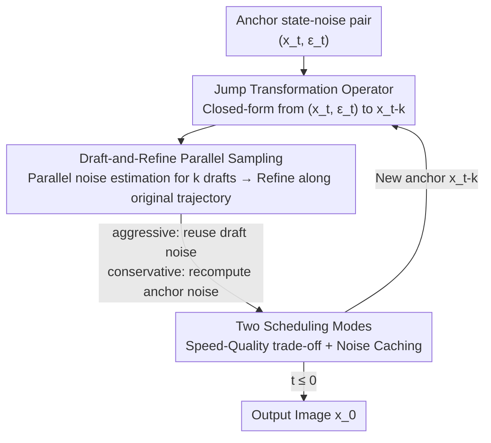

# DRiffusion: Draft-and-Refine Process Parallelizes Diffusion Models with Ease

**Conference**: CVPR 2026  
**Paper**: [CVF Open Access](https://openaccess.thecvf.com/content/CVPR2026/html/Bai_DRiffusion_Draft-and-Refine_Process_Parallelizes_Diffusion_Models_with_Ease_CVPR_2026_paper.html)  
**Code**: Not disclosed (no repository link in paper)  
**Area**: Diffusion Models / Inference Acceleration  
**Keywords**: Diffusion models, parallel sampling, inference acceleration, jump transformation, draft-and-refine

## TL;DR
DRiffusion formalizes "skipping intermediate timesteps" in diffusion sampling as a **local operator**. It first uses this operator to draft approximate states for the next $k$ timesteps at once, feeds these drafts into the original denoising network **in parallel** to obtain noises, and then refines them along the original trajectory. Without modifying pretrained models or samplers, it achieves a 1.4×–3.7× wall-clock speedup using $n$ GPUs, while maintaining near-original FID/CLIP scores.

## Background & Motivation
**Background**: Diffusion models produce high-fidelity content through iterative denoising from pure noise. However, this process is inherently serial—the network forward for step $t-1$ must wait for the completion of step $t$. Sequencing dozens of steps leads to high sampling latency, making it difficult for interactive scenarios.

**Limitations of Prior Work**: Existing acceleration routes have significant drawbacks. "Step-reduction" methods like distillation and Rectified Flow suffer from noticeable quality degradation under aggressive compression, and distillation can lose generation diversity. Parallelization is an orthogonal approach, but existing implementations are limited: system-level methods (DistriFusion, AsyncDiff) approach it from a computational perspective and are tightly coupled with specific U-Net/Transformer architectures, with additional VRAM expanding with the number of devices; mathematical methods (ParaDiGMS, etc.) rewrite diffusion as SDE/ODE solvers, which often have poor compatibility with existing frameworks and may deviate from the original model's sampling distribution.

**Key Challenge**: The **serial nature** of diffusion sampling stems from the fact that "to calculate the noise at step $t-k$, one must first have the state at $t-k$, which requires step-by-step denoising." System-level methods search for parallelizable parts outside this sequence, while mathematical methods redefine the entire sampling path—neither addresses a more fundamental question: **Is there inherent parallelism within the original framework?**

**Goal**: To consolidate the main bottleneck of diffusion inference (network forward passes) into a single parallel step without modifying pretrained networks, changing samplers, or deviating from the original sampling distribution.

**Key Insight**: The authors observe a simple mathematical fact: predicting an earlier state $x_{t-k}$ directly from $(x_t, \varepsilon_t)$ (skipping intermediate steps) has closed-form solutions in DDPM, DDIM, and ODE frameworks. By extracting this "step-jumping" as a **local operator** that can be called on-demand, multiple future states can be "drafted" beforehand, enabling parallel network evaluations.

**Core Idea**: Use the jump operator to draft future states as parallel proposals (draft), then refine them along the original denoising trajectory after obtaining their noises in parallel (refine), thus compressing serial network evaluations into a single parallel step.

## Method

### Overall Architecture
The input of DRiffusion is the state-noise pair $(x_t, \varepsilon_t)$ at the current anchor timestep $t$, and the output is the sampled image $x_0$. The core loop is a **draft-and-refine** block: at the anchor point, the jump operator is used to draft states $x_{t-1}, x_{t-2}, \dots, x_{t-k}$ simultaneously. These $k$ draft states are sent **in parallel** to the same noise prediction network to obtain corresponding noises, which are then used to refine each state via standard denoising updates until a refined $x_{t-k}$ is reached as the anchor for the next round. Each round compresses $k$ network forward passes into one parallel evaluation, reducing latency from $O(\text{steps})$ to the level of $O(\text{steps}/n)$ (where $n$ is the number of devices).

The method consists of three progressive stages: formalizing "step-jumping" as an operator (enabling parallelism), building the draft-and-refine pipeline (implementing parallelism), and providing two scheduling modes to trade off speed and quality.

### Key Designs

**1. Jump Transformation Operator: Formalizing "skipping steps" as a local primitive**

Parallelization is hindered by the serial nature of sampling, but the authors found this can be broken locally. A jump transformation refers to predicting a future state $x_{t-k}$ directly from $(x_t, \varepsilon_t)$ without intermediate steps. In continuous time, this is a natural operation of "integrating over a longer interval," but existing frameworks only exercise this freedom at the **global** level (ODE via global discretization schedules, DDIM via re-selecting timestep subsequences). The contribution here is **operatorization**—deriving closed-form updates for DDPM, DDIM, and Euler frameworks, making it a local primitive that can be called anytime without changing the underlying mechanism.

Specifically, for DDPM, since the reverse step comes from Bayes' rule, the jump target $q(x_{t-k}\mid x_t, x_0)=\dfrac{q(x_t\mid x_{t-k})\,q(x_{t-k}\mid x_0)}{q(x_t\mid x_0)}$ involves three Gaussian terms, resulting in a closed-form Gaussian:

$$x_{t-k}\mid x_t, x_0 \sim \mathcal{N}\!\left(\mu'(x_t, x_0),\ \sigma_{t,k}^2 I\right),\quad \sigma_{t,k}^2=\frac{\left(1-\tfrac{\alpha_t}{\alpha_{t-k}}\right)(1-\alpha_{t-k})}{1-\alpha_t}$$

This is essentially the "$k$-step analogy" of the single-step rule. DDIM is non-Markovian, relying on marginal consistency $p(x_{t-k}\mid x_0)=\int p(x_{t-k}\mid x_t)\,p(x_{t-k}\mid x_0)\,dx_t$, leading to $x_{t-k}\sim\mathcal{N}\big(\sqrt{\alpha_{t-k}}\,x_0+\sqrt{1-\alpha_{t-k}-\sigma_{t,k}^2}\,\hat\varepsilon_t,\ \sigma_{t,k}^2 I\big)$. For ODE/Euler frameworks, the jump is equivalent to taking a larger numerical integration step: $x_{t-k}=x_t+(\sigma_{t-k}-\sigma_t)\,v_\theta(x_t,\sigma_t)$. These derivations enable direct connections between any two diffusion states, serving as the foundation for parallelism.

**2. Draft-and-Refine Parallel Sampling: Drafting proposals for parallel refinement**

With the jump operator, the authors enable simultaneous noise calculation for multiple timesteps. At anchor $t$, the operator generates draft states $x_{t-1}^d,\dots,x_{t-k}^d$ for multiple $k$ values. These drafts are aligned with the true denoising trajectory but slightly imprecise due to the large step size. These $k$ drafts are fed **in parallel** into the noise predictor to obtain estimates $\varepsilon_{t-1},\dots,\varepsilon_{t-k}$, which are then used in standard denoising updates to obtain refined states. The drafts act as "parallel proposals," and refinement pulls them back to the original trajectory.

This mechanism works based on two observations: first, slight perceptual degradation does not mean the representation is broken; images/latents often retain most semantic and structural information. Second, noise predictors generalize well enough to map the "neighborhood of credible samples" to reasonable results. Thus, even if drafts use larger steps, the refined output remains high quality. Unlike system-level methods, DRiffusion only modifies the sampling process and does not touch the model structure, so additional VRAM is **decoupled** from acceleration levels (only +186~226MB).

**3. Two Scheduling Modes: Trading noise caching for speed or quality**

Noises in a parallel block do not have equal weight—the noise used to draft multiple states is more critical than others. The authors provide two modes regarding whether to calculate a separate precise noise for the anchor:

- **Aggressive**: The anchor noise $\varepsilon_t$ is reused to draft all $k$ proposals. After parallel estimation of $\varepsilon_{t-1\dots t-k}$ and refinement, the key trick is that $\varepsilon_{t-k}$ (calculated in parallel but not used for the current update) is **cached** and brought into the next round as the anchor noise, saving one forward pass at the start of the next round. Ideal wall-clock speedup reaches $k\times$ (latency $\approx O(1/n)$).
- **Conservative**: The current noise is **independently** recomputed at anchor $x_t$. This noise comes from a refined state rather than a draft, ensuring higher accuracy. This multiplies the independent forward passes, limiting the speedup to $\tfrac{k+1}{2}\times$ (latency $\approx O(2/(n+1))$).

## Loss & Training
This is a **pure inference-time** parallel sampling framework. It introduces no training, fine-tuning, or distillation, and can be applied directly to off-the-shelf pretrained diffusion models (SD2.1 / SDXL / SD3). Thus, there is no loss function.

## Key Experimental Results

### Main Results
Evaluated on MS-COCO 2017 validation set (5000 images) across SD2.1, SDXL, and SD3. Metrics include FID, CLIP, PickScore, and HPSv2.1. Efficiency was measured using up to 4 V100 GPUs.

| Model | Mode | Devices | Latency (s) | Gain | FID ↓ | CLIP ↑ | Pick ↑ | HPSv2.1 ↑ |
|------|------|--------|---------|--------|-------|--------|--------|-----------|
| SD2.1 | original | 1 | 5.96 | – | 23.63 | 26.29 | 21.79 | 26.62 |
| SD2.1 | conservative | 4 | 2.42 | 2.5× | 23.47 | 26.30 | 21.75 | 26.49 |
| SD2.1 | aggressive | 4 | 1.66 | 3.6× | 23.24 | 26.27 | 21.69 | 26.34 |
| SD3 | original | 1 | 11.25 | – | 31.03 | 26.56 | 22.57 | 29.14 |
| SD3 | aggressive | 3 | 3.81 | 3.0× | 29.73 | 26.50 | 22.12 | 28.20 |
| SD3 | aggressive | 4 | 3.00 | 3.7× | 29.08 | 26.46 | 21.95 | 27.64 |

Overall speedup is 1.4×–3.7×. CLIP drops are at most 0.16; Pick/HPSv2.1 average drops are only 0.17 / 0.43. FID occasionally improves slightly (attributed to statistical fluctuation).

### Comparison with AsyncDiff (SDXL)

| Method | Devices | Gain ↑ | Extra VRAM ↓ | FID ↓ | CLIP ↑ | Pick ↑ |
|------|--------|----------|------------|-------|--------|--------|
| Stable Diffusion | 1 | – | +0MB | 24.02 | 26.67 | 22.43 |
| AsyncDiff (N=2,S=1) | 2 | 1.6× | +494MB | 24.13 | 26.60 | 22.34 |
| **DRiffusion (consv.)** | 2 | 1.5× | **+186MB** | **23.87** | 26.60 | 22.37 |
| AsyncDiff (N=3,S=2) | 4 | 3.4× | +554MB | 24.25 | 26.54 | 22.02 |
| **DRiffusion (aggr.)** | 4 | 3.6× | **+222MB** | 24.14 | 26.54 | **22.26** |

DRiffusion consistently outperforms AsyncDiff in PickScore at similar acceleration levels and reduces the quality gap by **48.6%** on average. VRAM remains low (+186~226MB).

### Key Findings
- **Decoupled VRAM and Acceleration**: Since only the sampling process is modified, extra VRAM does not grow significantly with the number of devices or steps, avoiding OOM bottlenecks.
- **SD3 Aggressive 4-dev sensitivity**: SD3 only uses 28 steps by default; large jump steps in aggressive mode amplify approximation errors, suggesting reliance on sufficient step budgets.
- **Controllable Quality Degradation**: Refinement pulls drafts back to the original trajectory, keeping FID/CLIP stable while only sensitive preference scores show slight declines at extreme speeds.

## Highlights & Insights
- **Downgrading "step-jumping" from a global schedule to a local operator** is the pivot of the paper: converting a mathematical fact into a callable primitive unlocks parallelism.
- **The draft-and-refine concept** mirrors speculative decoding ("draft model + verification") and can be extended to other serial iterative generative inferences.
- **The noise caching trick** in aggressive mode is clever: reusing $\varepsilon_{t-k}$ as the next anchor noise saves one forward pass per block at almost no cost.

## Limitations & Future Work
- **Reliance on Multiple Devices**: Speedups of 1.4×–3.7× require 2~4 GPUs; there is no benefit in single-GPU scenarios.
- **Performance in Low-Step Budgets**: Aggressive mode on SD3 (28 steps) indicates that quality drops more sharply when the total step count is limited.
- **Jump Variance Hyperparameter**: While the paper suggests using zero variance or DDPM variance, the impact of these choices was not systematically ablated.

## Related Work & Insights
- **vs AsyncDiff**: AsyncDiff splits sub-modules across GPUs, causing VRAM to swell with devices (+494MB+); DRiffusion is architecture-agnostic with significantly lower VRAM overhead (+186MB+).
- **vs DistriFusion**: DistriFusion parallelizes via image patches; DRiffusion parallelizes across timesteps. The two are orthogonal.
- **vs ParaDiGMS**: ParaDiGMS uses Picard iteration for ODEs, requiring convergence; DRiffusion uses closed-form jumps + single refinement, making it more compatible and closer to original distributions.

## Rating
- Novelty: ⭐⭐⭐⭐ Formalizing step-jumping as an operator to unlock temporal parallelism is a novel perspective.
- Experimental Thoroughness: ⭐⭐⭐⭐ Coverage across three architectures and comparisons with AsyncDiff is strong.
- Writing Quality: ⭐⭐⭐⭐ Clear motivation and intuitive explanation of draft-and-refine.
- Value: ⭐⭐⭐⭐ Plug-and-play and memory-friendly; high practical value for interactive diffusion deployment on multi-GPU systems.

<!-- RELATED:START -->

<!-- RELATED:END -->

## Related Papers

- [\[ICML 2025\] Review, Remask, Refine (R3): Process-Guided Block Diffusion for Text Generation](../../ICML2025/image_generation/review_remask_refine_r3_process-guided_block_diffusion_for_text_generation.md)
- [\[CVPR 2026\] ProcessMaker: A Generalized Process Visualization Framework with Adaptive Sequence Steps on Diffusion Transformers](processmaker_a_generalized_process_visualization_framework_with_adaptive_sequenc.md)
- [\[CVPR 2026\] Reviving ConvNeXt for Efficient Convolutional Diffusion Models](reviving_convnext_for_efficient_convolutional_diffusion_models.md)
- [\[CVPR 2026\] Visual Diffusion Models are Geometric Solvers](visual_diffusion_models_are_geometric_solvers.md)
- [\[CVPR 2026\] Elucidating the SNR-t Bias of Diffusion Probabilistic Models](dcw_snr_t_bias_diffusion.md)

<!-- RELATED:END -->
