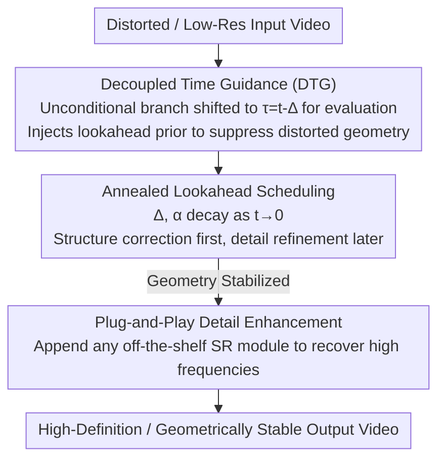

# DTG-Restore: Training-Free Diffusion Refinement for Generative Video Super-Resolution

**Conference**: CVPR 2026  
**Paper**: [CVF Open Access](https://openaccess.thecvf.com/content/CVPR2026/html/Yesiltepe_DTG-Restore_Training-Free_Diffusion_Refinement_for_Generative_Video_Super-Resolution_CVPR_2026_paper.html)  
**Code**: TBD  
**Area**: Image/Video Restoration  
**Keywords**: Video Super-Resolution, Diffusion Prior, Training-Free, Classifier-Free Guidance, Temporal Decoupling

## TL;DR
DTG-Restore proposes a **training-free, model-agnostic** video super-resolution framework: during diffusion sampling, the unconditional branch is evaluated at a cleaner (lower noise) timestep, injecting a "lookahead prior" into the current step. This suppresses the replication of distorted geometry while preserving appearance details when restoring low-resolution or degraded videos. The framework can be followed by any off-the-shelf super-resolution module to supplement high-frequency details, significantly outperforming recent diffusion-based video restoration methods in both perceptual quality and geometric stability.

## Background & Motivation

**Background**: Large-scale video diffusion Transformers (DiTs) are already capable of generating spatially and temporally consistent videos with fine textures from text. These pretrained priors are naturally leveraged for restoration/super-resolution (VSR). Common approaches either employ traditional CNNs/Transformers with synthetic degradation and deterministic reconstruction losses, or integrate generative priors into the restoration pipeline via diffusion-based VSR (such as Upscale-A-Video, VEnhancer, STAR, SeedVR2, etc.).

**Limitations of Prior Work**: When generative prior is applied to restoration, models exhibit a fatal tendency to **replicate distortion artifacts from the input rather than reconstructing the underlying clean structures**. In degraded or AI-generated videos, this manifests as distorted faces, misaligned body parts, stretched motions, and jittery frame-to-frame details. Traditional VSR methods, which are solely effective on synthetic degradations, often end up "sharpening" the artifacts when dealing with complex non-stationary degradations in real or generated content. This results in outputs that may seem sharp frame-by-frame but lack temporal consistency.

**Key Challenge**: Standard Classifier-Free Guidance (CFG) locks **the conditional and unconditional branches to be evaluated at the exact same timestep $t$**. This "simultaneous coupling" forces the model to be overly faithful to the contaminated low-resolution input. While trying to hallucinate plausible structures, it is dragged back to replicate the distortions in the input. Consequently, the dual goals of "generating plausible structures" and "maintaining temporal stability" cannot be simultaneously achieved. To decouple these two signals, existing methods generally require extensive fine-tuning of large diffusion backbones, binding them to specific training configurations and lacking flexibility for arbitrary degradations or unseen content.

**Goal**: Without retraining or altering the architecture, this paper aims to intervene solely at inference time, enabling the diffusion backbone to "first correct geometry, then supplement details" while maintaining stability across frames.

**Key Insight**: The authors' key observation is that **the conditional and unconditional paths do not need to be evaluated at the same timestep**. If the unconditional branch is evaluated at a cleaner timestep $\tau = t-\Delta$ closer to the data manifold, it provides a "high-SNR-state geometric prior" (lookahead). This prevents the replication of spurious geometry from the current step while remaining anchored to the observed content.

**Core Idea**: Replace "simultaneous coupling" with "temporal decoupling"—advance the unconditional evaluation by a temporal offset $\Delta$, yielding **Decoupled Time Guidance (DTG)**, and anneal this offset during sampling. This allows the denoising process to smoothly transition from structural correction to detail refinement, followed by a plug-and-play integration with any off-the-shelf super-resolution module to supplement high-frequency details.

## Method

### Overall Architecture
DTG-Restore addresses the task of "outputting a geometrically stable and high-definition video with plausible details given a distorted/low-resolution input video." It operates entirely during **inference/testing** without any training. The pipeline consists of two stages: The first stage is **DTG Refinement**. Within each sampling step of a pretrained T2V diffusion backbone (based on Rectified Flow noise scheduling), instead of placing both conditional and unconditional paths at the current timestep $t$ as in standard CFG, the unconditional (cleaner) path is shifted to a cleaner anchor time $\tau=t-\Delta$ for evaluation. The outputs of both paths are combined to form the update direction according to an extrapolation rule, thereby injecting a "lookahead prior" that suppresses distorted geometry. The offset $\Delta$ and extrapolation coefficient $\alpha$ undergo temporal annealing, prioritizing structure in the early stages and details in the later stages. The second stage is **Plug-and-Play Detail Enhancement**. After DTG corrects the geometry, any off-the-shelf restoration/super-resolution module is appended to focus purely on recovering high-frequency textures. Serializing these two stages unifies "generative inference" and "restoration fidelity" into a single training-free, model-agnostic pipeline.

### Key Designs

**1. Decoupled Time Guidance (DTG): Temporally decoupling conditional and unconditional branches to suppress distorted geometry with a lookahead prior**

This step directly addresses the pain point of "standard CFG locking both paths to the same timestep, forcing the model to replicate input distortions". Let $F(x,t)$ denote the output of the pretrained denoiser (or flow velocity field) at diffusion time $t$. In addition to the current time $t$, DTG defines a cleaner anchor time $\tau := t-\Delta$ ($0\le\Delta\le t$) and an extrapolation coefficient $\alpha$. The update rule performs anchored extrapolation between the "prediction at the clean anchor" and the "prediction at the current step":

$$x_{\text{new}} = F(x,\tau) + \alpha\big[F(x,t) - F(x,\tau)\big]$$

This equation is highly interpretable: when $\alpha=0$, it directly aligns with the cleaner prediction $F(x,\tau)$; when $\alpha=1$, it degenerates to the standard step at $t$; when $\alpha>1$, it extrapolates beyond $t$ along the "direction anchored by the clean prior." Intuitively, $F(x,\tau)$ originates from a state closer to the data manifold with a higher signal-to-noise ratio. It provides a lookahead direction indicating "which geometry to proceed towards," thereby preventing the model from being misled by spurious geometries in the current step while remaining anchored to the observed content.

The authors further substitute the Tweedie approximation $F(x,t)\approx x+\sigma_t^2\nabla_x\log p_t(x)$ into the update formula, proving that DTG is mathematically equivalent to denoising at an **implicit effective noise level**:

$$\sigma_{\text{eff}}^2 = \sigma_\tau^2 + \alpha\big(\sigma_t^2 - \sigma_\tau^2\big),\qquad \mathrm{SNR}_{\text{eff}} = \frac{\alpha_\tau^2}{\sigma_{\text{eff}}^2}$$

In other words, because the signal component is anchored at $\tau$, DTG behaves as if denoising is performed at some "implicit time" between $\tau$ and $t$: when $\alpha>1$, it increases the effective SNR, yielding a cleaner and more stable diffusion trajectory, whereas when $0<\alpha<1$, it conservatively interpolates. This is the origin of the "implicit enhancement of the effective signal-to-noise ratio" repeatedly emphasized in the paper. ⚠️ Note that the subscripts such as $\alpha_\tau$/$\sigma_\tau$ in the formulas are sourced from the original paper's OCR; please refer to the original text for precise details.

**2. Annealed Lookahead Scheduling: Smooth transition from structural correction to detail refinement**

Using a fixed temporal offset $\Delta$ is insufficient: an excessively large offset leads to over-reliance on lookahead and loses alignment with the observations, whereas a fixed offset cannot simultaneously accommodate "correcting geometry in the early stage and capturing details in the later stage." Therefore, DTG allows $\Delta$ and $\alpha$ to anneal during the sampling process:

$$\Delta_t \to 0 \ \text{as}\ t\to 0,\qquad \alpha_t \to 1 \ \text{as}\ t\to 0$$

The physical meaning is: in the early phase of sampling (large $t$, heavy noise), a larger lookahead offset is maintained to pull structure from a cleaner anchor point and correct the distorted geometry first. As $t\to0$, the offset converges to 0 and $\alpha$ converges to 1, smoothly switching back to standard denoising to focus on detail refinement consistent with the observations. This scheduling of "strong lookahead start + progressive decay" is the key factor rendering DTG truly effective. Ablation studies show that a fixed $\Delta$ (even $\Delta=0$, which degenerates to standard CFG) performs significantly worse, while exponential annealing outperforms linear/cosine options (see experiments). This is also the fundamental difference from CFG: CFG combines conditional and unconditional paths at the same timestep $t$, whereas DTG anchors one of the paths to $\tau=t-\Delta$ to supply a geometry-preserving prior from a higher SNR state, while utilizing the current timestep direction to refine details.

**3. Plug-and-Play Detail Enhancement: Appending arbitrary off-the-shelf super-resolution modules after DTG to supplement high frequencies**

DTG is responsible for "correcting geometry and suppressing distortion" but does not specifically focus on recovering high-frequency textures. The authors completely decouple detail restoration: after DTG refinement, any off-the-shelf restoration/super-resolution module $R_\phi$ is appended. Denoting DTG as $T_\tau$, the entire pipeline can be formulated as:

$$\hat{x} = R_\phi(x_{\text{new}}\,;\,y_{1:T})$$

where $R_\phi$ optionally takes the external condition $y_{1:T}$ as side information. This combination is drop-in, training-free, and model-agnostic: structural corrections introduced by DTG are preserved, while the specialized network only needs to focus on high-frequency details. Combining DTG with SeedVR, SeedVR2, RealViFormer, etc., consistently yields improvements, validating the universality of this task division ("fix geometry first, then delegate high frequencies to off-the-shelf super-resolution").

## Key Experimental Results

The evaluation is conducted on two tracks: ① standard VSR benchmarks (SPMCS, UDM10, REDS30) using full-reference metrics (PSNR/SSIM/LPIPS/DISTS); ② the self-constructed **GenWarp480** benchmark, consisting of 4,400 AI-generated distorted videos of 480p resolution, 3–5 seconds length, and 16fps. It covers six major categories (human actions, natural environments, animals, vehicles, urban architecture, daily-use objects) and specifically targets "generative degradations" such as distorted faces, misaligned body parts, and spatial artifacts. Given the lack of ground truth (GT), non-reference perceptual metrics including LAION Aesthetic Predictor, MUSIQ, MANIQA, NIQE, and CLIP-IQA are employed for evaluation.

### Main Results

Perceptual metric comparison on GenWarp480 (Table 2, higher is better except for NIQE): Ours ranks first in LAION AP, MANIQA, and CLIP-IQA, and second in MUSIQ.

| Method | LAION AP ↑ | MUSIQ ↑ | MANIQA ↑ | NIQE ↓ | CLIP-IQA ↑ |
|------|-----------|---------|----------|--------|-----------|
| RealViformer | 3.998 | 50.47 | 0.293 | 4.014 | 0.482 |
| SeedVR | 4.120 | 46.85 | 0.278 | 4.128 | 0.496 |
| SeedVR2 | 4.423 | 37.28 | 0.242 | **3.915** | 0.527 |
| VEnhancer | 4.218 | 44.12 | 0.267 | 4.206 | 0.508 |
| Upscale-A-Video | 4.371 | 45.67 | 0.273 | 4.198 | 0.517 |
| STAR | 4.457 | 41.96 | 0.261 | 4.263 | 0.418 |
| **Ours** | **4.642** | 48.83 | **0.314** | 4.337 | **0.541** |

SeedVR2 achieves the lowest NIQE, but the authors note this is due to its "heavy smoothing," causing it to perform poorly across other perceptual metrics. STAR shows a decent LAION AP but lags significantly in CLIP-IQA.

Standard VSR benchmarks (Table 1, excerpting PSNR and SSIM for SPMCS / UDM10 / REDS30): Ours **does not target exceeding pixel fidelity**, hence PSNR/SSIM are not intentionally pushed high but remain highly competitive.

| Dataset / Metric | RealViformer | UAV | VEnhancer | STAR | SeedVR2-7B | Ours |
|--------------|-------------|------|-----------|------|-----------|------|
| SPMCS PSNR ↑ | **24.18** | 21.68 | 18.52 | 22.59 | 20.66 | 22.76 |
| SPMCS SSIM ↑ | **0.658** | 0.523 | 0.514 | 0.609 | 0.603 | 0.613 |
| UDM10 PSNR ↑ | 26.78 | 24.53 | 21.57 | 24.69 | 25.74 | 25.61 |
| REDS30 PSNR ↑ | **23.36** | 21.42 | 19.91 | 22.14 | 22.20 | 23.12 |

Methods targeting strong reconstruction like RealViformer and MGLD-VSR predictably lead in PSNR/SSIM. Ours achieves an SSIM of 0.613 on SPMCS and an LPIPS of 0.271 on UDM10, remaining competitive across the board without being explicitly optimized for pixel-level fidelity, avoiding the amplification of distortion observed in VEnhancer/UAV.

### Ablation Study

**$\Delta$ Scheduling (Table 3, GenWarp480 grouped by Mild/Medium/Severe distortion, Quality/Sharp)**: Fixed $\Delta$ consistently performs poorly and degrades further with larger $\Delta$, whereas annealing is significantly better, with exponential annealing being optimal.

| Scheduling | Mild Quality | Mild Sharp | Severe Quality | Severe Sharp |
|------|-----------|----------|-----------|----------|
| $\Delta=0$ (standard CFG) | 4.12 | 0.768 | 3.91 | 0.739 |
| $\Delta=0.2$ (constant) | 4.08 | 0.751 | 3.87 | 0.721 |
| $\Delta=0.3$ (constant) | 4.03 | 0.724 | 3.82 | 0.694 |
| Linear Annealing | 4.51 | 0.812 | 4.41 | 0.791 |
| Cosine Annealing | 4.56 | 0.824 | 4.47 | 0.806 |
| **Ours (Exponential)** | **4.64** | **0.839** | **4.58** | **0.821** |

**Comparison with SDEdit (Table 4)**: The "step-by-step decoupling" of DTG comprehensively outperforms the "single-point resampling" of SDEdit, achieving the lowest geometric warp error.

| Method | LAION ↑ | MANIQA ↑ | CLIP-IQA ↑ | Warp ↓ |
|------|---------|----------|-----------|--------|
| SDEdit ($t_{\text{start}}=0.3$) | 4.21 | 0.267 | 0.489 | 0.142 |
| SDEdit ($t_{\text{start}}=0.5$) | 4.38 | 0.281 | 0.512 | 0.118 |
| SDEdit ($t_{\text{start}}=0.7$) | 4.29 | 0.258 | 0.478 | 0.097 |
| **DTG (Ours)** | **4.64** | **0.314** | **0.541** | **0.071** |

SDEdit exhibits a typical trade-off: shallow resampling ($0.3$) fails to preserve structure (warp $0.142$), while deep resampling ($0.7$) reduces warp to $0.097$ but harms perceptual quality (LAION $4.29$ / CLIP-IQA $0.478$). Conversely, the step-by-step decoupling of DTG simultaneously enhances both perceptual quality and geometric stability.

**User Study (Table 5, 50 users / 60 videos / 1–5 score)**: DTG-Restore ranks first in all three metrics: sharpness, motion smoothness, and overall aesthetic quality (4.40 / 4.52 / 4.36), with VEnhancer ranking second but trailing by a noticeable margin (especially in motion quality).

### Key Findings
- **Annealing is critical**: Fixed/zero offsets (including $\Delta=0$, i.e., standard CFG) lag across all metrics. The strategy of "strong lookahead start + progressive decay" is key to balancing geometric correction and detail restoration, with exponential annealing > cosine > linear.
- **Step-by-step decoupling > single-point resampling**: Compared to SDEdit, which conducts a one-time resampling at a specific $t_{\text{start}}$, DTG performs temporal decoupling at every step. This simultaneously improves perceptual quality and warp geometric stability, bypassing SDEdit's structural-perceptual trade-off.
- **Metric preference depends on the task**: Reconstruction-based metrics (PSNR/SSIM) favor models with strong consistency biases. Non-reference perceptual metrics are necessary to capture the advantages of the proposed "creative upsampling"—hence, this work intentionally does not prioritize chasing PSNR.

## Highlights & Insights
- **Shifting the unconditional branch to a cleaner timestep is exceptionally clever**: Solely relying on a temporal offset $\tau=t-\Delta$ decouples the simultaneous coupling of CFG. It requires no training or architectural modifications yet successfully injects geometric lookahead—a classic example of a "modify sampling, not the model" training-free intervention.
- **Clean theoretical explanation**: Utilizing Tweedie approximation, the authors demonstrate that DTG is equivalent to denoising under an implicit effective noise level $\sigma_{\text{eff}}^2$, implicitly boosting SNR when $\alpha>1$. This grounds an engineering heuristic in the language of "effective SNR," easily transferable to other diffusion sampling modifications.
- **Decoupled task division of "correcting geometry" and "supplementing details"**: DTG handles structure while off-the-shelf SR manages high frequencies. This drop-in integration allows it to easily leverage any pretrained video diffusion backbone and arbitrary super-resolution modules, facilitating high deployment flexibility.
- **GenWarp480 fills a research gap**: Existing VSR benchmarks mostly feature synthetic degradations. This dataset of 4,400 video clips, focusing specifically on "generative degradations" (distorted faces, body misalignments, spatial artifacts), is highly targeted for evaluating the robustness of diffusion-based restoration.

## Limitations & Future Work
- **Pixel fidelity is not a strength**: This paper explicitly acknowledges that it does not aim to outperform strong reconstruction-biased methods on pixel-level metrics like PSNR/SSIM, making it potentially unsuitable for domains requiring precise pixel restoration (e.g., forensics, measurements).
- **Dependence on off-the-shelf SR modules**: The second-stage detail enhancement directly plugs in an external $R_\phi$. Thus, the final high-frequency quality is bounded by the capacity of the chosen module. The paper does not thoroughly analyze the failure modes across different choices of $R_\phi$.
- **Backbone resolution limitations**: The video diffusion backbones used are limited to fixed token lengths because of full self-attention (translating to roughly $512\times512$/$480$p). Scaling pretrained diffusion models to higher resolutions remains an open problem, which DTG itself does not solve.
- **Sensitivity to schedules and hyper-parameters**: The annealing curves of $\Delta_t$ and $\alpha_t$ (with exponential being optimal) are hyper-parameters. The original paper does not construct a complete sensitivity analysis regarding whether exponential remains optimal across different backbones/degradations or the stable extrapolation boundaries for $\alpha>1$. ⚠️ Subject to the original text.

## Related Work & Insights
- **vs Upscale-A-Video / VEnhancer**: These enhance consistency via temporal propagation in latent space or unified spatial-temporal upsampling, but still couple generative priors to retraining and often amplify input distortions. In contrast, ours is training-free and model-agnostic, suppressing distortion replication at its source via temporal decoupling.
- **vs STAR / SeedVR2**: STAR leverages frequency-domain loss + local enhancement for real-world fidelity, and SeedVR2 utilizes adversarial post-training to compress restoration to a single step—both requiring heavy fine-tuning of large diffusion backbones. DTG operates entirely at inference time without modifying the backbone.
- **vs SDEdit**: SDEdit performs one-time resampling after adding noise at some $t_{\text{start}}$, which acts as a "single-point" intervention and exhibits a structure-preservation vs. perception trade-off. DTG, on the other hand, performs temporal decoupling "step-by-step" in each sampling iteration, simultaneously improving both perceptual and geometric stability.
- **vs Standard CFG**: CFG pairs conditional and unconditional paths at the same timestep $t$. DTG anchors the unconditional path to $\tau$ with a higher SNR, providing a geometry-preserving prior. This "temporal decoupling" concept can inspire other conditional diffusion tasks requiring both fidelity to observations and structural generation.

## Rating
- Novelty: ⭐⭐⭐⭐⭐ Decoupling CFG's conditional/unconditional branches along the temporal dimension + lookahead prior is a clean and novel training-free sampling intervention, backed by theoretical support from an SNR perspective.
- Experimental Thoroughness: ⭐⭐⭐⭐ Covering standard VSR + custom GenWarp480 + multiple ablation branches (scheduling/SDEdit) + user studies is comprehensive; however, a systematic sensitivity analysis of different $R_\phi$ choices and annealing hyper-parameters is lacking.
- Writing Quality: ⭐⭐⭐⭐ The logic chain from motivation to method and theory is clear, though formulas and notations are dense (some OCR subscripts require verification with the original paper).
- Value: ⭐⭐⭐⭐⭐ Training-free, model-agnostic, and plug-and-play; directly transferable to any video diffusion backbone and super-resolution module, demonstrating strong practicality.

<!-- RELATED:START -->

## Related Papers

- [\[CVPR 2026\] STCDiT: Spatio-Temporally Consistent Diffusion Transformer for High-Quality Video Super-Resolution](stcdit_spatio-temporally_consistent_diffusion_transformer_for_high-quality_video.md)
- [\[CVPR 2026\] VOSR: A Vision-Only Generative Model for Image Super-Resolution](vosr_a_vision_only_generative_model_for_image_super_resolution.md)
- [\[CVPR 2026\] DUO-VSR: Dual-Stream Distillation for One-Step Video Super-Resolution](duo-vsr_dual-stream_distillation_for_one-step_video_super-resolution.md)
- [\[CVPR 2026\] Training-free Motion Factorization for Compositional Video Generation](training-free_motion_factorization_for_compositional_video_generation.md)
- [\[CVPR 2026\] Training-free Mixed-Resolution Latent Upsampling for Spatially Accelerated Diffusion Transformers](training-free_mixed-resolution_latent_upsampling_for_spatially_accelerated_diffu.md)

<!-- RELATED:END -->
