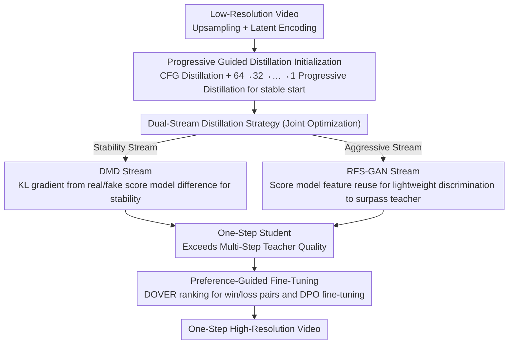

# DUO-VSR: Dual-Stream Distillation for One-Step Video Super-Resolution

**Conference**: CVPR 2026  
**arXiv**: [2603.22271](https://arxiv.org/abs/2603.22271)  
**Code**: [https://cszy98.github.io/DUO-VSR/](https://cszy98.github.io/DUO-VSR/)  
**Area**: Image Generation / Video Super-Resolution  
**Keywords**: Video Super-Resolution, Diffusion Distillation, One-Step Generation, GAN, Distribution Matching Distillation

## TL;DR
This paper proposes DUO-VSR, a three-stage distillation framework. It compresses multi-step video super-resolution models into a one-step generator through progressive guided distillation initialization, dual-stream distillation (joint optimization of DMD and RFS-GAN), and preference-guided fine-tuning. This achieves approximately 50× acceleration while exceeding the visual quality of previous one-step VSR methods.

## Background & Motivation

1. **Background**: Diffusion-based video super-resolution (VSR) has made significant progress in visual quality. Methods like SeedVR and STAR utilize large-scale pre-trained priors to achieve impressive detail restoration. However, these methods typically require 15-50 denoising iterations, leading to inference times of hundreds of seconds, which severely hinders practical deployment.

2. **Limitations of Prior Work**: Existing one-step VSR methods face three challenges: (1) DOVE uses regression loss to ensure stability but sacrifices detail fidelity; (2) SeedVR2 employs adversarial post-training, but large discriminators tend to dominate optimization and introduce unnatural artifacts; (3) Direct application of Distribution Matching Distillation (DMD) to VSR faces **training instability** (one-step student output distribution deviates from the teacher), **biased supervision** (the frozen real score model has not seen student noise outputs, producing spatial offsets and artifacts), and **insufficient supervision** (the real score model itself is inferior to real HR videos, limiting the student's upper bound).

3. **Key Challenge**: The fundamental difficulty in one-step VSR distillation lies in the "stability-quality" trade-off—trajectory-preserving distillation (e.g., progressive distillation) is stable but produces blurry outputs, whereas distribution matching distillation (e.g., DMD) offers high quality but suffers from training instability and the teacher's performance ceiling. GAN-based methods can introduce supervision from real videos but suffer from unstable discriminator training.

4. **Goal**: Design a unified framework to simultaneously address the issues of initialization instability, biased supervision, and insufficient supervision in DMD distillation, enabling a one-step VSR generator to match or even exceed the quality of multi-step models.

5. **Key Insight**: The authors propose jointly optimizing DMD and GAN as complementary dual-stream supervision signals—DMD ensures stability by aligning with the teacher's distribution, while GAN breaks the teacher's quality upper bound by introducing real HR video features.

6. **Core Idea**: Three-stage progressive distillation + dual-stream joint optimization of DMD and RFS-GAN + DPO preference fine-tuning to achieve stable, high-quality one-step video super-resolution.

## Method

### Overall Architecture
DUO-VSR aims to compress a diffusion VSR model requiring 50 steps into "just one step" without losing details or collapsing training. It decomposes distillation into three relay stages: utilizing progressive distillation to converge the multi-step teacher into a stable one-step initialization, followed by joint DMD and GAN supervision to enhance quality, and finally a round of preference fine-tuning for perceptual refinement. The first two stages resolve "stability" and "exceeding the teacher," while the third stage provides the "finishing touch."

Regarding data flow, the input low-resolution video $x^{LR}$ is first upsampled to the target resolution and encoded into the latent space as $z^{LR}$; the DiT-based denoiser, conditioned on $z^{LR}$ and text embedding $c$, directly predicts the clean HR latent representation in one step. The base model has approximately 1.3B parameters, and the original multi-step teacher defaults to 50-step sampling.

### Key Designs

**1. Progressive Guided Distillation Initialization: Stabilizing before enhancing quality**

Initializing a one-step student directly from a 50-step teacher causes drastic gradient oscillations and training collapse because the denoising path is overly truncated. Thus, this step prioritizes a "stable" starting point over quality through two sub-steps. First is CFG Distillation: the student directly matches the teacher's conditional/unconditional combined output $v_{\text{cfg}} = (1+w)v_\theta(z_t, t, z^{LR}, c) - v_\theta(z_t, t, z^{LR}, \emptyset)$, folding two forward passes into one. Second is Progressive Distillation: using the CFG-distilled model as a teacher, steps are halved iteratively ($64 \to 32 \to 16 \to \dots \to 1$), where the student aligns its one-step prediction with the teacher's two-step prediction for each round, and the teacher is updated with the latest student every 500 steps. This gradual reduction prevents divergence.

**2. Dual-Stream Distillation Strategy: DMD for stability, RFS-GAN to break the teacher ceiling**

Running DMD alone has two drawbacks: quality is capped by the teacher, and the frozen real score model provides "biased supervision" with spatial offsets and artifacts for student noise outputs it hasn't encountered. DUO-VSR solves this by alternating and complementing two streams. In the DMD stream, the frozen real score model anchors the high-quality distribution, while the continuously updated fake score model tracks the student's current distribution; the difference provides the KL divergence gradient. The RFS-GAN stream reuses these score models as discriminator backbones—concatenating features from several transformer layers and feeding them into an additional convolutional discriminator head. This uses a hinge GAN objective plus feature matching loss to separate student outputs (fake) and real HR videos (real). The adversarial signal from real videos suppresses the biased gradients from the real score model and breaks the quality ceiling; simultaneously, the adversarial supervision examines both real and fake features for balanced signaling. Computationally, both streams share the student output $\hat{z}_t^S$ after diffusion noise addition, and stop-gradients are placed between the backbone features and discriminator heads to prevent GAN gradients from polluting the score models' distribution tracking.

**3. Preference-Guided Fine-Tuning: Low-cost DPO refinement with quality scorers**

The fine-tuning stage further polishes perceptual quality. No additional discriminators are trained: the second-stage student generates multiple HR candidates for each LR video, which are ranked by an off-the-shelf video quality assessment model (e.g., DOVER). Winning $z_0^{S_w}$ and losing $z_0^{S_l}$ pairs $(z^{LR}, z_0^{S_w}, z_0^{S_l})$ are formed, and the student is fine-tuned with a DPO loss to bias the predicted velocity field toward high-quality samples. This acts as an inexpensive preference alignment using existing quality signals as implicit rewards.

### Loss & Training
**Stage I**: CFG distillation uses MSE loss $\mathcal{L}_{CFG}$; progressive distillation uses trajectory matching loss $\mathcal{L}_{PD}$.  
**Stage II**: Student update = $\mathcal{L}_{DMD} + 0.1 \cdot \mathcal{L}_G + 0.05 \cdot \mathcal{L}_{FM}$; auxiliary updates use $\mathcal{L}_{Diff}$ for the fake score model and $\mathcal{L}_D$ for the discriminator head. One student update is performed for every 3 auxiliary updates.  
**Stage III**: DPO loss $\mathcal{L}_{DPO}$ is used to fine-tune for 1000 steps on 2000 preference pairs.

## Key Experimental Results

### Main Results (Multiple datasets, No-reference perceptual metrics)

| Method | Steps | Time(s) | NIQE↓ | MUSIQ↑ | CLIP-IQA↑ | DOVER↑ |
|------|------|---------|-------|--------|-----------|--------|
| STAR | 15 | 200.4 | 5.17 | 59.08 | 0.4068 | 69.29 |
| SeedVR2-7B | 1 | 89.7 | 4.63 | 55.45 | 0.3387 | 59.56 |
| DOVE | 1 | 66.7 | 4.43 | 51.25 | 0.3209 | 69.36 |
| DLoRAL | 1 | 76.6 | 4.91 | 58.44 | 0.4346 | 73.60 |
| **Ours** | **1** | **11.3** | **4.08** | **59.24** | **0.3925** | **69.71** |

* (Example from YouHQ40 dataset; DUO-VSR reaches 87.28 DOVER on UDM10, leading comprehensively)*

### Ablation Study (AIGC60 Dataset)

| Configuration | NIQE↓ | MUSIQ↑ | CLIPIQA↑ | DOVER↑ |
|------|-------|--------|----------|--------|
| Base (50 steps) | 4.31 | 63.46 | 0.4712 | 87.98 |
| Stage I only | 5.45 | 58.97 | 0.408 | 86.49 |
| Stage I + II | 4.64 | 63.36 | 0.487 | 88.01 |
| Stage I + III | 5.11 | 60.22 | 0.423 | 87.63 |
| **Stage I + II + III** | **4.42** | **63.68** | **0.489** | **88.15** |

### Dual-Stream Strategy Ablation

| Setting | NIQE↓ | MUSIQ↑ | CLIPIQA↑ | DOVER↑ |
|------|-------|--------|----------|--------|
| DMD only | 4.99 | 61.46 | 0.432 | 87.38 |
| RFS-GAN only | 5.32 | 62.64 | 0.427 | 87.53 |
| Sequential DMD→GAN | 5.17 | 62.76 | 0.419 | 87.67 |
| **Dual-Stream (Joint)** | **4.42** | **63.68** | **0.489** | **88.15** |

### Key Findings
- **Stage II (Dual-Stream Distillation) is core**: Moving from Stage I to Stage I+II improves CLIPIQA from 0.408 to 0.487 and DOVER from 86.49 to 88.01, surpassing the 50-step baseline (87.98), proving that adversarial supervision from real videos breaks the teacher's ceiling.
- **Joint optimization significantly outperforms sequential**: Joint optimization improves CLIPIQA by 0.070 and DOVER by 0.48 compared to Sequential DMD→GAN. The two objectives interact and enhance each other dynamically.
- **High Efficiency**: With only 1.3B parameters, DUO-VSR processes 21 frames of 1920×1080 video in 11.3s, approximately 8× faster than SeedVR2-7B (89.7s) and 85× faster than multi-step MGLD (956.7s).
- **Complementary role of RFS-GAN**: While DMD is better at texture enhancement, RFS-GAN effectively suppresses artifacts and temporal inconsistencies (e.g., in tile regions and temporal profiles) caused by DMD's biased supervision.

<h2>Highlights & Insights</h2>
- The **Dual-Stream Joint Optimization** design is highly effective—DMD ensures the stability of distribution alignment, while GAN introduces high-quality real-world signals to break the ceiling. The shared post-diffusion samples and stop-gradients ensure synergistic efficiency without mutual interference. This "stable stream + aggressive stream" paradigm is transferable to other distillation tasks.
- The **diagnosis of the three DMD issues in VSR** (instability, biased supervision, insufficient supervision) is deep. The visualization of spatial offsets and artifacts in the real score model (Fig. 2) explains why VSR is more susceptible to biased supervision than unconditional generation due to strong spatial anchors from LR inputs.
- **DPO Preference Fine-Tuning** serves as a low-cost "finishing touch" that requires no extra discriminators, using only candidate generation and quality ranking for alignment.

## Limitations & Future Work
- The training pipeline is relatively complex (three stages, multiple score models), potentially leading to high total training costs and sensitive hyperparameter tuning (e.g., loss weights and update frequency).
- Training and evaluation are currently focused on synthetic degradation (RealBasicVSR pipeline); generalization to complex real-world degradations requires further validation.
- While 1.3B parameters is much smaller than SeedVR2-7B, it remains large for edge deployment; model compression could be integrated.
- Preference fine-tuning depends on specific quality assessment models, where different standards might lead to varying optimization directions.

## Related Work & Insights
- **vs DOVE**: DOVE uses regression loss and two-stage training, leading to blurry one-step outputs; DUO-VSR ensures both fidelity and perceptual quality via dual-stream distillation and DPO.
- **vs SeedVR2**: SeedVR2 uses large discriminators for adversarial post-training (APT), which can be unstable; DUO-VSR’s RFS-GAN leverages existing score model features for stability via stop-gradients.
- **vs DMD2**: DMD2 places GAN in a later fine-tuning phase using only fake score model features; DUO-VSR joint optimizes from the start and utilizes both real and fake score model features for comprehensive supervision.

## Rating
- Novelty: ⭐⭐⭐⭐ Innovative DMD+GAN joint optimization and deep analysis of DMD failure modes in VSR.
- Experimental Thoroughness: ⭐⭐⭐⭐⭐ Evaluated across five datasets (synthetic+real+AIGC) with complete ablation of stages and strategies.
- Writing Quality: ⭐⭐⭐⭐ Clear logic, thorough problem analysis, and intuitive visual aids.
- Value: ⭐⭐⭐⭐ The efficiency of processing 1080p video in 11.3s is highly attractive, though training complexity remains a hurdle.

<!-- RELATED:START -->

## Related Papers

- [\[CVPR 2026\] WaDi: Weight Direction-aware Distillation for One-step Image Synthesis](wadi_weight_direction-aware_distillation_for_one-step_image_synthesis.md)
- [\[CVPR 2026\] Uni-DAD: Unified Distillation and Adaptation of Diffusion Models for Few-step Few-shot Image Generation](uni-dad_unified_distillation_and_adaptation_of_diffusion_models_for_few-step_few.md)
- [\[NeurIPS 2025\] DOVE: Efficient One-Step Diffusion Model for Real-World Video Super-Resolution](../../NeurIPS2025/image_generation/dove_efficient_one-step_diffusion_model_for_real-world_video_super-resolution.md)
- [\[CVPR 2026\] MMFace-DiT: A Dual-Stream Diffusion Transformer for High-Fidelity Multimodal Face Generation](mmface-dit_a_dual-stream_diffusion_transformer_for_high-fidelity_multimodal_face.md)
- [\[AAAI 2026\] Realism Control One-step Diffusion for Real-World Image Super-Resolution](../../AAAI2026/image_generation/realism_control_one-step_diffusion_for_real-world_image_super-resolution.md)

<!-- RELATED:END -->
