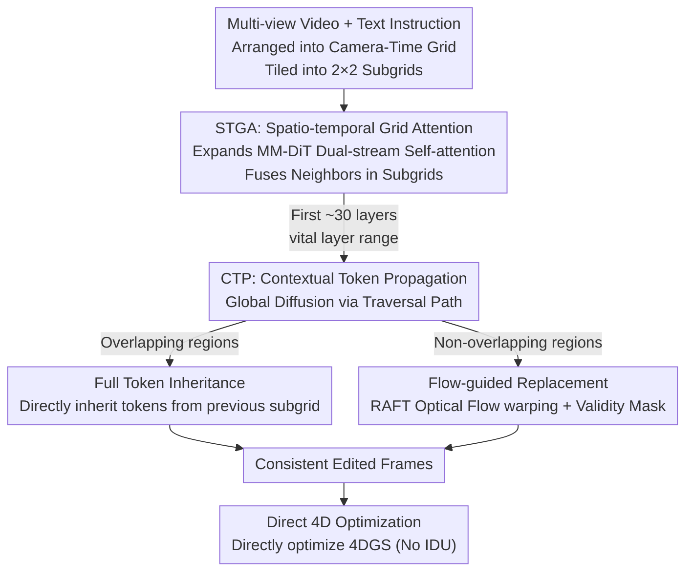

# Dynamic-eDiTor: Training-Free Text-Driven 4D Scene Editing with Multimodal Diffusion Transformer

**Conference**: CVPR 2026  
**Paper**: [CVF Open Access](https://openaccess.thecvf.com/content/CVPR2026/html/Lee_Dynamic-eDiTor_Training-Free_Text-Driven_4D_Scene_Editing_with_Multimodal_Diffusion_Transformer_CVPR_2026_paper.html)  
**Code**: https://di-lee.github.io/dynamic-eDiTor/ (Project page available)  
**Area**: Diffusion Models / 4D Scene Editing  
**Keywords**: 4D Gaussian Splatting, Text-driven Editing, MM-DiT, Spatio-temporal Consistency, Training-free  

## TL;DR
Multi-view videos are organized into a "camera $\times$ time" grid. By leveraging the dual-stream self-attention of MM-DiT, adjacent viewpoint and temporal features are fused simultaneously within local subgrids. This consistency is propagated across the entire grid using token inheritance and flow-guided token replacement. The edited frames are then used to optimize a pre-trained 4DGS without further training.

## Background & Motivation
**Background**: 3DGS and 4DGS have achieved high-fidelity reconstruction of static and dynamic scenes. While text-driven 3D editing (Instruct-NeRF2NeRF, GaussianEditor, EditSplat, etc.) is relatively mature, "text-driven 4D scene editing"—which requires modifying appearance while maintaining motion—remains an unexplored area.

**Limitations of Prior Work**: Existing 4D editing methods (Instruct 4D-to-4D, CTRL-D, Instruct-4DGS) predominantly apply 2D diffusion models to rendered frames independently. They lack a unified mechanism to process information jointly across views and time. This results in global edits like stylization but leads to motion distortion, geometric drift, and incomplete editing when handling non-rigid content (e.g., changing clothes, adding objects). Furthermore, some methods require per-scene fine-tuning of the diffusion model, which is computationally expensive.

**Key Challenge**: 4D editing introduces a higher-dimensional constraint than 3D editing—it requires both multi-view consistency (spatial) and temporal consistency (motion). Editing frame-by-frame naturally disrupts these consistencies because the denoising process of each frame is independent of others.

**Goal**: To generate a set of frames that are consistent across both views and time for 4DGS optimization, achieving globally coherent 4D editing without training or per-scene fine-tuning.

**Key Insight**: The dual-stream self-attention in new-generation MM-DiT editors (e.g., Qwen-Image-Edit) possesses strong cross-token fusion capabilities. By concatenating keys/values of multiple frames into a single attention pass, one frame can "attend to" its neighbors. The problem thus shifts from "training a 4D-consistent model" to "repurposing the MM-DiT attention mechanism for spatio-temporal fusion during inference."

**Core Idea**: The multi-view video is organized into a "camera-time" grid. Spatio-temporal Grid Attention (STGA) is used for local fusion within subgrids, and Contextual Token Propagation (CTP) diffuses this local consistency globally. The resulting consistent edited frames then drive 4DGS optimization.

## Method

### Overall Architecture
The input consists of a multi-view video corresponding to a pre-trained 4DGS (sampled at 1 FPS) and a text instruction. The output is an edited, consistent 4DGS model. The pipeline follows three steps: first, all frames $f_{v,t}$ are arranged into a camera-time grid $\text{Grid} = \{f_{v,t} \mid v\in[0,V], t\in[0,T]\}$ and tiled into overlapping $2\times2$ subgrids. Second, STGA performs local spatio-temporal fusion within each subgrid, and CTP propagates the results across the grid. Finally, the edited frames are used to optimize the pre-trained 4DGS.

The grid is processed via an "asymmetric sliding" sequence: a vertical pass at $t=0$ establishes multi-view alignment, followed by horizontal sliding along the time axis to diffuse consistency. Overlapping areas between subgrids serve as the structural link for STGA and CTP.

### Key Designs

**1. STGA (Spatio-temporal Grid Attention): Simultaneous Cross-View and Cross-Time Attention**

Independent frame editing fails because attention is computed internally for each frame. STGA expands MM-DiT dual-stream self-attention from a single frame to a $2\times2$ subgrid $S_{v,t}=\{f_{v,t}, f_{v+1,t}, f_{v,t+1}, f_{v+1,t+1}\}$. For each frame $f_i$ acting as a query, the key/value components are concatenated from all four frames: $K_{S_{v,t}}=[K_{f_{v,t}}, K_{f_{v+1,t}}, K_{f_{v,t+1}}, K_{f_{v+1,t+1}}]$ (similarly for $V$). The attention mechanism fuses the text stream $(Q_{txt},K_{txt},V_{txt})$ with the modified spatio-temporal image stream, incorporating RoPE positional encoding:

$$\text{STGA}(S_{v,t}) = \text{softmax}\!\left(\frac{[Q_{txt}, \text{RoPE}(Q_{f_{v,t}})]\cdot[K_{txt}, \text{RoPE}(K_{S_{v,t}})]^\top}{\sqrt{d_k}}\right)\cdot[V_{txt}, V_{S_{v,t}}]$$

Unlike methods that only expand attention temporally, STGA allows each query to attend to both spatially adjacent views and temporally adjacent frames.

The authors found that STGA should **not** be applied to all layers of MM-DiT. Over-application leads to excessive local self-focus, causing texture repetition. STGA is restricted to the "vital layer range" (approximately the first 30 layers) to balance consistency and editing fidelity.

**2. CTP (Contextual Token Propagation): Scaling Local to Global Consistency**

STGA only ensures local consistency within subgrids. CTP explicitly injects tokens $\phi(S_{v,t})=\text{STGA}(S_{v,t})$ from a previous subgrid $S_{prev}$ into the current subgrid $S_{curr}$ along the traversal path. It utilizes two strategies:

- **Full Token Inheritance**: If $S_{curr}$ and $S_{prev}$ overlap on the time axis ($t=1\to T-1$) or spatial axis ($v=1\to V-1$), the tokens $\phi(S_{prev})$ of the overlapping frames are directly inherited into $S_{curr}$.
- **Flow-guided Token Replacement**: In non-overlapping regions (rightmost column when sliding temporally), RAFT is used to estimate optical flow between $f_t$ and $f_{t-1}$. The previous tokens are warped to the current frame: $\hat\phi_r(S_{v,t})=\text{Warp}(F_{t\to t-1}(x,y),\,\phi_r(S_{v,t-1}))$. A forward-backward consistency check generates a validity mask $M$, ensuring only correctly warped tokens are used:

$$\phi_r(S_{v,t}) = M\odot\hat\phi_r(S_{v,t}) + (1-M)\odot\phi_r(S_{v,t})$$

**3. Direct 4D Optimization: Skipping IDU**

Previous 4D/3D editing methods rely on Iterative Dataset Update (IDU), which is slow and prone to drift. Since the frames generated by STGA and CTP are already consistent, the pre-trained 4DGS $G'_{edit}$ can be optimized directly using all edited frames $f^{edit}_{v,t}$:

$$G'_{edit} = \arg\min_G \sum_{v,t} \left\|\hat f_{v,t} - f^{edit}_{v,t}\right\| + \mathcal{L}_{tv}$$

## Key Experimental Results

### Main Results
Evaluated on the DyNeRF dataset (6 dynamic scenes). Multi-view videos (30FPS) were sampled at 1FPS. Baseline comparisons included Instruct4D-to-4D, Instruct-4DGS, and CTRL-D.

| Method | CLIPdir↑ | CLIPsim↑ | Overall Quality(%)↑ | PSNR↑ | SSIM↑ | LPIPS↓ |
|------|----------|----------|---------------------|-------|-------|--------|
| Instruct4D-to-4D | 0.1077 | 0.6308 | 27.57 | 21.86 | 0.6978 | 0.2145 |
| Instruct-4DGS | 0.1501 | 0.6342 | 10.48 | 20.62 | 0.6252 | 0.2869 |
| CTRL-D | 0.1498 | 0.6141 | 13.00 | **31.06** | **0.8498** | **0.0970** |
| **Ours** | **0.1849** | **0.6397** | **48.95** | 29.25 | 0.8064 | 0.1006 |

Ours leads in editing fidelity (CLIPdir/CLIPsim) and user preference. Reconstructive metrics (PSNR/SSIM) are slightly lower than CTRL-D, as CTRL-D tends to deviate less from the original frames (weaker editing).

### Ablation Study
Ablation of STGA and CTP (values from Table 2):

| STGA | CTP | Warp-Err(×10⁻³)↓ | MEt3R(×10⁻¹)↓ | PSNR↑ | SSIM↑ | CLIPdir↑ |
|:---:|:---:|:---:|:---:|:---:|:---:|:---:|
| - | - | 56.98 | 1.0721 | 26.14 | 0.7445 | 0.1930 |
| ✓ | - | 38.64 | 0.9277 | 28.08 | 0.7875 | 0.1872 |
| - | ✓ | 29.44 | 1.0695 | 28.74 | 0.8013 | 0.1944 |
| ✓ | ✓ | **28.94** | **0.9074** | **29.25** | **0.8064** | 0.1849 |

### Key Findings
- **Complementarity**: STGA primarily improves temporal consistency (Warp-Err drops from 56.98 to 38.64), while CTP targets multi-view consistency (MEt3R). Both are necessary for optimal performance.
- **CTP Strategy Roles**: CTP-Flow reduces temporal warping errors, while CTP-Full primarily reduces multi-view errors.
- **Semantic-Consistency Trade-off**: Strong spatio-temporal constraints slightly reduce CLIPdir (editing strength) but ensure a much more stable 4D structure.

## Highlights & Insights
- **Repurposing MM-DiT Attention**: Achieving 4D consistency by concatenating tokens in dual-stream attention is a training-free, zero-cost migration.
- **Vital Layer Range**: Restricting modifications to the first ~30 layers prevents repetitive texture artifacts.
- **Inheritance vs. Warping**: The explicit split between lossless inheritance for overlaps and flow-based propagation for new regions is a robust design for spatio-temporal tasks.
- **Optimized Workflow**: Consistent frames allow skipping the slow, iterative IDU process.

## Limitations & Future Work
- Evaluation is limited to the DyNeRF dataset; generalization to monocular dynamic scenes or long-duration high-motion videos is unverified.
- Dependency on RAFT: Optical flow failures in occluded or textureless regions can disrupt the propagation chain.
- Efficiency: While training-free, the process takes about 51 minutes per scene on an H100, which is still substantial.

## Related Work & Insights
- **Comparison to IDU-based methods**: Methods like CTRL-D update datasets iteratively, which can accumulate drift. This work creates a globally consistent dataset first.
- **Spatio-temporal Fusion**: Unlike standard video editing that only expands temporal attention, STGA simultaneously attends to both spatial (multi-view) and temporal axes.

## Rating
- Novelty: ⭐⭐⭐⭐
- Experimental Thoroughness: ⭐⭐⭐⭐
- Writing Quality: ⭐⭐⭐⭐
- Value: ⭐⭐⭐⭐

<!-- RELATED:START -->

## Related Papers

- [\[ICML 2026\] Self-Prompting Diffusion Transformer for Open-Vocabulary Scene Text Editing via In-Context Learning](../../ICML2026/image_generation/self-prompting_diffusion_transformer_for_open-vocabulary_scene_text_editing_via_.md)
- [\[ICCV 2025\] Free4D: Tuning-free 4D Scene Generation with Spatial-Temporal Consistency](../../ICCV2025/image_generation/free4d_tuning-free_4d_scene_generation_with_spatial-temporal_consistency.md)
- [\[AAAI 2026\] Playmate2: Training-Free Multi-Character Audio-Driven Animation via Diffusion Transformer with Reward Feedback](../../AAAI2026/image_generation/playmate2_training-free_multi-character_audio-driven_animation_via_diffusion_tra.md)
- [\[CVPR 2026\] UniEdit-I: Training-free Image Editing for Unified VLM via Iterative Understanding, Editing and Verifying](uniedit-i_training-free_image_editing_for_unified_vlm_via_iterative_understandin.md)
- [\[CVPR 2026\] A Training-Free Style-Personalization via SVD-Based Feature Decomposition](a_training-free_style-personalization_via_svd-based_feature_decomposition.md)

<!-- RELATED:END -->
