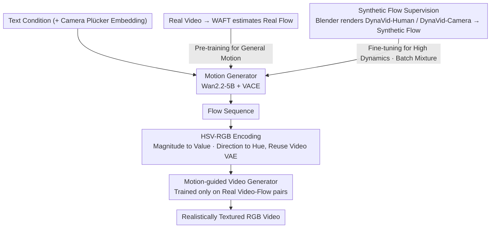

# DynaVid: Learning to Generate Highly Dynamic Videos using Synthetic Motion Data

**Conference**: CVPR 2026  
**arXiv**: [2604.01666](https://arxiv.org/abs/2604.01666)  
**Code**: None  
**Area**: Image Generation  
**Keywords**: Video Diffusion Models, Synthetic Motion Data, Optical Flow, Dynamic Motion Generation, Camera Control

## TL;DR
DynaVid proposes utilizing synthetic optical flow rendered via computer graphics (rather than synthetic video) to train video diffusion models. Through a two-stage framework consisting of a Motion Generator and a Motion-guided Video Generator, it achieves realistic video synthesis of highly dynamic motions and precise camera control.

## Background & Motivation

1. **Background**: Current video diffusion models (e.g., Wan2.2, CogVideoX) can generate high-quality videos but still heavily rely on the motion type distribution in large-scale training data. In mainstream training datasets, highly dynamic motion scenes (e.g., breakdancing, fast camera rotations) are extremely scarce.

2. **Limitations of Prior Work**:
    - Models struggle to synthesize realistic videos containing highly dynamic motions because such samples are underrepresented in training sets.
    - Camera control models (e.g., CameraCtrl, AC3D) require accurate 3D camera pose annotations, but pose estimation is highly unreliable in extreme motion scenarios.
    - Directly training with synthetic rendered videos introduces a severe appearance domain gap—the model tends to reproduce the artificial textures and lighting of the synthetic data.

3. **Key Challenge**: Synthetic data provides rich dynamic motion and precise control signals, but its non-realistic appearance features pollute the visual quality of the generative model. The critical problem is how to "capture the essence (motion information) while discarding the dross (artificial appearance)."

4. **Goal**
    - How to enable the model to learn highly dynamic motion patterns without sacrificing visual realism?
    - How to achieve precise camera trajectory control under extreme camera movements?

5. **Key Insight**: Optical flow naturally encodes only motion information and is decoupled from appearance. Therefore, replacing rendered videos with rendered optical flow can eliminate the appearance domain gap.

6. **Core Idea**: Use synthetic optical flow (instead of synthetic video) to train a Motion Generator to learn dynamic motion patterns, and use real video to train a Motion-guided Video Generator to maintain realistic appearance. This two-stage decoupling achieves "motion from synthetic, appearance from real."

## Method

### Overall Architecture
The core problem DynaVid aims to solve is that highly dynamic motions (breakdancing, fast camera rotations) are almost non-existent in real training data, but using synthetic videos rendered via computer graphics introduces "fake" textures and lighting. The solution is to split "motion" and "appearance" into two data paths. The pipeline consists of two stages: first, the **Motion Generator** receives text conditions and outputs a motion sequence represented by optical flow; then, the **Motion-guided Video Generator** uses this optical flow as a condition to "render" it into RGB video frames with realistic textures. Both generators are based on the Wan2.2-5B video diffusion model and use the VACE architecture to inject control signals. For camera control, the Motion Generator additionally receives Plücker embeddings as camera parameters. The key is that while motion can come from synthetic data, the appearance is always derived from real data, with the two intersecting at the intermediate representation of optical flow.

### Key Designs

**1. Using Synthetic Flow instead of Synthetic Video for Motion Supervision: Extracting "Motion" from "Appearance"**

The drawback of synthetic data is that while it provides intense motion and precise control signals scarce in real data, its rendered appearance is artificial. Training a generative model directly on it pollutes visual quality. DynaVid's solution is to keep only the "clean" half of synthetic data—optical flow. Optical flow is a pixel-wise displacement field that naturally encodes "where, which way, and how fast" things move without carrying texture or lighting information, thus cutting off the appearance domain gap at its source. To this end, the authors built two 3D scene libraries using the Blender Cycles renderer: DynaVid-Human binds Mixamo action sequences to animatable character models to render flow for dynamic human motion; DynaVid-Camera uses NURBS curve interpolation for key camera poses in complex 3D environments to create fast viewpoint trajectories and corresponding flow. The final products of both libraries are synthetic optical flow $\mathcal{F}^{syn}$, not synthetic RGB videos—this is the fundamental divergence from the "direct training on rendered video" approach.

**2. HSV-RGB Encoding for Flow to Reuse Existing Video VAE: Avoiding a Separate Flow Encoder**

The Motion Generator performs diffusion in latent space, but the pre-trained VAE only recognizes RGB images. Instead of training a dedicated VAE for optical flow, DynaVid "disguises" flow as an RGB image. Specifically, the flow vectors are normalized using the 99th percentile as a scaling factor $s_f$ (to prevent rare large displacements from blowing out the dynamic range), then the normalized magnitude is mapped to the Value channel of HSV, and the direction is mapped to the Hue channel. This is finally converted back to RGB and fed into the existing video VAE to be encoded into the latent space. Thus, flow and real video share the same VAE and latent space, reducing training costs and naturally aligning the condition injection for "flow-to-video."

**3. Two-stage Decoupled Training: Motion from Synthetic, Appearance from Real**

Having a clean motion signal is not enough; the training strategy must ensure the model learns intense motion without losing natural motion priors or polluting the appearance. The Motion Generator is trained in two steps: first, pre-training on real flow $\mathcal{F}^{real}$ estimated from real videos via WAFT to establish general motion statistics; then, fine-tuning on synthetic flow $\mathcal{F}^{syn}$ to learn intense dynamics. During fine-tuning, each batch is a mixture of real and synthetic flow—if only synthetic data were used, the model would overfit to synthetic patterns and forget natural priors (as shown in the ablation where Pexels FVD jumped from 1126 to 1886). The Motion-guided Video Generator is trained exclusively on real video-flow pairs, focusing on "how to generate realistic appearance given a flow condition," without touching a single frame of synthetic imagery. Both stages utilize the Flow Matching objective, enabling a clean handover between synthetic and real at the optical flow layer.

### Loss & Training
- The Motion Generator uses a Flow Matching objective: $\mathbb{E}[\|\hat{u}^{\mathcal{F}}(\mathcal{F}_{t_f}; c_{txt}, C, t_f) - v^{\mathcal{F}}\|_2^2]$
- The Motion-guided Video Generator also uses Flow Matching: $\mathbb{E}[\|\hat{u}^{\mathcal{I}}(\mathcal{I}_{t_I}; c_{txt}, \mathcal{F}, t_I) - v^{\mathcal{I}}\|_2^2]$
- Data Filtering: Inaccurate real flow-video pairs are filtered using flow cycle consistency error (threshold of 1.19 pixels, 90th percentile) to improve motion fidelity in the Motion-guided Video Generator.

## Key Experimental Results

### Main Results — Dynamic Object Motion Generation

| Method | Dataset | FVD↓ | A-Qual↑ | I-Qual↑ | M-Smooth↑ | T-Flick↑ |
|------|--------|------|---------|---------|-----------|----------|
| CogVideoX-5B | Pexels | 1519.54 | 0.5646 | 0.6613 | 0.9844 | 0.9673 |
| Wan2.2-5B | Pexels | 1172.02 | 0.5779 | 0.7235 | 0.9928 | 0.9883 |
| **Ours** | **Pexels** | **1126.38** | **0.5807** | **0.7342** | 0.9900 | 0.9748 |
| CogVideoX-5B | DynaVid-Human | 2238.68 | 0.5071 | 0.5562 | 0.9779 | 0.9565 |
| Wan2.2-5B | DynaVid-Human | 1775.99 | 0.5389 | 0.6974 | 0.9904 | 0.9791 |
| **Ours** | **DynaVid-Human** | **1351.94** | 0.5312 | **0.7352** | 0.9931 | 0.9864 |

### Main Results — Extreme Camera Control

| Method | Dataset | mRotErr↓ | FVD↓ | A-Qual↑ | I-Qual↑ |
|------|--------|----------|------|---------|---------|
| AC3D | DynaVid-Camera | 1.1529 | 782.01 | 0.4483 | 0.5407 |
| GEN3C | DynaVid-Camera | 1.1852 | 237.15* | 0.3889 | 0.5659 |
| **Ours** | **DynaVid-Camera** | **0.9289** | 674.72 | **0.4501** | **0.6713** |

### Ablation Study

| Configuration | Pexels FVD↓ | DynaVid-Human FVD↓ | Description |
|------|-------------|---------------------|------|
| Full model | 1126.38 | 1351.94 | Complete model |
| w/o Synthetic Motion Data | 1076.53 | 1878.98 | Severe degradation in dynamic scenes (+527 FVD) |
| w/o Batch Mixture | 1885.74 | 1229.70 | Severe degradation on Pexels, overfits synthetic patterns |
| w/ Synthetic Video (Non-Flow) | 1230.81 | 698.0* | Produces artificial appearance, FVD on Pexels degrades |

### Key Findings
- **Synthetic motion data is key to dynamic scene performance**: Without it, DynaVid-Human FVD surged from 1352 to 1879, while Pexels (general scenes) remained largely unchanged.
- **Batch mixture training is critical**: Fine-tuning only on synthetic data leads to severe overfitting, with Pexels FVD rising to 1886.
- **Correctness of flow vs. rendered video**: Training with synthetic video yields low FVD on synthetic tests but results in artificial appearance and significantly higher FVD in real-world Pexels scenarios.
- The Motion-guided Video Generator remains robust at noise levels above 20dB.

## Highlights & Insights
- **Using optical flow instead of rendered video to eliminate domain gaps**: This is a clever approach—optical flow naturally encodes motion without appearance, perfectly solving the contradiction of synthetic data being "useful but looking fake." This strategy of "selecting the right intermediate representation to bridge synthetic and real" is transferable to other cross-domain learning tasks.
- **Two-stage Decoupled Framework**: The decoupling of motion and appearance allows each to be trained using the most suitable data source. This decoupling idea can be applied to any generation task requiring separate modeling of content and motion.
- **Data filtering based on cycle consistency**: A simple but effective quality control method where a 90th percentile threshold significantly improves motion fidelity.

## Limitations & Future Work
- The synthetic dataset primarily features single-person scenarios; generation for multi-person dynamic scenes is less effective.
- Reliance on the quality of the optical flow estimator; estimation errors affect training data accuracy.
- More complex motion representations (e.g., scene flow, 3D motion fields) were not explored; using only 2D flow may limit 3D consistency.
- The diversity of the synthetic dataset could be expanded (multi-person interactions, object motions, etc.).

## Related Work & Insights
- **vs. Wan2.2-5B / CogVideoX**: These general video generation models are limited by the lack of dynamic motion in training data. DynaVid fills this gap by introducing synthetic motion data.
- **vs. HyperMotion**: HyperMotion relies on the first frame as input and tends to produce artificial appearances; DynaVid is pure text-to-video and requires no additional input.
- **vs. AC3D / GEN3C**: Both perform poorly under extreme camera motion; DynaVid learns fast viewpoint change patterns through synthetic motion data.

## Rating
- Novelty: ⭐⭐⭐⭐ The idea of using optical flow instead of rendered video to eliminate domain gaps is novel and effective.
- Experimental Thoroughness: ⭐⭐⭐⭐⭐ Comprehensive ablations covering both dynamic motion and camera control, with noise robustness also verified.
- Writing Quality: ⭐⭐⭐⭐ Clear logic with well-articulated motivations.
- Value: ⭐⭐⭐⭐ Provides a general framework for leveraging synthetic data to enhance video generation capabilities.

<!-- RELATED:START -->

## Related Papers

- [\[ICLR 2026\] CineTrans: Learning to Generate Videos with Cinematic Transitions via Masked Diffusion Models](../../ICLR2026/image_generation/cinetrans_learning_to_generate_videos_with_cinematic_transitions_via_masked_diff.md)
- [\[CVPR 2026\] iMontage: Unified, Versatile, Highly Dynamic Many-to-many Image Generation](imontage_unified_versatile_highly_dynamic_many-to-many_image_generation.md)
- [\[CVPR 2026\] AHS: Adaptive Head Synthesis via Synthetic Data Augmentations](ahs_adaptive_head_synthesis.md)
- [\[CVPR 2026\] Beyond the Golden Data: Resolving the Motion-Vision Quality Dilemma via Timestep Selective Training](beyond_the_golden_data_resolving_the_motion-vision_quality_dilemma_via_timestep_.md)
- [\[CVPR 2026\] Beyond Objects: Contextual Synthetic Data Generation for Fine-Grained Classification](beyond_objects_contextual_synthetic_data_generation_for_fine-grained_classificat.md)

<!-- RELATED:END -->
