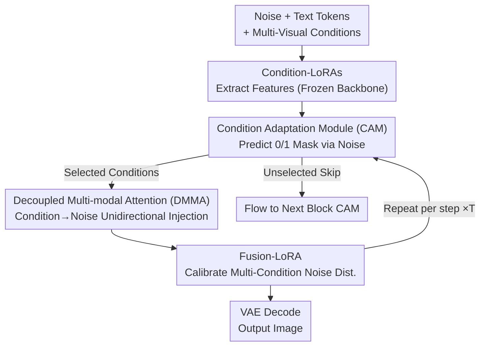

# DynFusion: Rethinking Condition Fusion for Adaptive Multi-Conditional Text-to-Image Generation

**Conference**: CVPR 2026  
**Paper**: [CVF Open Access](https://openaccess.thecvf.com/content/CVPR2026/html/Fang_DynFusion_Rethinking_Condition_Fusion_for_Adaptive_Multi_Conditional_Text_to_Image_Generation_CVPR_2026_paper.html)  
**Code**: None (Repository not public)  
**Area**: Diffusion Models / Controllable Generation  
**Keywords**: Multi-conditional controllable generation, condition fusion, dynamic gating, DiT, FLUX  

## TL;DR
DynFusion inserts a lightweight gating module, CAM, into each MMDiT block of the DiT architecture. This allows the model to autonomously decide which visual conditions (depth, edge, subject, background, etc.) to activate based on the "current denoising step, task, and injection position." By replacing static "blind stacking of all conditions" with dynamic sparse fusion, it simultaneously achieves better FID, controllability, and reduced inference FLOPs (Subject-Insertion FID 5.14→4.53, FLOPs 16.21T→7.76T).

## Background & Motivation
**Background**: Text-to-image diffusion models (SD, FLUX, SD3.5) can generate realistic images, but pure text cannot precisely specify spatial layouts, geometric structures, and appearance details. Consequently, controllable generation frameworks like ControlNet, IP-Adapter, and OmniControl have emerged to inject auxiliary conditions—such as depth maps, Canny edges, and reference subjects—into the diffusion backbone to strengthen structural alignment or appearance consistency.

**Limitations of Prior Work**: Real-world design tasks rarely rely on a single condition; they often require preserving the spatial geometry of a depth map, the structural outlines of an edge map, and the appearance style of a reference image simultaneously. Existing multi-condition methods (Cocktail, UniControlNet, OmniControl, UniCombine) typically "stack" these by adding multiple condition branches or sets of condition tokens, applying a **uniform fusion strategy** to all. This leads to two specific issues: first, the computational cost expands linearly with the number of conditions (e.g., OmniControl activating multiple task-LoRAs increases FLOPs to 16.92T); second, signals from different levels (low-level geometry vs. high-level semantics) **compete rather than collaborate**, resulting in structural distortion and semantic drift—evident in the "confusion / unmatched / fail" cases frequently cited in the paper.

**Key Challenge**: The heterogeneity and time-variance of conditions are ignored. Low-level cues (depth/canny) and high-level cues (subject/background) should play different roles at different denoising stages and network depths. However, uniform fusion treats them as the same class of signals, injecting them indiscriminately throughout the process, which is both redundant and conflicting.

**Core Idea**: Replace static stacking with **data-driven adaptive condition fusion**, allowing the model to dynamically determine *what/when/where* (which conditions to activate, at which timestep, in which block) rather than following a fixed schedule. This is implemented as a plug-and-play gating module (CAM), which works alongside decoupled attention and Fusion-LoRA to ensure that selected conditions are cleanly integrated into the noise branch.

## Method

### Overall Architecture
DynFusion is built upon mainstream DiT/MMDiT architectures (such as FLUX). The input consists of noise tokens, text tokens, and multiple visual condition maps (depth, canny, subject, background, etc.), with the output being the denoised target image. The core modifications to the pipeline are: **freezing the backbone** and training only condition-specific LoRAs to extract features, which are then injected into the noise latent space via multi-modal attention to avoid full-parameter fine-tuning. The pivotal innovation is the dynamic gate preceding injection:

Each MMDiT block is equipped with a **CAM (Condition Adaptation Module)**. It processes noise tokens to predict a binary mask $\hat{M}\in\{0,1\}^n$, determining which conditions to activate for that specific block. Selected ("1") conditions participate in the block's attention mechanism, while unselected ("0") conditions **skip the current block** and flow to the next CAM for the next decision (represented by dashed skip lines in the diagram). Because fewer condition tokens participate in attention, the computational load of the MMDiT decreases. The attention itself utilizes **Decoupled Multi-modal Attention (DMMA)**, which restricts information flow solely from conditions to noise to prevent cross-condition interference. When multiple conditions are activated simultaneously, **Fusion-LoRA** is used to calibrate the noise latent feature distribution, harmonizing the multi-path condition signals. This process repeats for each denoising step ($\times T$), allowing the CAM to activate different condition combinations at different timesteps.

### Key Designs

**1. CAM: Letting the Model Decide Which Conditions to Follow per Block**

This directly addresses the issues of "uniform fusion." CAM is a lightweight gate (<1% parameters) attached to each MMDiT block. It takes the noise token matrix $X\in\mathbb{R}^{*\times d}$ as input and outputs a 0/1 mask for $n$ conditions. It first performs **decoupled aggregation**—applying average pooling along both the token dimension (capturing global semantic dependencies across regions) and the embedding dimension (summarizing each token's individual representation). These two paths pass through MLPs to a $d_{cam}=d/64$ dimension: $Z_{global}=\text{MLP}_{glb}(\text{Agg}_{seq}(X))$ and $Z_{local}=\text{MLP}_{loc}(\text{Agg}_{emb}(X))$. Their sum yields the global-local fusion feature $Z_{glb\text{-}loc}=Z_{global}+Z_{local}$, which passes through a final MLP to produce mask logits $M=\text{Act}(\text{MLP}_{mask}(Z_{glb\text{-}loc}))$.

The activation function operates in two modes: **Unconstrained Selection** uses Sigmoid with a threshold $\tau=0.5$, $\hat{M}_i=\mathbb{1}[M_i>\tau]$, allowing any number of conditions to be activated; **Single-Condition Selection** uses Softmax + argmax, $\hat{M}_i=\mathbb{1}[i=\arg\max(M_i)]$, keeping only the most critical condition and reducing complexity close to single-condition generation. The key value is that this decision is **time-varying**. Visualizations in the paper (Fig. 4) show that depth activation is concentrated in early steps (0–10, reconstructing global geometry), canny in late steps (15–25, sharpening contours), and subject/background in middle steps (10–20, integrating semantic content). This aligns perfectly with the diffusion principle of "coarse geometry → semantics → fine details," preventing over-conditioning and cross-condition conflict.

**2. Differentiable Training of CAM: Gumbel Noise + Attention Masking**

Training CAM end-to-end faces two obstacles. First, sampling a binary mask $\hat{M}$ from logits is **non-differentiable**, preventing gradient backpropagation. This is solved by injecting **Gumbel noise** into $\text{Act}(\cdot)$ to approximate the discrete mask with a differentiable version. Second, $\hat{M}$ is unstructured and varies by timestep and sample; simply discarding condition tokens where $\hat{M}_i=0$ would cause inconsistent token counts within a batch, making **parallelization impossible**. The paper maintains a fixed token count but uses an attention mask to block pruned tokens: it first calculates $P=QK^\top/\sqrt{d}$, transforms the binary condition mask into an attention mask $\hat{M}^{(i,j)}_{attn}=\mathbb{1}[\hat{M}_{C(i)}\wedge\hat{M}_{C(j)}\neq 0]$ (where $C(\cdot)$ maps token indices to condition indices), and feeds it back into the Softmax:

$$\tilde{A}^{(i,j)}=\frac{\exp(P^{(i,j)}\hat{M}^{(i,j)}_{attn})}{\sum_{k=1}^{N}\exp(P^{(i,j)}\hat{M}^{(i,j)}_{attn})+\varepsilon}$$

The resulting $\tilde{A}$ is mathematically equivalent to recalculating attention after removing unselected tokens but preserves the matrix shape, enabling parallel training ($\varepsilon$ prevents underflow). This allows "dynamic sparsity" to save inference compute without sacrificing training efficiency.

**3. DMMA: Preserving "Signal Purity" for Each Condition**

Condition-LoRAs are trained independently. If conditions are allowed to perform cross-attention with each other, one condition may absorb information from others or the noise, leading to semantic dilution and entanglement. In dynamic fusion, features that should be shielded might leak into active conditions, interfering with control. DMMA separates condition branches and denoising branches into computationally independent modules: when noise tokens act as the query, they perform attention across all conditions $\text{DMMA}(Q=X_q, K/V=[C_T, X, C_{V_{1:n}}])$ to learn spatial semantics; however, **condition tokens do not exchange information with each other**. When a condition token acts as a query, it only performs self-attention $\text{DMMA}(Q=C_{V_i}, K/V=C_{V_i})$ and remains agnostic to the diffusion process. Ablations show DMMA achieves lower FID and lower attention compute than MMA/CMMA (1.77T vs. 2.74T AttnOps).

**4. Fusion-LoRA: Correcting Noise Distribution During Multi-Condition Activation**

Since condition-LoRAs are trained independently, simply using Softmax in DMMA to balance multi-path attention distributions often results in suboptimal fusion when multiple conditions are active. Given that the types and numbers of activated conditions in DynFusion change dynamically per timestep/sample, this issue is exacerbated. Fusion-LoRA is attached to the denoising branch specifically to calibrate the noise latent feature distribution, ensuring the noise embedding adapts to these dynamic adjustments for more harmonious multi-path control. Ablations show that removing it causes FID to drop from 4.53 to 5.93 and DINO from 93.14 to 89.42, making it a critical performance pillar.

### Loss & Training
The training objective uses **flow-matching loss** $L_{diff}=\mathbb{E}_{t,\epsilon}\|v_\Theta(z,t,C_T,C_V)-u_t(z|\epsilon)\|_2^2$ (where $v_\Theta$ is the learned velocity field and $u_t$ is the target vector field). To control condition sparsity, an additional **sparsity loss** is added to pull the FLOPs ratio of dynamic fusion versus uniform fusion toward a target sparsity $\lambda$: $L_{sps}=\frac{1}{|D_{bs}|}\sum_d (\frac{F^{t_d}_{dynamic}}{F_{uniform}}-\lambda)^2$. The total objective is $L_\theta=L_{diff}+\alpha\cdot L_{sps}$, with $\alpha=1.0$ by default. The entire training process freezes the DiT backbone, training only the condition-LoRAs, Fusion-LoRA, and CAM.

## Key Experimental Results

### Main Results
Evaluated on FLUX.1 across four multi-condition tasks. Subject consistency is measured by CLIP-I/DINO, controllability by SSIM/F1/MSE, and overhead by Params/FLOPs/Speed:

| Task | Method | FID ↓ | SSIM ↑ | CLIP-I ↑ | DINO ↑ | FLOPs ↓ | Speed ↑ |
|------|------|-------|--------|----------|--------|---------|---------|
| Multi-Spatial | UniCombine | 7.29 | 0.61 | - | - | 16.21T | 1.42it/s |
| Multi-Spatial | **Ours** | **6.52** | **0.66** | - | - | **8.27T** | **2.02it/s** |
| Subject-Insertion | UniCombine | 5.14 | 0.76 | 96.95 | 92.54 | 16.21T | 1.42it/s |
| Subject-Insertion | **Ours** | **4.53** | **0.80** | **97.21** | **93.14** | **7.76T** | **2.09it/s** |
| Subject-Depth | UniCombine | 6.92 | 0.52 | 93.79 | 90.41 | 16.21T | 1.42it/s |
| Subject-Depth | **Ours** | **6.21** | **0.56** | **94.52** | **90.70** | **7.96T** | **2.04it/s** |
| Subject-Canny | UniCombine | 6.41 | 0.57 | 94.76 | 92.24 | 16.21T | 1.42it/s |
| Subject-Canny | **Ours** | **5.72** | **0.64** | **95.33** | **92.87** | **8.20T** | **2.02it/s** |

Across all tasks, DynFusion outperforms the previous SOTA (UniCombine) in quality (FID/SSIM) and subject consistency (CLIP-I/DINO), while cutting FLOPs by approximately half and increasing inference speed by ~1.4x. While previous methods faced a trade-off between quality and compute, DynFusion achieves simultaneous improvements in both.

### Ablation Study (Subject-Insertion Task)

| Configuration | FID ↓ | SSIM ↑ | DINO ↑ | FLOPs / Notes |
|------|-------|--------|--------|------|
| Uniform (All Active) | 5.06 | 0.76 | 92.71 | 15.10T, baseline |
| Sole (Softmax Select) | 4.89 | 0.78 | 92.96 | 7.56T, single condition only |
| **Free (Sigmoid Select)** | **4.53** | **0.80** | **93.14** | 7.76T, adaptive multi-condition |
| Ours w. MMA | 5.19 | 0.78 | 92.40 | AttnOps 2.74T |
| Ours w. CMMA | 4.75 | 0.81 | 92.99 | AttnOps 2.41T |
| **Ours w. DMMA** | **4.53** | 0.80 | **93.14** | AttnOps **1.77T** |
| w/o Fusion-LoRA | 5.93 | 0.73 | 89.42 | Sharp performance drop |
| w. Fusion-LoRA | **4.53** | **0.80** | **93.14** | Full model |

### Key Findings
- **Dynamic Sparse > Uniform All-Active**: The Free (adaptive) mode lowered FID from 5.06 to 4.53 and FLOPs from 15.10T to 7.76T compared to Uniform, confirming that redundant/conflicting conditions hinder generation and that dynamic removal is effective.
- **Fusion-LoRA is the Most Sensitive Module**: Removing it caused FID to spike to 5.93 and DINO to drop to 89.42, indicating that noise distribution calibration is indispensable under dynamic combinations.
- **Sparsity Sweet Spot**: Quality/controllability peaked at 50% sparsity (FID 4.77). Dropping to 30% led to insufficient control signals and performance loss (FID 5.19), while raising it to 70% introduced redundancy issues.
- **Temporal Activation Logic**: Depth (early), subject/background (mid), and canny (late) activation patterns align with the "coarse geometry → semantics → details" trajectory of diffusion, providing interpretable insights into controllable diffusion mechanisms.

## Highlights & Insights
- **Turning "Should I use this condition?" into a learned decision**: Traditional controllable generation only learns "how to inject," whereas DynFusion learns "which block, which step, and which conditions," upgrading from static architecture to data-driven gating.
- **"Fake removal, real retention" via Gumbel + Attention Masking**: This trick allows dynamic sparsity for compute savings while maintaining batch parity for parallel training—a technique transferable to any scenario requiring sample-level dynamic pruning.
- **Interpretability as a byproduct**: CAM activation distributions naturally map out which conditions function during different stages of denoising, offering high value for understanding the internal mechanisms of multi-condition diffusion.
- **Preserving signal purity via decoupled attention**: The observation that independently trained branches dilute semantics if allowed to cross-correlate suggests that unidirectional injection should be the default for multi-branch conditioning.

## Limitations & Future Work
- The code is not public, and specific details like CAM architecture and exact training dataset scale are relegated to the supplemental materials, creating a high barrier for reproduction. ⚠️ Some formulas (e.g., Eq. 8 mask conversion, Eq. 9 masked softmax) should be referenced directly from the text.
- Validation is primarily on FLUX.1 (MMDiT); the applicability to UNet-based ControlNet systems and cross-architecture generalization remains under-discussed.
- The 50% sparsity sweet spot and $\tau=0.5$ threshold are empirical; whether they require adjustment for different tasks or if CAM generalizes to unseen condition combinations is not fully analyzed.
- Condition types are concentrated on depth/canny/subject/background; the scalability to more heterogeneous conditions (pose, texture, layout) when stacked simultaneously needs larger-scale validation.

## Related Work & Insights
- **vs. UniCombine / OmniControl**: These rely on stacking condition branches or parallel task-LoRAs for uniform injection, leading to compute expansion and conflict. DynFusion distinguishes itself through a paradigm shift from "stacking" to "gating."
- **vs. FlexControl**: FlexControl proposed adaptive single-condition injection across steps and blocks. DynFusion extends this insight to multi-condition scenarios and introduces DMMA + Fusion-LoRA to resolve the resulting issues of interference and distribution mismatch.
- **vs. ControlNet / IP-Adapter**: Classic single-condition injectors. DynFusion does not replace them but acts as a high-level "condition scheduler" determining when they should collaborate.

## Rating
- Novelty: ⭐⭐⭐⭐ Shifting fusion from static stacking to learnable gating with time-varying activation is a novel approach providing mechanism insights.
- Experimental Thoroughness: ⭐⭐⭐⭐ Comprehensive results across four tasks and four sets of ablations (strategy/attention/Fusion-LoRA/sparsity); however, lacks cross-architecture validation.
- Writing Quality: ⭐⭐⭐⭐ Clear motivation and good correspondence between text and figures; dynamic visualizations are a highlight, though some notations (CAM dimensions) are slightly inconsistent.
- Value: ⭐⭐⭐⭐ Improves both quality and efficiency for multi-condition generation; highly practical for design-oriented control and the gating logic is transferable.

## Related Papers

- [\[CVPR 2026\] CaReFlow: Cyclic Adaptive Rectified Flow for Multimodal Fusion](careflow_cyclic_adaptive_rectified_flow_for_multimodal_fusion.md)
- [\[CVPR 2026\] Rethinking Prompt Design for Inference-time Scaling in Text-to-Visual Generation](rethinking_prompt_design_for_inference-time_scaling_in_text-to-visual_generation.md)
- [\[CVPR 2026\] MultiBanana: A Challenging Benchmark for Multi-Reference Text-to-Image Generation](multibanana_a_challenging_benchmark_for_multi_reference_text_to_image_generation.md)
- [\[CVPR 2026\] Curriculum Group Policy Optimization: Adaptive Sampling for Unleashing the Potential of Text-to-Image Generation](curriculum_group_policy_optimization_adaptive_sampling_for_unleashing_the_potent.md)
- [\[CVPR 2026\] WISER: Wider Search, Deeper Thinking, and Adaptive Fusion for Training-Free Zero-Shot Composed Image Retrieval](wiser_wider_search_deeper_thinking_and_adaptive_fusion_for_training-free_zero-sh.md)

<!-- RELATED:END -->

<!-- RELATED:START -->

## Related Papers

- [\[CVPR 2026\] SeeThrough3D: Occlusion Aware 3D Control in Text-to-Image Generation](seethrough3d_occlusion_aware_3d_control_in_text-to-image_generation.md)
- [\[CVPR 2026\] MultiBanana: A Challenging Benchmark for Multi-Reference Text-to-Image Generation](multibanana_a_challenging_benchmark_for_multi_reference_text_to_image_generation.md)
- [\[CVPR 2026\] When Safety Collides: Resolving Multi-Category Harmful Conflicts in Text-to-Image Diffusion via Adaptive Safety Guidance](when_safety_collides_resolving_multi-category_harmful_conflicts_in_text-to-image.md)
- [\[CVPR 2026\] Fusion in Your Way: Aligning Image Fusion with Heterogeneous Demands via Direct Preference Optimization](fusion_in_your_way_aligning_image_fusion_with_heterogeneous_demands_via_direct_p.md)
- [\[CVPR 2026\] Rethinking Glyph Spatial Information in Font Generation](rethinking_glyph_spatial_information_in_font_generation.md)

<!-- RELATED:END -->
