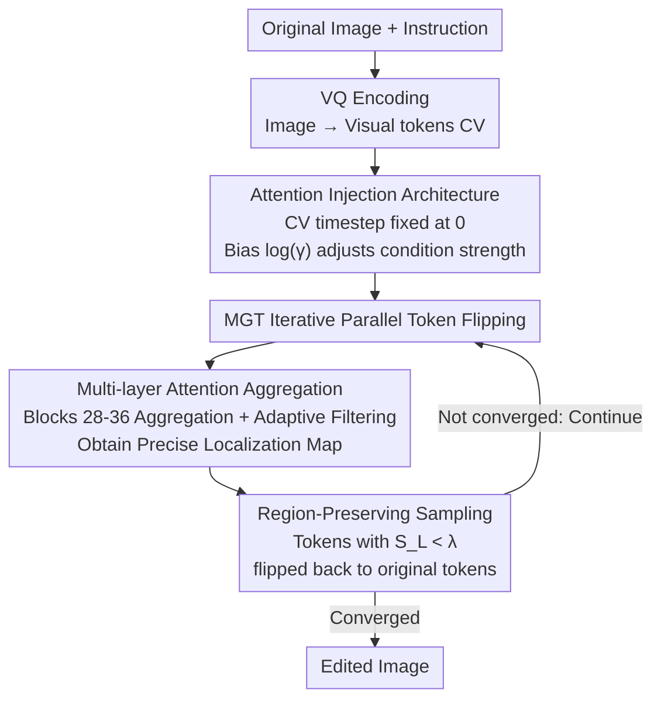

# EditMGT: Unleashing Potentials of Masked Generative Transformers in Image Editing

**Conference**: CVPR 2026  
**Paper**: [CVF Open Access](https://openaccess.thecvf.com/content/CVPR2026/html/Chow_EditMGT_Unleashing_Potentials_of_Masked_Generative_Transformers_in_Image_Editing_CVPR_2026_paper.html)  
**Code**: https://weichow23.github.io/EditMGT (Project Page / Code / Dataset)  
**Area**: Image Generation / Image Editing  
**Keywords**: Instruct Image Editing, Masked Generative Transformer (MGT), Attention Injection, Region-Preserving Sampling, Editing Leakage  

## TL;DR
EditMGT is the first instruction-based image editing model built on Masked Generative Transformers (MGT). By leveraging the "token-by-token flipping" local decoding characteristic of MGT, it employs multi-layer attention aggregation to localize editing regions and uses region-preserving sampling to revert tokens in low-attention areas back to the original image. This mechanism inherently eliminates "editing leakage" common in diffusion models. With only 960M parameters, it achieves SOTA image similarity across four benchmarks and is 6× faster than comparable models.

## Background & Motivation
**Background**: The current mainstream paradigm for instruction-based image editing is Diffusion Models (DM), which achieve high visual fidelity through iterative denoising. Models like InstructPix2Pix, FluxKontext, OmniGen2, and VAREdit follow this path.

**Limitations of Prior Work**: Denoising in DMs is **global**—every step involves refining the entire image. This entangles "local editing targets" with the "global context," leading to "leakage" where modifications affect regions that should remain unchanged (spurious edit / editing leakage). For instance, an instruction to "change a unicorn into a lion" might inadvertently alter the background or pose.

**Existing remedies are incomplete**: The authors categorize three types of existing solutions, all with drawbacks: (1) Scaling up high-quality data to let the model learn constraints implicitly, which lacks an **explicit guarantee**; (2) Using pre-defined masks + inpainting models, which are limited by the flexibility of the pre-trained inpainting model; (3) Using inversion to map non-edited areas back to the Gaussian noise subspace, which is slow and prone to errors.

**Key Challenge**: The global denoising mechanism of DMs is **inherently at odds** with the editing requirement of "modifying only the target area while preserving the rest." Preservation relies on external constraints rather than the architecture itself.

**Key Insight**: The authors pivot to MGT. MGT encodes images into discrete visual token sequences and generates images by **predicting multiple masked tokens in parallel**. This is a **local decoding** paradigm that naturally supports zero-shot inpainting—updating tokens within a specified mask while keeping tokens outside the mask completely unchanged. This means "explicitly protecting non-target areas" is an inherent capability of the MGT architecture.

**Core Idea**: Implement two essential editing capabilities in MGT: ① **Adaptive localization** of edit-relevant regions (without manual masks), and ② **Explicit protection** of irrelevant regions during inference. The former is achieved by observing that MGT cross-attention naturally carries localization signals, enhanced via multi-layer attention aggregation. The latter uses region-preserving sampling to revert low-attention tokens to the original image. This approach adds zero parameters, transforming a pre-trained text-to-image MGT (Meissonic) into an editing model via attention injection.

## Method

### Overall Architecture
EditMGT takes an "original image + editing instruction" as input and outputs the edited image. The pipeline is built on Meissonic, a 1024×1024 text-to-image MGT, and consists of three steps: (1) **Architecture layer**—encodes the original image into original condition tokens `CV`, utilizing attention injection to let the original image supervise generation, converting the text-to-image model into an editing model at zero cost; (2) **Localization**—extracts editing region signals from the MGT cross-attention during iterative token flipping, aggregating multiple layers to refine blurred attention maps into precise localization maps; (3) **Preservation**—uses region-preserving sampling to force tokens in low-attention areas of the localization map back to the original image tokens.

The MGT generation process starts from a fully masked canvas, iteratively sampling all missing tokens. Low-confidence tokens are reverted to `[MASK]` for re-prediction in the next round. EditMGT embeds the "protection" step into this iterative flipping loop.

### Key Designs

**1. Attention Injection Architecture: Converting text-to-image MGT to editing without new parameters**

The pain point is that editing models require the "original image" as a condition, which usually involves architectural changes or adding parameters. EditMGT introduces **condition tokens** $C_V\in\mathbb{R}^{N\times d}$ identical in shape to the iterative image tokens $C_I$, aligning their RoPE position matrices ($(i,j)_{C_V}=(i,j)_{C_I}$) to ensure spatial alignment. $C_V$ and $C_I$ **share parameters** and undergo the same processing, but the **timestep for $C_V$ is fixed at 0**, making it a stable condition signal that does not drift during sampling.

Attention is calculated as $W=\mathrm{softmax}\!\big(QK^\top/\sqrt{d}\big)$, with $Q,K,V$ derived from the concatenated tokens $C=[C_I;C_T]$ (image + text). To control condition strength at inference, a bias matrix $E$ is added to the weights $W_{\text{new}}=W+E$. $E$ is a block matrix where only the blocks between $C_I$ and $C_V$ are filled with $\log(\gamma)$, leaving the rest as 0:

$$\mathcal{E}=\begin{bmatrix}\mathbf{0}_{M\times M} & \mathbf{0}_{M\times N} & \mathbf{0}_{M\times N}\\ \mathbf{0}_{N\times M} & \mathbf{0}_{N\times N} & \log(\gamma)\mathbf{1}_{N\times N}\\ \mathbf{0}_{N\times M} & \log(\gamma)\mathbf{1}_{N\times N} & \mathbf{0}_{N\times N}\end{bmatrix}$$

This preserves original attention patterns within token types while allowing $\log(\gamma)$ to scale the interaction between the original and edited images: $\gamma=0$ disables the condition, while $\gamma>1$ strengthens it. This embeds conditioning via the attention mechanism **without introducing additional parameters**.

**2. Multi-layer Attention Aggregation: Refining blurred cross-attention into precise localization**

MGT text-to-image cross-attention carries rich semantics; for instance, the model can outline a "birthday hat" in early iterations. However, individual intermediate block attention maps lack **saliency and focus**, often misidentifying internal tokens if used directly.

EditMGT **aggregates** attention weights from **layers 28~36** (selected from semantically coherent single-modality layers) to amplify signals. Since the aggregated map still suffers from "holes" or blurred boundaries, **Adaptive Filtering** is applied for denoising and boundary sharpening. This achieves "Capability ①: Adaptive localization of edit-related regions" **without requiring any user-provided masks**.

**3. Region-Preserving Sampling: Mechanically preventing leakage**

How is preservation ensured? EditMGT integrates the protection step into the iterative flipping loop. Let $W^\ell_i\in\mathbb{R}^{M\times N}$ be the normalized attention from text $C_T$ to edited image $C_I$ at layer $\ell$. This is aggregated into a localization score for each token:

$$s_L=\frac{1}{|\mathcal{L}||\mathcal{M}|}\sum_{\ell\in\mathcal{L},\,m\in\mathcal{M}}W^\ell_i[m,:]\in\mathbb{R}^N$$

where $W^\ell_i[m,:]$ is the $m$-th row, and $\mathcal{M}$ is the set of indices for keyword tokens in the instruction. During inference, **all tokens where $S_L < \lambda$ are forcibly reverted to their original image counterparts**. This maintains the integrity of the sampling scheduler while ensuring consistency with the original image. The threshold $\lambda$ controls the editing range: higher $\lambda$ leads to more conservative edits. This provides "Capability ②: Explicit protection of irrelevant regions" as a hard mechanism during sampling.

### Loss & Training
The objective is to minimize the negative log-likelihood of reconstructing masked tokens given unmasked and condition tokens on a large-scale dataset $\mathcal{D}$:

$$L=\mathbb{E}_{(x,t)\sim\mathcal{D},\,\mathbf{m}\sim\mathcal{M}}\Big[-\sum_{i\in\mathbf{m}}\log p_\theta\big(v_i\,\big|\,v_{\neg i},C_T;C_V\big)\Big]$$

The mask rate $r\in[0,1]$ is sampled from a truncated arccos distribution with density $p(r)=\tfrac{2}{\pi}(1-r^2)^{-1/2}$ (cosine schedule). Training occurs in three stages: **Stage 1** uses ~1M pairs with the text encoder replaced by Gemma2-2B; **Stage 2** involves full fine-tuning on 4M editing samples for 50,000 steps; **Stage 3** fine-tunes for 1,000 steps on high-quality data to align with human preferences.

**CrispEdit-2M Dataset**: Consists of 2M high-resolution (short side ≥1024) filtered editing samples across 7 categories, supplemented by another 2M collected samples, totaling 4M for training.

## Key Experimental Results

### Main Results
**Emu Edit / MagicBrush (Image Similarity + Instruction Consistency)**: EditMGT (960M params) achieves SOTA in CLIPim across both benchmarks, with a ~1.1% gain on MagicBrush. DINO semantic similarity is SOTA on MagicBrush and second on Emu Edit.

| Model | Params | EmuEdit CLIPim↑ | EmuEdit DINO↑ | MagicBrush CLIPim↑ | MagicBrush DINO↑ |
|------|------|------|------|------|------|
| AnyEdit (CVPR'25) | 1B | 0.872 | 0.821 | 0.898 | 0.881 |
| OminiGen2 | 7B | 0.876 | 0.822 | - | - |
| VAREdit | 8B | 0.876 | 0.825 | 0.901 | 0.844 |
| **EditMGT (Ours)** | **1B** | **0.878** | **0.832** | **0.911** | **0.881** |

**GEdit-EN-full (GPT Evaluation, 11 categories)**: The 960M EditMGT outperforms VAREdit-8B, GoT-6B, and OminiGen2-7B, approaching the 12B FluxKontext.dev. It exceeds FluxKontext in sub-tasks like Color (+9.8%) and Style Transfer (+17.6%).

| Model | Params | BG Trans. | Color | Style | Avg. |
|------|------|------|------|------|------|
| GoT | 6B | 4.11 | 5.75 | 4.59 | 3.95 |
| VAREdit | 8B | 6.77 | 6.64 | 7.29 | 5.73 |
| FluxKontext.dev | 12B | 7.06 | 7.03 | 6.76 | **6.26** |
| **EditMGT (Ours)** | **0.96B** | **7.69** | **7.71** | 5.24 | 5.87 |

**Efficiency**: Editing a 1024×1024 image takes only **2 seconds**, which is **6× faster** than models of comparable performance, with a VRAM footprint of 13.8 GB.

### Ablation Study

| Configuration | Phenomenon | Description |
|------|------|------|
| Text Encoder Gemma2-IT-2B | Optimal | Outperforms T5-XXL / Llama3.2-1B |
| Data Scale 20K→80K steps | Monotonic Increase | Scores improve with more steps after switching encoder |
| Threshold $\lambda$ Increase | Range Decreases | L1 distance drops; semantic score peaks then falls |

### Key Findings
- **Threshold $\lambda$ is a "Fidelity vs. Edit Strength" knob**: As $\lambda$ increases, more tokens are reverted, and L1 distance (difference from original) monotonically decreases. Semantic scores follow a "rise then sharp fall," indicating that moderate preservation is beneficial while excessive preservation suppresses editing.
- **Robustness to Text Encoder**: Switching from CLIP to Gemma2-2B maintains stable improvements as training steps increase.
- **Why small models outperform**: The 960M model leads in style tasks (+17.6%) due to MGT's precise structural control. Lower L1 scores are attributed to the inherent diversity between EditMGT and the ground truth.

## Highlights & Insights
- **Paradigm Shift Solution**: Instead of patching DMs, it utilizes MGT’s local decoding nature to make "preservation" an inherent architectural feature rather than an external constraint.
- **Zero-param Attention Injection**: Uses shared parameters and fixed-timestep condition tokens to convert a generative model into an editing model, which is transferable to other MGT-based conditional tasks.
- **Attention as Free Mask**: Multi-layer aggregation translates cross-attention into precise localization maps, eliminating the need for manual masks or extra segmentation networks.
- **Compact and Fast**: 960M parameters, 2 seconds, 13.8 GB—demonstrating that the bottleneck in editing may not be parameter count but precise region control.

## Limitations & Future Work
- **L1 Performance**: The authors admit no significant advantage in pixel-level L1, citing diversity in generation as a factor.
- **Dependence on Attention Quality**: Localization relies on specific blocks (28-36) and filtering. For complex multi-object scenes or abstract instructions, localization accuracy may degrade.
- **Threshold Tuning**: Since semantic scores are sensitive to $\lambda$, an automatic selection mechanism is currently missing.
- **Base Model Binding**: The method is currently tied to the Meissonic MGT; generalizability to other MGT architectures remains to be explored.

## Related Work & Insights
- **vs. Diffusion Editing (FluxKontext / VAREdit)**: These rely on global denoising + large data/inversion, using 6~12B parameters and prone to leakage. EditMGT uses local decoding for **explicit** preservation with 960M parameters and 6× speed.
- **vs. Mask-based Inpainting**: The latter requires manual masks and is limited by inpainting models; EditMGT uses adaptive localization for higher flexibility.
- **vs. Attention Control (Prompt-to-Prompt)**: While these modulate attention in DMs, EditMGT is the **first to systematically analyze attention dynamics in MGT token flipping** to suppress leakage.

## Rating
- Novelty: ⭐⭐⭐⭐⭐ Resolves leakage at the paradigm level.
- Experimental Thoroughness: ⭐⭐⭐⭐ Strong benchmarks, but L1 and failure case analysis could be deeper.
- Writing Quality: ⭐⭐⭐⭐ Clear mapping between motivation and mechanism.
- Value: ⭐⭐⭐⭐⭐ Efficient high-performance model with an open-source dataset.

<!-- RELATED:START -->

## Related Papers

- [\[CVPR 2026\] SpotEdit: Selective Region Editing in Diffusion Transformers](spotedit_selective_region_editing_in_diffusion_transformers.md)
- [\[CVPR 2026\] MRT: Masked Region Transformer for Layered Image Generation and Editing at Scale](mrt_masked_region_transformer_for_layered_image_generation_and_editing_at_scale.md)
- [\[CVPR 2026\] PixelDiT: Pixel Diffusion Transformers for Image Generation](pixeldit_pixel_diffusion_transformers_for_image_generation.md)
- [\[NeurIPS 2025\] Unleashing Diffusion Transformers for Visual Correspondence by Modulating Massive Activations](../../NeurIPS2025/image_generation/unleashing_diffusion_transformers_for_visual_correspondence_by_modulating_massiv.md)
- [\[CVPR 2026\] ReasonEdit: Towards Reasoning-Enhanced Image Editing Models](reasonedit_towards_reasoning-enhanced_image_editing_models.md)

<!-- RELATED:END -->
