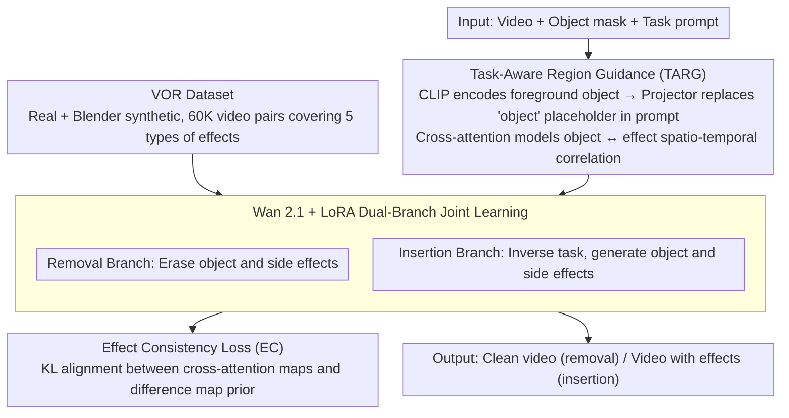

# EffectErase: Joint Video Object Removal and Insertion for High-Quality Effect Erasing

**Conference**: CVPR 2026  
**arXiv**: [2603.19224](https://arxiv.org/abs/2603.19224)  
**Code**: [Project Page](https://henghuiding.com/EffectErase/)  
**Area**: Image Generation  
**Keywords**: Video Object Removal, Visual Side Effects, Diffusion Models, Dual Learning, Dataset

## TL;DR

The EffectErase framework is proposed, which jointly learns video object insertion as an inverse auxiliary task for removal. A large-scale VOR dataset containing 60K video pairs is constructed to achieve high-quality erasing of objects and their visual side effects, including occlusions, shadows, reflections, lighting changes, and deformations.

## Background & Motivation

Video object removal requires not only the removal of the target object itself but also the erasing of various **visual side effects** introduced by the object (such as shadows, reflections, lighting changes, occlusions, and deformations). Existing methods face two major dilemmas:

**Methodological Level**: Existing video inpainting methods rely excessively on input masks for guidance, ignoring side effects outside the mask area. Even methods like ROSE that predict difference masks still lack explicit modeling of the spatio-temporal correlation between the object and its side effects.

**Data Level**: There is a lack of large-scale public datasets that systematically capture multiple types of object effects. SVOR does not consider side effects, and ROSE relies solely on synthetic data from camera movements, which is limited in scale and diversity.

## Method

### Overall Architecture

EffectErase addresses the residual visual side effects (shadows, reflections, lighting, occlusions, deformations) after video object removal. It employs LoRA fine-tuning on the Wan 2.1 video generation model. The Core Idea is to perform joint learning of "removal" and its inverse task "insertion"—the insertion branch naturally knows which side effects an object will bring, which in turn provides supervision for the removal branch to clean those same effects. The pipeline is supported by three components: a large-scale VOR dataset providing real "with/without object" paired supervision, Task-Aware Region Guidance (TARG) to model the spatio-temporal correlation between objects and effects, and Effect Consistency (EC) loss to align both removal and insertion branches to the same affected region.

### Key Designs

**1. VOR Dataset: Systematically covering five types of side effects with real + synthetic pairs**

The greatest challenge in side effect erasing is the lack of appropriate supervision signals. SVOR overlooks side effects entirely, while ROSE relies on camera movement synthesis with limited scale and diversity. VOR uses fixed cameras to capture "with/without object" paired videos for real data and complements this with synthetic data from over 150 3D scenes rendered in Blender. It systematically covers five categories of side effects: Occlusion (opaque, semi-transparent, and transparent subtypes), Shadow (projections under different lighting), Lighting (brightness and color changes after removing light sources), Reflection (mirrored surfaces like water, tiles, etc.), and Deformation (physical changes in curtains, grass, nets, etc.). The final scale reaches 60K video pairs, 366 object categories, 443 scenes, and over 145 hours, far exceeding previous datasets and providing the necessary foundation for the model to learn "effect erasing" rather than just "object cropping."

**2. Task-Aware Region Guidance (TARG): Modeling spatio-temporal correlation between objects and side effects via cross-attention**

Existing video inpainting methods rely too heavily on input masks, focusing only on the mask area and failing to recognize side effects outside it. TARG first uses a CLIP image encoder to encode the foreground object as an embedding $\boldsymbol{e}^f$, then uses a projector to replace the "object" placeholder in the task prompt: $\boldsymbol{e}^{\text{prompt}} = \boldsymbol{e}^{\text{task}}[\text{object}] \leftarrow \mathcal{P}_\psi(\boldsymbol{e}^f)$. This allows cross-attention to explicitly model the correlation between "this object" and the spatio-temporal side effects it induces. Combined with task tokens, the same mechanism can flexibly switch between removal and insertion.

**3. Effect Consistency Loss (EC): Aligning removal and insertion to the same affected region**

Removal and insertion are inverse tasks that essentially affect the same region, which can be used for mutual constraint. EC collects cross-attention maps from the DiT blocks of both branches, obtains soft region estimates $f^{\text{rm}}, f^{\text{in}}$ via max pooling and a mapper, and aligns them with a difference map prior $f^{\text{diff}}$: $\mathcal{L}_{\text{EC}} = \mathrm{KL}(f^{\text{diff}} \| f^{\text{rm}}) + \mathrm{KL}(f^{\text{diff}} \| f^{\text{in}})$. The $f^{\text{diff}}$ is derived from the normalized distribution of frame differences between the "with" and "without" object videos. Unlike binary masks, it preserves intensity information for lighting and shadows, providing "softer" and more realistic supervision.

### Loss & Training

$$\mathcal{L}_{\text{total}} = \mathcal{L}_{\text{denoise}}^{\text{remove}} + \mathcal{L}_{\text{denoise}}^{\text{insert}} + \lambda \mathcal{L}_{\text{EC}}$$

- Base Model: Wan 2.1 + LoRA (rank=256)
- Input Resolution: $832 \times 480$, 81 randomly sampled consecutive frames
- Training: 120K iterations with batch size 8 on 8×H100 GPUs, learning rate $1 \times 10^{-5}$
- Inference: 50-step denoising

## Key Experimental Results

### Main Results

| Dataset | Metric | EffectErase | ROSE | MinMax-Remover | Gain (vs ROSE) |
|--------|------|-------------|------|----------------|--------------|
| ROSE-Benchmark | PSNR↑ | **32.161** | 31.122 | 26.770 | +1.04 |
| ROSE-Benchmark | SSIM↑ | **0.948** | 0.917 | 0.905 | +0.031 |
| ROSE-Benchmark | LPIPS↓ | **0.039** | 0.077 | 0.099 | -0.038 |
| ROSE-Benchmark | FVD↓ | **55.578** | 72.177 | 137.840 | -16.6 |
| VOR-Eval | PSNR↑ | **23.750** | 22.966 | 21.963 | +0.784 |
| VOR-Eval | SSIM↑ | **0.806** | 0.792 | 0.802 | +0.014 |
| VOR-Wild | QScore↑ | **9.280** | 9.240 | 8.984 | +0.040 |
| VOR-Wild | User↑ | **7.20** | 6.38 | 5.90 | +0.82 |

### Ablation Study

| Configuration | PSNR↑ | SSIM↑ | LPIPS↓ | FVD↓ | Description |
|------|-------|-------|--------|------|------|
| Real only | 20.409 | 0.720 | 0.243 | 368.664 | Baseline |
| +EC loss | 21.020 | 0.737 | 0.224 | 354.545 | Consistency Loss |
| +EC+TARG | 23.101 | 0.780 | 0.193 | 349.094 | Region Guidance |
| +EC+TARG+Syn | **23.750** | **0.806** | **0.170** | **342.871** | Full Scheme |

### Key Findings

- TARG makes the largest contribution (SSIM jumps from 0.737 to 0.780), proving that spatio-temporal correlation modeling is crucial for side effect localization.
- Adding synthetic data increases diversity, reducing LPIPS from 0.193 to 0.170 and significantly improving generalization.
- The model can switch to object insertion tasks without additional training, generating realistic shadows and reflections.

## Highlights & Insights

- **Novel Problem Definition**: Redefines the video object removal problem as "effect erasing," systematically summarizing five types of side effects.
- **Exquisite Dual Learning Design**: Removal and insertion act as inverse operations sharing the same affected region, naturally forming complementary supervision.
- **High Value of VOR Dataset**: With 60K paired videos, 145 hours, and a mix of real and synthetic data, it is the largest dataset in this field to date.
- The soft difference map prior retains more intensity information than binary masks.

## Limitations & Future Work

- Restoration quality for extreme occlusions (e.g., large-scale foreground objects blocking the background) still needs improvement.
- The cost of acquiring real-world paired data is high, making it difficult to cover all possible scenes.
- LoRA fine-tuning might limit generalization to entirely new types of effects.

## Related Work & Insights

- The primary differences from ROSE are: (1) joint learning vs. single task, (2) attention mechanisms for modeling spatio-temporal correlations vs. difference mask prediction, and (3) a significant gap in data scale and diversity.
- Insight: The dual learning concept can be extended to other inverse task pairs (e.g., super-resolution/downsampling, colorization/grayscale conversion).

## Rating

- Novelty: ⭐⭐⭐⭐ Dual learning + effect consistency design is novel; VOR dataset fills a significant gap.
- Experimental Thoroughness: ⭐⭐⭐⭐ Complete across three datasets, user studies, ablation, and insertion task demonstrations.
- Writing Quality: ⭐⭐⭐⭐ Clear motivation and rich illustrations.
- Value: ⭐⭐⭐⭐⭐ The VOR dataset and the effect-aware removal framework provide significant driving value for the field.

<!-- RELATED:START -->

## Related Papers

- [\[CVPR 2026\] Object-WIPER: Training-Free Object and Associated Effect Removal in Videos](object-wiper_training-free_object_and_associated_effect_removal_in_videos.md)
- [\[CVPR 2026\] Precise Object and Effect Removal with Adaptive Target-Aware Attention](precise_object_and_effect_removal_with_adaptive_target-aware_attention.md)
- [\[CVPR 2026\] Preserving Source Video Realism: High-Fidelity Face Swapping for Cinematic Quality](preserving_source_video_realism_high-fidelity_face_swapping_for_cinematic_qualit.md)
- [\[ICCV 2025\] OmniPaint: Mastering Object-Oriented Editing via Disentangled Insertion-Removal Inpainting](../../ICCV2025/image_generation/omnipaint_mastering_object-oriented_editing_via_disentangled_insertion-removal_i.md)
- [\[CVPR 2026\] Frequency-Aware Flow Matching for High-Quality Image Generation](freqflow_frequency_aware_flow_matching.md)

<!-- RELATED:END -->
