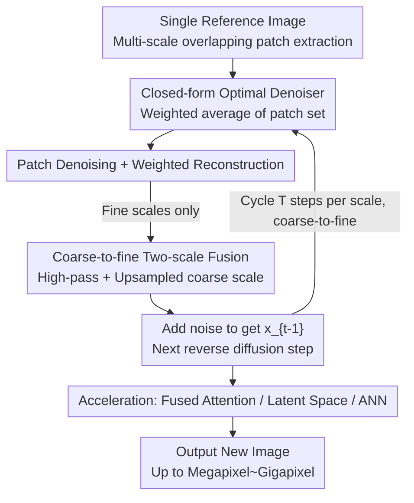

# Efficient and Training-Free Single-Image Diffusion Models

**Conference**: CVPR 2026  
**arXiv**: [2606.04299](https://arxiv.org/abs/2606.04299)  
**Code**: https://haojunqiu.github.io/efficient-SID/ (Available)  
**Area**: Diffusion Models / Image Generation  
**Keywords**: Single-image generation, training-free diffusion, closed-form denoiser, patch prior, coarse-to-fine

## TL;DR
By treating "all patches within a single image" as a finite dataset, it is demonstrated that the denoising score on this dataset has an analytical closed-form solution (a weighted denoiser similar to non-local-means). This transforms single-image diffusion models into a completely **training-free** process—matching or exceeding the quality and diversity of SinDDM/SinFusion which require hours of training, while enabling the generation of megapixel images in seconds and gigapixel images in minutes.

## Background & Motivation
**Background**: Single-image generation aims to produce new images that maintain internal patch distributions (local structural statistics across multiple scales) consistent with a single reference image, while creating a novel global layout. Two main approaches exist: ① Single-image GANs (SinGAN) use discriminators to enforce patch statistics; ② Single-image diffusion (SinDDM, SinFusion, SinDiffusion) train a network to denoise the same image across multiple scales, followed by coarse-to-fine sampling.

**Limitations of Prior Work**: Even with only one image as training data, these generative models require **hours** of optimization (SinDDM takes 10 hours on a TITAN RTX, SinFusion 3.2 hours, and SinDiffusion 5.4 hours). GANs also suffer from local minima and mode collapse, and cannot incorporate text guidance without retraining.

**Key Challenge**: The flexibility of diffusion models (explicit modeling of patch priors, compatibility with VLMs for text editing, and addition of symmetric/local constraints) is appealing, but this flexibility is tied to the requirement of "internally training a denoising network first." Conversely, classical non-parametric patch methods (like GPNN’s nearest-neighbor patch matching) are training-free and fast but do not explicitly model patch probabilities, leading to poor flexibility. Neither approach satisfies both requirements.

**Key Insight**: The authors leverage a critical observation—**the set of patches in a single image is finite**. For a finite dataset, the score function (i.e., the optimal denoiser) of a noisy patch has an analytical closed-form solution, eliminating the need to train a neural network. In other words, the denoiser $D$ in a diffusion model, which is usually "learned," can be **calculated directly** in a single-image setting.

**Core Idea**: Replace the trained denoising network with a **closed-form denoiser** that is optimal for "all patches of the image" and integrate it into a coarse-to-fine reverse diffusion process. This approach retains the explicit probabilistic modeling and controllability of diffusion models while eliminating hours of training. At the image level, this closed-form denoiser simplifies to non-local-means denoising, bridging modern diffusion with classic patch restoration.

## Method

### Overall Architecture
The input is a single reference image, and the output is a new image with consistent patch distributions but a novel global layout. The entire pipeline contains no learnable parameters. It first decomposes the reference image into overlapping patches at multiple scales to serve as the "clean dataset." Starting from pure noise, it performs reverse diffusion at each timestep. In each step, a closed-form denoiser is used on each patch, which are then stitched back into a full image, followed by inter-scale fusion. Sampling proceeds from coarse to fine resolutions. Finally, three acceleration techniques enable scaling to gigapixel resolutions.

For a single-scale reverse diffusion step: Extract all overlapping noisy patches from the noisy image → For each patch, use the closed-form denoiser (weighted average over the full patch set) to obtain a clean estimate → Weight and stitch denoised patches back into a full denoised image $\hat{\mathbf{x}}_t$ → Update using DDIM/DDPM-style iterations to obtain $\mathbf{x}_{t-1}$. In the multi-scale setting, a "two-scale fusion" step is inserted after stitching at each fine scale to incorporate results from the previous coarser scale.

### Key Designs

**1. Closed-form Optimal Denoiser: Replacing "Training" with "Weighted Average"**

The bottleneck stems from the motivation—single-image diffusion usually requires hours to train a denoiser. The authors point out this step is redundant. Standard diffusion defines noisy signals as $\mathbf{x}_t=\alpha(t)\mathbf{y}+\sigma(t)\boldsymbol\epsilon$, where the denoiser $D$ should minimize $\mathbb{E}[\,w(t)\|D(\mathbf{x}_t,t)-\mathbf{y}\|_2^2\,]$. When the dataset $\mathcal{Y}=\{\mathbf{y}^{(1)},\dots,\mathbf{y}^{(Y)}\}$ is **finite** (as is the case with a single image's patch set), this optimal denoiser has a closed-form solution:

$$D(\mathbf{x}_t,\mathcal{Y},t)=\frac{\sum_{\mathbf{y}\in\mathcal{Y}} p_{\mathcal N}(\mathbf{x}_t;\alpha\mathbf{y},\sigma^2\mathbf I)\,\mathbf{y}}{\sum_{\mathbf{y}\in\mathcal{Y}} p_{\mathcal N}(\mathbf{x}_t;\alpha\mathbf{y},\sigma^2\mathbf I)}$$

Essentially, it computes the distance between the current noisy patch and every clean patch in the dataset, weights them by a Gaussian kernel $\exp(-\|\mathbf{x}_t-\alpha\mathbf{y}\|_2^2/2\sigma^2)$, and calculates the weighted average. This is effective because the patch dimensionality is low and the set is finite, allowing the score to be computed exactly (rather than approximated by a network). As $\sigma\to0$, it converges to the minimum mean square error estimate. Plugging this into reverse diffusion iterations (Eq. 3–6) with $\eta(t)$ controlling stochasticity (where $\eta=0$ yields deterministic DDIM) allows for generation without any training.

**2. Patch-level Denoising + Weighted Reconstruction: Connection to Non-Local-Means**

Applying the denoiser to the whole image involves "Patch Denoising → Image Reconstruction" (Algorithm 1 `ImgDenoise`). First, a matrix $\mathbf{P}^{(i)}$ extracts each patch $\mathbf{x}_t^{(i)}$ from the noisy image. These are processed by the closed-form denoiser to obtain $\hat{\mathbf{x}}_t^{(i)}$, and then stitched back via $\hat{\mathbf{x}}_t\leftarrow\sum_i \mathbf{R}_\rho^{(i)}\hat{\mathbf{x}}_t^{(i)}$. Here, $\mathbf{R}_\rho^{(i)}$ places patches back with Gaussian weights of standard deviation $\rho$ ($\rho=0$ places only the center pixel, exactly equivalent to Non-Local-Means).

This "connection" is elegant: when the dataset is the noisy patches of the image itself, the denoiser in Eq. (2) **is specifically classical non-local-means**. Furthermore, it can be viewed as degrading a GMM patch prior (like EPLL) into a trivial GMM with one Gaussian component per patch. While traditional GMMs require EM fitting and lack MAP closed-form solutions, this trivial GMM is analytically solvable. Thus, "modern diffusion scores" and "classical patch restoration (NLM / GMM priors)" are unified.

**3. Coarse-to-fine Sampling: Restoring Global Structure**

Single-scale sampling only preserves patch-level local statistics, often resulting in scrambled global layouts. The mechanism compensates for this by building a scale pyramid from $s=S$ (coarsest) to $s=0$ (full resolution). A coarse image is generated first, and its results are progressively injected into finer scales using `TwoScaleBlend`:

$$\tilde{\mathbf{x}}_{s,t}\leftarrow \hat{\mathbf{x}}_{s,t}-\mathrm{Blur}(\hat{\mathbf{x}}_{s,t})+\mathrm{Upsample}(\mathbf{x}_{s+1,t=0})$$

This applies a high-pass filter to the current denoised image (retaining high-frequency details) and superimposes the upsampled coarse result to contribute low-frequency/global structure—essentially a two-scale Laplacian pyramid fusion. Each fine scale's patch dataset $\mathcal{Y}_s$ is extracted from the input image at the **same scale**, ensuring patch statistics are aligned across all frequency bands.

**4. Three Acceleration Tricks: Crunching $\mathcal O(N^2)$ Comparisons for Gigapixels**

The cost of the closed-form denoiser is a comparison between every patch and the full set in each step, which is $\mathcal O(N^2)$ and explodes at high resolutions. The authors use three complementary techniques: ① Rewrite patch denoising as scaled-dot-product attention to utilize PyTorch's **fused attention** (FlashAttention) kernels; ② Use a pre-trained VAE (FLUX VAE, 8× spatial compression) to perform denoising in **latent space**; ③ Use **ANN (Approximate Nearest Neighbor)** (Inverted File Index with $\sqrt{N}$ clusters) to approximate the summation in Eq. (2), reducing complexity from $\mathcal O(N^2)$ to $\mathcal O(N^{3/2})$. Combined, these yield >1000× speedup for 16 MP images, enabling megapixel generation in one second and gigapixel generation in minutes (308 MP input to 14336×70080 generation in 13.9 min).

### Loss & Training
Ours **has no training loss and no learnable parameters**. The denoising objective in Eq. (1) serves only as a theoretical anchor to derive the closed-form solution. Inference uses a flow matching schedule ($\alpha(t)=1-t/T, \sigma(t)=t/T$), with default $T=10$ steps, deterministic sampling $\eta=0$, patch size 15×15, $S=4$ scales, stride=1, and reconstruction weight $\rho=0.2$. For text-guided style transfer, CLIP (ViT-B/32) gradients are introduced: $\hat{\mathbf{x}}_{t,\text{CLIP}}\leftarrow\gamma\nabla_{\hat{\mathbf{x}}_t}\mathcal L_{\text{CLIP}}+\lambda\hat{\mathbf{x}}_t+(1-\lambda)\hat{\mathbf{x}}_{t+1,\text{CLIP}}$, but CLIP remains a pre-trained frozen model.

## Key Experimental Results

### Main Results
For unconditional single-image generation, metrics are averaged over 50 samples across 15 input images. SIFID measures patch distribution matching, while NIQE/NIMA/MUSIQ measure quality. Pixel/LPIPS Div. measure diversity. Timings are measured on 186×248 images (A6000).

| Method | SIFID ↓ | NIMA ↑ | MUSIQ ↑ | LPIPS Div. ↑ | Training (A6000, hrs) ↓ | Inference (A6000, s) ↓ |
|------|---------|--------|---------|--------------|---------------------|-------------------|
| SinGAN | 0.13 | 4.32 | 48.26 | 0.27 | N/A | N/A |
| GPNN | 0.06 | 4.69 | 56.60 | 0.29 | 0.0 | 2.08 |
| GPDM | **0.015** | 4.21 | 49.72 | 0.31 | 0.0 | 11.49 |
| SinDDM | 0.48 | 4.30 | 50.74 | 0.36 | 8.0 | 1.25 |
| SinFusion | 0.51 | **4.75** | 51.38 | 0.38 | 1.5 | 1.99 |
| SinDiffusion | 0.31 | 4.19 | 49.31 | 0.41 | 4.2 | 12.10 |
| **Ours** ($T{=}10,\eta{=}0$) | 0.29 | 4.53 | 55.41 | **0.49** | **0.0** | 3.09 |
| **Ours** ($T{=}40,\eta{=}1$) | 0.21 | 4.47 | 55.81 | 0.39 | **0.0** | 12.57 |
| **Ours** ($T{=}10,\eta{=}0,k{=}5$) | 0.38 | 4.52 | 55.13 | **0.50** | **0.0** | **0.88** |

Interpretation: While GPNN/GPDM have lower SIFID (0.06/0.015), the paper notes they often "cheat" by producing near-duplicates of the input, reflected in low LPIPS diversity. Ours, while being **training-free**, outperforms all training-based diffusion models (SinDDM 0.48 / SinFusion 0.51 / SinDiffusion 0.31) in SIFID, maintains quality (NIMA/MUSIQ), and achieves the **highest diversity** (LPIPS Div. 0.49–0.50 vs. second-best 0.41).

### Ablation Study (Inference Time vs. Resolution, sec, T=10, RTX 6000 Ada)

| Configuration | 256² | 1024² | 2048² | 4096² | 8192² |
|------|------|-------|-------|-------|-------|
| vanilla | 2.27 | 733.75 | >1 hr | >1 hr | >1 hr |
| + fused attention | 1.26 | 401.79 | >1 hr | >1 hr | >1 hr |
| + latent space | 0.36 | 0.65 | 3.43 | 36.65 | 523.97 |
| + ANN | 0.65 | 1.30 | 3.85 | 15.14 | **69.39** |

### Key Findings
- **Diversity is the standout feature**: LPIPS Div. and Pixel Div. are the highest among all methods, proving the closed-form denoiser does not collapse into memorizing the input.
- **Quality-Diversity Trade-off**: Increasing steps and stochasticity ($T{=}40, \eta{=}1$) reduces SIFID (aligning better with patch distribution) but drops diversity from 0.49 to 0.39—$T$ and $\eta$ serve as explicit "knobs."
- **ANN offers free speedup**: Adding ANN ($k{=}5$) drops inference from 3.09s to 0.88s with only a minor SIFID increase (+0.09).
- **Synergistic Acceleration**: Latent space drastically reduces patch counts (1024² from 401s → 0.65s), while ANN sustains performance at extreme resolutions (8192² 523.97s → 69.39s), enabling >1000× total speedup at 16 MP.

## Highlights & Insights
- **Theoretical Shortcut**: The realization that "finite datasets lead to closed-form score functions" is a significant shortcut, bypassing the standard requirement for training in single-image settings.
- **Unification of Modern and Classic**: Eq. (2) bridges modern diffusion scores, Non-Local-Means, and trivial GMM MAP estimates. This unified view allows for "new constraints using old tools."
- **Controllability without Learning**: Controllability (symmetry, tiling, retargeting, CLIP guidance) is preserved because it originates from the diffusion framework's multi-step refinement, not the neural network itself. This gives Ours an edge over pure nearest-neighbor methods like GPNN.
- **Engineering Trick**: Reformulating weighted patch averaging as scaled-dot-product attention to leverage FlashAttention kernels is a highly transferable trick for any kernel-based aggregation task.

## Limitations & Future Work
- **Dependency on Internal Statistics**: Generation is limited to rearranging existing patches; it cannot introduce novel semantic structures or textures not present in the reference image.
- **Approximation Cost at High Res**: Gigapixel generation relies on latent spaces and ANN approximations, showing that the pure analytical solution is computationally restrictive at extreme scales.
- **Evaluation Metrics**: SIFID is controversial (rewarding duplicates). A better metric is needed to balance "fidelity to input" and "novelty of layout."
- **Future Directions**: Making ANN indexing adaptive to scale/region or incorporating cross-image patch libraries could break the limit of "only rearranging the input."

## Related Work & Insights
- **vs. SinDDM / SinFusion / SinDiffusion (Training-based Diffusion)**: These require 1.5–10 hours to implicitly model patches. Ours uses an explicit closed-form denoiser, is **training-free**, and achieves better SIFID and diversity.
- **vs. GPNN / GPDM (Non-parametric Patch Methods)**: While similarly fast and training-free, these tend towards near-duplicates as they lack probabilistic score modeling. Ours provides a probabilistic framework allowing for better controllability.
- **vs. Classic Restoration (NLM / EPLL)**: Ours proves the diffusion denoiser is essentially NLM or a GMM MAP estimate, successfully repurposing restoration tools for the generative task.

## Rating
- Novelty: ⭐⭐⭐⭐⭐ The leap from "finite patch set" to "analytical score" fundamentally changes the training-free single-image diffusion paradigm.
- Experimental Thoroughness: ⭐⭐⭐⭐ Extensive comparisons and multi-application demos are provided, though metrics remain tied to SIFID.
- Writing Quality: ⭐⭐⭐⭐⭐ Clear progression from observation to mathematical derivation to Algorithmic implementation.
- Value: ⭐⭐⭐⭐⭐ Practical and inspiring, enabling high-res single-image generation in seconds without any training.

<!-- RELATED:START -->

## Related Papers

- [\[CVPR 2026\] Training-free, Perceptually Consistent Low-Resolution Previews with High-Resolution Image for Efficient Workflows of Diffusion Models](training-free_perceptually_consistent_low-resolution_previews.md)
- [\[CVPR 2026\] PG-VTON: Single-Pass Training-Free Virtual Try-On via Patch-Guided Reference Alignment](pg-vton_single-pass_training-free_virtual_try-on_via_patch-guided_reference_alig.md)
- [\[CVPR 2026\] Denoising as Path Planning: Training-Free Acceleration of Diffusion Models with DPCache](dpcache_denoising_path_planning_diffusion_accel.md)
- [\[CVPR 2026\] Coupled Diffusion Sampling for Training-Free Multi-View Image Editing](coupled_diffusion_sampling_for_training-free_multi-view_image_editing.md)
- [\[CVPR 2026\] DBMSolver: A Training-free Diffusion Bridge Sampler for High-Quality Image-to-Image Translation](dbmsolver_a_training-free_diffusion_bridge_sampler_for_high-quality_image-to-ima.md)

<!-- RELATED:END -->
