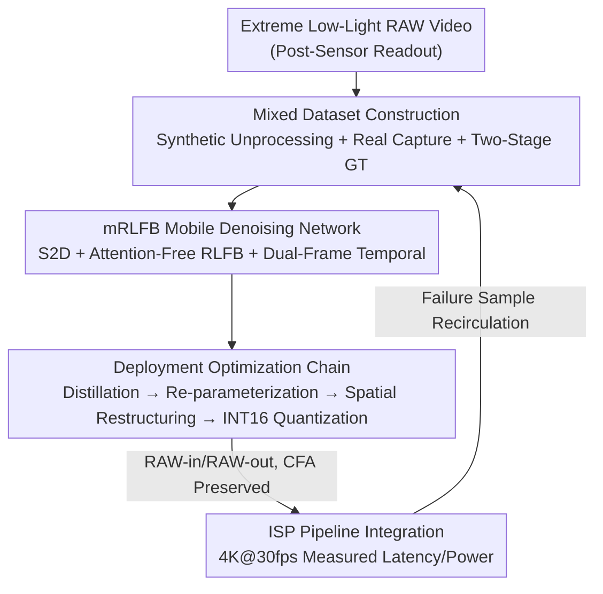

# Efficient Real-Time Raw-to-Raw Denoising for Extreme Low-Light Ultra HD Video on Mobile Devices

**Conference**: CVPR 2026  
**Paper**: [CVF Open Access](https://openaccess.thecvf.com/content/CVPR2026/html/Pochimireddy_Efficient_Real-Time_Raw-to-Raw_Denoising_for_Extreme_Low-Light_Ultra_HD_Video_CVPR_2026_paper.html)  
**Code**: None (Project page in paper, code not public)  
**Area**: Image/Video Restoration  
**Keywords**: RAW Video Denoising, Extreme Low-Light, Mobile Deployment, Structural Re-parameterization, Real-Time ISP  

## TL;DR
To address the challenge of high noise in 4K/8K videos captured by mobile phones under extreme low-light ($<1$lx) while meeting strict constraints of $<33$ms latency and $<250$mA power consumption, this Samsung paper presents an end-to-end engineering solution ranging from "Mixed Dataset Construction → Lightweight mRLFB Denoising Network → Distillation/Re-parameterization/Quantization Optimization." It develops a real-time denoiser that can be directly integrated into commercial ISP pipelines (raw-in/raw-out, preserving CFA), running at 4K@30fps on Snapdragon NPUs with PSNR comparable to heavy SOTA models but with latency and power consumption reduced by an order of magnitude.

## Background & Motivation
**Background**: Mobile night video quality has improved significantly via DNNs; however, mainstream denoising models (e.g., NAFNet, BRVE, various Transformer/Recurrent structures) prioritize restoration quality, often leading to massive computation costs and latencies ranging from hundreds of milliseconds to seconds per frame. While they perform adequately in low-light ($<10$lx), sensor readout noise increases sharply in extreme low-light ($<1$lx) scenarios, where traditional ISP denoising remains insufficient.

**Limitations of Prior Work**: Porting these heavy models to mobile devices for real-time UHD video is nearly impossible. The paper categorizes the challenges into three points: ① **Data Scarcity**: Acquiring paired "noisy-clean" raw videos with real motion in extreme low-light is difficult, and synthetic methods often fail to generalize. ② **Lack of Lightweight Models**: Most mobile-friendly structures are designed for single images (taking 0.5–1s for 8MP), not for 30/60fps real-time video. ③ **Deployment Constraints**: Simultaneously meeting $<33$ms latency and $<250$mA power consumption requires training low-complexity models and performing post-training optimization (re-parameterization, quantization), which often involves a trade-off with "learnability/detail preservation."

**Key Challenge**: The fundamental conflict between restoration quality and mobile real-time performance/power consumption—the better a model cleans extreme low-light noise, the heavier it becomes, making it harder to run on mobile NPUs. Additionally, there is an engineering constraint: many SOTA solutions aim to "replace the entire ISP" or perform "Joint Demosaicing and Denoising (JDD)," sacrificing modularity and the ability to be integrated as plug-and-play components in existing commercial camera stacks.

**Goal**: To design a **raw-in / raw-out denoising module that preserves the Bayer CFA pattern, placed after sensor readout and before demosaicing**. It must suppress extreme low-light noise without disrupting downstream ISP behavior while maintaining real-time performance on physical devices.

**Key Insight**: Instead of pursuing a "stronger model" in the academic sense, the authors optimize the data, model, and deployment as an **end-to-end engineering system**. They use mixed synthetic+real data to solve the pairing problem, control computation with a lightweight RLFB variant (mRLFB) that removes attention and adds multi-level skips, and compress latency/power via a chain of distillation, structural re-parameterization, spatial restructuring, and INT16 quantization.

## Method

### Overall Architecture
The method consists of a **four-stage serial engineering pipeline**: First, synthetic unprocessing combined with real tripod-mounted captures and two-stage GT generation is used to assemble paired training data for extreme low-light. Second, a mobile-optimized mRLFB denoising network is trained (inputting noisy raw and outputting clean raw, preserving CFA throughout). Third, a series of post-training optimizations (distillation → re-parameterization → spatial restructuring → quantization) are applied to compress the network for mobile NPUs. Finally, the module is integrated into an ISP pipeline to measure latency and power consumption at 4K@30fps on Snapdragon 8 Gen 3, with failure samples recirculated for iteration.

### Key Designs

**1. Mixed Dataset Construction: Bypassing extreme low-light pairing issues via synthesis, real captures, and two-stage GT**

In extreme low-light, capturing "noisy-clean" pairs with real motion is impossible—motion causes ghosting during multi-frame averaging, preventing clean reference generation. The authors assemble the training set from three sources. **Synthetic Data** follows an "unprocessing" reverse pipeline: taking high-quality sRGB images and sequentially applying inverse tone mapping / gamma ($\gamma=2.12$) / CCM → Bayer mosaicing → exposure attenuation (simulating $<1$lx) → inverse AWB / BLS to obtain clean pseudo-raw $B_{GT}$. ISP parameters (mean WB gains [1.81, 1, 1.89], CCM matrix) are extracted from Galaxy S25 metadata for sensor consistency. Heteroscedastic Gaussian noise is then added:

$$B_{in} = \mathcal{N}(0,\ \beta_1 B_{GT} + \beta_2)$$

where $\beta_1, \beta_2$ are shot/read noise parameters calibrated from 0lx and $<1$lx captures using grid search and perceptual verification. Synthesis involves two complementary sets: Set1 (1500 images, texture-focused, using color-blob cut-mix to simulate intensity gradients and suppress color bleed) and Set2 (1200 high-backlight images). **Real Data** utilizes tripod-mounted static raw sequences in a controlled darkroom. GT generation follows two stages: first, averaging 90 consecutive frames to zero out mean noise, then using a large 16-mRLFB model trained on synthetic data to remove residual noise. The authors acknowledge that model-generated GT introduces bias but serves as a practical compromise for this ill-posed problem. **Synthetic Motion** is added to static pairs using a movement dictionary to ensure frame-to-frame alignment for temporal evaluation. Training begins with synthetic pre-training followed by real static data fine-tuning.

**2. mRLFB Mobile Architecture: Removing attention and using S2D with dual-frame input for real-time performance**

For UHD video, feature map resolution dictates computational cost. The network starts with a $k\times k$ Space-to-Depth (S2D) operation, reducing spatial resolution by $k$ and increasing channels by $k^2$ while preserving color channel relationships. Core processing occurs on this low-resolution feature map using $N=4$ **mRLFB (mobile-optimized Residual Local Feature Blocks)** derived from RLFN. The key change is **removing attention modules** to save global pooling/upsampling overhead. Each mRLFB consists of three $3\times 3$ convolutions (ReLU) followed by a $1\times 1$ convolution with residual connections:

$$F_{out} = F_{in} + W_1 * \big(F_{in} + \sigma(W_3 * \sigma(W_2 * \sigma(W_1 * F_{in})))\big)$$

$W_i$ denotes convolution kernels and $\sigma$ denotes ReLU. Deep features are aggregated via $3\times 3$ convolutions, concatenated with shallow features, and passed through a $1\times 1$ convolution to preserve high-frequency details. For **Temporal** consistency, the first layer is modified to accept **S2D outputs of both the current and previous frames** (32-channel input). This dual-frame approach balances temporal stability and latency, with metrics outperforming single-frame models.

**3. Deployment Optimization Chain: Distillation → Re-parameterization → Spatial Restructuring → INT16 Quantization**

Lightweight structure alone is insufficient for real-time performance. Four post-training steps are applied. **Step 1: Knowledge Distillation**: A high-capacity teacher T (Model A, $N=4, k=4, d=32$) is distilled into a compact student S (Model B, $d=16$) using joint output space and intermediate feature guidance: $L_{KD} = \|T(y)-S(y)\|_1 + \beta\|\phi(T)-\phi(S)\|_2^2$. **Step 2: Structural Re-parameterization**: Multi-branch blocks are used during training (1x1+skip for local feature distillation, followed by 3x3 and 1x1) and merged into a **single 3x3 convolution** during inference. This is mathematically equivalent but eliminates skip-connection memory overhead and runtime. **Step 3: Spatial Restructuring**: During inference, feature map width is halved while channel depth is doubled via weight re-arrangement. This is done only at inference (not training) to avoid directional bias while exploiting NPU hardware characteristics. **Step 4: INT16 Quantization**: Per-channel symmetric weight and per-tensor activation INT16 quantization are applied. Quantization-aware fine-tuning is performed if quality drops exceed thresholds. I/O remains 10/12-bit integer Bayer, while internal INT16 accumulators are promoted to INT32 as needed.

### Loss & Training
The base loss is a compound of raw fidelity and color consistency. **Raw Reconstruction Loss** uses L1: $L_{raw} = \frac{1}{M}\sum\|B_{GT}-B_{pred}\|$. **Chromatic Loss** suppresses cross-channel misalignment: using the mean green channel $G_{avg}=\frac{1}{2}(G_1+G_2)$ as reference, it calculates the L1 difference between $D_{BG}=B-G_{avg}$ and $D_{RG}=R-G_{avg}$ for predictions: $L_{chromatic}=\frac{1}{M}\sum(\|D_{BG}-\hat{D}_{BG}\|_1+\|D_{RG}-\hat{D}_{RG}\|_1)$. Total loss: $L = w_r L_{raw} + w_c L_{chromatic}$, with $w_r=0.6, w_c=0.4$. Training: batch size 16, 256×256 packed-RAW patches, Adam with cosine annealing, initial lr $1\times10^{-4}$ on NVIDIA A100.

## Key Experimental Results

### Main Results
Testing was performed on a Galaxy S25 Plus (Snapdragon 8 Gen 3 Elite) with INT16 quantization and Monsoon HV power monitoring. Note: extreme low-light raw pixel intensities are very small, leading to low MSE and unusually high PSNR (55–60dB); this should not be compared directly with datasets like CRVD/SRVD (30–45dB).

Comparison with SOTA (real-world static + synthetic pre-train → real fine-tune, Table 2):

| Method | PSNR↑(Real) | SSIM↑(Real) | Runtime(ms)↓ | Current(mA)↓ |
|------|-------------|-------------|--------------|--------------|
| NAFNet | 59.09 | 0.9838 | 375 | 12187 |
| BRVE | 59.55 | 0.9993 | 4806.3 | 156204 |
| SplitterNet | 53.83 | 0.9735 | 16.97 | 551 |
| **Ours: Model A\*** | **60.18** | 0.9883 | 22.95 | 565 |
| **Ours: Model B\*** | — | — | **19.30** | **475** |

Key points: Model A* outperforms NAFNet/BRVE in PSNR while reducing latency from hundreds/thousands of ms to ~20ms and current from >10,000mA to hundreds of mA. SplitterNet, the only comparable lightweight baseline, has a PSNR over 6dB lower.

### Ablation Study
Impact of deployment optimizations on latency/power (multi-frame model, Table 5):

| Configuration | Runtime(ms)↓ | Current(mA)↓ | PSNR↑ | SSIM↑ |
|------|--------------|--------------|-------|-------|
| Model A | 25.32 | 621 | 60.54 | 0.9886 |
| Model A (restructured) | 43.54 | 1405 | 60.54 | 0.9886 |
| Model AQ (Quantized) | 17.94 | 366 | 57.46 | 0.9992 |
| Model B (Distilled) | 20.53 | 503 | 58.63 | 0.9880 |
| Model B (Restructured) | 12.96 | 419 | 58.63 | 0.9880 |
| Model BRQ (Restruc.+Quant.) | 12.91 | 244 | 57.17 | 0.9986 |

Synthetic data ablation (Table 1): Set1 (56.97) / Set2 (56.53) / Set1+Set2 (58.05) / Pure Real (60.18) / Synthetic Pre-train + Real Fine-tune (**60.54** dB). Temporal ablation (Table 4): Multi-frame Model A achieved better tOF (0.55), tLP (0.70), flicker (0.78), and VMAF (70.43) than the single-frame version.

### Key Findings
- **Restructuring specifically benefits small models**: For Model B, restructuring reduced runtime by 37% and power by 16% due to NPU parallelism. However, for Model A, it pushed intermediate channels to 64, exceeding the NPU's efficiency zone and causing performance to plummet—highlighting that this optimization is tightly coupled with hardware limits.
- **Distillation provides high ROI**: Moving from Model A to B reduced runtime and power by ~20% with manageable quality loss.
- **Transfer learning is most effective**: Synthetic pre-training followed by real fine-tuning yielded the highest PSNR (60.54), proving the value of combined texture/brightness diversity.
- **Multi-frame benefits without overhead**: The dual-frame input significantly improved temporal metrics without exceeding mobile constraints or sacrificing single-frame PSNR.

## Highlights & Insights
- **Deployment as a first-class citizen**: Rare end-to-end throughput from data to on-device measurement. Primarily targeted at practical industrial deployment rather than just chasing academic metrics.
- **"Plug-and-play" raw-to-raw design**: Positioning the module after sensor readout ensures modularity. It enhances existing commercial camera stacks without requiring the replacement of the entire ISP or demosaicing algorithm.
- **Attention-free + Re-parameterization**: The use of multi-branch blocks during training to preserve expressivity while merging them into 3x3 convolutions for inference provides a reusable paradigm for NPU-friendly design.
- **Hardware-aware engineering**: Exploiting the NPU characteristic where different feature map shapes have equivalent latency (spatial restructuring) is a highly practical engineering trick.

## Limitations & Future Work
- **Lack of Real-Motion GT**: Accurate "clean" references for real motion at $<1$lx remain unattainable. Temporal evaluation relies on synthetic dictionaries and subjective video quality rather than quantitative real-world motion metrics.
- **Non-comparable PSNR values**: The 55–60dB range in extreme low-light raw (due to small pixel values) can be misleading. Readers should prioritize SSIM/VMAF and temporal stability.
- **Model-generated GT**: Using a large model to clean tripod-averaged sequences locks the performance ceiling to the teacher model's bias.
- **Hardware/Sensor dependency**: ISP parameters are tied to the Galaxy S25, and optimizations are hardware-specific (Snapdragon Hexagon). Generalization to other platforms is not fully verified.

## Related Work & Insights
- **vs NAFNet / BRVE (Heavy SOTA)**: While they offer slightly better/comparable quality, their runtime and power consumption make mobile deployment impossible. This work achieves similar quality with 100x lower latency/power.
- **vs SplitterNet (Lightweight Baseline)**: While similar in speed, SplitterNet suffers from significantly lower PSNR (>6dB) and poor temporal stability, proving that extreme light denoising requires more than just a small model—it requires a system.
- **vs JDD / Full ISP Replacement**: Unlike joint demosaicing/denoising, this raw-in/raw-out approach favors compatibility and modularity in industrial pipelines.

## Rating
- **Novelty**: ⭐⭐⭐⭐ Components are known; the systematic integration and end-to-end real-time deployment for extreme low-light video are the primary innovations.
- **Experimental Thoroughness**: ⭐⭐⭐⭐ Strong combination of real/synthetic data and on-device testing. Only missing quantitative real-motion GT.
- **Writing Quality**: ⭐⭐⭐⭐ Transparent about GT generation and PSNR scaling issues.
- **Value**: ⭐⭐⭐⭐⭐ High industrial reference value for mobile night video features.

<!-- RELATED:START -->

## Related Papers

- [\[CVPR 2026\] RawMetaDiff: Unlocking Extreme Darkness from Dual-Exposure RAW with Meta-Guided Diffusion](rawmetadiff_unlocking_extreme_darkness_from_dual-exposure_raw_with_meta-guided_d.md)
- [\[CVPR 2026\] NEC-Diff: Noise-Robust Event–RAW Complementary Diffusion for Seeing Motion in Extreme Darkness](nec-diff_noise-robust_event-raw_complementary_diffusion_for_seeing_motion_in_ext.md)
- [\[CVPR 2026\] Edit-aware RAW Reconstruction](edit-aware_raw_reconstruction.md)
- [\[CVPR 2026\] 2-Shots in the Dark: Low-Light Denoising with Minimal Data Acquisition](2-shots_in_the_dark_low-light_denoising_with_minimal_data_acquisition.md)
- [\[CVPR 2026\] Real-Time Neural Video Compression with Unified Intra and Inter Coding](real-time_neural_video_compression_with_unified_intra_and_inter_coding.md)

<!-- RELATED:END -->
