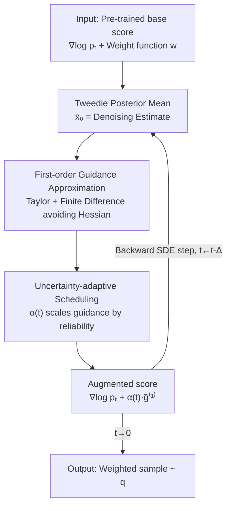

# Efficient Weighted Sampling via Score-based Generative Models

**Conference**: CVPR 2026  
**Paper**: [CVF Open Access](https://openaccess.thecvf.com/content/CVPR2026/html/Kim_Efficient_Weighted_Sampling_via_Score-based_Generative_Models_CVPR_2026_paper.html)  
**Code**: https://github.com/Heasung-Kim/efficient-weighted-sampling-via-score-based-generative-models  
**Area**: Diffusion Models / Image Generation  
**Keywords**: Weighted sampling, score-based generative models, training-free guidance, uncertainty-adaptive scheduling, diffusion sampling acceleration

## TL;DR
To address the requirement of "sampling from weighted distributions such as $w(x)p(x)$," this paper proposes LAGS: a first-order guidance approximation **without second-order derivatives or Hessians** added to the score of a pre-trained diffusion model, combined with a **single-parameter time scheduler** derived from error theory to dynamically adjust guidance strength. Achieving a completely training-free approach, it is 1.2–4.7× faster than SOTA resampling methods on SDXL while achieving higher PickScore.

## Background & Motivation
**Background**: Weighted sampling refers to sampling from $q(x) \propto w(x)p(x)$—re-weighting a base distribution $p$ with a weight function $w$ before sampling. This is ubiquitous in scenarios such as variance reduction, data augmentation, reward/preference alignment, and fairness correction. Current mainstream approaches leverage pre-trained score-based generative models (SGMs) using **guidance** techniques: instead of retraining the model, a correction term is added to the base score $\nabla_x\log p_t(x)$ during inference to approximate the score of the target distribution $q$.

**Limitations of Prior Work**: Existing guidance methods have limited accuracy in approximating the score of $q$, often leading to degraded sample quality or unstable generation dynamics. To remedy this, SOTA methods have turned to two types of "expensive" inference-time mechanisms: **time-travel resampling** (e.g., FreeDoM, which repeatedly rolls back and resamples intermediate latents) and **particle resampling** (e.g., DAS, which maintains a batch of candidate particles for Sequential Monte Carlo with adaptive re-weighting). While they improve quality, they either require repeated score evaluations or maintenance of numerous particles, leading to **surging GPU memory and computational overhead**, making them practically unusable for large models (e.g., SDXL) or latency-sensitive scenarios.

**Key Challenge**: A trade-off exists between accuracy and efficiency—accurate approximation requires calculating the **second-order derivative (Hessian)** of the score/weight or repeated resampling, both of which are costly. Conversely, simple guidance methods are unstable or inaccurate. The root of the problem is twofold: (i) how to obtain a sufficiently accurate guidance term **without calculating the Hessian**, and (ii) guidance reliability varies across different timesteps of reverse diffusion (approximation error is high when noise is high in early stages), yet existing methods apply fixed strength or manual heuristics.

**Goal**: To decompose the problem into two sub-problems: ① deriving a computationally lightweight guidance approximation that avoids second-order derivatives; ② providing a theoretically grounded scheduler that dynamically adjusts guidance strength over time.

**Key Insight**: By utilizing the Tweedie posterior mean + first-order Taylor expansion + finite differences, the guidance term is compressed into a lightweight approximation requiring only "one extra score forward pass + one $w$ backpropagation." This is combined with a **single-parameter time scheduling function** $\alpha(t)$ derived from error bound theory to suppress unreliable early guidance—forming the training-free LAGS.

## Method

### Overall Architecture
The goal of LAGS is to approximate the score function of the target weighted distribution $q_t$ without fine-tuning the pre-trained SGM. The starting point is a clean decomposition (Eq. 5):

$$\nabla_x \log q_t(x) = \nabla_x \log p_t(x) + g(x,t)$$

where $\nabla_x\log p_t(x)$ is the available pre-trained base score, and $g(x,t)$ is the **guidance term** required to steer the base score toward the target distribution. The paper proves that this guidance term has an exact form $g(x,t) = \nabla_x \log \mathbb{E}_{X_0^p \sim p(\cdot|X_t^p=x)}[w(X_0^p)]$ (Eq. 9), representing the "log-gradient of the conditional expectation of weight $w$ on the denoised initial state given the current noisy state $x$." Since this expectation is generally intractable, LAGS approximates it as $\tilde g(x,t)$ in two steps and integrates it into the reverse SDE for step-by-step sampling.

The runtime pipeline is as follows: at each reverse diffusion step, the denoised posterior mean $\bar x_{0|x,t}$ is estimated from the current noisy sample using the Tweedie formula. A first-order guidance approximation $\tilde g^{(1)}$ (avoiding the Hessian) is calculated based on this estimate. Then, the scheduler $\alpha(t)$ scales the guidance strength according to the reliability of the current timestep. The augmented score is used to take one step in the backward SDE, repeating until $t=0$ to produce the sample.

### Key Designs

**1. First-order Guidance Approximation: Using Tweedie + Taylor + Finite Difference to bypass the Hessian**

The conditional expectation in the exact guidance term $g(x,t)=\nabla_x\log\mathbb{E}[w(X_0^p)\mid X_t^p=x]$ is intractable. Direct brute-force approximation would involve the Hessian of both the score and the weight—calculating second-order derivatives for high-capacity score networks like SDXL is practically infeasible. LAGS solves this with a three-step approach: first, it performs a **first-order Taylor expansion** of $w(X_0^p)$ at its conditional mean $\bar x_{0|x,t}:=\mathbb{E}[X_0^p\mid X_t^p=x]$, approximating the $w$ inside the expectation as $w(\bar x_{0|x,t})$, thus $g(x,t)\approx \nabla_x\log w(\bar x_{0|x,t})$ (Eq. 10). The conditional mean is provided directly by the **Tweedie formula**, which is a linear combination of $x$ and the base score:

$$\bar x_{0|x,t} = \tfrac{1}{\sqrt{\bar\alpha(t)}}\big(x + (1-\bar\alpha(t))\,\nabla_x\log p_t(x)\big)$$

Expanding this with the chain rule reveals the Hessian of the base density $H_{\log p_t}(x)$ (Eq. 11), the primary computational bottleneck. LAGS replaces the Hessian-vector product with a **directional derivative via finite difference**: taking a small $\epsilon>0$, it uses:

$$\nabla_x\log p_t\big(x+\epsilon\,\nabla_{\bar x_{0}}\log w(\bar x_{0|x,t})\big) - \nabla_x\log p_t(x)$$

to approximate $\epsilon\,H_{\log p_t}(x)\,v$. The resulting first-order approximation $\tilde g^{(1)}(x,t)$ (Eq. 13) **contains no second-order derivatives of $p$ or $w$**. The cost is only one additional backpropagation of $w$ (to compute $\nabla\log w$) and one extra score forward pass (to compute $\nabla_x\log p_t$ at the perturbed point)—significantly cheaper than computing the Hessian or maintaining particle groups, which is the primary reason LAGS runs efficiently on large models.

**2. Uncertainty-Adaptive Scheduling: Deriving a single-parameter time scheduler α(t) from error bounds**

The first-order approximation is not equally accurate at all times. Theorem 1 proves that the approximation error $\|g(x,t)-\tilde g^{(1)}(x,t)\|$ has an upper bound $u(x,t)$, whose dominant term is proportional to $(1-\bar\alpha(t))$ and the conditional variance of the denoised posterior $\mathbb{E}[\|X_0^p-\bar x_{0|x,t}\|^2\mid X_t^p=x]$. The intuition is: in the **early stages** of reverse sampling ($t$ is large, noise is heavy, $\bar\alpha(t)$ is small, conditional variance is high), the error is large and guidance is unreliable. As $t\to0$, variance diminishes and the error vanishes, making guidance highly reliable. This explains why prior methods required resampling or manual strength "patches" in the early stages.

Instead of patches, LAGS introduces a time scheduling function $\alpha(t):[0,T]\to[0,1]$ to scale the guidance: $\nabla_x\log q_t(x)\approx \nabla_x\log p_t(x)+\alpha(t)\,\tilde g^{(1)}(x,t)$, and selects $\alpha(t)$ to minimize the mean squared error of the score approximation (Eq. 15). Using the variance upper bound from Theorem 1 (which can be written as a sum of $(1-\bar\alpha)^i/\bar\alpha^j$ terms under VP-SDE), Proposition 1 provides a closed-form upper-envelope solution for the optimal $\alpha^*(t)$, which is simplified into a practical form with **only one tunable constant $c$**:

$$\alpha^*(t) \approx \Big(1 + c\,\tfrac{(1-\bar\alpha(t))^2}{\bar\alpha(t)^2}\Big)^{-1}$$

This function increases monotonically along the reverse sampling direction (near 0 at early stages and approaching 1 as $t\to0$), automatically achieving the behavior of "trusting guidance less early and fully late." Combining Eq. 13 with this schedule, the final augmented score has only two hyperparameters, $\epsilon$ and $c$ (Eq. 17):

$$\tilde g(x,t) = \frac{\bar\alpha(t)^2}{\bar\alpha(t)^2 + c\,(1-\bar\alpha(t))^2}\,\tilde g^{(1)}(x,t)$$

Compared to heuristics like the "guidance learning rate" in FreeDoM or tempering in DAS, this scheduler is derived from uncertainty analysis. The single parameter enables generalization across tasks and models. (The paper also provides a degenerate 0/1 hard-gating scheduler when certain simplifying assumptions are removed; see Appendix B.2 for details).

### Loss & Training
LAGS is entirely **training-free**: it neither trains nor fine-tunes any models, instead modifying the score during inference. The process uses only two preset hyperparameters—the finite difference step size $\epsilon$ and the confidence constant $c$ (fixed at $c=10$ across all experiments and robust for $0.1\le c\le 20$). Compared to methods requiring retraining or fine-tuning for each $w$, it eliminates all task-specific training costs.

## Key Experimental Results

### Main Results
Evaluation covers three areas: 2D multi-modal synthetic distributions, human preference alignment in SD/SDXL text-to-image generation, and applications like fairness and frequency domain control. Overall conclusion: LAGS achieves either the lowest Wasserstein distance (WD) or the highest average weight across all settings while being the fastest.

**2D Multi-modal Weighted Sampling** (base: mixture of 25 Gaussians; target weight along a heart-shaped manifold): LAGS achieves both the **lowest WD and the fastest runtime**, generating $10^4$ samples in just **0.33 seconds** without second-order derivatives or resampling. FreeDoM has wide coverage but often samples outside the target support (where $q(x)\approx0$), while DAS has high precision but high computational cost. LAGS balances high coverage and precision.

**SDXL Text-to-Image (PickScore Alignment) Runtime and No-reference Image Quality** (Runtime normalized to LAGS=1.0, lower is better; bold denotes the best among guidance methods):

| Method | Relative Runtime ↓ | BRISQUE ↓ | MANIQA ↑ |
|--------|---------------------|-----------|----------|
| SDXL (default) | 0.377 | 21.48 ± 12.45 | 0.733 ± 0.139 |
| DPS | 1.193 | 24.52 ± 13.03 | 0.720 ± 0.139 |
| FreeDoM | 1.930 | 34.49 ± 15.20 | 0.711 ± 0.144 |
| DAS | 4.722 | **19.55 ± 12.75** | 0.720 ± 0.145 |
| DAS-1P | 1.202 | 22.56 ± 11.97 | 0.728 ± 0.130 |
| **Ours (LAGS)** | **1.000** | 26.40 ± 12.99 | 0.720 ± 0.134 |

In target metrics PickScore and HPS, LAGS is the best and fastest on SD/SDXL. While DAS has the best image quality (BRISQUE), it takes **4.72×** longer. LAGS has a negligible quality gap but is significantly faster. Single image sampling on SDXL takes ~85 seconds for LAGS; DAS requires ~4.72× that time.

### Ablation Study
**Speedup and Cross-metric Performance** (Comparison of guidance baselines):

| Setting / Configuration | Key Result | Description |
|-------------------------|------------|-------------|
| High-dim Speedup (vs SOTA) | Up to **4.7× Speedup** | Overall acceleration relative to previous SOTA in high-dim settings |
| SDXL vs DAS | **4.7× Faster** | Resampling overhead scales with model size |
| SDXL vs FreeDoM | **1.9× Faster** | Time-travel resampling is costly |
| SD vs DAS-1p/DPS | 6% Faster | Smaller speedup on smaller models |
| SDXL vs DAS-1p/DPS | 16.7% Faster | Larger models yield higher gains from avoiding Hessians |
| PickScore / HPS | Highest among guidance | Broad lead in target alignment metrics |
| ImageReward / CLIP (SDXL) | Slightly behind DAS | Minor gap (<0.1 / <0.06) but LAGS is much faster |
| $c$ value $0.1\sim20$ | Stable Performance | Scheduler is robust to constant $c$; fixed at $c=10$ |

### Key Findings
- **Breaking the "High Score ↔ High Compute" Trade-off**: Existing baselines usually choose between being accurate or fast. LAGS achieves higher PickScore while maintaining the lowest runtime, a primary selling point.
- **Benefits of Avoiding Hessians Scale with Model Size**: Speedup is only 6% on SD but 16.7% on SDXL—the larger the model, the more expensive the Hessian, making LAGS increasingly advantageous and scalable.
- **Scheduler Insensitivity to $c$**: Fixing $c=10$ outperformed others across models/tasks. Performance is stable for $0.1\le c\le20$, requiring almost no tuning.
- **Image Quality Trade-off**: DAS is superior in BRISQUE, while LAGS is superior in target alignment. The quality gap is within the typical fluctuation of guidance methods, but LAGS is 4.7× faster.

## Highlights & Insights
- **Reformulating guidance as an approximation problem with error bounds**, then deriving the scheduler from the bound—this logic ensures the scheduling strength is "grown" from theory rather than manually tuned, an approach transferable to any training-free guidance method (e.g., inverse problems, reward alignment).
- **Replacing Hessian-vector products with finite differences** is a highly practical engineering insight: obtaining second-order directional information with just one extra score forward pass. This is universal for all large diffusion models.
- **Tweedie Posterior Mean + First-order Taylor** reduces intractable conditional expectations to "calculating $\nabla\log w$ at the denoising estimate point," allowing any differentiable weight $w$ (preference scores, classifiers, frequency/color operators) to be plug-and-play.

## Limitations & Future Work
- The first-order Taylor approximation might be inaccurate when the weight $w$ is highly non-linear or the target distribution is extremely sharp; these worst cases are not discussed in detail.
- The theory relies on several assumptions ($w$ and its derivatives are bounded, $p_0$ has compact support, VP-SDE, and Assumption 3 regarding orthogonality/uncorrelation). Assumption 3 was introduced for tractability; removing it leads to a 0/1 hard-gated scheduler, with fewer results provided for this case.
- Experiments compare fairly within the training-free guidance category; comparisons with stronger (but more expensive) alignment routes like text-embedding manipulation, fine-tuning, or LLMs are not explored. Thus, "optimal" is defined within the training-free context.
- Image quality metrics (e.g., BRISQUE) are not optimal, suggesting room for adjustment between target score pursuit and perceptual quality maintenance; quality terms could potentially be integrated into $w$.

## Related Work & Insights
- **vs FreeDoM**: FreeDoM uses time-travel resampling to stabilize early reverse SDEs. Ours uses the theoretically derived $\alpha(t)$ scheduler to directly suppress unreliable early guidance—addressing the same instability but without resampling, making it ~1.9× faster on SDXL.
- **vs DAS**: DAS uses Sequential Monte Carlo with a particle batch for adaptive re-weighting, providing high precision at the cost of memory/compute scaling with particle count. LAGS is single-trajectory and resampling-free, being 4.7× faster on SDXL with higher target scores.
- **vs DPS**: DPS was originally designed for inverse problems and uses denoised mean estimators to adapt to weighted sampling but lacks temporal modeling of guidance reliability. LAGS adds Hessian-free first-order approximation and scheduling to the Tweedie mean framework, improving accuracy and stability.

## Rating
- Novelty: ⭐⭐⭐⭐ Translates weighted sampling guidance into a first-order approximation with error bounds + theory-driven single-parameter scheduling.
- Experimental Thoroughness: ⭐⭐⭐⭐ Covers 2D synthesis to SDXL with multiple metrics and speedup ratios, though some comparisons are relegated to the appendix.
- Writing Quality: ⭐⭐⭐⭐ Rigorous theoretical derivation and clear motivation, though dense formulas require careful reading.
- Value: ⭐⭐⭐⭐ Training-free, plug-and-play, and provides significant acceleration for large models, offering high practical value.

<!-- RELATED:START -->

## Related Papers

- [\[CVPR 2026\] Memory-Efficient Fine-Tuning Diffusion Transformers via Dynamic Patch Sampling and Block Skipping](memory-efficient_fine-tuning_diffusion_transformers_via_dynamic_patch_sampling_a.md)
- [\[CVPR 2026\] Smoothing the Score Function to Enhance Generalization in Diffusion Models](smoothing_the_score_function_to_enhance_generalization_in_diffusion_models.md)
- [\[CVPR 2026\] Bias at the End of the Score: Demographic Biases in Reward Models for T2I](bias_reward_models_t2i.md)
- [\[CVPR 2026\] Adaptive Spectral Feature Forecasting for Diffusion Sampling Acceleration](adaptive_spectral_feature_forecasting_for_diffusion_sampling_acceleration.md)
- [\[CVPR 2026\] Few-Step Diffusion Sampling Through Instance-Aware Discretizations](few-step_diffusion_sampling_through_instance-aware_discretizations.md)

<!-- RELATED:END -->
