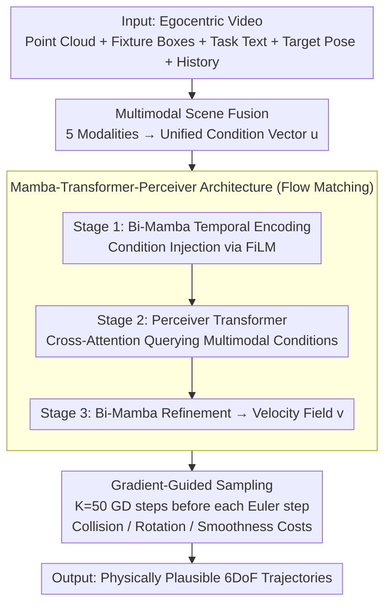

# EgoFlow: Gradient-Guided Flow Matching for Egocentric 6DoF Object Motion Generation

**Conference**: CVPR 2026  
**arXiv**: [2604.01421](https://arxiv.org/abs/2604.01421)  
**Code**: [https://abhi-rf.github.io/egoflow/](https://abhi-rf.github.io/egoflow/)  
**Area**: Image Generation  
**Keywords**: Egocentric Video, 6DoF Trajectory Generation, Flow Matching, Gradient-Guided Sampling, Mamba-Transformer Hybrid Architecture

## TL;DR
EgoFlow proposes a generative framework based on Flow Matching that utilizes a Mamba-Transformer-Perceiver hybrid architecture to fuse multimodal scene conditions. During inference, it employs gradient-guided sampling to impose differentiable physical constraints (collision avoidance, motion smoothness), generating physically plausible 6DoF object motion trajectories from egocentric videos, with a collision rate reduction of up to 79%.

## Background & Motivation

1. **Background**: With the popularization of AR devices and the emergence of large-scale egocentric datasets (EgoExo4D, HOT3D, HD-EPIC), understanding and predicting object motion from a first-person perspective has become a core capability for embodied perception and robotic interaction. Existing methods primarily rely on diffusion models or autoregressive prediction to generate object trajectories.

2. **Limitations of Prior Work**:
    - Egocentric scenes are highly diverse and cluttered; objects are frequently occluded, fields of view are limited, and rapid camera movements lead to motion blur.
    - Capturing long-term predictions suffers from small spatial errors that accumulate over time, resulting in unrealistic motion patterns.
    - Existing generative models lack explicit physical reasoning capabilities, failing to guarantee collision-free and dynamically smooth trajectories.

3. **Key Challenge**: Generative models must simultaneously satisfy two seemingly contradictory requirements: motion diversity (learning rich motion distributions) and physical consistency (collision avoidance, motion smoothness). Purely data-driven methods cannot explicitly reason about physical constraints in novel scene configurations.

4. **Goal**:
    - How to generate long-term, physically plausible 6DoF object trajectories?
    - How to ensure collision avoidance and motion smoothness without physical supervision during training?
    - How to effectively fuse multimodal conditions including scene geometry, semantics, and targets?

5. **Key Insight**: Use Flow Matching instead of diffusion models to learn deterministic transport fields for efficient trajectory synthesis, and employ gradient-guided sampling at inference time to inject physical constraints (decoupling training and testing). A hybrid Mamba + Transformer + Perceiver architecture is utilized to handle long-sequence multimodal fusion.

6. **Core Idea**: The combination of Flow Matching for learning motion distributions and gradient guidance for physical constraints achieves an elegant decoupling where the "model learns the data distribution, while constraints are injected on-demand during inference."

## Method

### Overall Architecture
EgoFlow addresses the problem of predicting how an object will move next from an egocentric video, ensuring trajectories are reasonable, collision-free, and smooth. First, all available scene information (point clouds, fixture bounding boxes, task text, target pose) is fed into a multimodal fusion module to produce a unified condition vector $\mathbf{u}$. A Flow Matching model with a Mamba-Transformer hybrid architecture then generates the 6DoF trajectory $\mathbf{x}_{H+1:T} \in \mathbb{R}^{(T-H) \times 9}$ (position $\mathbb{R}^3$ + continuous 6D rotation $\mathbb{R}^6$) from noise conditioned on $\mathbf{u}$. Finally, during each integration step of inference, gradient guidance steers the velocity field toward collision-free and smoother states. During training, the model observes the first 30% of the trajectory to predict the remaining 70%.

### Key Designs

**1. Multimodal Scenario Fusion: A single modality cannot fully describe cluttered egocentric scenes.**

The difficulty of egocentric scenes is that observing the trajectory alone is insufficient—geometry dictates collisions, semantics suggest typical movements, and the target defines the destination. EgoFlow fuses five modalities into a single condition vector. Trajectory dynamics linearize the history $\mathbf{x}_{1:H}$ into temporal embeddings $\mathbf{F}_{traj}$. Local geometry uses PointNet++ to encode point clouds, propagating features to the object center via inverse distance weighting. Fixture layouts embed bounding box geometry followed by self-attention to capture spatial relations like "counter is above the cabinet." Semantic prompts use CLIP to encode object categories and task descriptions. Target descriptions map the target pose $\mathbf{x}_T$ to a target token via an MLP. These features are concatenated and projected:

$$\mathbf{u} = \text{MLP}([\mathbf{F}_{traj}, \mathbf{F}_p, \mathbf{F}_g, \mathbf{F}_b, \mathbf{F}_s, \mathbf{F}_{goal}])$$

**2. Mamba-Transformer-Perceiver Architecture: Differing requirements for long sequences and multimodal reasoning.**

Trajectory sequences are long, making the quadratic complexity of pure Transformers prohibitive, while multimodal fusion requires the "query-on-demand" capability of attention. EgoFlow stacks components in stages: Stage 1 uses 3 layers of bidirectional Mamba for temporal encoding with FiLM modulation:

$$\mathbf{h}_t' = \gamma(\mathbf{u}_t) \odot \mathbf{h}_t + \beta(\mathbf{u}_t)$$

Stage 2 employs 6 layers of Perceiver-style Transformer: self-attention models temporal relations between trajectory tokens, while cross-attention queries multimodal conditions $\mathbf{u}_t$. Stage 3 adds 3 more bidirectional Mamba + FiLM layers for refinement before a linear head outputs the $\mathbb{R}^9$ velocity prediction.

**3. Gradient-Guided Sampling: Moving physical constraints from training to inference.**

Data-driven models only see collision-free demonstrations during training and fail to reason about obstacles in new configurations. EgoFlow decouples "learning the distribution" from "satisfying constraints." The model learns the distribution, while constraints are applied during inference. Before each Euler integration step, $K=50$ steps of gradient descent are performed on the predicted velocity field:

$$\mathbf{v}_\theta^{(k+1)} = \mathbf{v}_\theta^{(k)} - \alpha \nabla_\mathbf{v} \mathcal{J}, \quad \mathcal{J} = \mathcal{J}_{coll} + \lambda_{rot}\mathcal{J}_{rot} + \lambda_{vel}\mathcal{J}_{vel}$$

The costs address collision avoidance (using SDF to penalize distances within a safety margin $\epsilon=5$cm), rotation consistency (cosine similarity of adjacent rotations), and translation smoothness (penalizing linear acceleration). Since constraints are not in the training loop, the model adapts to dynamic scene configurations without retraining.

### Loss & Training
- Flow Matching Loss: $\mathcal{L}_{FM} = \mathbb{E}_{t, \mathbf{x}_0, \mathbf{x}_1}[\|\mathbf{v}_\theta(\mathbf{x}_t, t, \mathcal{S}) - (\mathbf{x}_1 - \mathbf{x}_0)\|_1]$
- Linear Interpolation Path: $\mathbf{x}_t = (1-t)\mathbf{x}_0 + t\mathbf{x}_1$
- Equal-weight L1 loss for position and rotation components.
- AdamW, lr=$10^{-4}$, batch 32, 100 epochs, 20-step Euler sampling.

## Key Experimental Results

### Main Results — HD-EPIC Dataset

| Method | ADE↓ | FDE↓ | Frechet↓ | Geodesic↓ | Collision↓ |
|------|------|------|----------|-----------|------------|
| GIMO | 0.285 | 0.509 | 0.210 | **0.725** | 23.5% |
| CHOIS | 0.471 | 0.755 | 0.262 | 1.255 | 18.7% |
| M2Diffuser | 0.601 | 0.442 | 0.476 | 1.788 | 8.5% |
| EgoScaler | 1.330 | 1.494 | 0.315 | 1.614 | 35.8% |
| **Ours** | **0.279** | **0.102** | **0.197** | 1.141 | **2.5%** |

### Zero-shot Transfer — Ego-Exo4D→HOT3D

| Method | ADE↓ | FDE↓ | GD↓ |
|------|------|------|-----|
| GIMO | 0.299 | 0.436 | 2.06 |
| EgoScaler | 0.351 | 0.540 | **0.856** |
| **Ours** | **0.265** | **0.027** | 1.49 |

### Ablation Study — HD-EPIC Inputs and Guidance

| Configuration | ADE↓ | FDE↓ | Frechet↓ | Coll.↓ |
|------|------|------|----------|--------|
| Full model | 0.279 | 0.102 | 0.197 | 2.5% |
| w/o Point cloud $\mathcal{P}$ | 0.305 | 0.110 | 0.205 | 2.9% |
| w/o Action text | 0.330 | 0.147 | 0.213 | 3.1% |
| w/o Target pose $\mathbf{x}_T$ | 0.386 | 0.619 | 0.239 | 3.1% |
| w/o History | 0.405 | 0.207 | 0.275 | - |

### Key Findings
- **Major Reduction in Collision Rate**: EgoFlow achieves only 2.5%, a 71% reduction compared to the next best M2Diffuser (8.5%) and 89% lower than GIMO (23.5%). Gradient-guided sampling is the primary factor.
- **Extremely Low Final Displacement Error**: FDE of 0.102 (HD-EPIC) and 0.027 (HOT3D) significantly outperforms all baselines, with target pose $\mathbf{x}_T$ contributing most to this accuracy.
- **Superior Cross-Dataset Generalization**: It maintains a lead even when trained on Ego-Exo4D and tested zero-shot on HOT3D.
- **Target Pose as Critical Condition**: Removing $\mathbf{x}_T$ causes the most severe degradation in FDE (6x).

## Highlights & Insights
- **Training-Inference Decoupling**: The model is trained on collision-free demonstrations to learn motion distributions, while physical constraints are injected via gradient guidance during inference. This avoids the distribution mismatch where models never learn how to "avoid" if they only see success.
- **Thoughtful Hybrid Architecture**: Using FiLM for global modulation and cross-attention for selective fusion allows the model to benefit from the efficiency of the former and the precision of the latter.
- **Flow Matching vs. Diffusion**: Deterministic transport fields are better suited for trajectory generation than stochastic diffusion, providing smoother paths and requiring fewer steps (20 steps) for coherent trajectories.

## Limitations & Future Work
- Gradient-guided optimization (50 steps) increases inference latency; more efficient injection methods like classifier-free guidance could be explored.
- SDF collision detection relies on simple Oriented Bounding Boxes (OBB); complex geometries might require more precise collision meshes.
- Training data trajectories are derived from hand-motion proxies, introducing noise and approximation errors.
- Dynamic obstacles are currently not considered; the framework only handles static scene fixtures.

## Related Work & Insights
- **vs EgoScaler**: EgoScaler uses a PointLLM framework but suffers from high position error and collision rates (35.8%); EgoFlow surpasses it in both accuracy and physical plausibility.
- **vs M2Diffuser**: M2Diffuser also uses inference-time constraints but is based on diffusion; EgoFlow's Flow Matching and refined gradient guidance reduce collision rates significantly further (8.5% -> 2.5%).
- **vs GMT**: GMT is a predecessor that shares multimodal condition concepts; EgoFlow introduces Flow Matching, the Mamba hybrid architecture, and gradient guidance.

## Rating
- Novelty: ⭐⭐⭐⭐
- Experimental Thoroughness: ⭐⭐⭐⭐⭐
- Writing Quality: ⭐⭐⭐⭐
- Value: ⭐⭐⭐⭐

<!-- RELATED:START -->

## Related Papers

- [\[CVPR 2026\] Stability-Driven Motion Generation for Object-Guided Human-Human Co-Manipulation](stability-driven_motion_generation_for_object-guided_human-human_co-manipulation.md)
- [\[CVPR 2026\] ProjFlow: Projection Sampling with Flow Matching for Zero-Shot Exact Spatial Motion Control](projflow_projection_sampling_with_flow_matching_for_zero-shot_exact_spatial_moti.md)
- [\[CVPR 2026\] Frequency-Aware Flow Matching for High-Quality Image Generation](freqflow_frequency_aware_flow_matching.md)
- [\[CVPR 2026\] Flow Matching for Multimodal Distributions](flow_matching_for_multimodal_distributions.md)
- [\[CVPR 2026\] Learning Straight Flows: Variational Flow Matching for Efficient Generation](learning_straight_flows_variational_flow_matching_for_efficient_generation.md)

<!-- RELATED:END -->
