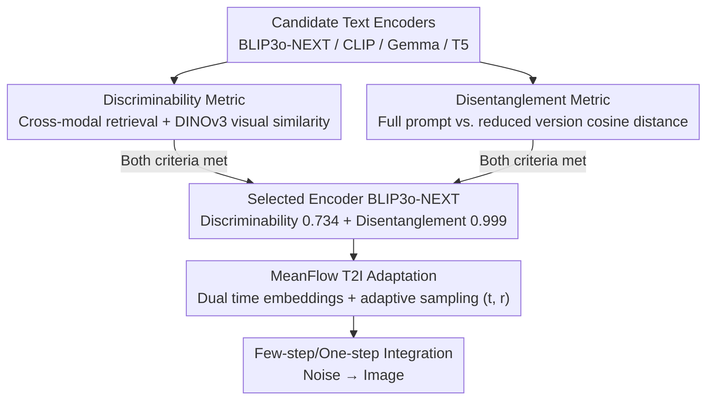

# Extending One-Step Image Generation from Class Labels to Text via Discriminative Text Representation

**Conference**: CVPR 2026  
**arXiv**: [2604.18168](https://arxiv.org/abs/2604.18168)  
**Code**: [https://github.com/AMAP-ML/EMF](https://github.com/AMAP-ML/EMF)  
**Area**: Image Generation  
**Keywords**: MeanFlow, One-step generation, text-to-image, text encoder, semantic discriminability

## TL;DR

This work first extends the MeanFlow framework from class-label conditioning to text-conditional image generation. It discovers that the semantic discriminability and disentanglement of text representations are key bottlenecks under restricted inference steps. Based on the BLIP3o-NEXT text encoder, the authors achieve high-quality few-step and one-step T2I generation.

## Background & Motivation

**Background**: MeanFlow is a theoretically grounded flow matching acceleration method that achieves one-step generation by learning the average velocity field between two time points. It has achieved performance comparable to standard multi-step models in ImageNet class-conditional generation. Subsequent works (e.g., improved training strategies and architectures) have also focused primarily on the class-conditional setting.

**Limitations of Prior Work**: Extending MeanFlow from fixed class labels to flexible text inputs seems straightforward but is actually challenging. Directly integrating LLM text encoders into the MeanFlow framework with conventional training strategies yields disappointing results. Numerical stability issues of the JVP term have been repeatedly identified as the main bottleneck for scaling consistency-based methods to large-scale T2I.

**Key Challenge**: Class labels are discrete and easily distinguishable conditional signals, whereas text conditions are continuous and semantically complex. In extremely few-step (e.g., one-step) inference, the model has almost no opportunity to correct semantic deviations through multiple denoising iterations, thus imposing extremely high requirements on the quality of conditional signals.

**Goal**: (1) Understand why certain text encoders fail in few-step settings; (2) Identify key attributes that high-quality text representations should possess; (3) Implement the first effective text-conditional MeanFlow generation model based on these findings.

**Key Insight**: The authors compare performance differences of various text encoders under restricted inference steps. They find that the BLIP3o-NEXT text encoder maintains basic semantic integrity even in a single step, while the SANA-1.5 encoder suffers from severe semantic degradation in few-step settings.

**Core Idea**: High-quality text representations require two core attributes: discriminability (distinguishing subtle semantic differences) and disentanglement (maintaining the linguistic structure of the text). Only encoders possessing both attributes can construct a reliable velocity field direction, making few-step or even one-step generation possible.

## Method

### Overall Architecture

This paper addresses the problem that while MeanFlow succeeds in class-conditional generation, it fails when switching to free-form text via LLM text encoders using standard training. Instead of focusing solely on the numerical stability of the JVP term, the authors first determine "what kind of text representation supports few-step generation." After identifying two quantifiable attributes (discriminability and disentanglement), they adapt the BLIP3o-NEXT pre-trained diffusion model into MeanFlow.

The overall pipeline is: input text is processed by the encoder to obtain text features; the velocity network then predicts the average velocity field from time $r$ to $t$. During inference, image generation is performed via noise integration in very few steps (or a single step). Compared to the original MeanFlow, the only structural change is splitting the single time embedding into two paths: $\phi_{interval}(t-r)$ encoding the interval length and $\phi_{end}(t)$ encoding the current time point. Their sum produces the conditional embedding $\phi_{cond}(t,r) = \phi_{interval}(t-r) + \phi_{end}(t)$, which is fed into the velocity network alongside text features so the model knows both where it is and how far it needs to jump.

It is emphasized that the core contribution is not a new architecture but the "selection-adaptation" pipeline: candidate encoders are evaluated via discriminability and disentanglement metrics. Only those meeting both criteria (BLIP3o-NEXT) are selected for adaptation into few-step/one-step MeanFlow models.

### Key Designs

**1. Discriminability Metric: Determining if the encoder can distinguish semantically similar but distinct descriptions**

In one-step generation, the model lacks multiple denoising steps to correct errors; the velocity field direction must be accurate immediately. Therefore, the conditional signal must be "sharp." The authors quantify this sharpness using a cross-modal retrieval experiment: on the COCO 2017 training set (118K), the encoder encodes a query prompt to retrieve the most similar image-text pairs. DINOv3 is then used to compare the visual features of the retrieved image with the target image. Higher scores indicate better alignment and better separation of similar but distinct semantics. Results show BLIP3o-NEXT scores 0.734, CLIP 0.730, and Gemma 0.713, whereas T5 scores only 0.634. Encoders with poor discriminability provide blurry velocity field directions, causing failure in few-step settings.

**2. Disentanglement Metric: Determining if text representations drift significantly due to minor phrasing changes**

Discriminability alone is insufficient; the encoder must also maintain linguistic structure, ensuring local changes do not cause disproportionate shifts in the representation. Using full prompts from DPG-Bench, the authors randomly delete parts of the text to create reduced versions. They then calculate the cosine distance between the full and reduced encodings. BLIP3o-NEXT scores nearly perfect at 0.999, followed by Gemma at 0.987, CLIP at 0.967, and T5 at only 0.893. High disentanglement ensures that similar texts fall into close regions of the representation space, making the velocity field smooth and predictable. Poor disentanglement introduces jitter that few-step inference cannot absorb.

**3. MeanFlow T2I Adaptation: Fine-tuning for few-step/one-step generation on qualified encoders**

Once the encoder is selected, the BLIP3o-NEXT pre-trained diffusion model is transformed into MeanFlow. The original time embedding layer is duplicated into interval and endpoint layers (dual time embeddings). During training, time step pairs $(t, r)$ are sampled adaptively from uniform or logit-normal distributions. The ratio of $t \neq r$ is gradually increased to transition the model from learning "instantaneous velocity" to learning "average interval velocity." The training objective follows the standard MeanFlow form:

$$\mathcal{L}_{MF}(\theta) = \mathbb{E}\big[\|u_\theta - \text{sg}(u_{tgt})\|^2\big]$$

where the target $u_{tgt}$ is calculated via JVP with stop-gradient. Fine-tuning is preferred over training from scratch as pre-trained weights already encode usable velocity fields. However, this shortcut only works if the encoder satisfies both discriminability and disentanglement. Ablation studies show that switching to the SANA-1.5 encoder fails even with additional SFT, proving the bottleneck lies in encoder attributes rather than training data.

### Loss & Training

The model uses approximately 170K samples (BLIP3o-60k + shareGPT-4o + Echo-4o), a learning rate of 1e-5, and a batch size of 128 for 150 epochs. Fine-tuning is based on the BLIP3o-NEXT model.

## Key Experimental Results

### Main Results

| Model | Steps | GenEval↑ | DPG-Bench↑ | HPSv2↑ |
|------|------|---------|-----------|--------|
| BLIP3o-NEXT | 30 | 0.91 | 82.05 | 29.42 |
| BLIP3o-NEXT | 4 | 0.86 | 78.15 | 26.96 |
| BLIP3o-NEXT | 1 | 0.46 | 57.05 | 18.54 |
| **EMF (Ours)** | 4 | **0.90** | **81.20** | **29.25** |
| **EMF (Ours)** | 2 | 0.85 | 79.44 | 27.21 |
| **EMF (Ours)** | 1 | 0.74 | 77.36 | 25.77 |
| SANA-Sprint | 4 | 0.77 | - | - |
| rCM | 4 | 0.83 | - | - |

### Ablation Study

| Configuration | GenEval (1-step) | Description |
|------|-------------|------|
| BLIP3o-NEXT Encoder + MeanFlow | 0.74 | High discriminability + High disentanglement |
| SANA-1.5 Encoder + MeanFlow | Failure | Insufficient discriminability |
| SANA-1.5 Encoder + SFT Toneup + MeanFlow | Still Failure | SFT cannot compensate for encoder defects |

### Key Findings

- EMF 4-step generation almost matches BLIP3o-NEXT 30-step performance (GenEval 0.90 vs 0.91), achieving approximately 7.5× acceleration.
- EMF outperforms all distillation models (SDXL-Turbo/Lightning/DMD2, etc.) without requiring a teacher model.
- The SANA-1.5 encoder failed to work effectively in MeanFlow even after SFT fine-tuning, proving that encoder attributes, rather than training data, are the bottleneck.
- EMF performance improves consistently with increased steps (1→2→4→8), unlike traditional consistency models that often saturate or degrade.

## Highlights & Insights

- The systematic analysis of text encoder "discriminability" and "disentanglement" is highly valuable. While prior work focused only on final generation quality, this study delves into representation space attributes, providing clear metrics for encoder selection in few-step generation.
- The insight into "why class labels work for MeanFlow but text doesn't" is revealing: class labels are naturally discrete and distinguishable, possessing high discriminability by default.
- The comparison with consistency methods highlights a key advantage: while consistency models may degrade with more steps, MeanFlow, as a stable discretization of a continuous flow, consistently benefits from more steps.

## Limitations & Future Work

- The findings are currently validated on BLIP3o-NEXT; whether they generalize to all encoders meeting these criteria remains to be fully explored.
- There is still a gap between 1-step GenEval (0.74) and multi-step baselines, leaving room for improvement in high-quality one-step T2I.
- Numerical stability issues in JVP calculation are mitigated by choosing a good encoder but are not fundamentally solved.
- Future work: Explore text encoders specifically designed/trained for few-step generation.

## Related Work & Insights

- **vs. Original MeanFlow**: Original version only supported class conditioning; this work is the first extension to text.
- **vs. SANA-Sprint**: SANA-Sprint is a distillation method reaching 0.77 GenEval at 4 steps, while EMF significantly improves this to 0.90.
- **vs. Consistency Models**: Unlike consistency methods which may degrade with more steps, the MeanFlow approach provides sustainable improvements.

## Rating

- Novelty: ⭐⭐⭐⭐ First extension of MeanFlow to T2I with deep analysis of text representations.
- Experimental Thoroughness: ⭐⭐⭐⭐ Comprehensive comparison across multiple benchmarks and systematic encoder analysis.
- Writing Quality: ⭐⭐⭐⭐ Clear logical progression from observation to analysis to methodology.
- Value: ⭐⭐⭐⭐ Provides guiding insights for text encoder selection in the context of few-step T2I generation.

<!-- RELATED:START -->

## Related Papers

- [\[CVPR 2026\] Temporal Equilibrium MeanFlow: Bridging the Scale Gap for One-Step Generation](temporal_equilibrium_meanflow_bridging_the_scale_gap_for_one-step_generation.md)
- [\[CVPR 2026\] ImageRAGTurbo: Towards One-step Text-to-Image Generation with Retrieval-Augmented Diffusion Models](imageragturbo_towards_one-step_text-to-image_generation_with_retrieval-augmented.md)
- [\[CVPR 2026\] Self-Evaluation Unlocks Any-Step Text-to-Image Generation](self-evaluation_unlocks_any-step_text-to-image_generation.md)
- [\[CVPR 2026\] Resolving the Identity Crisis in Text-to-Image Generation](resolving_the_identity_crisis_in_text-to-image_generation.md)
- [\[ICML 2026\] Riemannian MeanFlow for One-Step Generation on Manifolds](../../ICML2026/image_generation/riemannian_meanflow_for_one-step_generation_on_manifolds.md)

<!-- RELATED:END -->
