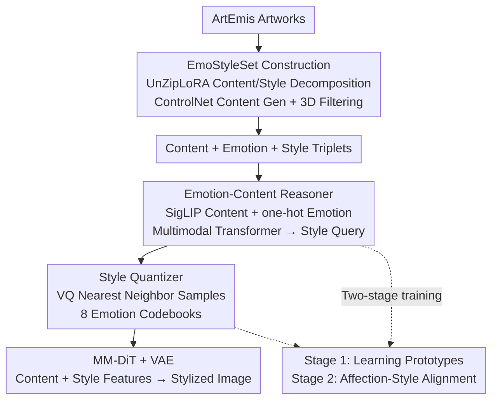

# EmoStyle: Emotion-Driven Image Stylization

**Conference**: CVPR 2026  
**Paper**: [CVF Open Access](https://openaccess.thecvf.com/content/CVPR2026/html/Yang_EmoStyle_Emotion-Driven_Image_Stylization_CVPR_2026_paper.html)  
**Code**: Project Page https://vcc.tech/research/2026/EmoStyle (No public repository visible)  
**Area**: Image Generation / Style Transfer / Affective Computing  
**Keywords**: Emotion-driven stylization, Emotion-content reasoning, Style quantization, VQ style dictionary, Flow matching  

## TL;DR
EmoStyle proposes the new task of "Affective Image Stylization (AIS)"—rendering a content image into an artistic style that evokes a target emotion using only a single emotion word (e.g., "fear", "awe"). This is achieved via an emotion-content reasoner that fuses emotion and content into style queries, and a style quantizer that discretizes continuous features into "per-emotion" style codebooks, improving the Emo-A metric from ~24% to 33.36%.

## Background & Motivation
**Background**: Style Transfer (ST), which aims to make images "look good," is well-established but requires either a reference style image or expert terminology (e.g., "Impressionism", "Monet"). Another line of work, Affective Image Manipulation (AIM), adjusts colors or content to evoke emotions but focuses on generating "realistic" images rather than using artistic style as a medium for emotional expression.

**Limitations of Prior Work**: Art is inherently a medium for "conveying emotion," yet existing methods decouple "style" and "emotion"—ST ignores emotion, and AIM ignores artistic style. A few emotion-aware stylization works still rely on reference images or meticulously crafted text descriptions, resulting in high barriers to entry and poor usability.

**Key Challenge**: Achieving a balance between "emotional expressiveness" and "content preservation" is a non-trivial trade-off. Stronger stylization often leads to more intense emotions but risks destroying structure and semantics, while content preservation may weaken the style and emotional impact. Fundamentally, there is a lack of data for learning the "emotion $\leftrightarrow$ style" mapping, as no dataset provides "content-emotion-style" triplets.

**Goal**: Define and solve the new AIS task—given a content image and an emotion word, output a style image that preserves content and evokes the emotion, addressing both (1) the lack of training data and (2) the emotion-style mapping challenges.

**Key Insight**: Drawing from art history, style and content are intertwined; artists choose styles based on subject matter and emotion. Furthermore, style is perceived by humans as "discrete categories" (Impressionism, Modernism) rather than continuous gradients.

**Core Idea**: Replace "reference images/terminology prompts" with "emotion-content reasoning + discrete style quantization." Each emotion is bound to a learnable discrete style codebook, enabling controllable and interpretable stylization based solely on emotion words.

## Method

### Overall Architecture
EmoStyle addresses the transition from "emotion word + content image" to "stylized affective image." The pipeline consists of two phases: an offline construction of the **EmoStyleSet** triplet dataset to decouple "emotion" from "artworks," and an online two-module network. The **Emotion-Content Reasoner** fuses emotion and content into a "style query," while the **Style Quantizer** aligns this query with discrete style prototypes corresponding to the emotion. Finally, "content features (VAE encoded) + style features (quantized prototypes)" are fed into a frozen MM-DiT. Training involves two stages: learning style prototypes first, then learning the "emotion-content to prototype" selection.

### Key Designs

**1. EmoStyleSet: Triplet dataset decoupling "emotion" from artworks**

The first hurdle for AIS is the lack of data. Existing datasets (ArtEmis, EmoArt) map "whole artwork $\rightarrow$ emotion label" without distinguishing whether the emotion stems from content or style. AIS requires learning "how style conveys emotion," necessitating the separation of style from content. The authors constructed 10,041 triplets from ArtEmis: first, BLIP-2 generates descriptions; UnZipLoRA decomposes each image into "content LoRA + style LoRA." Then, a Canny edge map preserves structure, and Canny + description + content LoRA are fed to ControlNet to generate a "style-free content image." Due to unsupervised noise, a 3D filtering process is used: CLIP similarity for semantics, LPIPS for structure, an ArtEmis-trained classifier for emotion consistency, and manual verification for style-content differentiation.

**2. Emotion-Content Reasoner: Orthogonal one-hot encoding and cross-modal reasoning**

A major pain point is "emotion-aware stylization"—choosing the right style for specific content to evoke the target emotion. Content features are extracted via SigLIP. Crucially, emotion is encoded as a $1\times8$ one-hot vector rather than text. The advantages are: (1) emotions are orthogonal, and (2) the vectors span the entire emotional space. One-hot and semantic features are projected into a unified space, concatenated to initialize $q_i^0$, and passed through a four-layer multimodal Transformer to model interactions, yielding the "emotion-aware, content-conditioned" style query $q_i$:

$$q_i^k = \mathrm{MSA}(\mathrm{LN}(q_i^{k-1})) + q_i^{k-1}, \qquad q_i^k = \mathrm{MLP}(\mathrm{LN}(q_i^k)) + q_i^k$$

where $\mathrm{LN}$ is LayerNorm and $k$ is the layer index. This query serves as a retrieval vector for selecting prototypes in the codebook.

**3. Style Quantizer: Discrete VQ codebooks "per emotion"**

Since styles are perceived as discrete categories, the Style Quantizer discretizes continuous features into prototypes, enhancing interpretability. Although emotion-style mapping is multi-to-multi, the authors simplify this to one-to-many: eight style dictionaries $Z_e=\{z_k^e\}_{k=1}^K$ are built for each emotion. Initialized by clustering USO style features, the quantizer $Q(\cdot)$ performs vector quantization during inference, replacing $q_i$ with the nearest prototype:

$$Q(q_i) = z_k^e, \quad \text{where } k = \arg\min_j \lVert q_i - z_j^e \rVert_2$$

This ensures style consistency and allows users to select different prototypes for the same emotion, providing controllable and diverse results.

**4. Loss & Training: Two-stage training + emotion score weighting**

The backbone is a frozen MM-DiT. **Stage 1: Learning Style Prototypes** uses EmoStyleSet style images to cluster prototypes in style space:

$$L_{style} = \lVert z_k^e - E_s(I_s)\rVert_2^2, \quad k = \arg\min_j \lVert E_s(I_s) - z_j^e \rVert_2$$

**Stage 2: Affection-Style Alignment** aligns results with Ground Truth (GT) using triplets. Pixel-level alignment utilizes Flow Matching loss $L_{FM}=\mathbb{E}_{x_0,t,\epsilon}[w(t)\lVert v_\theta - v_t\rVert^2]$, and feature-level alignment uses $L_{align}=\lVert q_i - z_k^e\rVert_2^2$. To ensure fidelity, losses are weighted by ArtEmis voting scores $e_n$: $L_2=\frac{1}{N}\sum_n e_n\cdot(L_{FM}+L_{align})$, giving higher weight to samples with "certain" emotional Ground Truth.

## Key Experimental Results

### Main Results
Evaluated on 405 real-world images from EmoEdit, stylized into 8 emotions (3,240 images total). Metrics: CLIP↑ (semantics), DINO↑ (structure), SG↓ (Sentiment Gap), Emo-A↑ (Emotion Accuracy), SD↓ (Style Difference).

| Method | Category | CLIP ↑ | DINO ↑ | SG(‰) ↓ | Emo-A(%) ↑ | SD ↓ |
|------|------|--------|--------|---------|-----------|------|
| OmniStyle | Style Transfer | 0.710 | 0.813 | 2.615 | 12.80 | 11.90 |
| InST | Style Transfer | 0.569 | 0.679 | 2.016 | 21.22 | 11.48 |
| IP2P | Image Editing | 0.708 | 0.729 | 3.459 | 24.34 | 12.76 |
| EmoEdit | AIM | 0.597 | 0.545 | 2.245 | 12.60 | 28.83 |
| CLVA | AIM | 0.727 | 0.789 | 2.030 | 14.99 | 9.49 |
| AIF | AIM | 0.712 | 0.780 | 2.625 | 12.99 | 8.48 |
| **Ours** | AIS | 0.718 | **0.842** | **1.976** | **33.36** | **7.59** |

Ours achieves 33.36% Emo-A, significantly outperforming IP2P (24.34%). It records the lowest SG (1.976), lowest SD (7.59), and highest DINO (0.842).

### Ablation Study
| Configuration | Observation | Description |
|------|------|------|
| Full model | Affective fidelity + distinct style + consistency | Complete architecture |
| w/o Style Quantizer | Results are too "realistic" | Reasoner alone cannot map emotion to expressive artistic styles |
| w/o Reasoner | Weakened emotional arousal | Lacks cross-modal reasoning to select correct style |
| w/o Emotion Encoder | Weakened emotional arousal | Emotion encoding is essential for affective stylization |

User study (Aesthetic/Emotion/Balance):
| Method | Aesthetics ↑ | Emotion Fidelity ↑ | Balance ↑ |
|------|-----------|-----------|--------|
| CLVA | 8.50% | 0.81% | 1.19% |
| InST | 2.50% | 29.63% | 1.34% |
| AIF | 9.08% | 5.09% | 7.76% |
| **Ours** | **79.92%** | **64.47%** | **89.70%** |

### Key Findings
- **Style Quantizer is key for "Artisticness"**: Without it, results degrade to realism, suggesting that mapping emotion to discrete prototypes provides expressive power.
- **Encoding matters**: One-hot encoding avoids the bias where LLMs associate emotion words strictly with facial expressions.
- **Guide scale trade-off**: Increasing image guidance scale intensifies emotion and style but degrades structural preservation.
- **Transferability**: Replacing the image encoder with a text encoder allows the emotion-style dictionary to be used for "Affective Text-to-Image" generation.

## Highlights & Insights
- **Task Definition**: Bridges the gap between "style-only" ST and "emotion-only" AIM by proposing AIS, lowering the barrier to entry by using simple emotion words.
- **One-hot Trick**: Using orthogonal one-hot vectors instead of text avoids LLM-induced biases toward facial expressions and ensures a comprehensive, independent emotion space.
- **VQ Codebook Interpretability**: Discrete dictionaries turn "black-box" style control into a selectable, enumerable menu of styles.
- **Data Construction Logic**: The "decompose-reconstruct-filter" pipeline (UnZipLoRA + ControlNet + LPIPS/CLIP filtering) offers a template for creating content-style disentangled datasets from artworks.

## Limitations & Future Work
- **One-to-many limitation**: The current simplification of the multi-to-multi emotion-style relationship to one-to-many (one codebook per emotion) may lose context-dependent nuances.
- **Content-induced emotion**: Emotion is evoked by both style and content; modeling their interaction and balancing their contributions remains an open problem.
- **Evaluation Difficulty**: Affective perception is subjective. Current metrics like Emo-A (at 33%) underscore the inherent difficulty of the task.
- **Hyperparameters**: Sensitivity to the codebook size $K$ and the initialization threshold for prototypes requires further investigation.

## Related Work & Insights
- **vs Style Transfer (OmniStyle/InST/CLIPStyler)**: ST creates "pretty" styles but lacks emotional arousal (Emo-A 12~21%); EmoStyle doubles Emo-A to 33% using only emotion words.
- **vs AIM (EmoEdit/EmoEditor)**: AIM uses color/semantics for emotion but generates realistic images; EmoStyle utilizes artistic style as the primary tool.
- **vs Affect-aware Stylization (MSNet/AIF)**: Previous works still rely on reference images or complex descriptions; EmoStyle uses simple words and discrete codebooks for interpretability.

## Rating
- Novelty: ⭐⭐⭐⭐⭐ Systematically marries emotion with artistic style through a new task and framework.
- Experimental Thoroughness: ⭐⭐⭐⭐ Extensive comparisons and user studies, though Emo-A absolute values remain challenging and hyperparameter sensitivity is under-discussed.
- Writing Quality: ⭐⭐⭐⭐ Clear motivation, high-quality visualizations, and consistent logic.
- Value: ⭐⭐⭐⭐ Practical utility for AIGC art creation and transferable style assets.

<!-- RELATED:START -->

## Related Papers

- [\[CVPR 2026\] Cross-Modal Emotion Transfer for Emotion Editing in Talking Face Video](cross-modal_emotion_transfer_for_emotion_editing_in_talking_face_video.md)
- [\[CVPR 2026\] Hist2Style: Histogram-Guided Stylization with Bilateral Grids](hist2style_histogram-guided_stylization_with_bilateral_grids.md)
- [\[CVPR 2026\] Proxy-Tuning: Tailoring Multimodal Autoregressive Models for Subject-Driven Image Generation](proxy-tuning_tailoring_multimodal_autoregressive_models_for_subject-driven_image.md)
- [\[ICCV 2025\] Balanced Image Stylization with Style Matching Score](../../ICCV2025/image_generation/balanced_image_stylization_with_style_matching_score.md)
- [\[CVPR 2026\] FlowFixer: Towards Detail-Preserving Subject-Driven Generation](flowfixer_towards_detail-preserving_subject-driven_generation.md)

<!-- RELATED:END -->
