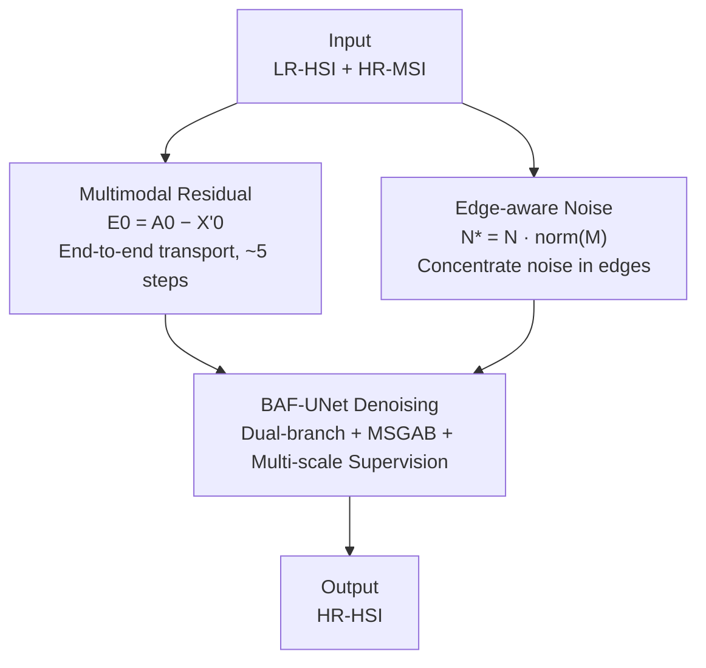

# EMR-Diff: Edge-aware Multimodal Residual Diffusion Model for Hyperspectral Image Super-resolution

**Conference**: CVPR 2026  
**Paper**: [CVF Open Access](https://openaccess.thecvf.com/content/CVPR2026/html/Zhang_EMR-Diff_Edge-aware_Multimodal_Residual_Diffusion_Model_for_Hyperspectral_Image_Super-resolution_CVPR_2026_paper.html)  
**Code**: https://github.com/luocz55/EMR-Diff  
**Area**: Diffusion Models / Image Restoration  
**Keywords**: Hyperspectral Image Super-Resolution, Multimodal Residual Diffusion, Edge-aware Noise, Image Fusion, Dual-branch UNet

## TL;DR
EMR-Diff reformulates the fusion task of "Low-Resolution Hyperspectral Image (LR-HSI) + High-Resolution Multispectral Image (HR-MSI)" into "High-Resolution Hyperspectral Image (HR-HSI)" as a diffusion process. By transferring **multimodal residuals** instead of pure Gaussian noise between the start and end of the Markov chain, the sampling steps are reduced from thousands to 5. Furthermore, edge information from the HR-MSI is used to **modulate the noise**, forcing the model to focus on reconstructing high-frequency details. Combined with a dual-branch BAF-UNet, it outperforms over 10 SOTA methods across metrics like PSNR and SAM on the ICVL, Harvard, and Chikusei datasets.

## Background & Motivation
**Background**: Due to hardware constraints, it is difficult for sensors to simultaneously capture HSIs with both high spatial and high spectral resolution. A common trade-off involves fusion—using an easily obtainable LR-HSI (high spectral but low spatial resolution) and an HR-MSI (high spatial but low spectral resolution) to produce a clear, spectrally complete HR-HSI. Recently, diffusion models have become favored for this task due to their strong generative capabilities.

**Limitations of Prior Work**: Direct application of the standard diffusion framework (DDPM) to HSI super-resolution (SR) faces three specific issues. First, **inefficient sampling**: the forward process completely destroys the image into pure noise, requiring thousands of reverse iterations, which slows down inference. Second, **limited detail generation**: pure Gaussian noise is isotropic and does not distinguish between regions, making it difficult for the model to focus on critical high-frequency details (edges, textures). Third, **insufficient denoising**: conventional UNets often use "early fusion" by concatenating noisy inputs with observations too early, leading to interference between information types and suboptimal reconstruction quality when combined with blind upsampling.

**Key Challenge**: The "generation from pure noise" paradigm of diffusion models naturally diverges from the essence of SR, which is to "supplement missing details" rather than "create from nothing." Since the combination of LR-HSI and HR-MSI already contains most of the information for the HR-HSI, it is unnecessary to destroy the image completely before reconstruction.

**Goal**: While maintaining the generative capabilities of diffusion models, this research aims to: (1) significantly compress sampling steps; (2) focus noise/denoising on high-frequency details; and (3) design a specialized denoising network to decouple observations from noise.

**Key Insight**: Instead of traversing between "clean image $\leftrightarrow$ pure noise," the diffusion chain moves between "HR-HSI $\leftrightarrow$ LR-HSI+HR-MSI." The difference between these endpoints is the **multimodal residual** $E_0$. The diffusion process simply transports this residual over a few dozen steps. Simultaneously, the HR-MSI edges modulate the Gaussian noise into **edge-aware noise**, concentrating noise energy in edge regions to force the model to prioritize detail restoration.

## Method

### Overall Architecture
The core of EMR-Diff lies in redefining the two endpoints of the diffusion chain. The **start point** $X'_0$ of the forward chain is the concatenation of the ground-truth HR-HSI and its Pseudo-MSI. The **end point** $A_0$ is the concatenation of the upsampled LR-HSI ($Y_\uparrow$) and the HR-MSI ($Z$), i.e., $A_0 = Y_\uparrow \,\textcircled{c}\, Z$. The difference between them is the multimodal residual $E_0 = A_0 - X'_0$, which captures both spatial details lost by the LR-HSI and spectral differences of the HR-MSI relative to the Pseudo-MSI. The forward process gradually injects $E_0$ and edge-aware noise $N^*$ into the starting point according to a monotonically increasing coefficient $\eta_t$. The reverse process starts from $A_0$ and uses the BAF-UNet denoising network to systematically transport the residual back to recover $X'_0$. Due to the high correlation between the endpoints, the chain requires only about 5 steps.

The overall flow from input to output is shown below, where the three contribution nodes correspond to the three key designs:

### Key Designs

**1. Multimodal Residual Mechanism: Shifting from "Generation" to "Residual Transport"**

To address sampling inefficiency, the authors extend the residual concept to multimodal fusion, inspired by ResShift. Instead of adding noise until reaching pure Gaussian noise, the residual $E_0$ is injected along the chain:

$$X'_t = X'_{t-1} + \alpha_t E_0 + \kappa\sqrt{\alpha_t}\,N^*, \qquad X'_t = X'_0 + \eta_t E_0 + \kappa\sqrt{\eta_t}\,N^*$$

Where $\alpha_t = \eta_t - \eta_{t-1}$, $\eta_t$ is a monotonically increasing sequence, and $\kappa$ controls noise intensity (set to 1). At $t=1$, $\eta_t \to 0$ and $X'_1 \approx X'_0$. At $t=T$, $\eta_t \to 1$ and $X'_T \approx A_0 + N^*$. The reverse posterior is:

$$X'_{t-1} = \tfrac{\eta_{t-1}}{\eta_t}X'_t + \tfrac{\alpha_t}{\eta_t} f_\theta(X'_t, A_0, t) + \kappa\sqrt{\tfrac{\eta_{t-1}}{\eta_t}\alpha_t}\,N^*$$

The denoising network $f_\theta$ directly predicts $X'_0$. Unlike standard diffusion, $E_0$ provides a clear path for "which details and spectra to supplement," reducing steps from thousands to single digits. Ablations show multimodal residuals outperform no-residual and unimodal-residual baselines by 1.35 dB and 0.82 dB, respectively.

**2. Edge-aware Noise: Concentrating Noise Energy in High-Frequency Regions**

Observing that HR-HSI and HR-MSI share highly similar high-frequency edge structures, the authors use HR-MSI edges to modulate noise. The HR-MSI is averaged into a grayscale image $P$. Sobel operators $C_x, C_y$ calculate gradients $G_x = C_x * P$ and $G_y = C_y * P$. The edge strength is the gradient magnitude:

$$M = \sqrt{G_x^2 + G_y^2 + \epsilon}, \quad \epsilon = 10^{-8}$$

The normalized weights $W = \text{norm}(M)$ are element-wise multiplied with Gaussian noise to produce edge-aware noise $N^* = N \cdot W$. High noise in edge regions forces the denoising network to concentrate "computational effort" on reconstructing textures. This improved PSNR by 0.92 dB in experiments.

**3. Dual-branch Attention Fusion UNet (BAF-UNet): Decoupling Observations and Noise**

BAF-UNet utilizes two specialized paths. **Dual-branch Decoupling**: One denoising path processes noisy input $X'_t$, while a guidance path takes the concatenated LR-HSI+HR-MSI to provide structural and spectral priors. They fuse only in deeper layers to prevent noise distribution learning from contaminating structural feature learning. The backbone of each path is the **MSGAB (Multi-Scale Group Attention Block)**, which uses spatial attention and parallel group convolutions ($g_1$ for dense cross-channel interaction, $g_2$ for sparse connection to preserve spectral properties) with adaptive weighting. **Multi-scale Supervision**: Upsampled LR-HSI and downsampled HR-MSI are injected at each stage, supervised by progressively downsampled HR-HSI targets:

$$L_{\text{multi}} = \sum_{k=0}^{3} \big\| O_k + Y_{\uparrow n}\,\textcircled{c}\,Z_{\downarrow n'} - X'_{\downarrow n'} \big\|_1, \quad n = 2^k,\ n' = 2^{3-k}$$

This ensures explicit supervision at every upsampling stage, simulating a progressive "low-to-high" reconstruction.

### Loss & Training
Training utilizes the multi-scale $L_1$ loss listed above. The denoising network $f_\theta$ directly regresses $X'_0$. Inference defaults to 5 diffusion steps. $A_0$ is formed by $8\times$ bicubic upsampling of the LR-HSI concatenated with the HR-MSI. The Pseudo-MSI takes the first three bands of the HR-HSI to ensure spectral smoothness.

## Key Experimental Results

### Main Results
On three datasets (ICVL/Harvard/Chikusei), EMR-Diff outperformed 10 SOTA methods across four metrics:

| Dataset | Metric | EMR-Diff | Best Competitor (DSPNet) | Note |
|--------|------|----------|------------------|------|
| ICVL | PSNR↑ / SAM↓ | **55.40 / 0.0040** | 55.19 / 0.0042 | Superior spatial/spectral balance |
| Harvard | PSNR↑ / SAM↓ | **49.28 / 0.0233** | 48.68 / 0.0237 | PSNR gain of +0.60 dB |
| Chikusei | PSNR↑ / SAM↓ | **47.55 / 0.0950** | 46.97 / 0.0977 | Leads even in 128-band scenes |

Traditional methods (CNMF/Hysure) lag significantly behind, and unsupervised methods (PLR/ARGS) tend toward over-smoothing.

### Ablation Study

| Configuration | PSNR↑ | SAM↓ | ERGAS↓ | Note (Harvard) |
|------|-------|------|--------|------|
| Multimodal Residual (Full) | **49.28** | 0.0233 | 0.7800 | Complete model |
| Unimodal Residual | 48.46 | 0.0241 | 0.8025 | LR↔HR-HSI only, −0.82 dB |
| No Residual | 47.93 | 0.0250 | 0.8994 | −1.35 dB |
| Edge-aware Noise | **49.28** | 0.0233 | 0.7800 | — |
| Pure Gaussian Noise | 48.36 | 0.0245 | 0.8198 | −0.92 dB |

### Key Findings
- **Multimodal residuals provide the largest contribution**: Removing them leads to a 1.35 dB drop, confirming that transporting residuals between degraded versions fits SR better than generation from scratch.
- **5-step sampling is optimal**: 3 or 4 steps result in underfitting, while 10 steps actually show a slight performance decrease (48.89 PSNR), suggesting that the residual paradigm reaches peak efficiency very early.
- **Spectral Selection**: Using the first three bands for Pseudo-MSI yielded the best results (49.28 PSNR), likely because these bands correspond to visible light where spatial details are most abundant.

## Highlights & Insights
- **Endpoint Redefinition**: Changing the diffusion target from "pure noise" to "another observation" is the most significant innovation. By transporting residuals between two degraded versions, thousands of steps are compressed to 5.
- **Cross-modal Detail Prior**: The use of HR-MSI glass to modulate noise is a simple yet effective way to reallocate noise energy to high-frequency regions, acting as a "detail attention prior" without extra parameters.
- **Decoupled Conditional Diffusion**: The dual-branch architecture that physically separates "noise distribution learning" from "structural prior learning" is a reusable design pattern for conditional diffusion.

## Limitations & Future Work
- **Generalization**: The authors acknowledge that cross-sensor and cross-scene generalization remains a challenge.
- **Synthetic Data**: Experiments were conducted on synthetic data (Gaussian blur + Bicubic downsampling). The performance on real-world sensors with complex degradations remains to be seen.
- **Noise Concentration Risk**: Edge-aware noise assumes edge consistency between HR-MSI and HR-HSI. If the modalities are misaligned or the MSI is noisy, the modulation might concentrate noise in the wrong regions.

## Related Work & Insights
- **vs. ResShift**: ResShift uses unimodal residuals for natural image SR. EMR-Diff extends this to multimodal fusion, encoding both spatial and spectral losses, resulting in a 0.82 dB improvement over the unimodal approach.
- **vs. Standard HSI Diffusion**: Methods like DDPM require massive sampling steps. EMR-Diff achieves higher quality with only 5 steps through residual transport and edge noise.
- **vs. Supervised Fusion (DSPNet/DHIF)**: While these regression-based methods are fast, they lack generative detail completion. EMR-Diff combines deterministic priors with generative refinement, typically improving PSNR by 0.2~0.6 dB.

## Rating
- Novelty: ⭐⭐⭐⭐ Multimodal residual diffusion and cross-modal edge modulation are well-tailored for HSI tasks.
- Experimental Thoroughness: ⭐⭐⭐⭐ Extensive comparison on three datasets and six ablation groups, though limited to synthetic degradations.
- Writing Quality: ⭐⭐⭐⭐ Clear structure connecting specific pain points to modules.
- Value: ⭐⭐⭐⭐ High-quality 5-step HSI SR; the residual-endpoint concept is highly applicable to other paired restoration tasks.

<!-- RELATED:START -->

## Related Papers

- [\[AAAI 2026\] GEWDiff: Geometric Enhanced Wavelet-based Diffusion Model for Hyperspectral Image Super-resolution](../../AAAI2026/image_generation/gewdiff_geometric_enhanced_wavelet-based_diffusion_model_for_hyperspectral_image.md)
- [\[CVPR 2026\] VOSR: A Vision-Only Generative Model for Image Super-Resolution](vosr_a_vision_only_generative_model_for_image_super_resolution.md)
- [\[ICLR 2026\] Step-Aware Residual-Guided Diffusion for EEG Spatial Super-Resolution](../../ICLR2026/image_generation/step-aware_residual-guided_diffusion_for_eeg_spatial_super-resolution.md)
- [\[CVPR 2026\] Residual Diffusion Bridge Model for Image Restoration](residual_diffusion_bridge_model_for_image_restoration.md)
- [\[CVPR 2026\] Physics-Consistent Diffusion for Efficient Fluid Super-Resolution via Multiscale Residual Correction](physics-consistent_diffusion_for_efficient_fluid_super-resolution_via_multiscale.md)

<!-- RELATED:END -->
