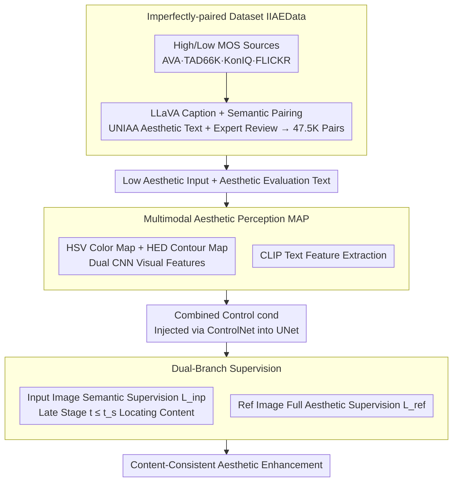

# Enhancing Image Aesthetics with Dual-Conditioned Diffusion Models Guided by Multimodal Perception

**Conference**: CVPR 2026  
**arXiv**: [2603.11556](https://arxiv.org/abs/2603.11556)  
**Code**: None  
**Area**: Image Generation / Image Aesthetic Enhancement  
**Keywords**: Image Aesthetic Enhancement, Multimodal Aesthetic Perception, Weakly-supervised Diffusion Models, Imperfectly-paired Data, ControlNet

## TL;DR

DIAE proposes a Multimodal Aesthetic Perception (MAP) module to convert vague aesthetic instructions into explicit control signals (HSV + contour + text). It constructs an "imperfectly-paired" dataset IIAEData for weakly-supervised training with a dual-branch framework, achieving content-consistent enhancement with a 17.4% LAION aesthetic score improvement.

## Background & Motivation

**Background**: Image aesthetic enhancement requires models to possess aesthetic perception to identify deficiencies in color, composition, and lighting for targeted editing. While diffusion models have succeeded in semantic image editing, existing methods lack aesthetic awareness.

**Limitations of Prior Work**: (1) **Difficulty in understanding aesthetic instructions**—evaluations like "low saturation" or "rule-of-thirds composition" are highly abstract, making it difficult for simple text encoders to translate them into generation directions; (2) **Lack of training data**—aesthetic enhancement requires "perfectly-paired" images with consistent content but different aesthetic quality, which are extremely costly to annotate.

**Key Challenge**: Aesthetics is a high-level human visual capability influenced by culture and experience. Furthermore, there is a lack of paired data for supervised learning. Traditional image quality assessment datasets focus on artificial degradations (blur, noise) rather than aesthetics.

**Goal**: (1) Enable diffusion models to understand and execute vague aesthetic instructions; (2) Train aesthetic enhancement models without perfectly-paired data.

**Key Insight**: Aesthetic perception is decomposed into color and structure dimensions, represented by HSV color maps and HED contour maps, respectively. These, combined with text descriptions, form multimodal control signals. For data, "imperfectly-paired" images with similar semantics but different aesthetic quality are used for weak supervision.

**Core Idea**: Reify vague instructions through multimodal visual representations (HSV + contour) and achieve weakly-supervised enhancement using "imperfectly-paired" data with a dual-branch supervision framework.

## Method

### Overall Architecture

DIAE addresses the challenge of enabling diffusion models to understand abstract aesthetic evaluations like "low saturation" and "rule-of-thirds" to enhance images without altering content. The pipeline consists of three layers: offline construction of an "imperfectly-paired" dataset IIAEData by matching high/low-quality images from existing benchmarks; a MAP module that translates aesthetic evaluations into HSV, HED, and text control signals injected via ControlNet; and a dual-branch supervision framework where the input image maintains semantics and the reference image guides aesthetics.

### Key Designs

**1. Imperfectly-paired Dataset (IIAEData): Weak supervision signals from existing data**

Ideal training data consists of "perfect pairs" where only aesthetic attributes differ. Since these are unavailable, IIAEData selects high-MOS images as references and low-MOS images as inputs from AVA, TAD66K, etc. LLaVA-13b generates captions for semantic matching, ensuring pairs have "similar content but different aesthetics." UNIAA-LLaVA generates standardized aesthetic evaluations, followed by expert review to filter mismatches, resulting in 47.5K samples (45K training, 1.5K testing).

**2. Multimodal Aesthetic Perception (MAP): Translating abstract text into visual signals**

Vague terms like "low saturation" are difficult for text encoders to ground. MAP decomposes aesthetic evaluations into color (saturation, illumination) and structure (focus, composition). Color is represented via HSV maps (closer to human perception), and structure via HED contours. Dual CNN branches $\Phi_i$ extract visual features $F_{col}^I, F_{str}^I$, while a CLIP text encoder extracts $F_{col}^T, F_{str}^T$. These are combined into $\{cond_h, cond_c\}$. Multimodal signals compensate for the info loss in individual representations.

**3. Dual-Branch Supervision Framework: Safe use of inconsistent reference images**

Imperfectly-paired reference images may cause content drift if used for full supervision. Leveraging the frequency-hierarchy of diffusion (semantics at early stages, details at late stages), a threshold $t_s$ (default 900) is used. For $t \leq t_s$, the input image supervises semantic consistency $L_{inp}$. The high-MOS reference image supervises aesthetic attributes $L_{ref}$ throughout. The total loss is:

$$L = L_{ref} + \lambda L_{inp}$$

This decouples "content" and "aesthetics" along the time axis, allowing the model to learn aesthetics from the reference without losing the input's content.

### Loss & Training

Based on SD-v1.5, UNet and ControlNet are trainable, while the CLIP text encoder is frozen. $t_s=900$. AdamW optimizer with learning rate 1e-5. Trained on 4×A800 for 100K iterations.

## Key Experimental Results

### Main Results

| Method | LAION (256) | LAION (512) | MLLM (256) | MLLM (512) | CLIP-I (256) | CLIP-I (512) |
|------|-------------|-------------|------------|------------|----------|----------|
| Original | 4.962 | 5.123 | 3.243 | 3.300 | 1.000 | 1.000 |
| ControlNet | 4.979 | 5.522 | 3.271 | 3.415 | 0.628 | 0.617 |
| InstructPix2Pix | 4.991 | 5.396 | 3.264 | 3.325 | 0.764 | 0.690 |
| MGIE | 4.947 | 5.519 | 3.045 | 3.411 | 0.557 | 0.770 |
| DOODL | 5.102 | 5.140 | 3.255 | 3.297 | 0.775 | 0.703 |
| **DIAE (Ours)** | **5.324** | **6.012** | **3.339** | **3.662** | **0.772** | **0.784** |

### Ablation Study

| Config | LAION Score | MLLM Score | CLIP-I | Description |
|------|----------|---------|--------|------|
| DIAE (w/o v) | 5.250 | 3.343 | 0.623 | No visual modality (ControlNet-like) |
| DIAE (w/o t) | 5.428 | 3.410 | 0.792 | No text modality |
| **DIAE (Full)** | **5.668** | **3.501** | **0.778** | Text + Visual |

### Key Findings

- Gain: LAION score improved by 17.4% (5.123→6.012) and MLLM score by 11.0% at 512 resolution, with CLIP-I maintained at 0.784.
- Most significant improvements observed in low-aesthetic cases (MOS < 4.0), specifically in color and brightness correction.
- Removing visual modality dropped CLIP-I to 0.623, indicating HSV/contour maps are vital for content consistency.
- Increasing $t_s$ retains more input semantics, offering explicit control over the content-enhancement trade-off.

## Highlights & Insights

- **Decomposition of aesthetics into color and structure**: By mapping abstract concepts to HSV and contour maps, the model grounds vague instructions in concrete visual signals, a strategy transferable to other abstract attribute control tasks.
- **Clever weak-supervision strategy**: Using the frequency layering of the diffusion denoising process to apply different supervision signals at different time steps effectively decouples content and style.
- **IIAEData construction logic**: Leveraging existing datasets with LLM-based semantic matching provides a low-cost, scalable paradigm for tasks lacking perfectly-paired data.

## Limitations & Future Work

- Portrait and crowd scenes are not covered (facial/postural aesthetics excluded during data filtering).
- Built on SD-v1.5; generation capacity is limited compared to newer models like SD3.5.
- "Imperfect pairing" in IIAEData depends on LLaVA matching accuracy; potential for mismatches exists.
- Aesthetic evaluation is limited to two dimensions; micro-attributes like texture and complex lighting gradients are missing.
- $t_s$ is a fixed scalar rather than being adaptively adjusted per image.

## Related Work & Insights

- **vs InstructPix2Pix**: IP2P focuses on semantic editing and lacks specific aesthetic understanding.
- **vs DOODL**: DOODL uses aesthetic classifier gradients for guidance during sampling but does not address specific aesthetic attributes.
- **vs ControlNet**: ControlNet provides structural control but lacks aesthetic semantic awareness; DIAE adds aesthetic perception on top of its architecture.

## Rating

- Novelty: ⭐⭐⭐⭐ Combination of multimodal perception and dual-branch weak supervision is novel, though individual components are established.
- Experimental Thoroughness: ⭐⭐⭐ Lacks user studies; CLIP-I may not fully capture human-perceived consistency.
- Writing Quality: ⭐⭐⭐⭐ Clear problem definition and logical motivation.
- Value: ⭐⭐⭐⭐ Addresses a practical demand with a scalable weak-supervision data strategy.

<!-- RELATED:START -->

## Related Papers

- [\[CVPR 2026\] MICON-Bench: Benchmarking and Enhancing Multi-Image Context Image Generation in Unified Multimodal Models](micon-bench_benchmarking_and_enhancing_multi-image_context_image_generation_in_u.md)
- [\[CVPR 2026\] MMFace-DiT: A Dual-Stream Diffusion Transformer for High-Fidelity Multimodal Face Generation](mmface-dit_a_dual-stream_diffusion_transformer_for_high-fidelity_multimodal_face.md)
- [\[CVPR 2026\] UniPercept: A Unified Diffusion Model for Generalizable Visual Perception](unipercept_a_unified_diffusion_model_for_generalizable_visual_perception.md)
- [\[CVPR 2026\] Diffusion-Based Makeup Transfer with Facial Region-Aware Makeup Features](diffusion-based_makeup_transfer_with_facial_region-aware_makeup_features.md)
- [\[CVPR 2026\] Prototype-Guided Concept Erasure in Diffusion Models](prototype-guided_concept_erasure_in_diffusion_models.md)

<!-- RELATED:END -->
