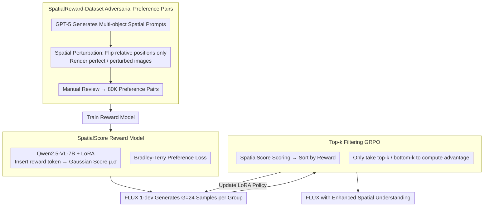

# Enhancing Spatial Understanding in Image Generation via Reward Modeling

**Conference**: CVPR 2026  
**arXiv**: [2602.24233](https://arxiv.org/abs/2602.24233)  
**Code**: None  
**Area**: Text-to-Image Generation / Reinforcement Learning  
**Keywords**: Spatial Understanding, Reward Modeling, GRPO, Diffusion Models, FLUX

## TL;DR

Ours constructs the 80K adversarial preference dataset SpatialReward-Dataset and trains a specialized reward model, SpatialScore (whose accuracy exceeds GPT-5), to evaluate spatial relationship precision. This model serves as the reward signal for online RL using GRPO with a top-k filtering strategy, significantly enhancing the spatial generation capabilities of FLUX.1-dev.

## Background & Motivation

Despite significant progress in visual quality for text-to-image generation, accurately depicting complex spatial relationships—especially in scenarios with long prompts involving multi-object relations—remains difficult. Enhancing spatial understanding through reinforcement learning (RL) is a natural direction, but the core bottleneck lies in the **lack of reliable reward models**:

**Human Preference Reward Models** (HPSv2, PickScore, etc.): These focus on overall aesthetics and text-image alignment, failing to accurately evaluate complex spatial relationships.

**VQA Alignment Models** (VQAScore, etc.): These also perform poorly in multi-object spatial reasoning.

**Proprietary VLMs** (GPT-5, Gemini): Their high cost makes them unsuitable for frequent queries required in RL.

**Open-source VLMs** (Qwen2.5-VL 72B): These exhibit severe hallucinations and unreliable spatial reasoning.

**Rule-based GenEval**: This only covers simple two-object template prompts, fails to generalize to long-prompt scenarios, and relies on object detectors sensitive to occlusion.

## Method

### Overall Architecture

**Mechanism**: This work addresses the issue of inaccurate spatial relations in text-to-image generation, particularly for complex long prompts and multi-object scenarios. The authors posit that the true bottleneck for RL-enhanced spatial understanding is the lack of a reliable reward model—existing human preference or VQA models fail to judge spatial relations accurately, and proprietary VLMs are too expensive for RL feedback loops. The pipeline consists of three stages: constructing a SpatialReward-Dataset with 80K adversarial preference pairs, training a specialized SpatialScore reward model, and optimizing FLUX.1-dev via GRPO online RL using SpatialScore as the signal.

### Key Designs

**1. SpatialReward-Dataset: Constructing Adversarial Preference Pairs via Spatial Perturbation**

Existing preference data either evaluates aesthetics or overall alignment, lacking a precise focus on spatial relations. The authors used GPT-5 to generate prompts containing complex multi-object spatial relations and then applied spatial perturbations—flipping relative positions (e.g., left to right, exchanging object positions) while keeping all other relations unchanged. The original prompts were rendered as "perfect images" and perturbed prompts as "perturbed images." In such pairs, "non-spatial factors" are almost perfectly aligned, ensuring the preference signal originates solely from spatial correctness. Generation utilized strong alignment models (Qwen-Image, HunyuanImage-2.1, Seedream-4.0), followed by manual review to filter samples failing spatial constraints, resulting in 80K pairs.

**2. SpatialScore Reward Model: Gaussian Distribution Score Modeling + Bradley-Terry Preference Loss**

To avoid the costs of GPT-5/Gemini and the hallucinations of standard open-source VLMs, SpatialScore uses Qwen2.5-VL-7B + LoRA as its backbone. A special `<reward>` token is inserted at the end of the prompt, and its last-layer embedding is mapped via an MLP to $\mu$ and $\sigma$. The reward is modeled as a Gaussian distribution $s \sim \mathcal{N}(\mu, \sigma^2)$ rather than a deterministic value, increasing robustness to noise. Training employs the Bradley-Terry preference loss: $\mathcal{L}_{\text{Reward}}(\theta) = \mathbb{E}_{c, y_w, y_l}[-\log \sigma(R_\phi(H_\phi(y_w, c)) - R_\phi(H_\phi(y_l, c)))]$. Ultimately, this 7B model surpasses GPT-5 and Gemini-2.5 Pro in spatial evaluation accuracy.

**3. Top-k Filtering GRPO: Eliminating Advantage Bias from Uneven Prompt Difficulty**

GRPO calculates advantages based on relative rewards within a group, but varying prompt difficulty can distort this. Easy prompts may result in many high-reward samples, causing some high-quality samples to be treated as negative advantages; conversely, difficult prompts may result in universally low rewards, skewing advantages. The authors sort $G$ samples per group by reward and only use the top-$k$ and bottom-$k$ samples for advantage calculation and training. $k=6$ (with group size $G=24$) was found to be optimal for diversity and balance, while also reducing NFEs from $24 \times 6$ to $12 \times 6$, effectively halving the computation.

### Loss & Training

**Reward Model Training**:
- Qwen2.5-VL-7B + LoRA, learning rate $2 \times 10^{-6}$, batch size 32.
- 8×H20 GPUs, completed in 1 day.

**RL Training**:
- Base Model: FLUX.1-dev + LoRA (rank=32).
- GRPO: learning rate $3 \times 10^{-4}$, clip range $1 \times 10^{-4}$, KL penalty 0.01.
- Deterministic ODEs are converted to stochastic SDEs (Euler-Maruyama discretization) for policy exploration.
- 32×H20 GPUs.

## Key Experimental Results

### Main Results

| Method | SpatialScore | DPG-Bench Overall | TIIF-short BR | TIIF-long BR | UniBench-short Lay-2D | UniBench-long Lay-2D |
|------|-------------|-------------------|---------------|--------------|----------------------|---------------------|
| FLUX.1-dev | 2.18 | 82.91 | 0.769 | 0.758 | 0.766 | 0.819 |
| Flow-GRPO* | 3.01 | 57.02 | 0.851 | 0.577 | 0.726 | 0.445 |
| **Ours** | **7.81** | **85.03** | **0.875** | **0.845** | **0.875** | **0.891** |

Internal evaluation via SpatialScore improved from 2.18 to 7.81 (+258%), and the overall DPG-Bench score approached GPT-Image-1 (85.03 vs 85.15).

### Evaluation (Reward Model)

| Model | Overall Accuracy |
|------|-----------------|
| PickScore | 0.509 |
| HPSv3 | 0.605 |
| Qwen2.5-VL-72B | 0.764 |
| GPT-5 | 0.890 |
| Gemini-2.5 Pro | 0.951 |
| **SpatialScore (7B)** | **0.958** |

The 7B-parameter SpatialScore outperforms GPT-5 and Gemini-2.5 Pro in spatial understanding evaluation.

### Ablation Study

| Configuration | SpatialScore | DPG-bench Rel | UniBench Lay-3D(long) | NFE/Step |
|------|-------------|---------------|----------------------|--------|
| w/o top-k | 7.73 | 0.919 | 0.793 | 24×6 |
| top-k (k=4) | 7.71 | 0.916 | 0.796 | 8×6 |
| **top-k (k=6)** | **7.81** | **0.932** | **0.801** | **12×6** |

### Key Findings

- Flow-GRPO trained on GenEval shows improvements for short prompts but **severe degradation on long prompts**, potentially losing the base model's long-text following capability.
- Scaling SpatialScore from 3B to 7B increased accuracy from 89.1% to 95.8%, indicating a strong scaling effect.
- Improvements in spatial understanding exhibit positive transfer effects, with gains across all five dimensions of DPG-Bench.

## Highlights & Insights

- **Adversarial Data Construction**: Preference pairs generated via spatial relation perturbation precisely eliminate interference from non-spatial factors.
- **7B Model Outperforms Proprietary Models**: Small models trained for specific tasks can surpass general-purpose large models on those specific domains.
- **Simple and Effective Top-k Filtering**: This addresses advantage bias in GRPO caused by uneven prompt difficulty while reducing computational requirements by 2x.
- The technical path of converting SDE/ODE for policy exploration has reached maturity.

## Limitations & Future Work

- Focus is limited to spatial relationships and does not cover other compositional generation dimensions (e.g., attribute binding, numerical accuracy).
- SpatialReward-Dataset depends on strong generative models (Qwen-Image, etc.), which may bias the evaluation toward those models' capabilities.
- RL training involves high computational costs (32×H20 GPUs).
- It remains undiscussed whether spatial understanding improvements negatively impact aesthetic quality.

## Related Work & Insights

- Key difference from Flow-GRPO: Specialized reward model vs. rule-based GenEval reward; the latter is unreliable in complex scenarios.
- The successful paradigm of RLHF in LLMs is being systematically migrated to image generation, with this work being a representative for the spatial dimension.
- Insight: Similar specialized reward models and RL frameworks can be constructed for other dimensions, such as attribute binding or temporal consistency.

## Rating

- Novelty: ⭐⭐⭐⭐ First reward model specifically for spatial understanding; top-k filtering strategy is valuable.
- Experimental Thoroughness: ⭐⭐⭐⭐⭐ Comprehensive multi-benchmark testing, detailed ablation, and comparisons with various baselines and proprietary models.
- Writing Quality: ⭐⭐⭐⭐ Clear motivation analysis and experimental presentation with rich visualizations.
- Value: ⭐⭐⭐⭐ Methodological verification of the reward model + RL paradigm in the spatial dimension.

<!-- RELATED:START -->

## Related Papers

- [\[CVPR 2026\] Spatial-SSRL: Enhancing Spatial Understanding via Self-Supervised Reinforcement Learning](spatial-ssrl_enhancing_spatial_understanding_via_self-supervised_reinforcement_l.md)
- [\[CVPR 2026\] SpatialReward: Verifiable Spatial Reward Modeling for Fine-Grained Spatial Consistency in Text-to-Image Generation](spatialreward_verifiable_spatial_reward_modeling_for_fine-grained_spatial_consis.md)
- [\[CVPR 2026\] Style-GRPO: Semantic-Aware Preference Optimization for Image Style Transfer Guided by Reward Modeling](style-grpo_semantic-aware_preference_optimization_for_image_style_transfer_guide.md)
- [\[ICCV 2025\] CoMPaSS: Enhancing Spatial Understanding in Text-to-Image Diffusion Models](../../ICCV2025/image_generation/compass_enhancing_spatial_understanding_in_text-to-image_diffusion_models.md)
- [\[CVPR 2026\] Unified Customized Generation by Disentangled Reward Modeling](unified_customized_generation_by_disentangled_reward_modeling.md)

<!-- RELATED:END -->
