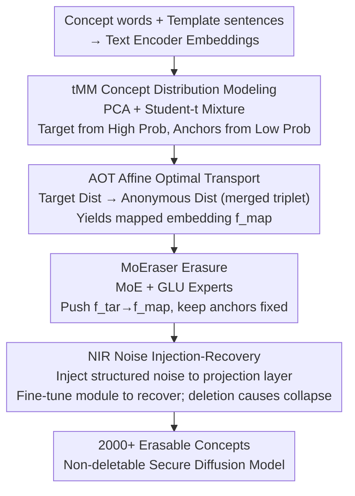

# Erasing Thousands of Concepts: Towards Scalable and Practical Concept Erasure for Text-to-Image Diffusion Models

**Conference**: CVPR 2026  
**Paper**: [CVF Open Access](https://openaccess.thecvf.com/content/CVPR2026/html/Seo_Erasing_Thousands_of_Concepts_Towards_Scalable_and_Practical_Concept_Erasure_CVPR_2026_paper.html)  
**Code**: To be confirmed  
**Area**: Diffusion Models / AI Safety  
**Keywords**: Concept Erasure, Text-to-Image Diffusion, Optimal Transport, MoE, White-box Robustness  

## TL;DR
ETC models each concept as a Student-t Mixture Model (tMM) on text embeddings, uses Affine Optimal Transport (AOT) to map target concepts to an "anonymous" distribution, and automatically samples anchors from distribution boundaries (eliminating manual selection). By employing a MoE-based erasure module, MoEraser, combined with "Noise Injection-Recovery" training, it erases 2000+ cross-domain concepts on SDv1.4 / SDv3.5-L in one go while resisting "module deletion" white-box attacks, achieving SOTA in both scale and precision.

## Background & Motivation
**Background**: Text-to-Image (T2I) diffusion models produce remarkable quality but can also generate portraits of celebrities, copyrighted characters, and protected artistic styles. A primary mitigation strategy is "concept erasure"—erasing target concepts from the model via fine-tuning while preserving the generation capabilities for remaining concepts. Representative methods include FMN (modifying cross-attention), ESD (aligning target/surrogate concepts), UCE/TIME (closed-form updates), MACE/SPM (adding LoRA modules), and CPE (non-linear approach).

**Limitations of Prior Work**: These methods are bottlenecked by "scale"—the number of concepts erasable with stability is often limited to dozens or hundreds, typically verified only within homogeneous domains (e.g., all celebrities). When erasing thousands of concepts across heterogeneous domains (celebrities, characters, styles), two issues arise: incomplete erasure (loss of pin-point precision, affecting unrelated concepts) or degradation of overall image quality.

**Key Challenge**: Erasure must simultaneously satisfy three conflicting objectives—**Scalable**, **Pin-point (modifying only targets)**, and **Robust (resistant to removal)**. Linear modules (MACE/SPM) easily distort non-target concepts and have limited scalability; non-linear external modules (CPE) scale better but suffer from (1) inference overhead proportional to the number of concepts, (2) inability to merge into weights, and (3) failure under white-box attacks where the external module is simply deleted. Furthermore, almost all methods rely on **manual/heuristic anchor selection** to protect remaining concepts, a step that is inherently unscalable.

**Goal**: To increase the number of erasable concepts from hundreds to 2000+ without relying on predefined anchors, sacrificing generation quality, or succumbing to "module deletion" attacks.

**Key Insight**: The author's key observation is that a word's embedding drifts based on its context. Therefore, a single concept should not be viewed as a point, but as a **distribution** in the embedding space. By modeling concepts as distributions, "target embeddings" and "anchor embeddings" can be naturally defined via high/low probability regions, completely eliminating manual selection.

**Core Idea**: A four-part suite—"Concept Distribution Modeling + Affine Optimal Transport (AOT) Mapping + MoE Erasure Module + Noise Injection-Recovery (NIR) Training"—to transform large-scale concept erasure into a scalable, anchor-free, and non-deletable security module.

## Method

### Overall Architecture
ETC operates in two stages. **Stage 1 (Distribution Modeling + Mapping)** is performed offline: For each concept, thousands of template sentences are used to embed concept words through the text encoder to obtain an embedding matrix; after PCA compression, a Student-t Mixture Model (tMM) is fitted. Target embeddings $f_{tar}$ are sampled from high-probability regions, and anchor embeddings $f_{anc}$ are sampled from low-probability boundaries. Then, AOT maps the target distribution to an "anonymous" distribution formed by merging three concepts, resulting in the mapped embedding $f_{map}$. **Stage 2 (Module Training)**: Supervised by the $(f_{tar}, f_{map}, f_{anc})$ triplets, a MoE-based module, MoEraser, is trained to push target embeddings to mapped embeddings while keeping anchors static. Finally, "Noise Injection-Recovery (NIR)" injects structured noise into the text embedding projection layer and fine-tunes MoEraser so that "deleting the module" causes model collapse, ensuring immunity to white-box attacks.

### Key Designs

**1. tMM Concept Distribution Modeling: Heavy-tailed Modeling for Free Anchors**

To address the bottleneck of "unscalable manual anchors," ETC treats concepts as distributions rather than points. Specifically, for a concept $c$, thousands of template sentences (e.g., "As the snow covered the path, {} lit a small fire") are used to generate an embedding matrix $X_c \in \mathbb{R}^{d\times N}$ via the text encoder. Since these embeddings are empirically **low-rank**, they are compressed via PCA to $Z_c \in \mathbb{R}^{d'\times N}$ ($d'\ll d$), followed by fitting a $k$-component Student-t mixture:

$$P_c(z) = \sum_{i=1}^{k} \pi_{c,i}\cdot t(z\mid \mu_{c,i}, \Sigma_{c,i}, \nu_{c,i})$$

A tMM is preferred over a Gaussian Mixture (GMM) because concept embeddings are empirically **heavy-tailed**: embeddings are naturally "in-distribution," and outliers reflecting variability are rare. The light tails of GMM would attribute high concept-strength to low-probability samples, whereas tMM (with degrees of freedom $\nu=2$) allows concept strength to decay proportionally with probability. Once modeled, **samples from high-probability regions serve as target embeddings $f_{tar}$, while samples from low-probability boundaries serve as anchor embeddings $f_{anc}$**. Anchors are sampled directly from the target's own distribution boundaries, requiring no external anchor sets.

**2. AOT Affine Optimal Transport: Mapping to an Anonymous "Nobody" Distribution**

Defining the target is insufficient; one must determine what to "erase it into." Research indicates that the choice of "surrogate concept" determines erasure effectiveness and preservation quality. ETC formulates the "Target → Mapping" as an Optimal Transport problem restricted to an **affine** form:

$$T_{p\mapsto q}(z, V_{pq}) = AV_{pq}z + b,\quad z\sim P_p$$

Where $V_{pq}\triangleq V_q V_p^\top$ aligns embeddings to the correct subspace. Parameters are solved by minimizing the 2-Wasserstein distance:

$$(A^*, b^*)\in\arg\min_{A,b} W_2\big((AV_{pq}z+b)_{\^{\#}P_p,\; P_q\big)$$

Using affine transport provides two benefits: (1) The linear form simplifies subsequent network training; (2) When the mapping target $q$ is a **"concept triplet" (e.g., merging Tom Cruise, Leonardo DiCaprio, and Chris Hemsworth)**, the mapping falls between the three, aligning with no real concept and generating a "nobody" face, thus enhancing safety (Fig.3 shows standard OT maps to a specific real person, while AOT maps to a new face).

**3. MoEraser: MoE-based Module for Concurrent Erasure and Preservation**

Given the $(f_{tar}, f_{map}, f_{anc})$ triplets, a network is trained to learn this mapping. Linear modules or single FFNs lack the capacity for heterogeneous domains. ETC uses a **MoE (Mixture of Experts) with Router**, termed MoEraser (each expert is a Gated Linear Unit (GLU), with top-$2$ routing). The objective is to align target embeddings with $W_{proj.}f_{map}$ after the projection layer $W_{proj.}$, while keeping anchors unchanged:

$$L_{Erase} = \big\|W_{proj.}(\text{MoEraser}(f_{tar})+f_{tar}) - W_{proj.}f_{map}\big\|_2^2 + \lambda\cdot\big\|W_{proj.}(\text{MoEraser}(f_{anc})+f_{anc}) - W_{proj.}f_{anc}\big\|_2^2$$

The module is integrated residually. MoE is chosen because erasure covers heterogeneous domains (celebrities, characters, styles); different experts can handle different domains, maintaining precision as the concept count reaches thousands.

**4. NIR Noise Injection-Recovery: Binding the Erasure Module**

Non-linear external modules typically fail if an attacker removes them. ETC uses "Noise Injection-Recovery (NIR)" to **bind** the module to the model. First, structured noise is injected into the text embedding projection layer to create a corrupted weight:

$$W_{cor.} = W_{proj.} + \alpha_{noise}\cdot e\,p_{tar}^\top$$

Where $p_{tar}$ contains the top-$r$ PCA components of target embeddings and $e\sim\mathcal{N}(0,I)$. This noise perturbs weights **along the target's principal components**, specifically sabotaging target generation so the model cannot produce high-fidelity images without the module. Then, MoEraser is fine-tuned to recover the original embeddings using the corrupted projection layer:

$$L_{NIR} = \big\|W_{cor.}(\text{MoEraser}(f)+f) - W_{proj.}(\text{MoEraser}^*(f)+f)\big\|_2^2$$

Sampling $f$ from $\{f_{tar}, f_{anc}, \epsilon\}$ ensures the model preserves priors outside target/anchor scopes. Consequently: keeping the module results in normal generation with targets erased; deleting the module leaves the projection layer corrupted, making the model unusable.

### Loss & Training
Two-stage losses consist of $L_{Erase}$ (Eq. 5) for erasure/preservation and $L_{NIR}$ (Eq. 7) for noise recovery. Triplets are sampled as $z_{tar}\sim P_{tar}^{(high)}$, $z_{anc}\sim P_{tar}^{(low)}$, and $z_{map}=T_{tar\mapsto map}(z_{tar})$. The mapping concept $q$ is implemented as a merged triplet distribution.

## Key Experimental Results

### Main Results
On SDv1.4, **2,072** cross-domain concepts (949 celebrities + 693 styles + 430 characters) were erased simultaneously, evaluated via a large-scale user study (203 participants, 8120 responses). Metrics: CRS (Concept Retention Score, lower is better for targets / higher for others), QS (Image Quality), $H_0$ (Harmonic Mean of target erasure and other preservation, higher is better).

| Domain / Method | Target CRSt↓ | Target QS↑ | Others CRSr↑ | Others QS↑ | $H_0$↑ |
|------|------|------|------|------|------|
| Celebrity · CPE | 0.164 | 0.436 | 0.544 | 0.667 | 0.659 |
| Celebrity · MACE | 0.396 | 0.613 | 0.468 | 0.701 | 0.527 |
| Celebrity · **ETC** | **0.099** | **0.895** | **0.688** | **0.936** | **0.780** |
| Artwork · CPE | 0.224 | 0.784 | 0.600 | 0.777 | 0.677 |
| Artwork · **ETC** | **0.130** | **0.894** | **0.719** | 0.829 | **0.787** |
| Character · CPE | 0.115 | 0.532 | 0.430 | 0.735 | 0.579 |
| Character · **ETC** | 0.130 | **0.814** | **0.719** | **0.919** | **0.787** |

ETC leads significantly in $H_0$ across all domains (0.78~0.79 compared to CPE's 0.58~0.68) while maintaining quality (QS 0.81~0.94). SAFREE, while maintaining high QS, failed to erase targets (CRSt 0.85+). On **SDv3.5-L (MMDiT architecture)** with 515 concepts, ETC also outperformed SAFREE / SPEED in $H_0$.

Small-scale setting (50 Celebrities, following MACE/CPE protocol):

| Method | Target Acct↓ | Others Accr↑ | $H_0$↑ | COCO FID↓ |
|------|------|------|------|------|
| MACE | 3.29 | 84.64 | 0.903 | 12.40 |
| CPE | 0.37 | 88.26 | 0.936 | 14.13 |
| **ETC** | **0.24** | **89.37** | **0.943** | **13.61** |
| SD v1.4 (Original) | 91.35 | 90.86 | — | 14.04 |

ETC reduced target detection accuracy to 0.24% while retaining 89.37% of other celebrities (close to original 90.86%).

### Ablation Study

| Configuration | Target Acct↓ | Others Accr↑ | Description |
|------|------|------|------|
| Direct mapping + Surrogate | 0.64 | 85.84 | Successful erasure but poor retention |
| GMM + AOT | 8.96 | 89.49 | GMM modeling fails to erase cleanly |
| tMM + Surrogate | 0.17 | 86.48 | Good erasure but weak retention |
| **tMM + AOT (Full)** | **0.24** | **89.37** | Best balance of erasure and retention |
| Anchors: $f_{anc}$ only | 1.12 | 88.53 | Boundary anchors alone weaken erasure |
| Anchors: $f_{anc}$ + noise | **0.24** | **89.37** | Optimal setup for boundary anchors |

### Key Findings
- **tMM and AOT are indispensable**: Replacing tMM with GMM increased target Acct from 0.24 to 8.96. Replacing AOT with a surrogate improved retention from 86.48 to 89.37.
- **Anchor-free is feasible/superior**: Boundary-sampled $f_{anc}$ with Gaussian noise matched or exceeded manual anchor performance, validating that concept distribution boundaries are inherently good anchors.
- **NIR Noise "Structure" determines recovery**: Full-rank noise sabatoged both target and non-target quality after recovery (Accr 79.28), whereas structured noise (along target principal components) accurately restored non-target concepts (Accr 89.37).

## Highlights & Insights
- **"Concept = Distribution" modeling is multi-functional**: It provides natural sources for targets/anchors (high/low probability) and a mathematical interface for mappings (Optimal Transport). It automates the "anchor-picking" chore, enabling scalability to 2000+ concepts.
- **Mapping to merged triplet distributions**: Merging three concepts creates a "nobody" face, merging the "replacement" and "anonymization" goals into one step.
- **NIR "welds" the security module to the weights**: Addressing the fatal flaw of external modules. This "deletion causes self-destruction" logic can be transferred to any plug-in security or watermarking module.
- **MoE is a rational inductive bias for heterogeneous erasure**: Celebrity, character, and style domains are handled by specialized experts, which is more efficient and scalable than increasing single-model capacity.

## Limitations & Future Work
- Large-scale evaluation **depends heavily on user studies**; the paper admits automated metrics like CLIP Score can misinterpret total model degradation as "good erasure."
- AOT is an **affine** mapping; it does not guarantee perfect alignment if the target and mapped distributions vary drastically.
- NIR binds the module to the model, meaning the **model is structurally dependent on the module**. Updating concept sets might require repeating the NIR process.
- Experiments focused on "entity-type" concepts; abstract concepts (composition, NSFW semantic combinations) remain untested.

## Related Work & Insights
- **vs MACE / SPM**: MACE uses linear modules like LoRA, with a scale limit (~hundreds) and non-target distortion. ETC uses non-linear MoE and distribution modeling for 2000+ concepts.
- **vs CPE**: CPE proved non-linear specificity but its modules cannot be merged, add overhead, and are deletable. ETC solves the "deletable" flaw via NIR and the "anchor selection" flaw via tMM+AOT.
- **vs UCE / TIME (Closed-form)**: Closed-form updates suffer from interference in large-scale settings; ETC’s trainable module is significantly more stable.

## Rating
- Novelty: ⭐⭐⭐⭐⭐ "Concept distribution → Boundary anchors → AOT mapping → NIR welding" provides a holistic solution for scale, automation, and robustness.
- Experimental Thoroughness: ⭐⭐⭐⭐ 2000+ concepts across two SD versions is robust, though automated metrics are lacking.
- Writing Quality: ⭐⭐⭐⭐ Clear motivation with logical "Remark" summaries.
- Value: ⭐⭐⭐⭐⭐ First effective erasure of 2000+ cross-domain concepts with a non-bypassable security paradigm.

<!-- RELATED:START -->

## Related Papers

- [\[CVPR 2026\] Neighbor-Aware Localized Concept Erasure in Text-to-Image Diffusion Models](neighbor-aware_localized_concept_erasure_in_text-to-image_diffusion_models.md)
- [\[CVPR 2026\] Prototype-Guided Concept Erasure in Diffusion Models](prototype-guided_concept_erasure_in_diffusion_models.md)
- [\[CVPR 2026\] Beyond Text Prompts: Precise Concept Erasure through Text–Image Collaboration](beyond_text_prompts_precise_concept_erasure_through_text-image_collaboration.md)
- [\[ICLR 2026\] SPEED: Scalable, Precise, and Efficient Concept Erasure for Diffusion Models](../../ICLR2026/image_generation/speed_scalable_precise_and_efficient_concept_erasure_for_diffusion_models.md)
- [\[CVPR 2026\] GrOCE: Graph-Guided Online Concept Erasure for Text-to-Image Diffusion Models](groce_graph-guided_online_concept_erasure_for_text-to-image_diffusion_models.md)

<!-- RELATED:END -->
