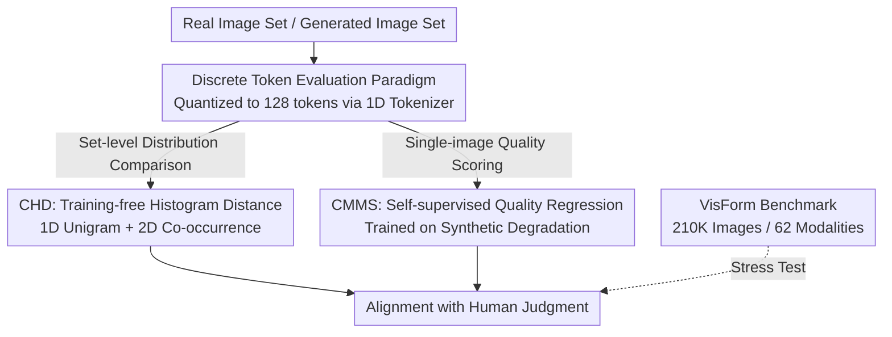

# Evaluating Generative Models via One-Dimensional Code Distributions

**Conference**: CVPR 2026  
**Paper**: [CVF Open Access](https://openaccess.thecvf.com/content/CVPR2026/html/Jia_Evaluating_Generative_Models_via_One-Dimensional_Code_Distributions_CVPR_2026_paper.html)  
**Code**: https://github.com/zexiJia/1d-Distance  
**Area**: Image Generation / Generative Model Evaluation  
**Keywords**: Generative model evaluation, discrete visual tokens, no-reference quality assessment, histogram distance, VisForm benchmark

## TL;DR
The evaluation of generative models is shifted from "continuous recognition features" to "discrete visual tokens." By using a 1D tokenizer to quantize images into token sequences, the authors design a training-free distribution distance (CHD) and a self-supervised no-reference quality score (CMMS). Both achieve state-of-the-art correlation with human judgment across multiple preference benchmarks.

## Background & Motivation

**Background**: Generative model evaluation is historically dominated by FID, which extracts pooled features from Inception-V3 for real and generated images, fits two Gaussian distributions, and calculates the Fréchet distance. Subsequent improvements followed two paths: upgrading the feature space (CLIP-FID, DINO-FID) or distribution assumptions (CMMD using kernel MMD), or directly training scorers on human preference data (HPS, PickScore, Q-Align, DEQA).

**Limitations of Prior Work**: FID-like metrics correlate poorly with human perception. The root cause is that the underlying "recognition features" are **trained for classification**, aiming for invariance to appearance changes (texture, sharpness, local coherence)—the very cues humans are most sensitive to. Furthermore, global average pooling collapses spatial structures, masking local artifacts and compositional failures. Upgrading to CLIP/DINO preserves the "semantic invariance + global pooling" flaw, while MMD-based methods introduce kernel bandwidth sensitivity. Trained preference models require expensive annotations and fail to generalize to new styles.

**Key Challenge**: All existing methods share the design choice of **evaluating generative models in continuous recognition feature spaces**. Recognition features inherently discard appearance information. Formally, recognition training maximizes $I(x_s;\phi(x))$ and suppresses $I(x_a;\phi(x)\mid x_s)$, while the Data Processing Inequality $I(q;x)\ge I(q;\phi(x))$ implies that any compression not optimized for quality $q$ inevitably loses quality information.

**Key Insight**: The authors observe that modern tokenizers (e.g., TiTok) follow the opposite path of recognition features—they are trained for **image reconstruction** and must preserve both semantics and appearance details in a unified, nearly lossless discrete index space. Previous analyses show that individual token positions can decoupingly encode attributes like blur, lighting, and sharpness. Crucially, quality manifests naturally in token statistics: natural images yield highly structured, low-entropy token patterns, while degraded images yield more random, high-entropy patterns ($H(\mathbf{c}\mid q_\text{high})<H(\mathbf{c}\mid q_\text{low})$).

**Core Idea**: Treat the discrete token space as a **first-class evaluation domain**. Evaluation is performed purely on token statistics: frequency (unigram) and local co-occurrence are used to measure distribution fidelity, and self-supervised learning on synthetically degraded token patterns is used to learn single-image quality.

## Method

### Overall Architecture
The framework centers on a common front-end: a TiTok model retrained on 100M images quantizes any $256\times256$ image into $N=128$ discrete tokens (codebook size $|V|=4096$). From this sequence, two paths emerge: **CHD** is a training-free set-level distribution metric comparing token histograms, and **CMMS** is a single-image no-reference quality score using a lightweight regressor trained via self-supervision on synthetic degradations. Finally, the **VisForm** benchmark, spanning 62 visual modalities, is introduced to stress-test these metrics under distribution shifts.

### Key Designs

**1. Discrete Token Evaluation Paradigm: Shifting from "Semantic Invariance" to "Reconstruction Equivariance"**

This step addresses the root cause of FID's failure. By moving to a 1D tokenizer trained for reconstruction, the image is represented as a token sequence $\mathbf{c}=[c_1,\dots,c_N]$. The joint distribution factorizes as $p(\mathbf{c})=\prod_{i=1}^N p(c_i\mid c_{<i})$, preserving rich dependencies usually erased by global pooling. To cover diverse domains (photos, paintings, 3D, medical), TiTok was retrained on 100M DataComp images. Unlike classification features, discrete codes learn equivariant representations that vary predictably with content and style—exactly what is needed for evaluation.

**2. CHD: A Training-free Token Histogram Distance for "Vocabulary" and "Grammar"**

CHD decomposes distribution fidelity into two histogram statistics. **CHD-1D (Visual Vocabulary)**: Calculates the empirical unigram frequency $h_{\mathcal{S}}^{(1)}(v)=\frac{1}{|\mathcal{S}|N}\sum_{I}\sum_{i}\mathbb{I}[c_i(I)=v]$ for an image set $\mathcal{S}$, and uses Hellinger distance to measure the difference between real set $\mathcal{R}$ and generated set $\mathcal{G}$:

$$\text{CHD-1D}(\mathcal{R},\mathcal{G})=\tfrac{1}{\sqrt{2}}\big\|\sqrt{h_{\mathcal{R}}^{(1)}}-\sqrt{h_{\mathcal{G}}^{(1)}}\big\|_2\in[0,1].$$

**CHD-2D (Local Grammar)**: Treats tokens as a grid $\{c(\mathbf{p})\}$ and calculates directional co-occurrence histograms $h_{\mathcal{S}}^{(2)}(u,v;\Delta)$ for displacement vectors $\mathcal{D}=\{(1,0),(0,1)\}$. These are symmetrized and averaged into a sparse co-occurrence distribution $\bar{h}_{\mathcal{S}}^{(2)}(u,v)$. The final CHD is the average: $\text{CHD}=\tfrac{1}{2}(\text{CHD-1D}+\text{CHD-2D})$. The Hellinger distance is chosen for its robustness to sparse histograms.

**3. CMMS: Self-supervised No-reference Quality Scoring via Synthetic Degradation**

CMMS targets single-image scoring without human labels by learning from three types of synthetic degradations: ① **Token Corrosion**: Tokens are replaced by uniform samples $\mathcal{U}(\mathcal{V})$ with probability $p$; ② **Semantic Segment Swapping**: Spatial token blocks are swapped to simulate structural misalignment; ③ **Pixel-space Augmentation**: JPEG compression, noise, and blurring are applied before tokenization. The target quality score is defined by corrosion intensity $p$ using an exponential mapping to mirror human non-linear sensitivity:

$$q(p)=\exp(-20p),\quad p\in[0,0.3].$$

The regressor is a lightweight 2-layer Transformer encoder followed by an MLP, trained only on ImageNet-1K tokens and used zero-shot elsewhere.

**4. VisForm Benchmark: A Stress Test for Distribution Shift across 62 Modalities**

VisForm comprises 210,000 images covering 62 visual modalities (portraits, medical imaging, UI infographics, etc.) generated by 12 representative models. Each image is annotated by experts across 14 dimensions (composition, texture, artifact severity, etc.) with high consistency (Kendall’s $W>0.75$). Importantly, CMMS is never trained or fine-tuned on VisForm to ensure genuine generalization tests.

### Loss & Training
CMMS is trained using AdamW on ImageNet-1K for 200 epochs (<24 hours on A100) with a learning rate of $1\times10^{-4}$ and batch size 512. CHD is entirely training-free. Inference is highly efficient, with CMMS throughput exceeding 1000 images/second.

## Key Experimental Results

### Main Results
Consistency with human judgment was measured on AGIQA, HPDv2, HPDv3, and VisForm using Spearman, Kendall, and N-MSE.

| Dataset | Metric | CHD (Ours) | CMMS (Ours) | Strongest Competitor | Description |
|--------|------|------|------|------|------|
| AGIQA | Spearman↑ | 0.829 | **0.943** | DEQA 0.886 | CMMS significantly leads IQA baselines |
| AGIQA | N-MSE↓ | 0.112 | **0.050** | CMMD 0.142 | CHD outperforms all distribution metrics |
| HPDv3 | Spearman↑ | **0.867** | 0.872 | DINO-FID 0.782 | Both CHD/CMMS lead by a wide margin |
| HPDv3 | N-MSE↓ | **0.017** | 0.018 | KID 0.045 | Error reduced to 1/2 or 1/3 of rivals |

Pairwise Accuracy (percentage of correctly predicted preferred images):

| Preference Model | AGIQA | HPDv2 | HPDv3 | VisForm |
|---------|-------|-------|-------|---------|
| DEQA (CVPR'25) | 68.7 | 70.6 | 52.7 | 63.1 |
| MDIQA | 66.3 | 70.1 | 51.1 | 64.5 |
| **CMMS (Ours)** | **71.5** | **74.9** | **61.3** | **66.7** |

### Ablation Study

| Dimension | Configuration | AGIQA (CHD N-MSE↓ / CMMS Acc↑) | Description |
|------|------|------|------|
| Tokenizer | VQ-VAE (2D token) | 0.268 | 2D tokenizer significantly degrades performance |
| Tokenizer | TiTok (1D token) | **0.112** | 1D tokenizer is the critical prerequisite |
| CHD Components | 1D + 2D | **0.112** | Complementary features yield best results |
| Distance Metric | Hellinger | **0.112** | Most robust for sparse histograms |
| Quality Mapping | exp(−20p) | **71.5** (Acc) | Best alignment with human perception |

### Key Findings
- **1D vs 2D tokenizers are decisive**: Replacing the 1D tokenizer with a 2D VQ-VAE doubles the N-MSE. 1D tokenizers provide compact, decoupled sequences essential for the method.
- **Sample Efficiency**: CHD stabilizes with ~1000 images, making it far more sample-efficient than FID for evaluating expensive models.
- **Sparse Trick**: Using sparse representations for CHD-2D co-occurrence matrices makes the computation of $4096^2$ pairs feasible.

## Highlights & Insights
- **Paradigm Shift in Evaluation Domain**: The most significant contribution is the argument that reconstruction tokens, rather than recognition features, are the proper "home" for quality evaluation.
- **Training-free + Self-supervised**: The combination of CHD (training-free) and CMMS (self-supervised) outperforms models trained on large human-annotated datasets, proving the strength of token-based priors.

## Limitations & Future Work
- **Tokenizer Dependency**: The performance ceiling is dictated by the tokenizer. If the tokenizer fails to reconstruct a specific domain, the statistics become unreliable.
- **Synthetic Gap**: Synthetic degradations may not perfectly mirror the failure modes of specific architectures (e.g., over-smoothing in Diffusion or repetition in AR models).
- **Differentiability**: The paper focuses on set-based ranking; whether these metrics provide benign gradients for direct optimization during training remains unexplored.

## Related Work & Insights
- **vs FID / KID**: FID relies on Gaussian assumptions and is invariant to appearance details. CHD uses Hellinger distance on discrete histograms, preserving spatial co-occurrence and improving N-MSE by 2-3x.
- **vs Human Preference Models (DEQA/Q-Align)**: These models align well but are expensive to train and generalize poorly. CMMS achieves superior preference prediction using zero human labels, suggesting token priors can replace supervision.

## Rating
- Novelty: ⭐⭐⭐⭐⭐ 
- Experimental Thoroughness: ⭐⭐⭐⭐⭐ 
- Writing Quality: ⭐⭐⭐⭐ 
- Value: ⭐⭐⭐⭐⭐ 

<!-- RELATED:START -->

## Related Papers

- [\[CVPR 2026\] A Style is Worth One Code: Unlocking Code-to-Style Image Generation with Discrete Style Space](a_style_is_worth_one_code_unlocking_code-to-style_image_generation_with_discrete.md)
- [\[CVPR 2026\] CaTok: Taming Mean Flows for One-Dimensional Causal Image Tokenization](catok_taming_mean_flows_for_one-dimensional_causal_image_tokenization.md)
- [\[ICML 2026\] Generative Visual Code Mobile World Models](../../ICML2026/image_generation/generative_visual_code_mobile_world_models.md)
- [\[ICML 2025\] Annealing Flow Generative Models Towards Sampling High-Dimensional and Multi-Modal Distributions](../../ICML2025/image_generation/annealing_flow_generative_models_towards_sampling_high-dimensional_and_multi-mod.md)
- [\[CVPR 2026\] Flow Matching for Multimodal Distributions](flow_matching_for_multimodal_distributions.md)

<!-- RELATED:END -->
