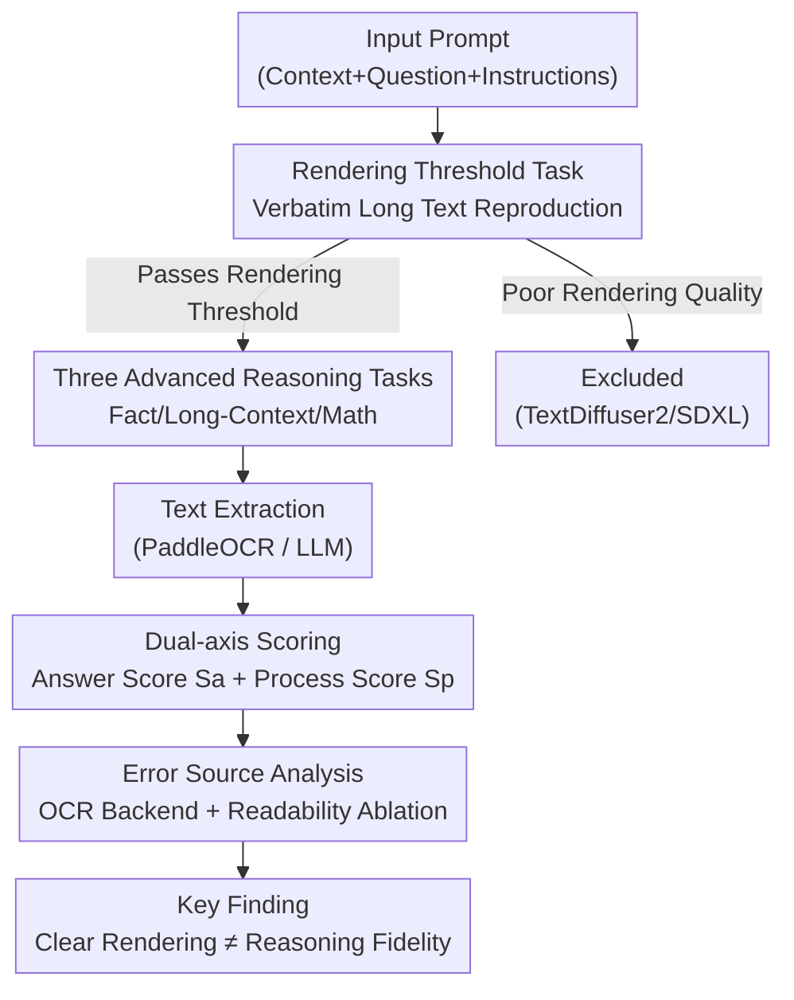

# Evaluating Reasoning Fidelity in Visual Text Generation

**Conference**: CVPR 2026  
**arXiv**: [2606.04479](https://arxiv.org/abs/2606.04479)  
**Code**: None  
**Area**: Image Generation / Visual Text Generation Evaluation  
**Keywords**: Visual Text Generation, Reasoning Fidelity, T2I Evaluation, Process Reward, Error Decoupling

## TL;DR
This is a diagnostic evaluation study: while modern T2I models can render text clearly and aesthetically, the authors investigate whether these models retain the reasoning capabilities of text models when the complete reasoning process must be externalized as visual text. Through a hierarchical evaluation protocol of "filter rendering, then test reasoning," it was discovered that even when text is rendered perfectly, T2I models frequently produce logically inconsistent results and incorrect intermediate steps, revealing a massive reasoning fidelity gap compared to pure-text LLMs.

## Background & Motivation
**Background**: Visual text generation capabilities in T2I models have advanced rapidly. From early SD-1.5/SD-XL, which struggled with short text, to GlyphControl, AnyText, Glyph-ByT5, and the latest GPT-Image/Gemini which can render long, structured document-style text, these advancements have catalyzed applications like document generation, PPT creation, and UI design.

**Limitations of Prior Work**: Existing evaluations almost exclusively focus on **rendering quality**—OCR accuracy, layout fidelity, and multilingual capabilities—repeatedly confirming that "longer text leads to poorer rendering." However, a more critical question remains unaddressed: when a model **directly draws** a multi-step reasoning process into an image, is the output **semantically correct and logically self-consistent**, or does it merely mimic surface-level formatting patterns?

**Key Challenge**: As multimodal systems increasingly produce "text-dense visual outputs" (scenarios like document or UI agents where intermediate text is unavailable and only the final image exists), visual quality alone is insufficient—content must be both semantically correct and logically consistent. In other words, **rendering fidelity $\neq$ reasoning fidelity**, yet the field has only measured the former.

**Goal**: To diagnose the reasoning capabilities of T2I models under the modal constraint where "reasoning must be externalized via visual text," and to cleanly decouple and attribute errors to either "rendering failure" or "reasoning failure."

**Key Insight**: The authors observe that the boundaries between linguistic and visual modalities are blurring. VLMs can take long text rendered as images as input for context compression and reasoning, while T2I models can increasingly generate dense structured text. This implies that "textual information represented, transmitted, and processed via visual channels" is becoming a new paradigm, making it critical to understand whether semantic reasoning remains faithful in visual form.

**Core Idea**: Design a set of tasks that are "trivial for modern LLMs but difficult for T2I models to draw as multi-step reasoning images." Use a hierarchical evaluation protocol to separately measure rendering errors, final answer errors, and intermediate step errors, using pure-text LLMs as the reasoning upper bound to quantify the gap.

## Method

### Overall Architecture
This is essentially a benchmark rather than a new model. The pipeline addresses a core challenge: **When a reasoning task fails, is it because of "poor rendering" or an "inability to reason"?** To solve this, the authors first set a preliminary "verbatim long-text rendering" task as a threshold to filter out models with inadequate rendering capabilities (e.g., TextDiffuser-2, SDXL). Models that pass the threshold proceed to three types of advanced reasoning tasks. The generated images follow a "text extraction via OCR/LLM $\rightarrow$ task-based scoring" pipeline, providing both an **answer score** and a **step-wise process score**. Finally, ablations using different OCR backends and readability metrics are used to exclude "rendering" as a confounding factor, proving that remaining failures stem from reasoning.

### Key Designs

**1. Hierarchical Protocol Decoupling Rendering and Reasoning: Filter First, Test Later**
Testing reasoning tasks directly introduces fatal confounding—a model might fail because the text is unreadable (OCR failure) or because the reasoning is actually wrong. The authors first use a **preliminary rendering task**: randomly sampling 500 text segments from WikiText, truncated into four difficulty levels (64/128/256/512 words). Models are tasked to draw the input verbatim ($t=p$) using a standard "black-on-white text, no LaTeX" template. Results are extracted via PaddleOCR and measured using CER (Character Error Rate), WER (Word Error Rate), and OCR Confidence ACC. Only models with clear rendering proceed; those like TextDiffuser-2 and SDXL, which struggle even with 64 words, are eliminated. This separately validates the "rendering capability" prerequisite, isolating rendering noise at the source.

**2. Dual-axis Scoring: Answer Score $S_a$ + Process Score $S_p$ to Expose "Guesstimate" Success**
The key to reasoning fidelity is not just the "correct final answer" but whether "every intermediate step is correct." A model might produce a random intermediate process yet happen to guess the correct answer. Drawing from process reward model concepts, the authors perform **step-level** evaluation: the question, all preceding steps, and the current step are fed to an LLM judge (GPT-5.2) to determine if the current step is logically/mathematically valid. Each step receives a binary score, and the process score $S_p$ is the average of all steps. Simultaneously, to account for final answers possibly contaminated by rendering errors or overly long reasoning chains, an LLM judge evaluates final answer correctness to obtain $S_a$. The gap between $S_a$ and $S_p$ reveals instances of "correct answer but poor reasoning"—in experiments, Gemini's math task yielded $S_a=0.761$ but $S_p$ only $0.419$, a huge gap indicating frequent guessing.

**3. Three Advanced Reasoning Tasks: Fact, Long-Context, and Math-Based Reasoning**
To ensure generalizability, the authors constructed three categories of tasks that are simple for LLMs but require the T2I model to **explicitly write out intermediate reasoning steps + the final answer** in the image ($t=(r,a)$): Factual Knowledge using ARC (Grade-school science MCQs; 200 Easy/Challenge items, requiring reasoning for each option); Long-Context Understanding using DROP (300 items requiring coreference resolution, counting, or addition over long paragraphs); and Mathematical Reasoning using MATH (500 items across 5 difficulty levels, competition-style multi-step math). The brilliance of this design is that "text models can do these tasks effortlessly"; thus, any T2I failure can be attributed to the modal constraint of "externalizing reasoning as visual text" rather than the task difficulty itself.

**4. Error Source Analysis: OCR Backend Replacement and Readability Metrics**
To counter potential arguments that "low process scores might just be OCR extraction errors," the authors used two sets of ablations: first, replacing PaddleOCR with DeepSeek-OCR, which showed highly consistent CER/WER (e.g., GPT-M CER 0.091 vs 0.096), proving OCR choice has limited impact. Second, using GPT-4.1 to estimate two readability metrics—CCR (Character Clear Rate) and ACR (All Clear Rate). They found that most models have high CCR (GPT-M reached 0.999 on math tasks), meaning the text is actually rendered clearly despite the reasoning failures. CCR was validated against human annotation on 200 samples, showing a Pearson correlation of 0.785 (0.920 after removing 8 outliers). Conclusion: Low process scores cannot be explained by rendering quality; they represent genuine reasoning failure.

## Key Experimental Results

### Main Results
Evaluated models include closed-source GPT-Image-1.5 (low/medium quality denoted as GPT-L/GPT-M), GPT-Image-2, Gemini-2.5-Flash-Image, Flux.2-Pro, and open-source Qwen-Image, SD-XL, TextDiffuser-2. Pure-text LLMs (GPT-5.2, Qwen3-8B) serve as the unconstrained reasoning upper bound. The following is a partial result from Table 1 ($S_a$/$S_p$ higher is better, CER/WER lower is better):

| Model | Rendering CER↓ | Rendering WER↓ | Math $S_a$↑ | Math $S_p$↑ | Long-Ctx $S_p$↑ | Fact $S_p$↑ |
|:---|:---:|:---:|:---:|:---:|:---:|:---:|
| GPT-5.2 (LLM Upper Bound) | 0.0024 | 0.0024 | 0.934 | **0.969** | **0.936** | **0.994** |
| Qwen3-8B (Small LLM) | 0.00004 | 0.0002 | 0.838 | 0.917 | 0.821 | 0.947 |
| GPT-Image-2 (Strongest T2I) | 0.049 | 0.283 | 0.728 | 0.845 | 0.901 | 0.931 |
| GPT-M | 0.091 | 0.347 | 0.520 | 0.615 | 0.822 | 0.919 |
| GPT-L | 0.263 | 0.613 | 0.011 | 0.126 | 0.634 | 0.825 |
| Gemini | 0.506 | 0.732 | 0.761 | 0.419 | 0.438 | 0.319 |
| Qwen-Img | 0.426 | 0.642 | 0.678 | 0.507 | 0.630 | 0.710 |
| Flux.2 | 1.352 | 1.450 | 0.608 | 0.376 | 0.796 | 0.861 |

Key Observations: Even the strongest T2I (GPT-Image-2) significantly trails pure-text LLMs across all tasks, with the largest gaps in difficult tasks. Gemini’s math answer score is 0.761 but its process score is only 0.419, a classic case of "correct answer, wrong reasoning." GPT-L almost completely fails math ($S_a=0.011$), but increasing generation quality to GPT-M jumps $S_a$ to 0.520, showing that rendering quality partially improves reasoning but is far from closing the gap with LLMs.

### Ablation Study

**OCR Backend Replacement (Table 2)**: Validates that evaluation results are insensitive to the choice of OCR.

| Model | PaddleOCR CER↓ | DeepSeek-OCR CER↓ | PaddleOCR WER↓ | DeepSeek-OCR WER↓ |
|:---|:---:|:---:|:---:|:---:|
| GPT-M | 0.091 | 0.096 | 0.347 | 0.351 |
| Gemini | 0.506 | 0.502 | 0.732 | 0.716 |
| Flux.2 | 1.352 | 1.553 | 1.450 | 1.648 |

**Rendering Readability (Table 3)**: Proves that characters are rendered clearly; failures are not due to rendering.

| Model | Text Rendering CCR↑ | Text Rendering ACR↑ | Math CCR↑ | Math ACR↑ |
|:---|:---:|:---:|:---:|:---:|
| GPT-M | 0.998 | 0.905 | 0.999 | 0.938 |
| Gemini | 0.988 | 0.758 | 0.996 | 0.899 |
| Qwen | 0.882 | 0.416 | 0.967 | 0.408 |
| Flux.2 | 0.995 | 0.886 | 0.992 | 0.714 |

### Key Findings
- **Rendering Quality is Decoupled from Reasoning Fidelity**: High CCR scores (e.g., GPT-M at 0.999 for math) indicate characters are drawn clearly, yet process scores still fail frequently—this is the core conclusion.
- **Correct Answer $\neq$ Correct Reasoning**: Most T2I models show significantly higher answer scores than process scores, often guessing the answer while the intermediate steps suffer from logical inconsistencies, hallucinations, or repetition.
- **Difficulty Increases the Gap**: As task difficulty rises, both $S_a$ and $S_p$ drop, with $S_p$ dropping more sharply. The gulf between T2I and LLMs is most apparent in long-context and math tasks.
- **Generation Quality Provides Partial Help**: GPT-M outperforms GPT-L across the board; improving rendering quality reduces rendering-related failures and results in more coherent reasoning chains, but still falls short of pure-text LLMs.

## Highlights & Insights
- **The "Step-wise Threshold" Decoupling Design is Clean**: By separating "can it draw text" and "can it reason" using a preliminary task, the study avoids misinterpreting rendering noise as reasoning failure. This is a paradigmatic approach for evaluating capabilities externalized through a potentially lossy channel.
- **Step-wise Process Score $S_p$ via Process Reward Logic**: Moving beyond final answers to determine logical validity at each step quantifies the "pseudo-reasoning" in T2I models. This is a critical tool for exposing the superficial success of current T2I reasoning.
- **Pure-Text LLM as the Reasoning Upper Bound**: Since the same tasks yield near-perfect scores on LLMs, the T2I deficit is clearly attributed to the "modal constraint" rather than "task difficulty," lending high credibility to the experimental design.
- **Multi-layered Evidence**: By combining OCR backend replacement, VLM-based readability metrics, and human annotation correlation, the authors systematically dismantled potential counterarguments regarding rendering quality.

## Limitations & Future Work
- **End-to-end setting may underestimate true reasoning capabilities**: Models must both generate the image and externalize reasoning as readable text; some models might reason internally but fail to externalize it. Current evaluations cannot probe internal states.
- **Residual Extraction Errors**: Despite rigorous constraints and multi-OCR verification, extracting mathematical symbols and formulas may still impact scoring accuracy (as acknowledged by the authors).
- **Non-exhaustive Rendering Factors**: Due to resource constraints, variables like font size, stroke width, and layout density—which might affect readability and extraction—were not systematically scanned.
- **Model Orientation Bias**: Many T2I models are optimized for natural images or short embedded text. Rendering dense paragraphs or multi-step reasoning is naturally difficult for them.
- **Future Directions**: The authors suggest training specialized T2I distillation variants for "reliable long-text rendering" to serve as more stable platforms for evaluating reasoning fidelity in visual spaces.

## Related Work & Insights
- **Vs. Rendering Quality Benchmarks (TextAtlas5M, STRICT, LeX-Art, GlyphMM-3M)**: These measure OCR accuracy, layout fidelity, and multilingual long-text rendering, generally concluding that longer text is harder to render. Ours ignores *how well* the text is drawn and focuses on whether the *content* is semantically/logically correct.
- **Vs. Multimodal Reasoning Benchmarks (MMMU, MathVista, ChartQA)**: These test the model's ability to **understand** visual inputs (charts, diagrams) to reason. Ours does the opposite, testing the model's ability to **write out** reasoning as visual text.
- **Vs. Reasoning-Augmented Generation (ThinkDiff, GoT, ShortCoTI, PPAD)**: These works attach external planners or CoT modules to T2I models. This paper is diagnostic rather than augmentation-focused—it quantifies the current lack of fidelity to provide a benchmark for such methods.

## Rating
- Novelty: ⭐⭐⭐⭐⭐ First to isolate and evaluate "reasoning fidelity" in visual text generation with a focus on logical consistency.
- Experimental Thoroughness: ⭐⭐⭐⭐ Coverage of 7 T2I and 2 LLM models across four task types with multi-step ablations, though rendering variables were not fully scanned.
- Writing Quality: ⭐⭐⭐⭐ Clear decoupling logic and well-structured arguments.
- Value: ⭐⭐⭐⭐⭐ Highlights the "Rendering $\neq$ Reasoning" gap and sets a benchmark for reasoning-aware visual text generation.

<!-- RELATED:START -->

## Related Papers

- [\[CVPR 2026\] Thinking-while-Generating: Interleaving Textual Reasoning throughout Visual Generation](thinking-while-generating_interleaving_textual_reasoning_throughout_visual_gener.md)
- [\[CVPR 2026\] FontCrafter: High-Fidelity Element-Driven Artistic Font Creation with Visual In-Context Generation](fontcrafter_high-fidelity_element-driven_artistic_font_creation_with_visual_in-c.md)
- [\[CVPR 2026\] UniVerse: Empower Unified Generation with Reasoning and Knowledge](universe_empower_unified_generation_with_reasoning_and_knowledge.md)
- [\[CVPR 2026\] POCA: Pareto-Optimal Curriculum Alignment for Visual Text Generation](poca_pareto-optimal_curriculum_alignment_for_visual_text_generation.md)
- [\[CVPR 2026\] Rethinking Prompt Design for Inference-time Scaling in Text-to-Visual Generation](rethinking_prompt_design_for_inference-time_scaling_in_text-to-visual_generation.md)

<!-- RELATED:END -->
