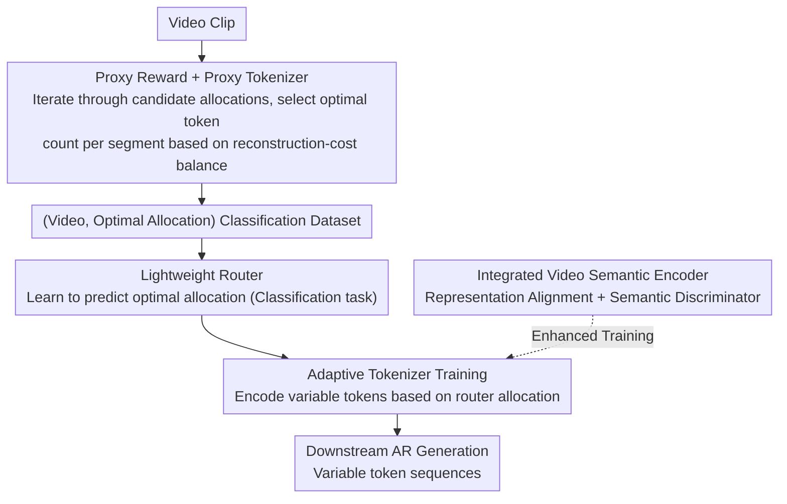

# EVATok: Adaptive Length Video Tokenization for Efficient Visual Autoregressive Generation

**Conference**: CVPR 2026  
**arXiv**: [2603.12267](https://arxiv.org/abs/2603.12267)  
**Code**: [Project Page](https://silentview.github.io/EVATok/)  
**Area**: Video Understanding / Video Generation / Model Compression  
**Keywords**: video tokenizer, adaptive token, autoregressive generation, efficiency, VQ-VAE

## TL;DR
The EVATok framework is proposed, featuring a three-step pipeline—optimal token allocation estimation, a lightweight router, and adaptive tokenizer training. This allows the video tokenizer to adaptively allocate token lengths based on clip complexity, saving over 24.4% of tokens while achieving SOTA generation quality on UCF-101.

## Background & Motivation
Autoregressive (AR) video generation relies on video tokenizers to compress pixels into discrete token sequences. The length of these sequences directly determines the computational cost of downstream generation. Existing video tokenizers allocate a fixed number of tokens uniformly to all temporal blocks, disregarding differences in content complexity. However, information density in videos is highly non-uniform: static backgrounds, repetitive textures, and slow-moving clips contain minimal information, whereas fast motion, scene cuts, and fine textures exhibit high information density.

## Core Problem
Uniform token allocation wastes tokens on simple clips (where reconstruction quality saturates quickly) and provides insufficient tokens for complex clips (leading to poor expression). The challenge lies in adaptively allocating the optimal number of tokens across different videos and clips. Three main hurdles exist: (1) How is "optimal" defined? It requires finding a Pareto optimum between reconstruction quality and efficiency. (2) Optimal allocation varies per video, and per-video optimization is too slow. (3) The tokenizer must be capable of handling variable-length token inputs.

## Method

### Overall Architecture
EVATok addresses the waste caused by uniform allocation in videos with varying information density. The framework enables the tokenizer to adaptively determine the token count for each temporal block. The pipeline consists of three sequential steps: ① Estimating the optimal token allocation for each video to serve as a supervision signal; ② Training a lightweight router to rapidly predict this allocation; ③ Training the final adaptive tokenizer, guided by the router’s allocation, to handle variable token lengths for downstream AR generation. The core difficulty lies in step ①—since "optimal allocation" was previously undefined, this work employs a proxy tokenizer and a proposed proxy reward to convert it into an enumerable optimization problem. An enhancement recipe, integrating a video semantic encoder for representation alignment, is applied throughout the tokenizer training.

### Key Designs

**1. Proxy Reward + Proxy Tokenizer: Defining and Solving "Optimal Allocation"**

To allocate tokens by complexity, one must first determine the "optimal" number for each block. Previous adaptive tokenizers relied on threshold searching or heuristic Integer Linear Programming (ILP) within mini-batches, which lacked global quality-cost balance. This work formalizes this as an "allocation identification problem maximizing proxy reward." The proxy reward characterizes the trade-off between reconstruction quality and token cost (sequence length). To calculate this for any allocation, a proxy tokenizer is first trained to reconstruct videos under various allocations. Then, by iterating through all candidate allocations for a given video, the one with the maximum proxy reward is identified as optimal. This creates a supervision dataset of (Video, Optimal Allocation) pairs for the router, a process that is performed offline only once.

**2. Lightweight Router: Compressing Expensive Enumeration into Forward Prediction**

The enumeration in step ① is too slow for real-time use. To solve this, a small router is trained to predict the optimal allocation directly from video clip features as a classification task. During inference, the router provides the token budget for all clips in a single forward pass with negligible overhead. Experiments show that router predictions align with the true optimal allocation with $>90\%$ consistency, indicating that clip complexity is highly predictable from visual features.

**3. Adaptive Tokenizer: Processing Variable-Length Tokens via Router Allocation**

Standard tokenizers output fixed lengths. This work uses a 1D Q-Former-based tokenizer design (where 1D sequences lack grid spatial priors and are easily adjustable) to train an adaptive tokenizer. During training, the router identifies the allocation for each input video in real-time, teaching the tokenizer to encode and decode effectively under variable budgets. The resulting variable-length token sequences facilitate efficient downstream adaptive AR generation.

**4. Integrated Video Semantic Encoder: Beyond Pixel Fidelity to Semantic Alignment**

This reinforcement recipe ensures that tokens carry robust semantic meaning, preventing bottlenecks in downstream AR generation. Representation alignment from a pre-trained video semantic encoder is introduced during tokenizer training, paired with a semantic video discriminator. Ablation studies show that this integration further reduces FVD, confirming that semantic signals are critical for token quality.

### Loss & Training
- Tokenizer Training: Reconstruction loss (L1/L2 + perceptual loss) + VQ quantization loss + Semantic alignment loss.
- Router Training: Classification/regression loss mimicking the optimal allocation.
- AR Generation Model: Standard autoregressive cross-entropy loss trained on variable-length tokens produced by EVATok.

## Key Experimental Results

| Dataset | Method | FVD↓ | Token Savings |
|-----------|----------|--------|---------------|
| UCF-101 | LARP (Fixed) | Baseline | 0% |
| UCF-101 | **EVATok** | **SOTA** | **≥24.4%** |
| UCF-101 | Fixed baseline | Baseline | 0% |

### Ablation Study
- Adaptive vs. Fixed Allocation: Adaptive allocation achieves significantly lower FVD at the same average token count.
- Router Accuracy: Consistency between router predictions and true optimal allocation is high ($>90\%$), proving predictability.
- Semantic Encoder Integration: Inclusion leads to a further decrease in FVD, highlighting the utility of semantic signals.
- Optimal Token Distribution: Simple clips congregate in the low-token range, while complex clips are distributed in high-token ranges, forming a long-tail distribution.

## Highlights & Insights
- The two-step paradigm—estimating the optimal solution first and then training a router to mimic it—is highly practical for balancing optimality and efficiency.
- A 24.4% token saving directly translates to a 24.4% reduction in AR generation computation, which is valuable for real-world deployment.
- The $>90\%$ prediction accuracy of the router suggests that "clip complexity" is a highly predictable attribute of visual features.
- Integration with semantic encoders demonstrates that token quality is not just a pixel-level concept; semantic-level signals are equally vital.

## Limitations & Future Work
- While the router's overhead is small, it is non-zero; its impact on extremely latency-sensitive scenarios remains to be evaluated.
- Optimal token allocation estimation depends on offline search; generalization to video types outside the training set needs verification.
- Whether variable sequence lengths introduce training instability in AR models needs further investigation.
- Potential extension to image tokenizers, as spatial regions in images also exhibit complexity variances.

## Related Work & Insights
- vs. LARP and other fixed-length tokenizers: EVATok achieves superior quality with fewer tokens.
- vs. TiTok/MAGVIT: EVATok’s core contribution is the adaptive allocation strategy, which can serve as an enhancement to these models.
- vs. TrajTok: While TrajTok focuses on trajectory grouping for understanding, EVATok focuses on token length optimization for generation, making them complementary.

## Related Work & Insights
- The adaptive token allocation framework is directly applicable to visual token compression in VLMs—allocating fewer tokens to simple image regions.
- The design pattern of "router predicting optimal configuration" is reusable for training small models to predict optimal hyperparameters for large models.
- Links with BiGain and TrajTok to form a complete methodology family for visual token efficiency.

## Rating
- Novelty: ⭐⭐⭐⭐ — While adaptive allocation is not entirely new, the systematic three-step framework and its validation in video generation are valuable.
- Experimental Thoroughness: ⭐⭐⭐⭐ — Well-validated on UCF-101, though validation on larger/more diverse datasets is needed.
- Writing Quality: ⭐⭐⭐⭐ — The framework is clearly described, and the three-step process is easy to follow.
- Value: ⭐⭐⭐⭐ — The router + adaptive allocation design pattern is directly referenceable for related research.

<!-- RELATED:START -->

## Related Papers

- [\[CVPR 2026\] Spherical Leech Quantization for Visual Tokenization and Generation](spherical_leech_quantization_for_visual_tokenization_and_generation.md)
- [\[CVPR 2026\] CaTok: Taming Mean Flows for One-Dimensional Causal Image Tokenization](catok_taming_mean_flows_for_one-dimensional_causal_image_tokenization.md)
- [\[CVPR 2025\] Language-Guided Image Tokenization for Generation](../../CVPR2025/image_generation/language-guided_image_tokenization_for_generation.md)
- [\[ICCV 2025\] Efficient Autoregressive Shape Generation via Octree-Based Adaptive Tokenization](../../ICCV2025/image_generation/efficient_autoregressive_shape_generation_via_octree-based_adaptive_tokenization.md)
- [\[CVPR 2025\] Efficient Long Video Tokenization via Coordinate-based Patch Reconstruction](../../CVPR2025/image_generation/efficient_long_video_tokenization_via_coordinate-based_patch_reconstruction.md)

<!-- RELATED:END -->
