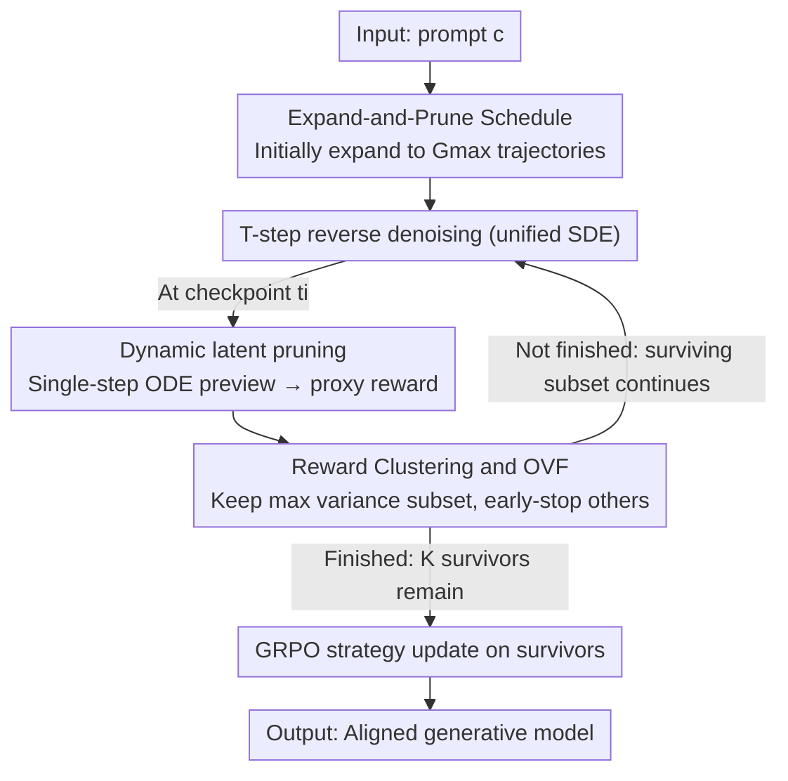

# Expand and Prune: Maximizing Trajectory Diversity for Effective GRPO in Generative Models

**Conference**: CVPR 2026  
**Paper**: [CVF Open Access](https://openaccess.thecvf.com/content/CVPR2026/html/Ge_Expand_and_Prune_Maximizing_Trajectory_Diversity_for_Effective_GRPO_in_CVPR_2026_paper.html)  
**Code**: To be confirmed  
**Area**: Image Generation / Diffusion Models / RLHF Alignment  
**Keywords**: GRPO, Text-to-Image Generation, Trajectory Pruning, Reward Variance, RL Alignment

## TL;DR
Addressing the dilemma in GRPO alignment for generative models where "large groups are effective but computationally prohibitive," this paper discovers that sample trajectories generally collapse towards the group mean reward (reward clustering), rendering advantage signals ineffective. The authors propose Pro-GRPO: during the denoising process, a single-step ODE preview is used to estimate proxy rewards for each trajectory early, dynamically pruning and early-stopping trajectories according to a "maximum variance" criterion. Coupled with an "Expand-and-Prune" schedule, it maximizes trajectory diversity without incurring the computational cost of a large group, achieving both better alignment and a 1.26–1.41× speedup on both diffusion and flow matching text-to-image (T2I) models.

## Background & Motivation

**Background**: Aligning visual generative models with human preferences currently follows the mainstream path of reinforcement learning (PPO / DPO / GRPO). Among these, GRPO is highly favored due to its "group-relative sampling" mechanism—sampling a group of $G$ trajectories for a single prompt and performing normalized advantage estimation directly using the group mean and variance, without training a separate value network. Flow-GRPO, DanceGRPO, etc., reformulate the generation process of diffusion/flow models into equivalent SDEs, making it possible to integrate GRPO into the post-training phase of these T2I models.

**Limitations of Prior Work**: The effectiveness of GRPO heavily relies on a **sufficiently large group size**. Only with a large group can the in-group reward mean and variance stabilize, ensuring reliable advantage estimation and sufficient exploration. However, as the group size scales up, memory and computational overhead expand linearly to unsustainable levels; when the group size is small, advantage estimation becomes unstable, limiting exploration. This trade-off directly bottlenecks model performance.

**Key Challenge**: Through two empirical studies, the authors localize the root cause of this conflict to a neglected phenomenon—**Reward Clustering**. When sampling a group of trajectories for a single prompt, a large number of trajectories have rewards clustered close to the group mean $\mu_G$, resulting in a very small in-group variance $\sigma_G^2$. According to the definition of advantage $A_i = (R_i - \mu_G)/(\sigma_G + \epsilon)$, the advantages of these samples clustered near the mean approach 0. They contribute almost nothing to the gradients while still consuming full computational resources for sampling and denoising. In other words, a significant portion of the computation in large groups is "wasted" on trajectories with no optimization value. Simple random downsampling does not solve this, as randomly drawing $k<G$ trajectories does not increase the variance in expectation, and the clustering remains.

**Goal**: Under a fixed compute budget, preserve the "exploration diversity only available in large groups" while freeing up computation from useless trajectories—effectively decoupling "exploration breadth" from "optimization cost."

**Key Insight**: Since what is truly useful are the high/low extreme samples at the ends of the reward distribution, one should not run all trajectories through the full denoising process before filtering. Instead, **assess trajectories early during the sampling process** to determine which ones are destined to collapse and early-stop them, using the saved computation to "expand" the initial group.

**Core Idea**: Replace a "fixed small group" with an "Expand-and-Prune" approach—first expand the initial sampling group to $G_{\max}$ to maximize trajectory diversity, and then dynamically perform multi-step "maximum variance filtering" using latent-based proxy rewards during denoising, gradually shrinking the group to $K$ surviving trajectories, and finally performing GRPO updates only on these $K$ trajectories.

## Method

### Overall Architecture
Pro-GRPO (Proactive GRPO) shifts the "filtering" from "post-sampling" to "mid-sampling". Given a prompt $c$, it first samples $G_{\max}$ initial latent variables and starts $T$-step reverse denoising (both diffusion and flow matching are unified into the same reverse SDE formulation). At preset checkpoints $t_i$, a **single-step ODE preview** is performed on each surviving trajectory to cheaply predict its final image and compute a proxy reward $\hat R_i$. Then, **OVF (Optimal Variance Filtering)** is used to retain a high-variance subset while **early-stopping** the rest (preventing them from further denoising), gradually shrinking the survival count along a monotonic funnel $K_1=G_{\max} > K_2 > \cdots > K_{I+1}=K$. At the final step $T$, only $K$ surviving trajectories remain. Group-normalized advantages are computed, and GRPO updates are performed on this pruned small set. The final optimization cost scales only with $K$ (instead of $G_{\max}$), thus enabling "the computational cost of a small group with the diversity of a large group."

### Key Designs

**1. Reward Clustering Phenomenon and OVF: Selecting Truly Useful Trajectories using "Maximum Variance"**

This design addresses "why large groups are wasteful, and which trajectories should be kept." The authors first formalize the clustering region as $\mathcal{C}_\delta = \{ i : |R_i - \mu_G| \le \delta\sigma_G \}$, and derive the upper bound on the advantage of samples in this region: $|A_i| = \frac{|R_i-\mu_G|}{\sigma_G+\epsilon} \le \frac{\delta\sigma_G}{\sigma_G+\epsilon} \le \delta$. When the in-group variance $\sigma_G^2$ shrinks, the normalized advantages of these samples vanish. Since the gradient contribution of each trajectory $g_i \propto A_i \nabla_\theta \log\pi_\theta(\tau_i)$ is proportional to the advantage, a large number of collapsed trajectories contribute almost zero to the mini-batch gradient $g = \frac{1}{G}\sum_i g_i$ while still consuming computation. Based on this, the authors propose **OVF (Optimal Variance Filtering)**: given rewards $\{R_g\}_{g=1}^G$ and a target size $k<G$, select the subset that maximizes the in-group variance: $\mathcal{K}^\star = \arg\max_{|\mathcal{K}|=k} \sigma^2(\mathcal{K})$. This criterion naturally favors samples that cover both the high and low extremes of rewards, thereby "de-clustering." Experiments confirm that training on this smaller, higher-variance subset ($k<G$) does not degrade performance but indeed **outperforms** the baseline trained on the full, unfiltered group—this is the "Less is More" phenomenon emphasized by the authors. OVF itself is an a posteriori heuristic filter; its significance lies in simply validating the hypothesis that "high-variance subsets are better," laying the foundation for the subsequent dynamic pruning.

**2. Dynamic Latent Pruning: Advancing Filtering to Mid-Sampling via Single-Step ODE Preview**

Although OVF is effective, it is an **a posteriori** filter—collapsed trajectories must be fully generated before being discarded, meaning the denoising computation is still wasted. This design aims to advance the "filter" to the "middle of sampling." The challenge is: before denoising is complete, how can we know if a trajectory will yield a high reward? The authors' approach is to perform a **single-step deterministic ODE projection** at checkpoint $t_i$ to "preview" the final step: using the probability flow ODE's drift term $b^{\mathrm{ODE}}_\theta$, they project from the current state to the final step: $\mathbf{x}^{(g)}_{T,\mathrm{ODE}} \approx \mathbf{x}^{(g)}_{t_i} + (T-t_i)\, b^{\mathrm{ODE}}_\theta(\mathbf{x}^{(g)}_{t_i}, t_i)$. Then, this preview latent variable is passed through the VAE decoder and the reward model to compute a proxy reward $\hat R_i^{(g)} = R(\mathbf{x}^{(g)}_{T,\mathrm{ODE}}, c)$. At each checkpoint, OVF is applied to select the surviving subset $\mathcal{K}_{i+1}\subseteq\mathcal{K}_i$ with the largest variance ($|\mathcal{K}_{i+1}|<|\mathcal{K}_i|$). **Only the surviving trajectories continue to denoise; the rest are early-stopped immediately, avoiding any further SDE steps.** Repeating this at multiple checkpoints monotonically decreases the number of surviving trajectories. The key to its effectiveness is that the single-step ODE preview is extremely cheap (one noise prediction + one VAE decoding + one reward evaluation) but sufficient to identify low-value trajectories destined to collapse. This directly saves the remaining dozens of denoising steps for these trajectories, and because only the $K$ survivors enter backpropagation, the optimization cost scales with $K$ instead of $G_{\max}$.

**3. Expand-and-Prune Scheduling: Expanding the Pool First, then Shrinking Funnel-style All the Way**

With the financial reassurance that "pruning is virtually free," this design answers "how large the initial group should be." Due to budget constraints, conventional methods can only start with a small group, resulting in a low diversity ceiling. Pro-GRPO does the opposite: **first temporarily expand the initial trajectory pool to $G_{\max} > K$** to maximize coverage of the reward terrain (exploration breadth), **and then prune step-by-step during generation**—repeatedly using OVF at a sequence of checkpoints $0<t_1<\cdots<t_I<T$ to contract, forming a monotonic funnel $K_1=G_{\max} > K_2 > \cdots > K_{I+1}=K$. In this way, exploration benefits from a large initial group, while the effective integration and optimization costs align with the final survival number $K$, thereby delivering stronger learning signals under a fixed compute budget. The specific schedule examples in the paper are intuitive: when benchmarking Flow-GRPO ($G=24$), the standard Pro-GRPO uses $G_{\max}=48$ and prunes at $t=\{5,7\}$ (path $48\to24\to12$); the lightweight Flash version uses $G_{\max}=24$ (path $24\to16\to12$); when benchmarking DanceGRPO ($G=16$, $T=50$), it uses $G_{\max}=48$ and prunes at $t=\{30,40\}$ (path $48\to32\to8$). This "expand-and-prune" process is the core mechanism that decouples "exploration breadth" from "optimization cost."

### Loss & Training
Finally, a group-normalized advantage is computed only on the surviving set $\mathcal{K}_{I+1}$ ($K=|\mathcal{K}_{I+1}|$ trajectories): $\widehat A^{(g)} = \frac{R(\mathbf{x}^{(g)}_T,c) - \mu_{\mathcal{K}_{I+1}}}{\sigma_{\mathcal{K}_{I+1}}+\epsilon}$, where both the mean and variance are calculated solely on the surviving set. The objective function is a PPO-style clipped objective constrained to surviving trajectories plus a KL regularization:

$$\mathcal{J}_{\mathrm{Pro\text{-}GRPO}}(\theta) = \mathbb{E}_c\Big[\tfrac{1}{K}\sum_{g\in\mathcal{K}_{I+1}}\tfrac{1}{T}\sum_{t=0}^{T-1}\min\big(r^{(g)}_t \widehat A^{(g)},\ \mathrm{clip}(r^{(g)}_t,1-\varepsilon,1+\varepsilon)\widehat A^{(g)}\big)\Big] - \beta\, D_{\mathrm{KL}}(\pi_\theta \| \pi_{\mathrm{ref}})$$

where $r^{(g)}_t$ is the step-by-step importance ratio of the current policy over the old policy under the Gaussian policy discretized by Euler-Maruyama. The entire process is unified into the same reverse SDE form across both diffusion and flow matching backbones, facilitating general applicability. ⚠️ Please refer to the original paper for exact mathematical details.

## Key Experimental Results

Experiments are conducted on two generation paradigms: Stable Diffusion v1.4 (diffusion, 8×A100) and SD 3.5-Medium (flow matching, 24×A100), benchmarking against DanceGRPO and Flow-GRPO respectively. The rewards are unified using HPSv2.1 / CLIP Score / PickScore, and evaluated on DrawBench and HPSv2.

### Main Results

Flow Matching Model (SD 3.5-M, DrawBench, trained on PickScore):

| Model | Speedup | PickScore↑ (In-domain) | Aesthetic↑ | ImageReward↑ | PickScore↑ (Out-of-domain) | HPSv2.1↑ |
|------|--------|------|------|------|------|------|
| SD 3.5-M (Base) | - | - | 5.408 | 0.852 | 22.425 | 0.280 |
| Flow-GRPO | 1.00× | 23.322 | 5.912 | 1.298 | 23.599 | 0.316 |
| Pro-GRPO-Flash | 1.41× | 23.722 | 6.030 | 1.381 | 23.868 | 0.319 |
| **Pro-GRPO (Ours)** | 1.26× | **24.008** | **6.046** | **1.397** | **24.108** | **0.322** |

The standard Pro-GRPO achieves +0.686 on PickScore and +0.134 on Aesthetic, while saving 26% computation (1.26× speedup). The lightweight Flash version still outperforms the Flow-GRPO baseline with a 1.41× speedup (DrawBench PickScore 23.722 vs 23.322), validating the benefit of "mid-sampling pruning" on its own.

For the diffusion model (SD-v1.4, DrawBench, benchmarked against DanceGRPO): Under a single-target (HPSv2.1) setting, Pro-GRPO achieves 0.391 in-domain vs. DanceGRPO's 0.369, and 1.114 vs. 1.079 out-of-domain ImageReward (HPSv2). Under a multi-target (HPSv2.1+CLIP) setting, Pro-GRPO completely dominates on out-of-domain metrics across both datasets.

Semantic Alignment (GenEval, all fine-tuned solely on PickScore, GenEval not involved in training):

| Model | Overall↑ | Two Obj.↑ | Colors↑ | Position↑ |
|------|------|------|------|------|
| SD 3.5-M (Base) | 0.696 | 0.869 | 0.817 | 0.248 |
| Flow-GRPO | 0.719 | 0.942 | 0.851 | 0.288 |
| **Pro-GRPO** | **0.726** | **0.947** | **0.867** | **0.323** |

The improvement in Position is the most significant (+0.035), demonstrating that variance-aware pruning produces trajectories with clearer semantic signals and stronger spatial reasoning/compositional binding. The consistent improvement on the unseen benchmark indicates that it does not overfit to the reward.

Computation Analysis (calflops full epoch FLOPs):

| Method | FLOPs (T)↓ | Speedup↑ |
|------|------|------|
| Flow-GRPO (Baseline) | 453474.18 | 1.00× |
| Pro-GRPO (Standard) | 335626.82 | 1.26× |
| Pro-GRPO (Flash) | 267365.79 | 1.41× |

Since only the surviving set $K$ enters backpropagation, optimization costs scale with $K$ instead of $G_{\max}$, reducing FLOPs by 26% / 41% respectively.

### Ablation Study

| Configuration | Key Metric | Description |
|------|---------|------|
| Initial Group $G_{\max}=32\to8$ | In-domain HPSv2.1 0.386 | Pool size too small |
| Initial Group $G_{\max}=48\to8$ | In-domain HPSv2.1 0.391 | Standard setting |
| Initial Group $G_{\max}=64\to8$ | In-domain HPSv2.1 0.393 | Diminishing returns (out-of-domain HPSv2.1 saturates at 0.383) |
| Pruning Steps $(t_1,t_2)=(10,20)$ | In-domain HPSv2.1 0.373 | Pruning too early |
| Pruning Steps $(20,30)$ | In-domain HPSv2.1 0.382 | Intermediate |
| Pruning Steps $(30,40)$ (Ours) | In-domain HPSv2.1 0.391 | Optimal trade-off |

### Key Findings
- **Larger initial groups are better but yield diminishing returns**: With the survivor size fixed at $K=8$, increasing $G_{\max}$ from 32 $\to$ 48 $\to$ 64 continuously improves most metrics. However, the marginal gains from 48 $\to$ 64 decrease significantly, with out-of-domain HPSv2.1 saturating at 0.383. This indicates that expanding beyond a "sufficiency threshold" is of little significance. Fortunately, pruning guarantees that optimization costs are bound only to $K$, allowing users to "boldly expand the initial group without incurring proportional computation."
- **Pruning checkpoints should be late rather than early** (under $T=50$, path $32\to8$): Delaying the checkpoints is beneficial (e.g., $(30,40)$ outperforms $(10,20)$, with in-domain HPSv2.1 at 0.391 vs. 0.373, and out-of-domain PickScore at 22.075 vs. 21.711). The authors explain that early checkpoints can discard obviously low-value samples to save computation, while late checkpoints refine the surviving set after the latent variables carry richer semantics—combining both stages works best.
- **"Less is More" is validated in multiple aspects**: The learning signal from the smaller, high-variance subset is stronger than that of the full, unfiltered group. This is consistently validated by main tables, training curves (showing faster convergence and a higher plateau), and the unseen GenEval benchmark.

## Highlights & Insights
- **Precisely Pinpoints the "Compute Waste" of GRPO to Reward Clustering and Provides a Provable Advantage Decay Bound**: The upper bound $|A_i|\le\delta$ builds a solid causal chain of "collapse $\rightarrow$ vanishing advantage $\rightarrow$ no gradient contribution." The motivation is mathematically grounded rather than just a vague concept of "improving diversity."
- **Highly Clever Use of Single-Step ODE Previews as "Cheap Reward Probes"**: Performing a single-step deterministic extrapolation + decoding + scoring in the middle of denoising provides an early estimate of the final reward. This converts expensive post-hoc filtering into virtually free mid-sampling filtering. This trick can be transferred to any "trajectory-style generation + RL alignment" scenarios (e.g., video generation, long-sequence sampling).
- **Decoupling Exploration Breadth from Optimization Cost is the Core Insight**: Traditionally, it was believed that "maximizing diversity requires paying for large group computation." This paper decouples the two using Expand-and-Prune—expansion only exists in the first few steps, and optimization only happens on the surviving set, making it possible to achieve both simultaneously.
- **Unified Method across Diffusion and Flow Matching**: Expressing both backbones in a unified reverse SDE formulation enhances generalizability.

## Limitations & Future Work
- **The accuracy of proxy rewards from single-step ODE previews is a key assumption**: Since latent semantics are insufficient at very early checkpoints, preview rewards might lead to misjudgments (as shown by performance drops in early-pruning ablations). The paper mitigates this by "late pruning," but lacks a correlation analysis between the preview rewards and true final rewards. ⚠️ The reliability of this assumption is subject to the original text and appendix.
- **Introduces several hyperparameters to tune**: $G_{\max}$, checkpoint locations $\{t_i\}$, and the funnel contraction path must be reconfigured for different backbones/sampling steps $T$ (different schedules are used for Flow-GRPO and DanceGRPO in the paper), leading to tuning overhead during practical migration.
- **Each checkpoint requires extra VAE decoding + reward model runs**: While the preview overhead is small (2.49 T FLOPs per VAE, 0.34 T FLOPs per reward), the cumulative overhead of previews can be a trade-off if there are many checkpoints or long trajectories.
- **Only evaluated on T2I**: While the method itself is modality-agnostic, whether it remains equally cost-effective on longer/more expensive generation trajectories (e.g., video, 3D) remains to be verified.

## Related Work & Insights
- **vs. Flow-GRPO**: Flow-GRPO reformulates flow model generation into SDEs to utilize GRPO, but still relies on a fixed large group and treats all trajectories equally during training. Pro-GRPO introduces "mid-sampling pruning + Expand-and-Prune" over it, achieving better accuracy (PickScore 24.008 vs. 23.322) and faster speed (1.26×) under the same reward signal. The advantage comes from the training strategy rather than the reward.
- **vs. DanceGRPO**: Similarly a GRPO alignment baseline for flow/diffusion. Pro-GRPO consistently outperforms it on both in-domain and out-of-domain metrics in single-target and multi-target settings, with more stable margins in multi-target (HPS+CLIP) setups.
- **vs. Random Downsampling**: Randomly drawing $k<G$ trajectories does not increase variance in expectation and preserves collapse. Pro-GRPO selectively picks extreme values at both ends using the maximum variance criterion, resulting in "targeted" downsampling.
- **Insight**: "Using cheap probes mid-generation for early assessment and pruning based on variance/value" is a highly generalizable paradigm. Any RL alignment utilizing "in-group sampling + advantage normalization" (not limited to images) can leverage Expand-and-Prune to shift compute from useless samples to exploration, provided there is uneven sample value.

## Rating
- **Novelty**: ⭐⭐⭐⭐⭐ Starting from the "reward clustering" phenomenon, the authors transform post-hoc filtering into "mid-sampling pruning + Expand-and-Prune." Both the perspective and mechanism are novel.
- **Experimental Thoroughness**: ⭐⭐⭐⭐ Covers two generation paradigms (diffusion and flow matching), multiple benchmarks, computation analysis, and two sets of key ablations. It is quite solid, though a detailed reliability analysis of the preview reward is somewhat lacking.
- **Writing Quality**: ⭐⭐⭐⭐⭐ The logical flow from empirical observation $\rightarrow$ hypothesis validation (OVF) $\rightarrow$ dynamic framework (Pro-GRPO) is clear, with equations and diagrams well-integrated.
- **Value**: ⭐⭐⭐⭐⭐ Directly addresses the computational bottleneck of GRPO in aligning generative models. The method is general, plug-and-play, and holds practical value for reinforcement learning from human feedback (RLHF) post-training.

<!-- RELATED:START -->

## Related Papers

- [\[CVPR 2026\] DiverseGRPO: Mitigating Mode Collapse in Image Generation via Diversity-Aware GRPO](diversegrpo_mitigating_mode_collapse_in_image_generation_via_diversity-aware_grp.md)
- [\[CVPR 2026\] Fine-Grained GRPO for Precise Preference Alignment in Flow Models](fine-grained_grpo_for_precise_preference_alignment_in_flow_models.md)
- [\[CVPR 2026\] Neighbor GRPO: Contrastive ODE Policy Optimization Aligns Flow Models](neighbor_grpo_contrastive_ode_policy_optimization_aligns_flow_models.md)
- [\[ICLR 2026\] TempFlow-GRPO: When Timing Matters for GRPO in Flow Models](../../ICLR2026/image_generation/tempflow-grpo_when_timing_matters_for_grpo_in_flow_models.md)
- [\[CVPR 2026\] GRPO-Guard: Mitigating Implicit Over-Optimization in Flow Matching via Regulated Clipping](grpo-guard_mitigating_implicit_over-optimization_in_flow_matching_via_regulated_.md)

<!-- RELATED:END -->
