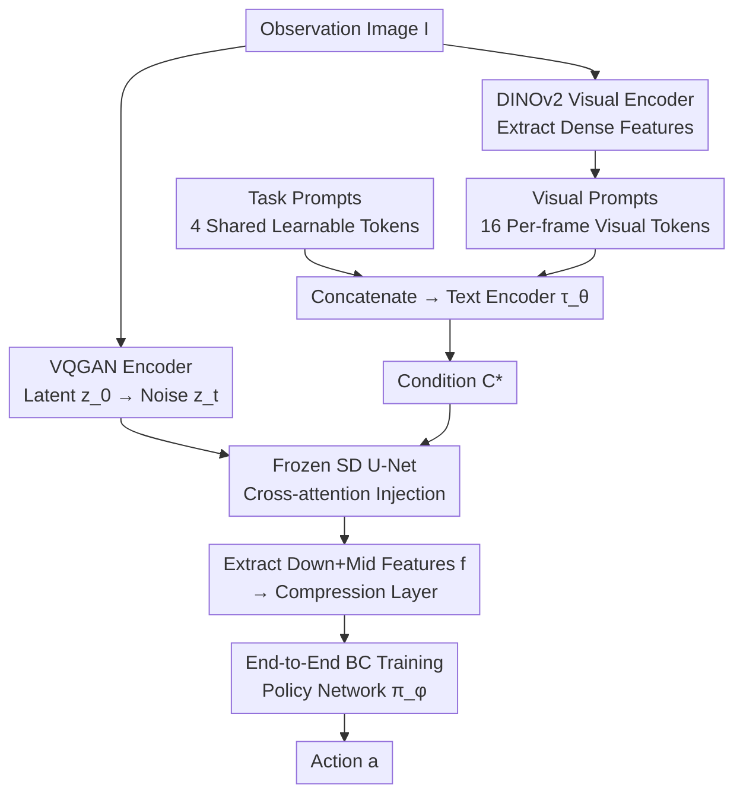

# Exploring Conditions for Diffusion Models in Robotic Control

**Conference**: CVPR 2026  
**arXiv**: [2510.15510](https://arxiv.org/abs/2510.15510)  
**Code**: [https://orca-rc.github.io/](https://orca-rc.github.io/)  
**Area**: Diffusion Models / Robotic Control  
**Keywords**: Diffusion Models, Robotic Control, Visual Representation, Task Adaptation, Learnable Prompts

## TL;DR
This paper explores how to use the conditioning mechanism of pre-trained text-to-image diffusion models to generate task-adaptive visual representations for robotic control. It finds that text conditions are ineffective in control environments due to domain gaps. The proposed ORCA framework introduces learnable task prompts and per-frame visual prompts as conditioning mechanisms, achieving SOTA on 12 tasks across DMC, MetaWorld, and Adroit benchmarks.

## Background & Motivation

1.  **Background**: Pre-trained visual representations (e.g., CLIP, VC-1, MVP) have become a standard paradigm for imitation learning—using frozen pre-trained encoders to extract features while the downstream policy network learns the mapping from features to actions. Meanwhile, diffusion models (e.g., Stable Diffusion) have demonstrated powerful representation capabilities in perception tasks like semantic segmentation and depth estimation, achieving task adaptation via text conditions.

2.  **Limitations of Prior Work**: (a) Frozen visual representations are task-agnostic—performance fluctuates across different control tasks, requiring manual per-task selection; (b) Fine-tuning visual encoders leads to severe overfitting due to the scarcity of imitation learning data; (c) Text conditions work well for visual perception (e.g., describing objects in VPD improves segmentation) but are negligible or harmful in control environments.

3.  **Key Challenge**: A significant domain gap exists between control environments and diffusion model training data (web images), leading to a failure in text-image alignment. Furthermore, control tasks involve dynamic video streams rather than static images, requiring fine-grained per-frame conditions instead of global descriptions.

4.  **Goal**: How to design conditioning mechanisms for diffusion models suited for robotic control to generate task-adaptive visual representations without fine-tuning the model itself?

5.  **Key Insight**: Analysis of cross-attention maps reveals a "grounding failure" for text conditions in control—for instance, the word "cheetah" fails to form correct attention on a MuJoCo-rendered cheetah. Therefore, conditions should (a) adapt to the control environment and (b) contain per-frame visual information.

6.  **Core Idea**: Replace text conditions with learnable task prompts to adapt to the control environment, and introduce per-frame visual prompts based on a visual encoder to capture dynamic details. Both are learned end-to-end via an imitation learning objective.

## Method

### Overall Architecture
ORCA aims to enable a frozen text-to-image diffusion model to output "fit-for-purpose" visual features for each robotic task without fine-tuning the model parameters. The pipeline works as follows: an observation image $I$ is encoded into a latent $z_0$ via a VQGAN encoder, noise is added at timestep $t=0$ to get $z_t$, which is fed into the Stable Diffusion U-Net. Simultaneously, a set of task prompts and per-frame visual prompts are concatenated and passed through a text encoder to generate conditions $\mathcal{C}^*$ injected into the U-Net via cross-attention. Intermediate features $f$ are extracted from the downsampling and bottleneck layers of the U-Net, processed by a compression layer, and sent to the policy network $\pi_\phi$ to output actions. The diffusion model weights remain frozen; only the prompts, compression layer, and policy network are trainable. The condition $\mathcal{C}^*$ is the pivot: by changing it, the same frozen model provides different features for different tasks.

### Key Designs

**1. Task Prompts: Replacing Failed Text Conditions with Learnable Tokens**
While text-to-image models rely on text for task adaptation, this fails in control environments as MuJoCo-rendered "cheetahs" differ vastly from web images. The cross-attention for the word "cheetah" cannot ground to the agent. ORCA bypasses explicit text by using $l_t = 4$ learnable tokens shared across all observations of a task to learn an implicit "vocabulary." These tokens are optimized via the imitation learning loss $\mathcal{L}_{\text{BC}}$, allowing cross-attention to automatically focus on task-relevant regions: e.g., focusing on both the button and the arm in *Button-press*, or the entire body in *Cheetah-run*. This avoids grounding failures and manual description efforts.

**2. Visual Prompts: Supplementing Per-Frame Spatial Details**
Task prompts are shared across the dataset and only encode "what the task is," failing to describe the agent's specific pose in a single frame. Since control requires fine-grained actions based on dynamic streams, ORCA uses a pre-trained DINOv2 visual encoder $\mathcal{E}_V$ to extract **dense** visual features (rather than a global vector). These are projected into $l_v = 16$ visual tokens via a small convolutional layer and concatenated with task prompts. Dense features are crucial for distinguishing local movements (e.g., front vs. back legs), whereas global vectors lose spatial layout. Visualization shows different visual tokens attending to the hand, table, or ball at different stages of the *Relocate* task. Task prompts handle "what to do," while visual prompts handle "what is happening now."

**3. End-to-End BC Training: Learning Conditions Only**
The prompts and policy network are learned together. Given demonstration trajectories $\{I_o^i, a_o^i\}$, the objective is:
$$\mathcal{L}_{\text{BC}}(\phi, \mathbf{p}) = \sum_{i,o} \big\|\pi_\phi\big(\epsilon_\theta(z_t, t; \mathcal{C}^*)\big) - a_o^i\big\|, \qquad \mathcal{C}^* = \tau_\theta(p_t; p_v)$$
where $p_t, p_v$ are task and visual prompts, and $\tau_\theta$ is the text encoder. The diffusion model $\epsilon_\theta$ remains frozen, with only 10.6M trainable parameters. Full fine-tuning causes extreme overfitting due to small sample sizes (success rate dropped from 58% to 9.3% in experiments). By compressing adaptation into lightweight prompts, the model allows for task-adaptation and prevents overfitting.

### Loss & Training
- Standard Behavior Cloning (BC) L1/L2 loss.
- Uses Stable Diffusion 1.5, timestep $t=0$.
- Concatenates features from downsampling blocks (down_1-3) and the bottleneck (mid).
- Trained for 100 epochs per task; evaluated online every 10 epochs.
- 2 demos for Adroit, 5 for DMC, 5 for MetaWorld.

## Key Experimental Results

### Main Results

**DeepMind Control Normalized Score**:

| Method | Stand | Walk | Reacher | Cheetah | Finger | Mean |
|------|-------|------|---------|---------|--------|------|
| CLIP | 87.3 | 58.3 | 54.5 | 29.9 | 67.5 | 59.5 |
| VC-1 | 86.1 | 54.3 | 18.3 | 40.9 | 65.7 | 53.1 |
| SCR (null cond.) | 85.5 | 64.3 | 81.8 | 43.4 | 66.6 | 68.3 |
| CoOp | 87.2 | 67.8 | 87.1 | 45.0 | 65.9 | 70.6 |
| TADP | 89.0 | 69.9 | 86.6 | 41.1 | 66.9 | 70.7 |
| **ORCA** | **89.1** | **76.9** | **87.6** | **50.0** | **68.0** | **74.3** |

**Adroit Success Rate (%)**:

| Method | Pen | Relocate | Mean |
|------|-----|----------|------|
| VC-1 | 65.3 | 29.3 | 47.3 |
| SCR | 84.0 | 32.0 | 58.0 |
| TADP | 81.3 | 33.3 | 57.3 |
| **ORCA** | **86.7** | **44.0** | **65.3** |

### Ablation Study

**Component Analysis (DMC)**:

| Task Prompt | Visual Prompt | Mean Score |
|:-----------:|:------------:|:----------:|
| ✗ | ✗ | 68.3 |
| ✓ | ✗ | 69.8 |
| ✗ | ✓ | 70.5 |
| ✓ | ✓ | **74.3** |

**Fine-tuning vs. Prompt Learning (Adroit)**:

| Method | Trainable Params | Mean |
|------|-----------|------|
| SCR (frozen) | - | 58.0 |
| SCR + Full FT | 346.7M | 9.3 |
| SCR + LoRA | 4.6M | 60.0 |
| ORCA | 10.6M | **65.3** |

### Key Findings
- **Text conditions are unreliable in control**: Performance improves in some tasks (Button-press) but drops in others (Cheetah-run) due to grounding failure.
- **Task and visual prompts are complementary**: Each alone improves scores by 1.5-2.2 points, but combined they gain 6 points (68.3 to 74.3).
- **Full fine-tuning is catastrophic**: Success rates crashed for SCR when fully fine-tuned, whereas ORCA’s 10.6M parameter prompt learning reached 65.3%.
- **Early U-Net layers are better for control**: Features from downsampling and bottleneck layers outperform upsampling layers as they encode higher-level semantic information.

## Highlights & Insights
- **Grounding Failure Analysis**: Visualizing cross-attention maps clearly demonstrates how domain gaps prevent text from attending to agents. This is a critical warning for using VLMs in control.
- **Task Prompts as Implicit Descriptions**: Learnable tokens discover task-relevant regions automatically, avoiding the pitfalls of manual text design.
- **Dynamic Visual Attention**: Visual tokens attend to different areas based on task stage (e.g., ball vs. hand in *Relocate*), showing the model learns to shift focus based on temporal progress.

## Limitations & Future Work
- **Reliance on SD 1.5**: Newer architectures like DiT might require different conditioning logic.
- **Visual Encoder Choice**: Lack of detailed ablation on other encoders like MAE or CLIP.
- **Simulation Only**: Performance remains to be verified on real-world robotic hardware.
- **Action Space**: Primarily focused on continuous control; long-horizon tasks are not yet explored.

## Related Work & Insights
- **vs. SCR**: SCR uses null conditions (task-agnostic). ORCA's adaptive conditions improve the DMC Mean from 68.3 to 74.3.
- **vs. VPD/TADP**: While text conditions work for visual perception in VPD, they fail in control because control environments are not natural images found in web data.
- **vs. VC-1**: VC-1 is a strong task-agnostic representation. ORCA outperforms it across all tasks, proving that task-adaptive representations are superior to massive task-agnostic pre-training.

## Rating
- Novelty: ⭐⭐⭐⭐
- Experimental Thoroughness: ⭐⭐⭐⭐⭐
- Writing Quality: ⭐⭐⭐⭐⭐
- Value: ⭐⭐⭐⭐

## Related Papers

- [\[CVPR 2026\] Guiding Diffusion Models with Semantically Degraded Conditions](guiding_diffusion_models_with_semantically_degraded_conditions.md)
- [\[CVPR 2026\] Image Generation as a Visual Planner for Robotic Manipulation](image_generation_as_a_visual_planner_for_robotic_manipulation.md)
- [\[CVPR 2026\] Pixel Motion Diffusion Is What We Need for Robot Control](pixel_motion_diffusion_is_what_we_need_for_robot_control.md)
- [\[CVPR 2026\] Guiding Diffusion Models with Fine-Grained Conditions and Semantics-Preserving Sampling for One-Shot Federated Learning](guiding_diffusion_models_with_fine-grained_conditions_and_semantics-preserving_s.md)
- [\[CVPR 2026\] Exploring Spatial Intelligence from a Generative Perspective](exploring_spatial_intelligence_from_a_generative_perspective.md)

<!-- RELATED:END -->

<!-- RELATED:START -->

## Related Papers

- [\[CVPR 2026\] Guiding Diffusion Models with Semantically Degraded Conditions](guiding_diffusion_models_with_semantically_degraded_conditions.md)
- [\[CVPR 2026\] Guiding Diffusion Models with Fine-Grained Conditions and Semantics-Preserving Sampling for One-Shot Federated Learning](guiding_diffusion_models_with_fine-grained_conditions_and_semantics-preserving_s.md)
- [\[CVPR 2026\] Exploring Spatial Intelligence from a Generative Perspective](exploring_spatial_intelligence_from_a_generative_perspective.md)
- [\[CVPR 2026\] Pixel Motion Diffusion Is What We Need for Robot Control](pixel_motion_diffusion_is_what_we_need_for_robot_control.md)
- [\[NeurIPS 2025\] OmniVCus: Feedforward Subject-driven Video Customization with Multimodal Control Conditions](../../NeurIPS2025/image_generation/omnivcus_feedforward_subject-driven_video_customization_with_multimodal_control_.md)

<!-- RELATED:END -->
