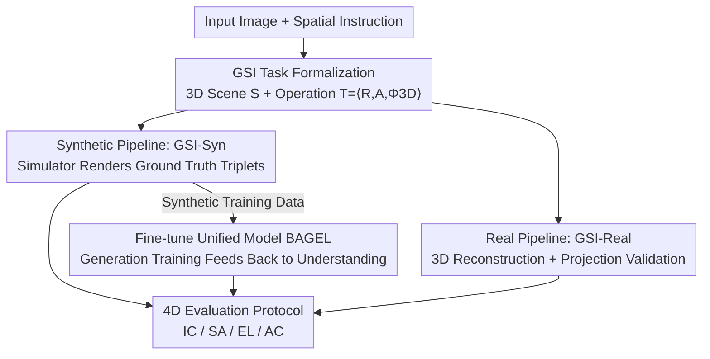

# Exploring Spatial Intelligence from a Generative Perspective

**Conference**: CVPR 2026  
**arXiv**: [2604.20570](https://arxiv.org/abs/2604.20570)  
**Code**: To be confirmed  
**Area**: Image Generation / Image Editing / Multimodal VLM / Spatial Intelligence  
**Keywords**: Generative Spatial Intelligence, Spatial Editing, 3D Priors, Synthetic Benchmarking, Unified Multimodal Models  

## TL;DR
This paper introduces the concept of "Generative Spatial Intelligence" (GSI)—the ability of unified multimodal models to adhere to and manipulate 3D spatial constraints during image generation. The authors construct the first quantitative benchmark, GSI-Bench (comprising the real-world set GSI-Real and the synthetic set GSI-Syn), evaluated via space-anchored image editing tasks. Furthermore, it demonstrates that fine-tuning BAGEL solely on synthetic editing data significantly improves generative spatial editing and, crucially, transfers back to enhance the model's spatial "understanding" capabilities.

## Background & Motivation

**Background**: Spatial intelligence—reasoning about objects, scenes, and their geometric relationships—is a cornerstone for multimodal large models moving toward embodied navigation and robotic manipulation. However, almost all current spatial intelligence datasets, benchmarks, and modeling methods adopt an "understanding" perspective, utilizing identification/QA supervision, 2D/3D perception pipelines, and offline diagnostic test sets. Meanwhile, as unified multimodal models (performing both understanding and generation) emerge, existing evidence suggests that "stronger understanding can conversely improve generation quality."

**Limitations of Prior Work**: The reverse direction remains largely unexplored—**can generation itself help a model grasp spatial concepts more deeply, thereby enhancing understanding**? Answering this requires evaluation tools, yet existing editing datasets (e.g., those derived from ScanNet++) lack precise spatial operation annotations. Moreover, spatial operations between pair-wise images, such as "move the apple 15cm to the left," are difficult to describe using unambiguous natural language.

**Key Challenge**: While Text-to-Image (T2I) generation implicitly involves spatial reasoning, open-ended prompts introduce ambiguity and lack a unique ground-truth target, making objective quantification of spatial consistency impossible. To quantify spatial capability, tasks must be constrained to a format with a unique correct answer: "Given Input Image + Explicit Spatial Instruction $\rightarrow$ Generate Output Image satisfying constraints."

**Goal**: This is decomposed into three sub-questions: (1) Do modern generative/unified models possess GSI? (2) Can GSI be measured reliably, scalably, and in a model-agnostic manner? (3) Can GSI be enhanced through targeted interventions, and does this enhancement transfer to downstream spatial understanding tasks?

**Key Insight**: Explicitly modeling every scene as an implicit 3D structure (object layout + camera parameters) allows "spatial operations" to be formalized as structured 3D transformations $\Phi_{\text{3D}}$, which are then projected or rendered back into images. This provides a unified interface for linguistic instructions, geometric transformations, and image evaluation.

**Core Idea**: Abstract GSI is operationalized through "space-anchored image editing" tasks. A simulator generates precisely annotated synthetic data for measurement and training, verifying the inverse hypothesis that "generative training enhances spatial understanding."

## Method

### Overall Architecture
The core contribution is a complete loop consisting of **task formalization + dual data pipelines + a four-dimensional evaluation protocol + fine-tuning validation**. The logic is as follows: The scene is represented as a 3D structure $\mathcal{S}=\{\mathcal{O}_i\}_{i=1}^N\cup\{\mathcal{C}\}$ (where $\mathcal{O}_i$ denotes object center/size/orientation, and $\mathcal{C}$ denotes camera parameters). Spatial instructions are structured as $\mathcal{T}=\langle\mathcal{R},\mathcal{A},\Phi_{\text{3D}}\rangle$ (target object, action, geometric transformation). Two data construction paths are followed: GSI-Syn utilize a simulator for perfect ground truth, while GSI-Real utilizes 3D reconstruction and projection validation. The resulting triplets $(\mathcal{I},\mathcal{T},\mathcal{I}')$ are used for both evaluation and fine-tuning. Finally, a four-dimensional protocol is used for scoring, and the synthetic data is used to fine-tune the unified model BAGEL to verify the reverse gain of generative training on understanding.

Seven categories of spatial operations cover object-level, camera-level, and scene-level changes: Camera Movement (CM), Object Placement (OP), Object Rotation (OR), Receptacle Placement (RP), Perspective Control (PC), Spatial Removal (SR), and Object Scaling (OS).

### Key Designs

**1. Formalizing GSI as "3D Transform-Driven Image Editing": Providing a Unique Answer for Abstract Abilities**

The primary obstacle to quantifying whether spatial constraints are obeyed during generation is the lack of a unique correct answer in T2I tasks. This study addresses this by switching to image-to-image editing and explicitly modeling each scene as an implicit 3D structure $\mathcal{S}=\{\mathcal{O}_i\}\cup\{\mathcal{C}\}$. Any 3D point projected onto the image plane is $\tilde{\mathbf{p}}_i=\pi(K(\mathbf{R}_c\mathbf{p}_i+\mathbf{t}_c))$. Spatial instructions are structured as triplets $\mathcal{T}=\langle\mathcal{R},\mathcal{A},\Phi_{\text{3D}}\rangle$, where the geometric transformation explicitly updates object poses or camera parameters:

$$(\mathbf{c}_i,\mathbf{R}_i,\mathbf{R}_c,\mathbf{t}_c)_{\text{src}}\mapsto(\mathbf{c}_i',\mathbf{R}_i',\mathbf{R}_c',\mathbf{t}_c')_{\text{dst}}$$

For instance, "move the apple 15cm to the left" is represented as relative camera translation, and "put the cup to the left of the plate" is a relational constraint $\mathbf{c}_{\text{cup}}'=\mathbf{c}_{\text{plate}}+\Delta_{\text{left}}$. This formalization allows language instructions, 3D transformations, and quantitative metrics to share a single interface—distinguishing it from qualitative edits like "make it look like a sunny day."

**2. GSI-Syn Benchmark: Using Simulators for "Perfect Ground Truth + Automated Validation + Infinite Scalability"**

Since real-world data lacks precise 3D ground truth, the authors use simulators like AI2-THOR and MesaTask. These provide the initial scene $\mathcal{S}_{\text{src}}$, precise transformation $\Phi_{\text{3D}}$, and target scene $\mathcal{S}_{\text{dst}}$, from which the ground truth edited image $\mathcal{I}'$ can be rendered. The pipeline consists of four steps: ① **Perspective Sampling**: Rooms are clustered using DBSCAN on floor plans, and maximum discrete perspective sampling is performed, prioritizing "actionable" views with many objects. ② **Action Candidates + Geometric Grounding**: Unoccluded, stably supported target objects are selected; for relational operations, reference objects are chosen, followed by rigorous 3D checks (camera movement must keep targets visible, and placement must check for space and collisions). ③ **Simulation + Success Verification**: The ideal state $\mathcal{S}_{\text{dst}}^{\text{ideal}}$ is compared with the actual engine state $\mathcal{S}_{\text{dst}}^{\text{actual}}$; failures (e.g., collisions) trigger a roll-back and resample. ④ **Post-processing Filtering**: Instance segmentation masks remove samples with negligible pixel changes, and Qwen3-VL-235B acts as a quality gate to discard physically implausible or heavily occluded samples.

**3. GSI-Real Benchmark: Reliable Testing via "3D Reconstruction + Projection + MLLM/Human Verification"**

Real-world scenarios have smaller domain gaps but lack perfect 3D representations. The protocol represents each sample as $(\mathcal{I},\mathcal{T},\mathcal{S}_{\text{src}},\Phi_{\text{3D}},\mathcal{S}_{\text{dst}})$. Success is determined by analyzing spatial consistency between the "predicted edit" and the "specified 3D transformation." Specifically: frames are sampled from ScanNet++, selecting clear frames with rich objects. DetAny3D reconstructs $\mathcal{S}_{\text{src}}=g(\mathcal{I})$, and candidate operations yield $\mathcal{S}_{\text{dst}}$. To combat uncertainty, original and transformed boxes are projected onto the image for visualization. MLLMs then perform three roles: removing physically impossible operations, correcting label-object mismatches, and rewriting template instructions into diverse natural language. Finally, full human review corrects residual errors.

### Loss & Training
BAGEL (a Mixture-of-Transformers that natively supports image editing and uses self-attention for deep perception-generation interaction) is selected as the base model. The training set is constructed from the GSI-Syn pipeline, covering move/rotate/resize/remove/scaling/view change operations, with 10,500 samples in total. Critically, **the model is fine-tuned only on spatial editing (generation) data without any understanding/reasoning data**, to cleanly verify if generative training alone can enhance understanding.

## Key Experimental Results

### Main Results
Nine SOTA models (7 open-source + 2 closed-source) were evaluated. The table below shows the average scores (average of IC/SA/AC/EL metrics) on the GSI-Real (441 samples) and GSI-Syn subsets, highlighting BAGEL before and after fine-tuning:

| Dataset | Metric | Emu3.5 (Strongest OS) | NanoBanana | BAGEL | BAGEL+GSI-Syn | Gain |
|--------|------|------|------|------|------|------|
| GSI-Real | Avg | 43.52 | 33.52 | 28.46 | 36.28 | **+7.83** |
| GSI-Syn-Table | Avg | 34.25 | 37.03 | 26.59 | 48.74 | **+22.15** |
| GSI-Syn-Room | Avg | 20.45 | 21.29 | 17.37 | 24.42 | **+7.05** |

On GSI-Real, BAGEL+GSI-Syn improved across all dimensions: EL +9.22, AC +8.25, IC +8.16, SA +5.68. Even when trained on synthetic images, identity preservation and precise spatial editing improved markedly. Closed-source models (NanoBanana/GPT-img), while strong in general generation, lagged in fine-grained spatial operations, exposing a lack of 3D perceptual inductive bias.

### Ablation Study (Generation Training $\rightarrow$ Understanding Transfer)
Verifying the core hypothesis: Performance of BAGEL fine-tuned only on GSI-Syn editing data (zero understanding supervision) on pure understanding benchmarks:

| Benchmark | Dimension | BAGEL | BAGEL+GSI-Syn | Gain |
|------|------|------|------|------|
| OmniSpatial | Overall | 41.55 | 42.07 | +0.52 |
| OmniSpatial | Spatial Interaction | 45.67 | 47.67 | +2.00 |
| OmniSpatial | Dynamic Reasoning | 47.38 | 48.33 | +0.95 |
| OmniSpatial | Perspective Taking | 39.22 | 40.29 | +1.07 |
| OmniSpatial | Complex Logic | 32.14 | 28.97 | −3.17 |
| SAT-Real | Overall | 65.33 | 69.33 | +4.00 |
| SAT-Real | Goal Aiming | 75.00 | 85.29 | +10.29 |
| SAT-Real | Egocentric Movement | 60.87 | 73.91 | +13.04 |

### Key Findings
- **Generative training indeed feeds back to understanding**: Without any understanding data, spatial interaction, dynamic reasoning, and perspective taking on OmniSpatial, as well as goal aiming on SAT-Real, consistently improved. This provides clear evidence for "generation $\rightarrow$ understanding" transfer.
- **Trade-off with logic**: Complex Logic on OmniSpatial dropped by 3.17%, attributed to the lack of explicit reasoning supervision in the fine-tuning corpus.
- **Robust Sim-to-Real transfer**: Models trained purely on synthetic data improved on real-world sets without real-world annotations. The gain on GSI-Syn-Table (+22.15) was higher than GSI-Syn-Room (+7.05), indicating that global spatial reasoning remains difficult.
- **Removal is easier than precise manipulation**: Qualitative analysis shows most models perform better on removal (SR) than on precise geometric manipulation.

## Highlights & Insights
- **Anchoring abstract abilities to single-answer tasks**: Using 3D structures and image editing turns "spatial constraint adherence" into a quantifiable, automated, and model-agnostic metric, bypassing the lack of ground truth in T2I.
- **Evidence for "Generation-Enhanced Understanding"**: While "understanding helps generation" is well-known, this work provides empirical proof of the reverse, suggesting that for geometric abilities, generative supervision might be more "grounded" than QA supervision.
- **Complementary Pipelines**: The synthetic pipeline provides scale and precision via simulators, while the real pipeline ensures domain authenticity through reconstruction and MLLM/human verification.

## Limitations & Future Work
- **Ours**: Room-level reasoning gains are limited; pure generative training sacrifices complex logic, suggesting a need for joint generation + reasoning objectives.
- **Self-identified**: GSI-Real depends on DetAny3D's quality, requiring MLLM + human oversight; furthermore, the evaluation depends heavily on Qwen3-VL-235B as a judge, introducing potential bias.

## Related Work & Insights
- **vs VSI-Bench / OmniSpatial**: These evaluate spatial reasoning from an "understanding" perspective; this work is the first to evaluate from a "generative" perspective and bridge the two.
- **vs SAT**: SAT uses simulators for spatial reasoning understanding; this work uses simulator data for generative editing and proves transfer back to understanding.
- **vs REVISION**: REVISION shows rendering guides both generation and understanding; this work fine-tunes a unified model directly on synthetic editing data and quantifies GSI.

## Rating
- Novelty: ⭐⭐⭐⭐⭐ First to propose and quantify "Generative Spatial Intelligence" with evidence of generation-to-understanding transfer.
- Experimental Thoroughness: ⭐⭐⭐⭐ 9 models across 3 datasets and 4 metrics, plus two understanding benchmarks, though the real-world set is small.
- Writing Quality: ⭐⭐⭐⭐ Clear formalization and pipelines, though some details are in appendices.
- Value: ⭐⭐⭐⭐⭐ Provides a new evaluation dimension and training paradigm for unified multimodal models.

<!-- RELATED:START -->

## Related Papers

- [\[ICLR 2026\] Everything in Its Place: Benchmarking Spatial Intelligence of Text-to-Image Models](../../ICLR2026/image_generation/everything_in_its_place_benchmarking_spatial_intelligence_of_text-to-image_model.md)
- [\[ICLR 2026\] Blueprint-Bench: Comparing Spatial Intelligence of LLMs, Agents and Image Models](../../ICLR2026/image_generation/blueprint-bench_comparing_spatial_intelligence_of_llms_agents_and_image_models.md)
- [\[CVPR 2026\] Spatial-SSRL: Enhancing Spatial Understanding via Self-Supervised Reinforcement Learning](spatial-ssrl_enhancing_spatial_understanding_via_self-supervised_reinforcement_l.md)
- [\[CVPR 2026\] Exploring Conditions for Diffusion Models in Robotic Control](exploring_conditions_for_diffusion_models_in_robotic_control.md)
- [\[CVPR 2026\] SpatialReward: Verifiable Spatial Reward Modeling for Fine-Grained Spatial Consistency in Text-to-Image Generation](spatialreward_verifiable_spatial_reward_modeling_for_fine-grained_spatial_consis.md)

<!-- RELATED:END -->
