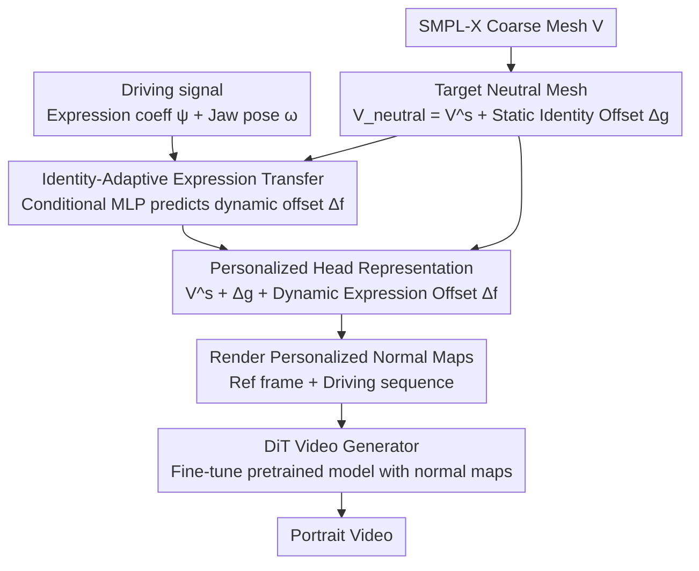

# ExpPortrait: Expressive Portrait Generation via Personalized Representation

**Conference**: CVPR 2026  
**arXiv**: [2602.19900](https://arxiv.org/abs/2602.19900)  
**Code**: None  
**Area**: Portrait Generation / Facial Reenactment  
**Keywords**: Portrait Animation, Personalized Head Representation, Expression Transfer, Diffusion Transformer, SMPL-X

## TL;DR

Ours proposes high-fidelity personalized head representations (static identity offsets + dynamic expression offsets) to address the limited expressiveness of parametric models like SMPL-X. Combined with an identity-adaptive expression transfer module and a DiT generator, it achieves SOTA performance in both portrait video self-driven and cross-identity reenactment tasks.

## Background & Motivation

The core challenge of portrait video generation is balancing fine-grained expression control with identity consistency. Existing intermediate signals possess fundamental flaws:

**2D Landmarks**: Sparse signals, lacking geometric details, and unstable under large poses.

**3D Parametric Models (SMPL-X/FLAME)**: Low-rank linear approximations; predefined blendshapes cannot model high-frequency non-linear dynamics (e.g., wrinkles), leading to severe entanglement between identity and expression.

**Implicit Motion Features**: Weakly controllable, insufficiently decoupled, and prone to identity leakage.

**Key Challenge**: The low-dimensional template subspace of parametric models limits expressiveness, failing to capture individual-specific anatomical structures and dynamic wrinkles, making it difficult to achieve both identity preservation and expressive richness.

## Method

### Overall Architecture

Portrait video generation is hindered by the contradiction between fine expression control and identity consistency, rooted in the low information density of intermediate control signals. ExpPortrait strengthens the intermediate representation rather than the generator: it overlays personalized high-detail head representations onto a coarse SMPL-X mesh, utilizes an identity-adaptive module to transfer driving expressions to the target identity, and finally trains a DiT video generator conditioned on personalized normal maps. These three steps address "insufficient representation detail," "cross-identity expression incompatibility," and "how to render into video."

### Key Designs

**1. Personalized Head Representation: Static Identity Offsets + Dynamic Expression Offsets on SMPL-X**

SMPL-X/FLAME are low-rank linear approximations where predefined blendshapes cannot model high-frequency non-linear dynamics (e.g., wrinkles), and identity/expressions are often confounded. The authors overlay two complementary offset fields on the coarse mesh: a static global offset $\Delta_g^s \in \mathbb{R}^{N_s \times 3}$ for expression-independent personalized geometry (face shape, hairline, shoulder contours), constrained to non-facial regions; and a dynamic per-frame offset $\Delta_f^s(i) \in \mathbb{R}^{N_s \times 3}$ for expression-related dynamics (wrinkles, micro-expressions), constrained to facial regions. Combining these with the upsampled high-resolution mesh yields $\widetilde{V}^s(i) = V^s + \Delta_g^s + \Delta_f^s(i)$, where $V^s = \mathcal{B}(V) \in \mathbb{R}^{N_s \times 3}$ is the mesh upsampled via barycentric interpolation ($N_s \gg N$). Decoupling is achieved through spatial constraints (facial vs. non-facial) and temporal regularization (minimum magnitude penalty + Laplacian smoothing). The optimization objective includes sparse landmark loss $\mathcal{L}_{\text{ldmk}} = \|\Pi(L_{\text{3D}}(i), \mathbf{c}) - L_{\text{2D}}(i)\|_2^2$, dense normal/depth supervision $\mathcal{L}_{\text{normal}} = \|\hat{N}_i - N_i\|_1$, $\mathcal{L}_{\text{depth}} = \|\hat{D}_i - D_i\|_1$, as well as expression coefficient regularization, displacement magnitude penalties, and Laplacian smoothing.

**2. Identity-Adaptive Expression Transfer: Adapting Expressions to Target Anatomy via Conditional MLP**

Directly transferring offsets during cross-identity reenactment causes issues—a child should not inherit an elderly person's deep wrinkle patterns. The authors first use a driving signal encoder to map expression coefficients $\boldsymbol{\psi} \in \mathbb{R}^{F \times 100}$ and jaw poses $\boldsymbol{\omega} \in \mathbb{R}^{F \times 3}$ into per-frame condition codes $Q = \mathcal{E}(\boldsymbol{\psi}, \boldsymbol{\omega}) \in \mathbb{R}^{F \times D}$. Then, a vertex-level MLP predicts personalized dynamic offsets $\Delta_f^s(i) = \mathcal{G}(V_{\text{neutral}}, q_i) \in \mathbb{R}^{N_s \times 3}$ conditioned on the target identity's neutral mesh $V_{\text{neutral}} = V^s + \Delta_g^s$ and the driving code $q_i$. Since the model explicitly incorporates the target identity's neutral mesh during prediction, the transferred expression automatically adapts to the target's anatomy instead of being a "one-size-fits-all" copy of the source deformation.

**3. DiT Video Generator: Fine-tuning Pre-trained Video Models with Personalized Normal Maps**

With high-fidelity control signals, the final step is rendering them into video. The authors fine-tune an LDM-based DiT conditioned on the reference frame normal map $N^R$ and the driving sequence normal maps $N_{1:F}^D$. A 3D convolutional pose encoder extracts spatiotemporal features, and a 2D convolutional reference encoder extracts appearance cues. Training utilizes standard noise prediction loss $\mathcal{L}_{\text{ldm}} = \mathbb{E}_{z_0, \epsilon, t}[\|\epsilon - \epsilon_\theta(z_t, t, c)\|_2^2]$. Because the condition signals already carry personalized geometric details, the generator does not need to "guess" wrinkles or identity, naturally mitigating identity leakage and expressive stiffness.

### Loss & Training

- Data: VFHQ + CelebV-HQ + HDTF, totaling 4000 videos (approx. 10 hours) at 512×512 resolution.
- Initial SMPL-X reconstruction followed by joint geometric optimization to obtain personalized head models.
- The expression transfer module is frozen before training the diffusion model.
- 30 epochs, 4×A800 GPUs, batch size 1/GPU, learning rate $10^{-4}$.
- Evaluation Datasets: RAVDESS (20 videos) + NeRSemble (80 videos).

## Key Experimental Results

### Main Results

| Method | PSNR↑ | SSIM↑ | LPIPS↓ | L1↓ | AED↓ | APD↓ | CSIM↑ |
|------|-------|-------|--------|-----|------|------|-------|
| LivePortrait | 23.29 | 0.830 | 0.373 | 0.046 | 0.129 | 0.021 | 0.830 |
| Follow-Your-Emoji | 25.69 | 0.841 | 0.236 | 0.029 | 0.147 | 0.015 | 0.803 |
| X-NeMo | 21.56 | 0.781 | 0.324 | 0.048 | 0.137 | 0.018 | 0.830 |
| **Ours** | **26.55** | **0.859** | **0.184** | **0.022** | **0.132** | **0.009** | **0.835** |

Ours significantly leads in multiple self-driven task metrics: PSNR +0.86 (vs F-Y-E), LPIPS -0.052, and APD at only 0.009.

### Cross-identity Reenactment

| Method | AED↓ | APD↓ | CSIM↑ |
|------|------|------|-------|
| LivePortrait | 0.286 | 0.230 | 0.729 |
| X-NeMo | 0.171 | 0.021 | 0.722 |
| **Ours** | **0.211** | **0.013** | **0.729** |

Achieved the best balance between expression accuracy (AED/APD) and identity preservation (CSIM).

### Ablation Study

| Configuration | Key Metrics | Description |
|------|---------|------|
| SMPL-X baseline | Stiff expressions, limited facial dynamics | Reaches expressiveness ceiling of standard parametric models |
| Direct offset transfer | Weakened expression, unnatural | Incompatibility between offsets of different identities |
| **Full Proposal** | Rich expression + High fidelity | Personalized representation + Adaptive transfer |

### Key Findings

- Personalized head representations are significantly superior to standard SMPL-X, simultaneously improving expression richness and identity fidelity.
- Implicit motion methods (Hunyuan Portrait, X-NeMo) can produce realistic results but suffer from severe identity leakage.
- Explicit control methods (AniPortrait, F-Y-E) are limited by sparse/low-rank signals and lack sufficient expressiveness.
- The expression transfer module yields more vivid and natural expressions compared to direct offset transfer.

## Highlights & Insights

- **Intermediate representation ceiling determines generation quality**: Rather than refining the generator, it is more effective to increase the information density and controllability of the control signals.
- **Static+dynamic decoupled design**: Realized through spatial constraints (facial/non-facial) and temporal regularization (zero-mean dynamic offsets) without requiring additional annotations.
- **Identity-adaptive mechanism**: Conditional prediction avoids "one-size-fits-all" expression transfer, aligning with individual facial anatomical differences.

## Limitations & Future Work

- **Oral interior not modeled**: Details like the tongue cannot be precisely generated.
- **Inaccurate eye movements**: Lacks fine-grained gaze capture.
- Limited training data (~10 hours) may restrict generalization to extreme poses and expressions.
- Not yet extended to full-body animation scenarios.

## Related Work & Insights

- Compared to the implicit landmark method of LivePortrait, the explicit 3D representation in this work is more controllable and avoids identity leakage.
- Compared to the FLAME-driven Follow-Your-Emoji, personalized offset fields capture more high-frequency details.
- Insight: The personalized representation concept can be generalized to hand and full-body animation scenarios.

## Rating

- Novelty: ⭐⭐⭐⭐ Innovative design of personalized offset fields and identity-adaptive transfer.
- Experimental Thoroughness: ⭐⭐⭐⭐ Comprehensive evaluation of self-driven and cross-driven tasks; clear ablations and convincing qualitative comparisons.
- Writing Quality: ⭐⭐⭐⭐ Clear presentation with standardized pipeline diagrams and mathematical formulations.
- Value: ⭐⭐⭐⭐ Provides a superior intermediate representation scheme for high-fidelity portrait animation with practical utility.

<!-- RELATED:START -->

## Related Papers

- [\[CVPR 2026\] FG-Portrait: 3D Flow Guided Editable Portrait Animation](fg-portrait_3d_flow_guided_editable_portrait_animation.md)
- [\[CVPR 2026\] MoCoDiff: A Controllable Autoregressive Diffusion Model for Expressive Motion Generation](mocodiff_a_controllable_autoregressive_diffusion_model_for_expressive_motion_gen.md)
- [\[CVPR 2026\] Unified Vector Floorplan Generation via Markup Representation](unified_vector_floorplan_generation_via_markup_representation.md)
- [\[CVPR 2026\] Say Cheese! Detail-Preserving Portrait Collection Generation via Natural Language Edits](say_cheese_detail-preserving_portrait_collection_generation_via_natural_language.md)
- [\[CVPR 2026\] Premier: Personalized Preference Modulation with Learnable User Embedding in Text-to-Image Generation](premier_personalized_preference_modulation_with_learnable_user_embedding_in_text.md)

<!-- RELATED:END -->
