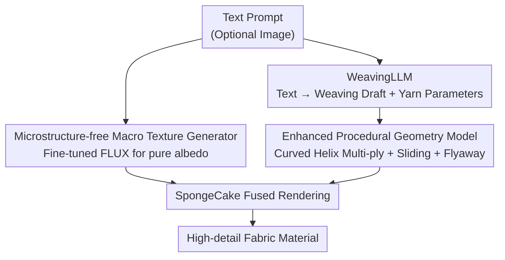

# FabricGen: Microstructure-Aware Woven Fabric Generation

**Conference**: CVPR 2026  
**Paper**: [CVF Open Access](https://openaccess.thecvf.com/content/CVPR2026/html/Tang_FabricGen_Microstructure-Aware_Woven_Fabric_Generation_CVPR_2026_paper.html)  
**Code**: Not open sourced  
**Area**: Diffusion Models / Material Generation  
**Keywords**: Fabric material generation, microstructure, procedural geometry, WeavingLLM, text-to-material  

## TL;DR
FabricGen decouples woven fabric generation into two paths: "macro texture" and "micro weaving structure." Specifically, a diffusion model fine-tuned on microstructure-free data generates albedo maps without microstructure, while a Language Model (WeavingLLM) designs weaving drafts and yarn parameters directly from text. These drive an enhanced procedural geometry model to synthesize yarn-level microstructures. The final fused rendering produces realistic fabrics with far richer details than previous methods while adhering to physical weaving rules.

## Background & Motivation
**Background**: Fabric materials (curtains, clothing, interior fabrics) are ubiquitous in rendering. Traditional creation involves multiple steps—designing weaving patterns in tools like Substance Designer, then creating textures and adjusting shading parameters—which is time-consuming even for skilled artists. Recently, diffusion models (DressCode, FabricDiffusion, MatFuse, ControlMat, etc.) have compressed this pipeline into "text/image → PBR maps," significantly lowering the barrier to entry.

**Limitations of Prior Work**: Pre-trained diffusion models are trained on natural images, lacking sufficient resolution and structural constraints. Generated fabrics often exhibit **artifact-like stripes, physically impossible patterns, or complete loss of microstructure**. While acceptable from a distance, close-up rendering reveals blurred yarn-level details and fake shadows. The root causes are twofold: diffusion models struggle to draw yarn-level microstructures, and it is difficult to impose hard constraints such as "obeying weaving rules" on the generation process.

**Key Challenge**: The realism of fabric stems from two scales simultaneously—**macro color/pattern textures** and **micro yarn interlacing geometry**. Learning both in a single diffusion model forces a sacrifice of microstructure due to resolution limits. While procedural geometry models can precisely characterize microstructures, they require expert manual design of weaving drafts and parameters, making them inaccessible to general users.

**Goal**: To allow general users without textile knowledge to generate high-quality fabric materials with yarn-level details and valid weaving principles end-to-end, using only a text prompt (with an optional image).

**Key Insight**: The macro texture and micro weaving patterns are two distinct types of information that should be **decoupled**. Macro textures are delegated to diffusion models (excel at color and patterns), which are constrained to generate "clean, microstructure-free" albedo. Microstructures are delegated to procedural models (precise geometry at any resolution), using a domain-specific LLM instead of an "expert" to design drafts and parameters.

**Core Idea**: A decoupled approach using a "microstructure-free diffusion model for macro textures + LLM-driven procedural model for microstructures." This bypasses the resolution bottleneck of a single model attempting to handle both patterns and microstructures.

## Method

### Overall Architecture
FabricGen receives a text prompt (optionally accompanied by a fabric image) and outputs fabric materials ready for physical rendering. The pipeline is split into two independent branches that converge at the rendering stage:

- **Macro-scale path**: A diffusion model fine-tuned on a "microstructure-free fabric texture" dataset. it generates a **pure albedo/color map** from text (and optional images), focusing on color and patterns while deliberately omitting yarn-level details.
- **Micro-scale path**: WeavingLLM generates a binary **weaving draft** and a set of yarn parameters (layers, roughness, flyaway intensity, etc.) from the text. These are fed into an **enhanced procedural geometry model** to generate yarn-level normals, orientations, and height fields as needed.

The outputs of both paths (macro albedo + micro geometry) are sent to the SpongeCake layered shading model for fused rendering. Since the microstructure is an "on-demand query" rather than pre-baked into fixed-resolution textures, close-up views can be scaled infinitely without blurring. Separate prompts are used—macro for color/style and micro for weaving descriptions.

### Key Designs

**1. Microstructure-free Macro Texture Generator: Forcing Diffusion to Only Draw Color**

Previous methods (DressCode, FabricDiffusion) let the diffusion model output "texture + microstructure" simultaneously, resulting in violations of weaving rules or lost detail due to resolution limits. This work does the opposite: **constraining the diffusion model to generate only pure albedo maps without microstructure**, outsourcing the complex task of microstructure generation entirely to the micro-path. Specifically, 600 pairs of "microstructure-free fabric textures + descriptions" were collected to fine-tune FLUX.1-dev using LyCORIS, transforming a general image generator into a "fabric-specific albedo generator." A noise rolling mechanism is introduced to ensure the textures are tileable. It also supports multi-modal conditions; a fabric photograph (flat or wrinkled) is encoded into latent space to guide generation, **suppressing geometric wrinkles while preserving the original pattern style**. Ablations show that raw FLUX, even when instructed "no microstructure, no folds," occasionally draws 3D objects or implicit stripes; fine-tuning ensures stable, clean albedo output.

**2. WeavingLLM: Delegating "Weaving Draft Design" to an LLM**

With the procedural model in place, there remains a gap: how to automatically design weaving patterns and geometric parameters? Traditionally, this requires a skilled artist. This work trains **WeavingLLM**—fine-tuned from Qwen2.5-14B-it using QLoRA. The training data consists of 1,142 annotated weaving drafts from Handweaving.net (all restricted to $16 \times 16$, making the output physically weaveable on a 16-harness loom). Its workflow is two-step: given a prompt, it uses a LoRA adapter to generate a binary matrix as the **weaving draft**, then **disables the LoRA adapter** to let the base LLM predict yarn parameters (roughness, ply count, etc.) based on "fabric expert knowledge." In addition to SFT, **prompt tuning** is utilized to inject domain fabric priors, teaching the LLM the characteristic parameters of different weaves. Ablations indicate this step is crucial: without prompt tuning, the base LLM predicts parameters that contradict common experience (e.g., failing to replicate the roughness of twill or the anisotropic luster of satin).

**3. Enhanced Procedural Geometry Model: Curved Helix Multi-ply + Global Irregularity**

Existing surface-based procedural models (Jin et al.) only support single-ply yarns and ignore global irregularities, resulting in fabrics that are too "perfect" to be realistic. This model $F=\{n(p), t(p), h(p)\}$ (where $p=(x,y) \in [0,1]^2$ represents normal, tangent/orientation, and relative height field) is enhanced in two ways:

First, a **curved helix multi-ply yarn model**. Previous models treated yarn as curved cylinders (single-ply). This work models each ply as a helix around the yarn centerline, supporting multi-ply configurations. By linearly mapping UV coordinates $x,y$ to yarn space arc coordinates $u,v$, geometric quantities are provided **analytically** without explicit curve storage:

$$n(u,v)=\big(\sin u\cos v,\; \sin v,\; \cos u\cos v\big),\qquad h(u,v)=r\cos(\varphi(u))+\cos u\,(R+r_{ply}\cos v)$$

where $R$ is the yarn arc radius, $r_{ply}$ is the ply radius, $\varphi(u)=\varphi(0)+uR\alpha$ is the rotation phase along the axis, and $\alpha$ is the helix rotation speed. The fiber orientation $t$ is obtained by rotating the ply orientation $o_{ply}$ around the normal by the twist angle $\psi$. These functions define the yarn-level microstructure over the UV domain, allowing for direct on-demand derivation of normal/height/orientation maps.

Second, **global irregularity effects**, accounting for two real-world phenomena ignored by prior methods:

- **Yarn sliding**: Yarn arrangement in real fabric is not strictly regular. Continuous procedural noise is used to perturb yarn positions—using 1D Perlin noise $P(x)$ along the axis and applying perturbations radially: $y_s = 0.5+(y-0.5)(1-k_{sliding}|P(x)|)$, $y_r = y_s\,e^{k_{sliding}P(x)}$, where $k_{sliding}$ controls intensity. This bijective mapping $f:y\to y_r$ allows retrieving regular coordinates from irregular space via inverse query, producing strip-like gaps between yarns.
- **Flyaway fibers**: Fibers escaping the fabric surface. An additional fiber layer is added to the SpongeCake model. The 3D fiber orientation field $o_{flyaway}(p)$ is constructed using two 2D Perlin noises $N_1, N_2$, where $N_1$ controls position and horizontal orientation and $N_2$ controls vertical orientation, resulting in a continuous, stochastic distribution that manifests as irregular highlights.

## Key Experimental Results

Experiments were conducted on a single RTX 4090. Baselines include DressCode (fabric-specific) and MatFuse (general material); FabricDiffusion was excluded due to limited availability.

### Main Results

| Condition | Metric | MatFuse | DressCode | Ours |
|-----------|---------|---------|-----------|------|
| Text-only | CLIP Score ↑ | 0.240 | 0.307 | **0.317** |
| Text-only | User Preference ↑ | 1.43% | 16.02% | **82.55%** |
| Text+Image| CLIP-I Score ↑ | 0.722 | N/A | **0.827** |

CLIP Score measures the alignment between prompts and renderings across 100 diverse prompts. The user study involved 64 participants selecting the "most prompt-compliant and realistic" result across 12 cases. Ours leads across semantic alignment, perceptual quality, and visual realism. The 82.55% preference highlight the significant gap in close-up detail.

### Ablation Study: Necessity of WeavingLLM

Comparing WeavingLLM against base Qwen2.5-14B and GPT-5 (COSSIM = cosine similarity of Fourier spectra between generated and reference drafts, PREF = user preference rate among 60 participants, LPIPS = perceptual difference of renderings using pure grey albedo):

| Case | Model | COSSIM ↑ | PREF ↑ | LPIPS ↓ |
|------|-------|----------|--------|---------|
| Herringbone twill | Qwen2.5-14B | 0.583 | 16.9% | 0.183 |
| Herringbone twill | GPT-5 | 0.582 | 11.9% | 0.245 |
| Herringbone twill | **Ours** | **0.701** | **71.2%** | **0.125** |
| Spot bronson, lace | Qwen2.5-14B | 0.35 | 1.7% | 0.385 |
| Spot bronson, lace | GPT-5 | 0.726 | 18.6% | 0.19 |
| Spot bronson, lace | **Ours** | **0.912** | **79.7%** | **0.152** |

Even a powerful general LLM like GPT-5 underperforms compared to the SFT-trained WeavingLLM in designing weaving drafts, indicating this is a specialized task requiring domain priors.

### Key Findings
- **Decoupling is the primary driver**: Isolating microstructure and outsourcing it to a procedural model is the fundamental reason for superior close-up detail quality. Baselines fail close-up inspections because their microstructures are constrained by resolution capacity.
- **Prompt-tuning ensures parameter plausibility**: Removing prompt tuning leads to yarn parameters that violate empirical logic (e.g., losing the characteristic anisotropy of satin), showing that both structural drafting and visual appearance require domain priors.
- **Irregularity brings life to fabric**: Sliding creates gaps between yarns and flyaway fibers create irregular highlights. Qualitatively, removing these effects makes the fabric appear "perfectly fake."

## Highlights & Insights
- **Generality of the "Decoupling Scales" vision**: When a generation task involves "low-frequency content" and "high-frequency structure" with conflicting model requirements (color vs. yarn geometry), it is better to use specialized tools for each scale and fuse them rather than forcing a single model to handle both.
- **LLM as a "Domain Designer" rather than "Text Generator"**: WeavingLLM outputs structured signals (binary drafts + parameter tables) rather than natural language. This "LLM → specialized control signals → procedural engine" approach is more controllable and satisfies hard physical constraints.
- **On-demand Query vs. Baked Textures**: Procedural geometry does not pre-generate fixed-resolution maps; instead, it is evaluated analytically during rendering, allowing infinite zoom without blurriness—a structural advantage over diffusion-based textures.
- **Two-phase Inference with LoRA Switching**: Enabling LoRA for drafting and disabling it for parameter prediction (to leverage the base LLM's common sense) is an elegant engineering trick to balance specialized structure with general appearance.

## Limitations & Future Work
- **Not Open Source**: Implementation and training details are largely confined to the paper and supplemental materials, making reproduction difficult.
- **Draft Constraints (16×16)**: Restricting weaving drafts to small repeat units limits the expression of very large or aperiodic complex patterns.
- **Small Dataset Reliance**: The macro branch relies on 600 microstructure-free textures and WeavingLLM on 1,142 drafts; rare weaves or styles may not generalize well.
- **Ambiguity in Irregularity Metrics**: The quantitative correspondence for the LPIPS ablation in Fig 11 is somewhat unclear in the text; qualitative conclusions are more reliable.
- **Subjective Evaluation**: Metrics primarily rely on CLIP and user studies, lacking objective physical alignment with measured data (e.g., BTF/reflectance of real samples).

## Related Work & Insights
- **vs DressCode / FabricDiffusion**: These fine-tune diffusion models to output PBR maps in one go, coupling texture and microstructure. They suffer from resolution-induced blurring and structural artifacts. This work yields higher close-up quality via decoupling.
- **vs MatFuse / ControlMat**: General SVBRDF methods cannot impose domain-specific structural constraints like weaving rules, nor can they render yarn-level details. This work injects weaving priors via WeavingLLM.
- **vs Jin et al.**: Previous surface-based models assume single-ply yarns and ignore global irregularities. This work extends the model to curved helix multi-ply configurations and adds stochastic effects while maintaining analytical efficiency.

## Rating
- Novelty: ⭐⭐⭐⭐⭐ The first "text → procedural microstructure" fabric generation; the combination of macro-micro decoupling and LLM as a weaving designer is highly novel.
- Experimental Thoroughness: ⭐⭐⭐⭐ Solid comparisons and ablations, but lacks objective physical validation and open-source availability.
- Writing Quality: ⭐⭐⭐⭐ Clear motivation, well-explained layered methodology, and effective use of equations/figures.
- Value: ⭐⭐⭐⭐ A practical tool for non-experts to create high-fidelity fabrics; the decoupling paradigm is transferable to other multi-scale materials.

<!-- RELATED:START -->

## Related Papers

- [\[CVPR 2026\] Property-Informed Diffusion-Based Text-to-Microstructure Generation](property-informed_diffusion-based_text-to-microstructure_generation.md)
- [\[CVPR 2026\] Decision Boundary-aware Generation for Long-tailed Learning](decision_boundary-aware_generation_for_long-tailed_learning.md)
- [\[CVPR 2026\] Frequency-Aware Flow Matching for High-Quality Image Generation](freqflow_frequency_aware_flow_matching.md)
- [\[CVPR 2026\] VA-π: Variational Policy Alignment for Pixel-Aware Autoregressive Generation](va-p_variational_policy_alignment_for_pixel-aware_autoregressive_generation.md)
- [\[CVPR 2026\] DiverseGRPO: Mitigating Mode Collapse in Image Generation via Diversity-Aware GRPO](diversegrpo_mitigating_mode_collapse_in_image_generation_via_diversity-aware_grp.md)

<!-- RELATED:END -->
