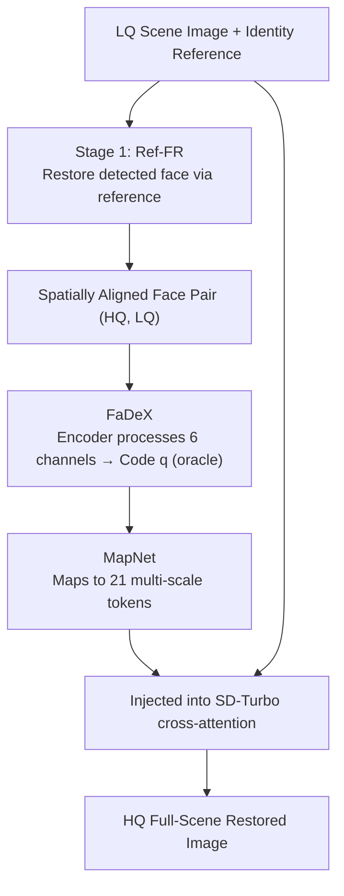

# Face2Scene: Using Facial Degradation as an Oracle for Diffusion-Based Scene Restoration

**Conference**: CVPR2026  
**arXiv**: [2603.16570](https://arxiv.org/abs/2603.16570)  
**Code**: [Project Page](https://amirhossein-kz.github.io/face2scene/)  
**Area**: Image Generation  
**Keywords**: Image Restoration, Diffusion Models, Facial Reference, Degradation Estimation, Full Scene Restoration, Single-step Inference

## TL;DR

The Face2Scene two-stage framework is proposed: it first utilizes a reference-based face restoration model (Ref-FR) to obtain HQ-LQ face pairs, from which a degradation code is extracted as an "oracle." This code then conditions a single-step diffusion model to complete full-scene image restoration, including the body and background.

## Background & Motivation

**Limitations of Prior Work - Reference face restoration is localized to facial regions**: Existing Ref-FR methods only restore cropped facial areas, ignoring the fact that real-world degradation (noise, blur, compression) typically affects the entire scene uniformly, which limits practical utility.

**Limitations of Prior Work - Full-scene restorers lack degradation awareness**: Most full-image restoration methods take only the LQ image as input. High uncertainty in the problem leads to visual artifacts, and it is difficult to maintain facial realism and identity consistency.

**Limitations of Prior Work - Coarse degradation estimation signals**: S3Diff only predicts two global scalars (noise and blur) from the LQ image; DeeDSR encodes degradation via unsupervised contrastive learning from the LQ, but learning efficacy is limited under complex degradation, often misidentifying texture or lighting as degradation.

**Key Insight - Faces provide natural advantages for degradation detection**: Faces possess stable geometric structures and reliable keypoints; identity reference images are often available; the difference in HQ-LQ pairs can effectively isolate degradation from content.

**Key Challenge - Scarcity of scene-level identity reference datasets**: Public datasets lack paired data containing both identity references and full-scene HQ images, hindering research reproducibility.

**Goal - Efficient single-step inference**: Multi-step diffusion models (DiffBIR 34.6s, SUPIR 19.9s) incur heavy inference overhead. Practical scenarios require single-step solutions that balance quality and speed.

## Method

### Overall Architecture

Face2Scene aims to address the restoration of full-scene degraded images, such as those captured by smartphones. While real degradation (noise, blur, compression) typically acts uniformly across the image, blind restoration struggles to estimate it accurately. The **Key Insight** is that the stable structure and reliable keypoints of faces make them natural degradation detectors. The **Mechanism** consists of two stages: In the first stage, a reference-based face restoration model $F_\theta$ restores the detected face to HQ using a same-identity reference image, yielding a spatially aligned $(x^{HQ}, x^{LQ})$ face pair. In the second stage, a degradation code is extracted from this pair as an "oracle" to condition a single-step diffusion model for full-scene restoration.

### Key Designs

**1. FaDeX: Distilling Face HQ-LQ Pairs into Content-Decoupled Degradation Embeddings**

Unlike S3Diff, which blindly estimates scalars, or DeeDSR's unsupervised contrast, FaDeX leverages faces as the strongest signal source. A lightweight convolutional encoder $E_\phi$ takes a 6-channel input (concatenated HQ and LQ), outputs spatial features $Z_{face} \in \mathbb{R}^{H' \times W' \times C}$, and produces a unit-normalized vector $q$ via global average pooling and an MLP projection head. A SupCon-style contrastive loss is used for training—samples generated by the same degradation operator $\mathcal{G}$ form positive pairs, while different degradations form negative pairs, stripping degradation from image content. During training, GT faces are used as HQ targets to enhance robustness. The resulting estimation is precise and generalized across images.

**2. MapNet: Mapping Degradation Embeddings to Multi-scale Tokens for Diffusion**

To ensure the single-step diffusion model "understands" the degradation code, MapNet first applies overlap patch embedding to $Z_{face}$, followed by a dual-branch residual attention layer $DegAttn(Z_{face}) = (A_1 - \lambda A_2)[V_1; V_2]$ where $\lambda$ is learnable. Finally, three-scale grid average pooling (4×4, 2×2, 1×1) with an MLP and LayerNorm generates 21 degradation tokens (16+4+1). These tokens are concatenated with text tokens and fed into the SD-Turbo cross-attention layers. This multi-scale design allows the model to perceive both global intensity and local variations, propagating facial degradation insights to the entire scene.

### Loss & Training

$$
\mathcal{L}(\theta) = \underbrace{\lambda_2 \|{\hat{I} - I^{HQ}}\|_2^2 + \lambda_{LPIPS} \cdot LPIPS(\hat{I}, I^{HQ})}_{\mathcal{L}_{rec}} + \lambda_{GAN} \cdot \mathcal{L}_{GAN}
$$

- **Reconstruction Loss**: $\ell_2$ + LPIPS perceptual loss.
- **Adversarial Loss**: The discriminator uses a frozen DINO backbone with multi-level independent classifiers, achieving single-step output **without a diffusion teacher**.
- **Hyperparameters**: $\lambda_{L2}=2.0$, $\lambda_{LPIPS}=5.0$, $\lambda_{GAN}=0.5$.

## Key Experimental Results

### Dataset

The authors constructed the **InScene** benchmark (~57.5K training images):

| Category | Quantity | Identities | Source |
|------|------|--------|------|
| Synthetic Reference Set (CelebRef-HQ + InfiniteYou) | 11,266 | 905 | Synthetic |
| Real Reference Set (Gallery) | 16,486 | 914 | Real |
| Non-reference Set (Filtered CC12M) | 29,697 | — | Real |

The test set includes 100 images (10 identities) captured by a Samsung S25 Edge, covering real degradations like ISO 3200/1600/800 and motion blur.

### Main Results (InScene Synthetic Validation)

| Method | Steps | DISTS↓ | LPIPS↓ | FID↓ | MUSIQ↑ | CLIP-IQA↑ |
|------|------|--------|--------|------|--------|-----------|
| SUPIR | 50 | 0.1361 | 0.3123 | 24.85 | 70.20 | 0.6015 |
| DiffBIR | 50 | 0.1831 | 0.3958 | 36.15 | 68.51 | 0.6975 |
| S3Diff | 1 | 0.1131 | 0.2557 | 18.06 | 72.18 | 0.6980 |
| **Ours** | **1+N** | **0.1007** | **0.2421** | **15.26** | **74.76** | **0.7640** |

On real-world validation, Face2Scene also leads significantly: DISTS 0.1178 vs S3Diff 0.2231, LPIPS 0.2502 vs 0.5149. Metrics such as MUSIQ, CLIP-IQA, and TOPIQ are all best-in-class.

### Ablation Study

| Configuration | DISTS↓ | LPIPS↓ | FID↓ | MUSIQ↑ | Wins |
|------|--------|--------|------|--------|------|
| Face2Scene **w/** Degradation Est. | 0.1007 | 0.2421 | 15.26 | 74.76 | **10/10** |
| Face2Scene **w/o** Degradation Est. | 0.1293 | 0.2711 | 17.81 | 71.78 | 0/10 |

- Removing degradation estimation causes a drop across all metrics, validating the core role of FaDeX+MapNet.
- GT Face Inserted: Even when pasting GT faces back into results, Face2Scene outperforms S3Diff (8/10 wins), proving improvements apply to the full scene.
- FaDeX Cosine Similarity: Embeddings for the same degradation across different images are highly similar, while embeddings for different degradations on the same image are distinct—confirming effective content decoupling.

### Key Findings

1. Extracting degradation information from face HQ-LQ pairs is far more effective than blind estimation from LQ, improving FID by over 15%.
2. Single-step inference takes 3.3s (1024×1024), which is in the same order of magnitude as S3Diff (1.4s) and much faster than DiffBIR (34.6s).
3. Degradation embeddings are highly decoupled from content, demonstrating generalization across scenes.

## Highlights & Insights

- **Clever Oracle Idea**: Treating face restoration as a degradation detector by estimating global degradation from the strongest signal (the face) to benefit the whole scene is a logical and natural motivation.
- **Novelty - FaDeX Contrastive Scheme**: Learns degradation embeddings without explicit labels and effectively decouples them from image content.
- **MapNet Multi-scale Tokens**: 21 multi-scale tokens provide rich conditioning signals, seamlessly integrating with SD-Turbo's cross-attention.
- **Value - InScene Benchmark**: Fills the gap in identity-reference scene-level data by combining synthetic, real, and captured data.
- **Function - Single-step Inference**: Combines SD-Turbo, LoRA, and teacher-less adversarial training to balance quality and speed.

## Limitations & Future Work

- **Assumption of Uniform Scene Degradation**: Not applicable to spatially varying degradation like depth-of-field bokeh or local motion blur.
- **Dependence on Detection and Ref-FR quality**: If face detection fails or reference quality is poor, degradation estimation becomes unreliable.
- **Stage 1 Inference Overhead**: Ref-FR accounts for ~60% of total inference time (~2.0s), limiting real-time applications.
- **Face-centric**: Currently cannot generalize to general scenes that do not contain faces.

## Related Work & Insights

- **Ref-FR**: FaceMe, RestorerID, MGFR — only restore facial regions, ignoring the scene.
- **Scene-level Human Restoration**: DiffBody, OSDHuman, HAODiff — extend to full body but do not use identity references for degradation estimation.
- **Degradation-aware Diffusion**: S3Diff (two scalars), DeeDSR (LQ contrastive) — signals are coarser than those estimated from HQ-LQ pairs.
- **General Blind Restoration**: DiffBIR, SUPIR, PASD — strong generality but poor identity preservation and slow multi-step inference.

## Rating

- **Novelty**: ⭐⭐⭐⭐ — The "face as degradation oracle" perspective is novel, effectively linking Ref-FR with degradation-aware diffusion.
- **Experimental Thoroughness**: ⭐⭐⭐⭐ — Built three data categories, tested 10 metrics, and included detailed ablations; lacks tests on more spatially varying degradations.
- **Writing Quality**: ⭐⭐⭐⭐ — Clear structure, rich visualizations, and well-articulated motivation.
- **Value**: ⭐⭐⭐⭐ — Clear practical application (low-quality mobile photos + album references) with strong scalability.

<!-- RELATED:START -->

## Related Papers

- [\[ICLR 2026\] Bridging Degradation Discrimination and Generation for Universal Image Restoration](../../ICLR2026/image_generation/bridging_degradation_discrimination_and_generation_for_universal_image_restorati.md)
- [\[CVPR 2025\] GenDeg: Diffusion-based Degradation Synthesis for Generalizable All-In-One Image Restoration](../../CVPR2025/image_generation/gendeg_diffusion-based_degradation_synthesis_for_generalizable_all-in-one_image_.md)
- [\[CVPR 2026\] Diffusion-Based Makeup Transfer with Facial Region-Aware Makeup Features](diffusion-based_makeup_transfer_with_facial_region-aware_makeup_features.md)
- [\[CVPR 2026\] High-Fidelity Diffusion Face Swapping with ID-Constrained Facial Conditioning](high-fidelity_diffusion_face_swapping_with_id-constrained_facial_conditioning.md)
- [\[AAAI 2026\] Realistic Face Reconstruction from Facial Embeddings via Diffusion Models](../../AAAI2026/image_generation/realistic_face_reconstruction_from_facial_embeddings_via_diffusion_models.md)

<!-- RELATED:END -->
