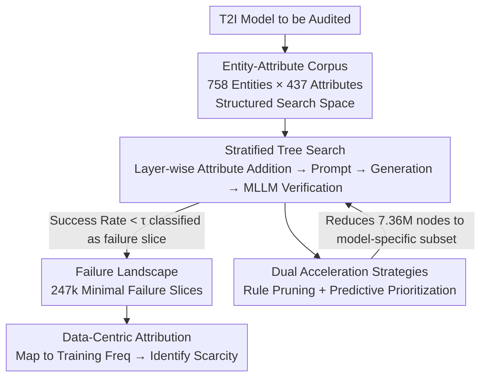

# FailureAtlas: Mapping the Failure Landscape of T2I Models via Active Exploration

**Conference**: CVPR 2026  
**Paper**: [CVF Open Access](https://openaccess.thecvf.com/content/CVPR2026/html/Chen_FailureAtlas_Mapping_the_Failure_Landscape_of_T2I_Models_via_Active_CVPR_2026_paper.html)  
**Code**: https://github.com/curelab/FailureAtlas  
**Area**: T2I Evaluation / Diffusion Models  
**Keywords**: T2I Evaluation, Error Slice Discovery, Active Exploration, Tree Search, Data Scarcity Attribution

## TL;DR
Instead of passively scoring T2I models with fixed prompt sets, this work formalizes "error finding" as a structured tree search over an entity × attribute combinatorial space. By utilizing rule-based pruning and learned prioritization, the astronomical search space is reduced to a feasible scale. The framework automatically uncovers 247,000 previously unknown "minimal failure slices" on SD1.5 and provides large-scale evidence correlating these failures with data scarcity in training sets.

## Background & Motivation
**Background**: The evaluation of Text-to-Image (T2I) models has long been dominated by static benchmarks—such as GenEval, T2I-CompBench, HRS-Bench, and WISE—which use fixed prompt sets and automated metrics (e.g., CLIPScore, TIFA, VQAScore) to calculate aggregate scores for cross-model comparisons.

**Limitations of Prior Work**: This paradigm, inherited from discriminative AI, offers shallow diagnostic depth. It identifies *that* a model failed on a specific prompt but fails to explain *why*. Since benchmark failure cases often involve multiple entangled attributes (e.g., "a small dog in red clothes jumping"), it is impossible to isolate the specific minimal attribute that triggered the failure. Furthermore, fixed prompt sets represent "exhaustive testing" that lacks search order optimization and suffers from severe coverage imbalance.

**Key Challenge**: Precision in root-cause localization requires **active and systematic** probing within the vast T2I input space to find the **minimal concept combinations** that trigger failure. This approach faces two hurdles: ① the combinatorial explosion of the entity × attribute space (restricted to 3 layers, this work still faces ~7.36 million nodes); ② the high cost of individual evaluations, as each requires actual image generation (full exploration for SD1.5 would require ~11 million generations).

**Goal**: To transform "active exploration" from a concept into a scalable framework that automatically maps the "failure landscape" of T2I models, locates the minimal failure-inducing concepts, and traces them back to training data.

**Key Insight**: The input space of generative models is simpler than that of discriminative models and can be flexibly constructed via prompts. This allows for the active design of probes and control over exploration granularity, order, and scope. The authors reframe "error slice discovery" as a **structured search**: starting from a single entity and incrementally adding attributes, the first point of failure identifies the foundational error.

**Core Idea**: Replace "static scoring" with "active exploration" by formalizing error discovery as a hierarchical tree search of entity–attribute combinations. Combined with rule-based pruning and predictive prioritization, this approach uncovers massive "minimal and fundamental" failure slices.

## Method

### Overall Architecture
FailureAtlas takes a T2I model (e.g., SD1.5) as input and outputs a "failure landscape"—thousands of minimal entity–attribute failure slices annotated with success rates—along with a correlation analysis between these failures and data scarcity (if training data is available). The pipeline consists of four components: a **high-coverage entity–attribute corpus** to structure the input space into an enumerable tree; a **stratified tree search** that converts combinations into prompts, generates images, and uses an MLLM for verification; **two acceleration strategies** (rule-based pruning and predictive prioritization) to narrow the search to a model-relevant subset; and **data-centric attribution** to map failure slices back to training data frequencies.

### Key Designs

**1. High-Coverage Entity–Attribute Corpus: Structuring the Input Space**

The first barrier to active exploration is the infinite input space. The authors address this by constructing a structured corpus where the search space is spanned by combinations of entities and attributes. Construction follows three steps: ① LLM-based initialization from general world knowledge; ② large-scale mining from COCO Captions and T2I-CompBench to align and expand the vocabulary; ③ LLM-based semantic validity labeling to avoid absurd prompts like "transparent stone." The final corpus contains **758 entities (5 categories, 25 subcategories) and 437 attributes (2 categories, 29 subcategories)**, focusing on general terms rather than specific proper nouns to balance scale and coverage. It covers approximately 90% of the entities and attributes in existing benchmarks like HRS-Bench and TIFA.

**2. Stratified Combinatorial Tree Search: Formalizing Minimal Failure Discovery**

The search is organized as a tree where the root layer contains entities, the second layer adds one attribute, and deeper layers stack more attributes. The search uses **Breadth-First Search (BFS)** across multiple entity trees to prioritize the discovery of failures involving the **fewest factors**. To constrain the space, only one attribute per category is allowed on any path. For each node, 25 images are generated. Evaluation is performed via **multiple-choice consistency checks** using an MLLM (Qwen2-VL-72B). A node is defined as a **failure slice** if its success rate falls below a threshold $\tau$ (set to 0.8).

**3. Rule-Based Pruning + Predictive Prioritization: Managing Combinatorial Explosion**

To make the 7.36 million nodes searchable, two strategies are employed. **Rule-based pruning** assumes monotonicity: if a parent node fails (e.g., "dog"), all its descendants (e.g., "jumping dog") are skipped. This ensures discovered failures are "minimal." **Predictive prioritization** utilizes the correlation of attributes within entities. A lightweight transformer-based predictor (using T5 embeddings of entities/attributes) is trained **online** (retrained every 10k nodes) to estimate success rates, steering the search toward high-failure regions. This provides a **2× acceleration** in failure discovery.

**4. Data-Centric Attribution: Mapping Failures to Training Frequency**

To investigate the "why," the authors focus on **data scarcity**. They extract entity/attribute frequencies from the model's training set (e.g., LAION-2B sampled distribution). For a discovered failure slice, if its frequency is lower than $\alpha$ times the layer's average, it is attributed to data scarcity. While this indicates correlation rather than direct causation, it provides guidance for data curation and model improvement.

### A Walkthrough Example
Using the entity "Sculpture" (as seen in Figure 1): The root "Sculpture" has 100% success (pass) → Layer 2 adds "Color: Gray" (90% success, pass) and "Background: Orange" (70% success, pass) → Layer 3 combines them into "Gray sculpture + Orange background," where success drops to 20% (failure slice). Since the parent nodes passed, this reveals a minimal failure concept linked to the combination of color and background, rather than the individual attributes.

## Key Experimental Results

### Main Results
Systematic evaluation on SD1.5 and SDXL Turbo (depth 3, 25 images/node, $\tau$=0.8) yields the following failure slice counts and densities:

| Layer | SD1.5 Failure Slices | SD1.5 Explored Nodes | SD1.5 Failure Density | SDXL Turbo Failure Slices | SDXL Turbo Failure Density |
|------|----------------|----------------|----------------|---------------------|---------------------|
| Layer 1 (Entity) | 162 | 758 | 21.3% | 91 | 12.0% |
| Layer 2 (+1 Attr) | 113,418 | 134,816 | 84.1% | 108,111 | 72.0% |
| Layer 3 (+2 Attr) | 133,850 | 303,893 | 44.0% | 331,740 | 37.3% |
| **Total** | **247,430** | **439,467** | **56.3%** | **439,942** | **42.3%** |

Corpus coverage mapping vs. established benchmarks:

| Benchmark | Entity Coverage | Attribute Coverage |
|-----------|---------|---------|
| COCO Captions | 88.2% | 93.7% |
| T2I-CompBench | 88.5% | 96.0% |
| HRS-Bench | 89.6% | 90.6% |
| TIFA | 92.0% | 90.8% |

### Ablation Study
Quantitative gains from acceleration strategies:

| Configuration | Key Metric | Description |
|------|---------|------|
| Rule-Based Pruning | Layer 3 space reduced to 4.2% | More aggressive for weaker models; extrapolated to 0.4% at Layer 4. |
| Predictive Prioritization | ~2× discovery speedup | Predictor maintains low L1 loss on unseen nodes. |
| Search Efficiency | 10k failures in ~12.5k nodes | Significant compute savings in target-oriented scenarios. |

### Key Findings
- **Pruning is the primary efficiency driver**: It reduces the search space for Layer 3 to 4.2%. Weaker models are pruned more heavily because they fail earlier in the hierarchy.
- **Failure density peaks at Layer 2**: Adding the first attribute is often sufficient to trigger failure (84.1% for SD1.5), whereas Layer 3 nodes are "survivors" of Layer 2, resulting in lower density.
- **Failures correlate with data scarcity**: Poorly performing concepts on SD1.5 correspond to fewer samples in LAION-2B. However, high-frequency failures (e.g., badminton) suggest other factors like model architecture also play a role.
- **Architecture Generalization**: The framework successfully identifies failures in SD3.5 Large Turbo and Flux.1-dev (e.g., viewpoint issues with "goldfish," "curved keys").

## Highlights & Insights
- **Paradigm Shift**: Transitioning from "static scoring" to "active exploration" allows for the localization of "minimal failure concepts," providing diagnostic depth that benchmarks cannot offer.
- **Synergy of Efficiency and Semantics**: Rule-based pruning not only saves computation but also ensures the search trajectory is determined by model-specific failures, naturally yielding minimal failure concepts.
- **Online Predictor for Adaptive Priors**: Learning the error distribution online allows for a doubling of failure discovery within a fixed budget, a mechanism applicable to any expensive evaluation task.
- **Corpus as a Unified Bridge**: Using the same vocabulary to span the search space and align with training data allows for seamless "failure-to-data" attribution.

## Limitations & Future Work
- **Ours**: Exploration is currently limited to "single entity + multiple attributes," omitting multi-entity interactions or complex scenes. The computational cost remains high (~11M generations for full scale).
- **Weak Attribution**: Data scarcity is a correlative signal, not proof of causation. Other factors like data quality or training curriculum are not yet isolated.
- **MLLM Dependency**: Attribute alignment at 84% suggests MLLM bias can propagate to slice selection. The monotonicity assumption for pruning has rare counter-examples (e.g., adding attributes can sometimes disambiguate and improve generation).

## Related Work & Insights
- **vs. Static Benchmarks**: While benchmarks provide aggregate horizontal comparisons, they fail to isolate root causes. FailureAtlas offers higher diagnostic depth at the cost of higher generation overhead.
- **vs. Discriminative Error Slice Discovery**: Traditional methods summarize fixed test sets, inheriting their coverage imbalances. FailureAtlas leverages the flexible input construction of generative models to ensure balanced and systematic coverage.
- **vs. MULTIMON**: Previous works were benchmark-driven and limited in scale. FailureAtlas is the first active exploration framework capable of discovering hundreds of thousands of error slices with data-centric attribution.

## Rating
- Novelty: ⭐⭐⭐⭐⭐ First active exploration framework for T2I; innovative reframing of error finding as tree search.
- Experimental Thoroughness: ⭐⭐⭐⭐ Extensive testing across four models with quantitative ablation, though attribution remains correlational.
- Writing Quality: ⭐⭐⭐⭐⭐ Clear progression from motivation to method; honest discussion of assumptions and counter-examples.
- Value: ⭐⭐⭐⭐⭐ Provides a scalable diagnostic engine for T2I auditing and a path toward data-driven improvement.

<!-- RELATED:START -->

## Related Papers

- [\[CVPR 2026\] SounDiT: Geo-Contextual Soundscape-to-Landscape Generation](soundit_geo-contextual_soundscape-to-landscape_generation.md)
- [\[AAAI 2026\] Exposing DeepFakes via Hyperspectral Domain Mapping](../../AAAI2026/image_generation/exposing_deepfakes_via_hyperspectral_domain_mapping.md)
- [\[CVPR 2026\] Breaking Semantic Boundaries: Distribution-Guided Semantic Exploration for Creative Generation](breaking_semantic_boundaries_distribution-guided_semantic_exploration_for_creati.md)
- [\[ICML 2026\] E²PO: Embedding-perturbed Exploration Preference Optimization for Flow Models](../../ICML2026/image_generation/embedding-perturbed_exploration_preference_optimization_for_flow_models.md)
- [\[ICML 2025\] Reimagining Parameter Space Exploration with Diffusion Models](../../ICML2025/image_generation/reimagining_parameter_space_exploration_with_diffusion_models.md)

<!-- RELATED:END -->
