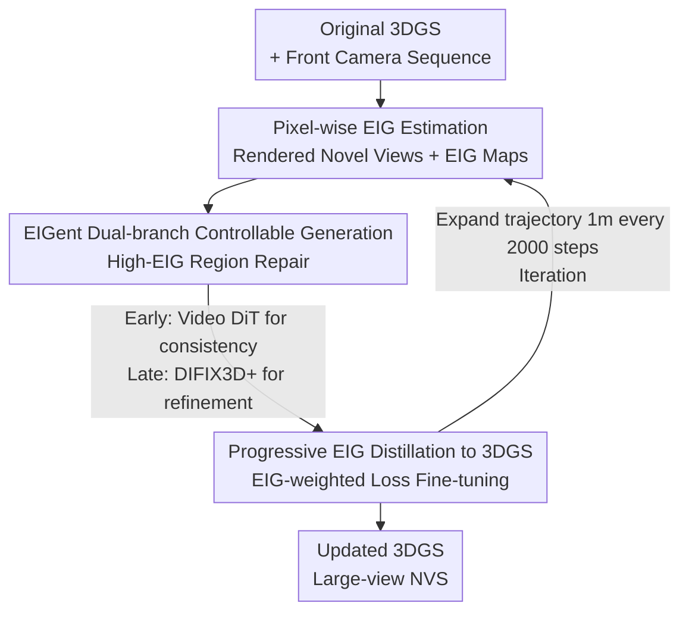

# FaithFusion: Harmonizing Reconstruction and Generation via Pixel-wise Information Gain

**Conference**: CVPR 2026  
**Paper**: [CVF Open Access](https://openaccess.thecvf.com/content/CVPR2026/html/Wang_FaithFusion_Harmonizing_Reconstruction_and_Generation_via_Pixel-wise_Information_Gain_CVPR_2026_paper.html)  
**Code**: To be released (the original paper states "code will be released soon")  
**Area**: Image Generation / Diffusion Models / 3D Vision / Autonomous Driving  
**Keywords**: 3DGS-Diffusion Fusion, Expected Information Gain (EIG), Driving Scene Reconstruction, Large View Synthesis, Pixel-wise Editing Strategy  

## TL;DR
FaithFusion reformulates the pixel-level decision of "whether and how much to edit" as **Expected Information Gain (EIG)**. The same EIG signal serves both to guide diffusion models—restricting generation to high-uncertainty regions—and as pixel-wise loss weights to distill generated content back into 3DGS. This maintains geometric fidelity and appearance controllability under large perspective shifts, such as lane changes. Ours achieves SOTA results on Waymo for NTA-IoU, NTL-IoU, and FID (retaining an FID of 107.47 even during a 6-meter lane change).

## Background & Motivation

**Background**: Constructing a controllable driving world for closed-loop simulation requires both geometric fidelity in reconstruction and controllability in appearance generation. While 3DGS and NeRF excel at high-quality novel view synthesis (NVS), diffusion models are superior for image/video generation and inpainting. The mainstream approach fuses both through an online progressive loop of "render → inpaint → feedback," where degraded novel views from 3DGS are repaired by diffusion and distilled back.

**Limitations of Prior Work**: 3DGS exhibits geometric inconsistencies and artifacts under sparse observations, heavy occlusion, or viewpoints far from the training trajectory. Conversely, diffusion models, lacking pixel-level and geometrically consistent guidance, tend to perform "over-restoration" and introduce geometric drift—repainting regions that were already correct once triggered. Fusion methods (like DIFIX3D+, ReconDreamer++) either rely on additional priors (LiDAR, 3D boxes, HDMaps) or require structural modifications to the 3DGS architecture.

**Key Challenge**: Existing fusion methods employ **view-level coarse-grained heuristics** to decide "where, when, and how much" to edit. They lack a principled mechanism capable of pixel-level precision to determine which regions should be generated and which should be preserved. This coarse guidance leads to insufficient control over generation, resulting in recurring over-restoration and geometric drift.

**Key Insight**: The authors reframe the decision of "whether to edit a pixel and with what intensity" as a **prospective information-theoretic metric**—quantifying how much the posterior uncertainty would decrease through that edit. Following the intuition of FisherRF, which uses Fisher Information as a proxy for uncertainty, this work **extends it to the pixel level** and tightly couples it with a differentiable 3DGS renderer.

**Core Idea**: A pixel-wise EIG is utilized as a "unified spatial strategy." The EIG signal acts as a spatial weight for the generation side (letting diffusion generate only in high-information/high-uncertainty areas to inhibit over-restoration) and as a pixel-wise loss weight for the reconstruction side (distilling high-value edits back into 3DGS). The system is plug-and-play, requiring no additional priors or modifications to the 3DGS architecture.

## Method

### Overall Architecture
FaithFusion is a 3DGS-Diffusion fusion framework driven by pixel-wise EIG. Its core is a three-step **progressive training loop**: First, novel views with lateral offsets and their corresponding pixel-wise EIG maps are rendered from the initial 3DGS (Step 1). These are fed into EIGent, a dual-branch generator, to repair high-EIG regions (Step 2: utilizing Video DiT for spatio-temporal consistency in early stages, and DIFIX3D+ for per-frame refinement later). Finally, the repaired views are used to fine-tune the 3DGS using EIG maps as pixel-wise loss weights (Step 3). The trajectory expands by 1 meter every 2000 steps, iterating the cycle to orderly distill generated content into the geometric representation.

The crucial element is that the **same EIG map persists throughout all three steps**: it is produced in Step 1, used as a spatial prior for generation in Step 2, and applied as a loss weight for reconstruction in Step 3.

### Key Designs

**1. Pixel-wise Expected Information Gain (EIG): Quantifying Edit Necessity**

To address the limitation of coarse heuristics, this work quantifies editing decisions by calculating how much observing a novel view reduces the posterior uncertainty of 3DGS parameters. 3DGS renders via $\alpha$-blending a set of anisotropic Gaussians ($\omega$: position $\mu_w$, rotation $q_w$, scale $s$, spherical harmonics $c$, opacity $o$). After determining the point estimate $\omega^* = \arg\min_\omega \sum \|Y_i^{train} - F(X_i^{train}, \omega)\|_2^2$, the posterior is modeled using **Laplace Approximation** as a Gaussian $\Omega \approx \mathcal{N}(\omega^*, H''[\omega^*]^{-1})$, where $H''$ is the Hessian of the negative log-likelihood. Its expectation is the Fisher Information.

For a novel view $X^{NVS}$, EIG is defined as the difference between the prior entropy and the expected posterior entropy after observation:

$$\text{EIG} = H[\Omega] - \mathbb{E}_{p(Y_i|X_i)}\big[H[\Omega \mid Y_i^{NVS}, X_i^{NVS}]\big]$$

Using Laplace Approximation and the additivity of Fisher Information, and applying the inequality $\log\det(A+I_d)\le \mathrm{tr}(A)$, a computable trace-form upper bound is derived: $\text{EIG} \le \tfrac{1}{2}\sum_i \mathrm{tr}\big(H''[Y_i^{NVS}|X_i^{NVS},\omega^*]\,H''[\omega^*]^{-1}\big)$. While FisherRF calculates view-level uncertainty at training views, the key extension here is **accumulating the Fisher Information contributions of Gaussians intersected along each rendered ray** (Algorithm 1), yielding pixel-wise EIG. Validation on Waymo (Fig. 3) shows that PSNR decreases monotonically as high-EIG regions are retained, proving that **high EIG corresponds to low-quality rendering**.

**2. EIGent Dual-branch Controllable Generation: EIG as Spatial Prior**

To prevent diffusion from repainting correct regions, EIGent uses EIG as an interpretable pixel-wise priority. High-gain areas (low quality/missing info) are targeted for repair, while low-gain areas (reliable background) preserve their structure. The architecture is **dual-branch**: a lightweight EIG-guided context encoder (cloned from the first four layers of a pre-trained DiT) runs parallel to a frozen DiT backbone, decoupling background preservation from foreground generation. Given video $V$, VAE yields latent $L=E(V)$. The EIG map $E$ is downsampled and fused via EIG-guided context injection:

$$\epsilon_\theta(z_t, t, C)_k = \epsilon_\theta(z_t, t, C)_k + M \odot G(L_N, L, E)_k$$,

where $G$ is the context encoder, $M$ is a binary mask for extreme uncertainty, and $k$ is the feature layer index. To enhance per-frame quality, external inpainting cues (DIFIX latents) are injected via **cross-attention** into the context branch, regulated by EIG spatial weights.

**3. Progressive EIG-aware Knowledge Feedback: EIG as Pixel-wise Loss Weight**

Knowledge integration utilizes pixel-wise EIG as a guidance signal. Total loss consists of original and novel trajectory terms. Original trajectories use standard L1 + SSIM + sparse LiDAR depth supervision. For novel views, the normalized EIG map acts as a **pixel-level weighting matrix** $\lambda_{EIG}$ to modulate image loss, focusing 3DGS optimization on areas with the highest information gain (least constrained):

$$L^{novel}_{img} = \lambda_{EIG} \odot \big(\lambda_r L^{novel}_1 + (1-\lambda_r)L^{novel}_{SSIM}\big)$$

Consistent geometry is maintained via sparse depth supervision $L^{novel}_{depth}$ from point cloud projections. This loop prioritizes establishing spatial structure via **EIGent-repaired views** in early stages, switching to **DIFIX3D+-refined views** for detail enhancement once the trajectory is stable. This suppresses over-restoration since low-EIG regions receive minimal updates.

## Key Experimental Results

### Main Results
Evaluation follows the ReconDreamer protocol on Waymo: 3DGS is trained on front-camera data, evaluating cross-lane rendering. Trajectories expand 1m every 2000 steps starting from step 3000. FaithFusion is integrated into the OmniRe framework.

| Method | Extra Conditions | @3m NTA-IoU↑ | @3m NTL-IoU↑ | @3m FID↓ | @6m NTA-IoU↑ | @6m NTL-IoU↑ | @6m FID↓ |
|------|---------|------|------|------|------|------|------|
| OmniRe | None | 0.424 | 51.73 | 188.42 | 0.423 | 49.08 | 191.00 |
| FreeVS | LiDAR | 0.505 | 56.84 | 104.23 | 0.465 | 55.37 | 121.44 |
| ReconDreamer | Box+HDMap | 0.539 | 54.58 | 93.56 | 0.467 | 52.58 | 149.19 |
| ReconDreamer++* | Box+HDMap | 0.572 | 57.06 | 72.02 | 0.489 | 56.57 | 111.92 |
| DIFIX3D+ | None | 0.578 | 56.94 | 84.12 | 0.504 | 53.77 | 120.24 |
| **Ours** | **None** | **0.581** | **57.67** | **71.51** | **0.517** | **55.78** | **107.47** |

> *ReconDreamer++ requires significant architectural changes. **Ours** achieves the lowest FID (71.51) @3m and remains superior @6m (FID 107.47) without any extra priors or 3DGS structural changes.

### Ablation Study
Metrics are reported separately for Under-Constrained Regions (UCR) and High-Precision Regions (HPR) using an EIG threshold $\tau=0.4$ on the 6m lateral shift task.

| Configuration | FID(Total)↓ | FID-UCR↓ | FID-HPR↓ | Notes |
|------|------|------|------|------|
| DIFIX3D+ (Baseline) | 120.24 | 147.97 | 152.66 | Per-frame repair only |
| + EIG-guided DIFIX3D+ | 119.01 | 143.80 | 149.82 | EIG focuses repair, inhibits hallucinations |
| ++ EIGent Dual-stage | 113.94 | 137.58 | 153.69 | Added video generation, UCR FID drops 6.22 |
| +++ EIG Recon (Full) | **107.47** | **137.02** | **147.75** | Total FID Gain: 12.77 over baseline |

### Key Findings
- **Complementary Modules**: EIG-guided DIFIX corrects semantic mismatches; EIGent fills UCR (Under-constrained regions); Progressive distillation prevents over-restoration in HPR.
- **Consistency vs. Detail Trade-off**: EIGent slightly increases FID-HPR (153.69) because video diffusion consistency can "flatten" fine details. The full system recovers this via back-filling.
- **EIG as Quality Proxy**: PSNR correlates with EIG, validating EIG as a reliable proxy for NVS quality.

## Highlights & Insights
- **Unified Logic**: One signal (pixel-wise EIG) handles both spatial weighting for generation and loss weighting for reconstruction.
- **Extending Fisher Information**: Accumulating Fisher contributions along rays for pixel-wise EIG is a versatile engineering contribution for differentiable rendering.
- **EIG-partitioned Evaluation**: Separating FID for UCR/HPR exposes the "consistency vs. detail" trade-off hidden by global FID.
- **Plug-and-Play**: Effective without LiDAR/Boxes/HDMaps or changing the 3DGS architecture.

## Limitations & Future Work
- EIG **mitigates** but does not eliminate error accumulation; custom 3DGS architectures might be needed for further reductions.
- The method is heavily optimized for driving scenes (front-camera training, lateral evaluation); generalization to general objects or indoor scenes is unverified.
- Computational overhead for Laplace Approximation and Fisher calculations on large-scale Gaussians was not quantified.
- Future work: Integrating EIG into active mapping strategies to improve exploration efficiency.

## Related Work & Insights
- **vs FisherRF**: FisherRF only uses view-level uncertainty for view selection; FaithFusion extends this to **pixel-wise EIG** for NVS to guide diffusion and reconstruction.
- **vs DIFIX3D+**: DIFIX3D+ lacks geometric consistency; FaithFusion wraps it with EIG spatial strategies to reduce FID from 120.24 to 107.47 @6m.
- **vs ReconDreamer++**: Ours outperforms ReconDreamer++ in FID and NTA-IoU while remaining model-agnostic and prior-free.

## Rating
- Novelty: ⭐⭐⭐⭐⭐ Principel use of pixel-wise EIG as a unified spatial strategy.
- Experimental Thoroughness: ⭐⭐⭐⭐ Solid results on Waymo, though limited to driving scenarios.
- Writing Quality: ⭐⭐⭐⭐ Clear motivation, mathematical derivation, and ablation logic.
- Value: ⭐⭐⭐⭐⭐ High practical value for driving simulation due to its plug-and-play nature.

<!-- RELATED:START -->

## Related Papers

- [\[CVPR 2026\] Rethinking Glyph Spatial Information in Font Generation](rethinking_glyph_spatial_information_in_font_generation.md)
- [\[CVPR 2026\] PixelDiT: Pixel Diffusion Transformers for Image Generation](pixeldit_pixel_diffusion_transformers_for_image_generation.md)
- [\[CVPR 2026\] VA-π: Variational Policy Alignment for Pixel-Aware Autoregressive Generation](va-p_variational_policy_alignment_for_pixel-aware_autoregressive_generation.md)
- [\[CVPR 2026\] DeCo: Frequency-Decoupled Pixel Diffusion for End-to-End Image Generation](deco_frequency-decoupled_pixel_diffusion_for_end-to-end_image_generation.md)
- [\[CVPR 2026\] gQIR: Generative Quanta Image Reconstruction](gqir_generative_quanta_image_reconstruc_tion.md)

<!-- RELATED:END -->
