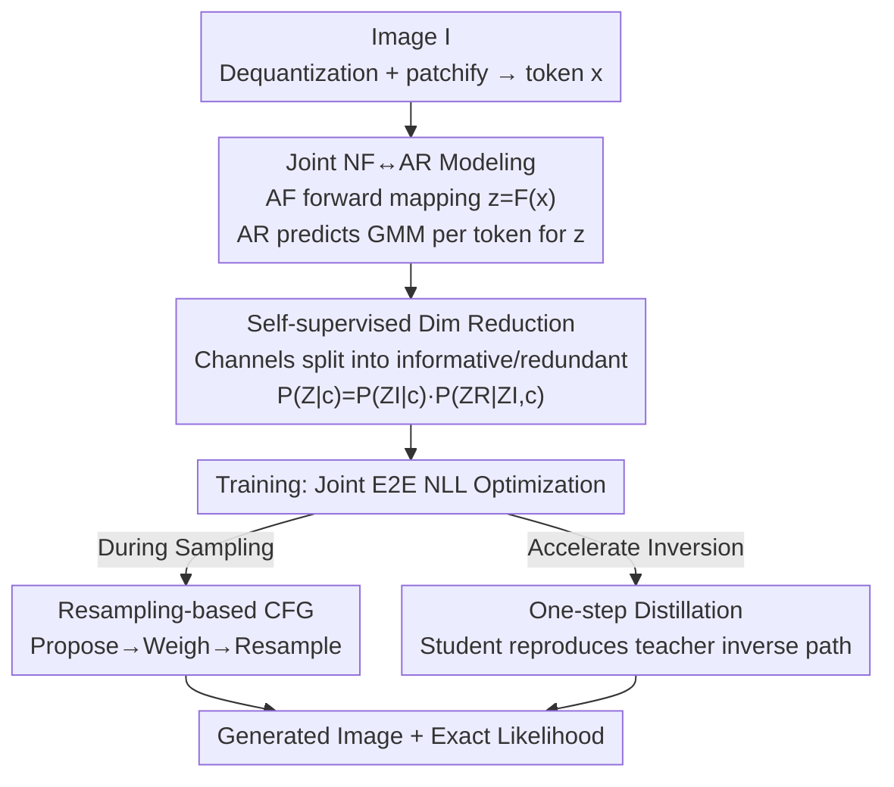

# FARMER: Flow AutoRegressive Transformer over Pixels

**Conference**: CVPR 2026  
**Paper**: [CVF Open Access](https://openaccess.thecvf.com/content/CVPR2026/html/Zheng_FARMER_Flow_AutoRegressive_Transformer_over_Pixels_CVPR_2026_paper.html)  
**Code**: To be confirmed  
**Area**: Image Generation / Diffusion Models / Autoregressive Generation  
**Keywords**: Normalizing Flows, Autoregressive Generation, Pixel-level Modeling, Exact Likelihood, Dimensionality Reduction

## TL;DR
FARMER integrates invertible Autoregressive Flows (AF) and Autoregressive Transformers (AR) into an end-to-end framework, performing generation and exact likelihood estimation directly on raw pixels. By using AF to transform images into latent sequences and AR to implicitly model the distribution of these sequences—supported by self-supervised dimensionality reduction, one-step distillation, and resampling-based CFG—it reduces the FID on ImageNet $256 \times 256$ from 6.64 (JetFormer) to 3.60.

## Background & Motivation

**Background**: Explicitly modeling the normalized likelihood $P(x)$ of data is a core objective in machine learning. Among the mainstream generation paradigms, VAEs only optimize the lower bound, GANs are implicit generators without likelihood, and diffusion/score-based models can only provide likelihood indirectly through variational bounds or expensive probability flow ODEs—none achieve exact likelihood easily. Autoregressive (AR) models decompose sequence likelihood into step-by-step conditional probabilities via the chain rule, achieving remarkable scaling success in language models, but have struggled when applied to continuous, high-dimensional image pixels.

**Limitations of Prior Work**: Direct continuous AR on pixels (e.g., PixelRNN/CNN, iGPT) faces **extremely long token sequences**—a $256 \times 256$ image contains hundreds to thousands of tokens, making training and sampling costly and vulnerable to long-range dependency issues. Another path, Normalizing Flows (NF), provides exact likelihood through invertible mappings, but recent NF works (JetFormer, STARFlow/TARFlow) almost exclusively map the data distribution to a **fixed standard Gaussian** $\mathcal{N}(0,1)$. Forcing high-dimensional, highly dispersed image distributions into an isotropic Gaussian introduces discontinuities or distortions, leading to out-of-distribution samples and degraded quality when mapping back to the data space.

**Key Challenge**: AR has strong expressivity but is difficult to model/sample, while NF is invertible with exact likelihood but limited by the "fixed standard Gaussian" constraint. No prior work has successfully merged the strengths of both paradigms.

**Goal**: Achieve **exact likelihood + high-quality synthesis + scalable training** on raw pixels while bypassing "long sequences" and "slow AF inversion" engineering hurdles.

**Key Insight**: Instead of mapping images to a fixed standard Gaussian, NF should map images to a **latent distribution implicitly modeled by an AR component**. The target distribution is no longer a predefined Gaussian but a learnable distribution empowered by AR.

**Core Idea**: Replace standard NF with Autoregressive Flow (AF) for forward/inverse mapping and use an AR Transformer to model the distribution of the latent sequence output by AF. Both are jointly optimized end-to-end (unified causal structure), preserving the exact likelihood of NF while leveraging the expressivity of AR.

## Method

### Overall Architecture
FARMER takes an image as input and outputs generative capabilities and exact likelihood estimation. The pipeline is as follows: the image is dequantized and patchified into a continuous token sequence $x$; the Autoregressive Flow $F$ invertibly maps $x$ to a latent sequence $z=F(x)$; an AR Transformer performs implicit distribution modeling on $z$, predicting a $K$-component Gaussian Mixture Model (GMM) per token. The two parts are jointly trained end-to-end using a unified negative log-likelihood (NLL). On top of this, three designs make it practical: self-supervised dimensionality reduction (splitting high-dimensional tokens into informative/redundant sets to reduce AR modeling burden), resampling-based CFG (implementing Classifier-Free Guidance within the GMM framework), and one-step distillation (compressing the slow serial AF inversion into a single step).

The training objective combines the AR likelihood (Eq. 7) and the AF log-determinant (Eq. 6), averaged over all dimensions:

$$\mathcal{L} = -\frac{1}{N\cdot d}\Big(\sum_{i=1}^{N}\log p(z_i\,|\,z_{<i}, c) + \log\big|\det \tfrac{\partial z}{\partial x}\big|\Big)$$

### Key Designs

**1. NF↔AR Joint Modeling: Replacing "Fixed Gaussian" with "AR Implicit Distribution"**

The bottleneck of standard NF is forcing high-dimensional image distributions into a standard Gaussian, causing a distribution gap and OOD sampling. FARMER's approach is: NF no longer targets a fixed Gaussian; instead, it maps the image to a latent sequence $z=F(x)$, and the distribution of this sequence is **implicitly** modeled by an AR model. Both are optimized jointly:

$$\min_{F,\text{AR}} -\sum_{i=1}^{N}\log p_\text{AR}(z_i\,|\,z_{<i}) - \log\big|\det(\tfrac{\partial F(x)}{\partial x})\big|$$.

To ensure AR base distribution expressivity, each conditional probability $p(z_i|z_{<i})$ is modeled using a $K$-component GMM (following JetFormer/GIVT):

$$p(z_i|z_{<i},c) = \sum_{k=1}^{K}\pi_k\,\mathcal{N}\big(z_i;\mu_k, \text{diag}(\sigma_k^2)\big)$$

The critical implementation difference is that FARMER implements the NF component $F$ as an **Autoregressive Flow (AF)** rather than the split-channel affine Jet structure used in JetFormer, ensuring the entire NF/AR pipeline maintains a consistent causal form. Each invertible block of AF performs a lower-triangular per-token affine transformation on the sequence: the forward pass for the $t$-th block is $z^t_i=(z^{t-1}_i-\mu^t(z^{t-1}_{<i}))\oslash\sigma^t(z^{t-1}_{<i})$ ($i>1$), and the inverse is solved algebraically. Since the Jacobian is lower-triangular, the log-determinant equals the product of diagonal elements (the $\sigma^t$ values), which is efficiently calculated during training (Eq. 6). Token permutations $\pi_t$ and inverse permutations are inserted between blocks to enhance expressivity. Notably, when $K=1$, AF+AR degenerates into a deeper single AF—proving this design is a proper expansion of AF.

**2. Self-supervised Dimensionality Reduction: Splitting Tokens into Informative/Redundant and Correct Probability Decomposition**

The invertibility of AF is **dimension-preserving**: for a $256 \times 256$ image with patch size 16, the latent sequence has $N=256$ tokens, each with dimension $d=768$. Modeling such high-dimensional tokens directly with GMM is difficult and explodes the sampling space. Prior works like RealNVP/JetFormer treated half the dimensions as redundant, assigning them to a **standard Gaussian prior** and assuming $P(Z|c)=P(Z^R)P(Z^I|c)$—meaning redundant dimensions $Z^R$ are independent of $Z^I$ and $c$. FARMER points out this independence assumption is often violated in practice; informative and redundant dimensions remain correlated, and forced independence loses information and restricts the interaction between multimodal conditions and latent variables.

FARMER instead splits latent variables along the channel dimension into an informative part $Z^I\in\mathbb{R}^{N\times d_I}$ and a redundant part $Z^R\in\mathbb{R}^{N\times d_R}$ ($d=d_I+d_R$), and uses the chain rule to **correctly** decompose the joint probability:

$$P(Z|c) = P(Z^I|c)\,P(Z^R\,|\,Z^I, c)$$

Informative tokens $Z^I_i$ are still modeled autoregressively (one GMM each, conditioned on $c$ and prefix $Z^I_{<i}$); however, **the redundant channels $Z^R$ across all tokens share a single GMM** $G_{N+1}$, conditioned on the entire informative sequence $Z^I$ (serving as global image context) and $c$. This effectively transforms $N$ high-dimensional tokens into $N+1$ low-dimensional tokens by packing all redundant channels into an "extra token." Maximizing likelihood then **induces self-supervised information decoupling**: complex contours and structures are pushed into $Z^I$, while simple colors and details are assigned to $Z^R$ (validated in Fig. 6 by scaling the shared GMM variance—small variance smooths colors while maintaining structure, while large variance increases detail diversity but risks artifacts).

**3. Resampling-based CFG: Sampling Classifier-Free Guidance in GMM Frameworks**

CFG is standard for quality in diffusion/AR, but its guided distribution $\log p^*(z)\approx \log p_u(z)+(w{+}1)\cdot(\log p_c(z)-\log p_u(z))$ is an intractable mixture of GMMs that cannot be sampled directly. FARMER's insight is to split the target into two terms: one is a directly samplable GMM, and the other is a term that can be **evaluated** for a candidate sample's probability. It uses a three-step resampling approximation: (i) **Propose**: Sample $s$ candidates from the conditional GMM $p_c$ and $s'$ candidates from the unconditional GMM $p_u$; (ii) **Weigh**: Calculate log-probabilities per the second term and normalize them into weights; (iii) **Resample**: Re-sample based on the normalized distribution to get the final token. In ablation studies, replacing JetFormer's naive CFG with this resampling-based CFG lowered FID from 8.66 to 5.67. ⚠️ Refer to the original Supplement Algorithm 1 for exact weight definitions.

**4. One-step Distillation: Compressing AF Serial Inversion from 22 Steps to 1**

The drawback of AF's expressivity is strictly serial inversion—every token depends on the resolved prefix during mapping, creating an inference bottleneck (especially for TARFlow/STARFlow with sequence lengths of 1024). FARMER leverages the exact inverse property of NF forward/inverse paths: it takes the **forward path** $(Z_0, Z_1, \dots, Z_n)$ of a trained teacher AF, reverses it to get an inverse path $(Z_n, \dots, Z_0)$, and trains a student AF to align its **single-step forward path** with the teacher's inverse path. Specifically, the student is initialized with a teacher copy but uses bidirectional attention; noisy latents $\tilde Z_n=Z_n+s\cdot\text{noise}$ are used for robustness, and each student block's output $\tilde Z_{t-1}$ is aligned with teacher's $Z_{t-1}$ via MSE. This reduces inversion time from 0.1689 s/img to 0.0076 s/img (**22× speedup, 4× overall speedup**) with only ~60 extra epochs and negligible quality loss (FID 5.55→5.63). Unlike progressive diffusion distillation, this end-to-end approach is more robust to cumulative error and doesn't require the teacher to run actual slow inversion for supervision.

### Loss & Training
- The total loss is data NLL, averaged over all dimensions (Eqs. 8/9), consisting of the AR per-token GMM likelihood and the AF log-Jacobian determinant.
- Dequantization uses **annealed noise**: $\mathcal{N}(0,\sigma^2)$ noise is added to original images, with $\sigma$ cosine-annealed from 0.1 to 0.005.
- Condition embeddings $c$ are duplicated $M$ times (default 64) and prepended to the latent sequence to amplify guidance.
- Default config: informative dimension $d_I=128$, $K=64$ GMM components; redundant dimension $d_R=640$, $K=200$. Two scales: FARMER-1.1B / 1.9B.

## Key Experimental Results

### Main Results
On ImageNet $256 \times 256$ class-conditional generation (50K samples for FID/IS/Precision/Recall using resampling CFG), FARMER, trained directly in pixel space, outperforms JetFormer by reducing FID by 3.04 and also surpasses NF-based TARFlow/STARFlow.

| Type | Model | Params | Epochs | FID↓ | IS↑ | Pre.↑ | Rec.↑ |
|------|------|------|--------|------|------|-------|-------|
| Pixel·NF+AR | JetFormer | 2.8B | 500 | 6.64 | - | 0.69 | 0.56 |
| Pixel·NF | TARFlow (patch 8) | 1.3B | 320 | 5.56 | - | - | - |
| Pixel·NF | STARFlow (patch 8) | 1.4B | 320 | 4.69 | - | - | - |
| Pixel·AR | FractalMAR-H | 844M | 600 | 6.15 | 348.9 | 0.81 | 0.46 |
| **Pixel·NF+AR** | **FARMER 1.1B (patch 16)** | 1.1B | 320 | 5.40 | 212.23 | 0.78 | 0.45 |
| **Pixel·NF+AR** | **FARMER 1.9B (patch 8)** | 1.9B | 320 | **3.60** | 269.21 | 0.81 | 0.51 |
| Latent·AR | MAR-L | 479M+66M | 800 | 1.78 | 296.0 | 0.81 | 0.60 |
| Latent·Diff | DiT-XL | 675M+86M | 1400 | 2.27 | 278.2 | 0.83 | 0.57 |

> Note: FARMER is a pure pixel-level, single-stage method. Latent space models like DiT/MAR use VAEs to provide structured latent spaces, giving them an advantage in FID. FARMER offers direct access to raw data distribution without VAE information bottlenecks, preserving fine-grained details better (e.g., in human faces).

### Ablation Study
FARMER-1.1B, $K=1024$, ImageNet $256 \times 256$. Effect of components (Table 2):

| Configuration (Cumulative) | FID↓ | IS↑ | Description |
|------------------|------|------|------|
| baseline | 61.17 | 22.10 | No components listed below |
| + Self-supervised Dim Reduction | 49.29 | 30.61 | informative/redundant split |
| + Conditional Duplication (×64) | 45.34 | 33.87 | Amplify class guidance |
| + Terminal Permutation | 44.56 | 33.17 | Maintain AF/AR dependency |
| + Naive CFG | 8.66 | 233.84 | JetFormer-style CFG (major gain) |
| + Resampling-based CFG | **5.67** | 215.53 | Ours, further FID reduction |

NF Architecture Comparison (Table 3): AF is more expressive than Jet, but slow to invert; one-step distillation recovers speed without quality loss.

| NF Architecture | FID↓ | IS↑ | Forward Speed | Inverse Speed |
|---------|------|------|----------|----------|
| Jet | 106.23 | 13.14 | 0.0065 s/img | 0.0099 s/img |
| AF | 5.55 | 194.63 | 0.0066 s/img | 0.1689 s/img |
| AF + One-step Distillation | 5.63 | 193.49 | 0.0066 s/img | **0.0076 s/img** |

### Key Findings
- **CFG is the Game Changer**: Moving from no CFG (FID 44.56) to naive CFG (8.66) and then to resampling CFG (5.67) proves that proper guidance on GMM implicit distributions is more critical than stacking parameters.
- **Dim Reduction + Correct Decomposition is Foundational**: Adding self-supervised dimensionality reduction dropped FID from 61.17 to 49.29. Compared to JetFormer's independent prior, FARMER's conditional decomposition $P(Z^R|Z^I,c)$ reduced FID from 7.81 to 5.67.
- **Hyperparameter Trade-offs**: $K=64$ GMM components is optimal; reducing to 32 breaks dimensionality reduction. Informative dimension $d_I$ peaks at 128; increasing it stores more info but makes AR modeling/sampling harder.
- **Jet Fails Information Separation**: The Jet architecture lacks the expressivity to separate image information into two channel groups (FID 106), justifying the use of AF as the NF component.

## Highlights & Insights
- **Rejecting the "Fixed Gaussian" target is key**: Replacing the NF target distribution with a learnable AR implicit distribution resolves the long-standing OOD and quality issues in NF.
- **Elegant Dimensionality Reduction Probability Correction**: Replacing JetFormer’s "redundant independence" assumption with a chain-rule decomposition $P(Z^I|c)P(Z^R|Z^I,c)$ effectively decouples structure and color information without info loss. The view of "$N$ high-dim tokens → $N+1$ low-dim tokens" is clever.
- **Transferable One-step Distillation**: Using reversed forward paths to supervise a single-step student provides a general template for accelerating any serial AF/NF model.
- **Resampling-based CFG** provides a universal Propose→Weigh→Resample template for scenarios where the distribution is a GMM mixture and cannot be sampled directly.

## Limitations & Future Work
- **Absolute Metrics Lag Behind Latent SOTA**: FARMER's best FID (3.60) still trails DiT/SiT (1.1~2.3). The authors attribute this to pure pixels vs. latent spaces, but it means it hasn't caught up in terms of leaderboard rankings yet.
- **Dependence on Engineering Tricks**: The drop from FID 61 to 5.67 relies heavily on the stack of CFG, dimensionality reduction, and distillation—the core NF+AR framework alone (without CFG) is not yet outstanding.
- **Limited Scope**: Testing was only performed on ImageNet $256 \times 256$ class-conditional generation; benefits for text-to-image or higher resolutions remain argued rather than demonstrated.
- **Potential Improvements**: Making the resample candidate count $s$ adaptive and exploring hierarchical channel splitting beyond two groups.

## Related Work & Insights
- **vs JetFormer**: Both use NF+AR on pixels, but FARMER (1) uses AF instead of Jet (expressivity), (2) uses conditional decomposition $P(Z^R|Z^I,c)$ instead of independent priors, and (3) uses resampling CFG. FID improved from 6.64 to 3.60.
- **vs TARFlow / STARFlow**: AF-based NFs that suffer from the fixed Gaussian target. FARMER introduces the AR implicit distribution and one-step distillation to solve expressivity and speed issues respectively.
- **vs Latent Models (DiT/MAR)**: These use VAEs for structured latent spaces. FARMER modeling directly on pixels provides exact likelihood and detail fidelity at the cost of current FID leads.

## Rating
- Novelty: ⭐⭐⭐⭐⭐ Restructuring NF+AR pixel generation by replacing fixed Gaussians with learnable distributions is a substantial contribution.
- Experimental Thoroughness: ⭐⭐⭐⭐ Detailed ablations on architecture and dim reduction, though limited to ImageNet $256 \times 256$.
- Writing Quality: ⭐⭐⭐⭐ Clear motivation and probability derivations, though some implementation details are relegated to the Supplement.
- Value: ⭐⭐⭐⭐ Provides a scalable, single-stage route for exact likelihood + high-quality pixel generation. One-step distillation and resampling CFG are independently reusable.

<!-- RELATED:START -->

## Related Papers

- [\[CVPR 2026\] MPDiT: Multi-Patch Global-to-Local Transformer Architecture for Efficient Flow Matching](mpdit_multi-patch_global-to-local_transformer_architecture_for_efficient_flow_ma.md)
- [\[CVPR 2026\] DDT: Decoupled Diffusion Transformer](ddt_decoupled_diffusion_transformer.md)
- [\[ICLR 2026\] Dragging with Geometry: From Pixels to Geometry-Guided Image Editing](../../ICLR2026/image_generation/dragging_with_geometry_from_pixels_to_geometry-guided_image_editing.md)
- [\[CVPR 2026\] Guiding a Diffusion Transformer with the Internal Dynamics of Itself](guiding_a_diffusion_transformer_with_the_internal_dynamics_of_itself.md)
- [\[CVPR 2026\] From Sketch to Fresco: Efficient Diffusion Transformer with Progressive Resolution](from_sketch_to_fresco_efficient_diffusion_transformer_with_progressive_resolutio.md)

<!-- RELATED:END -->
