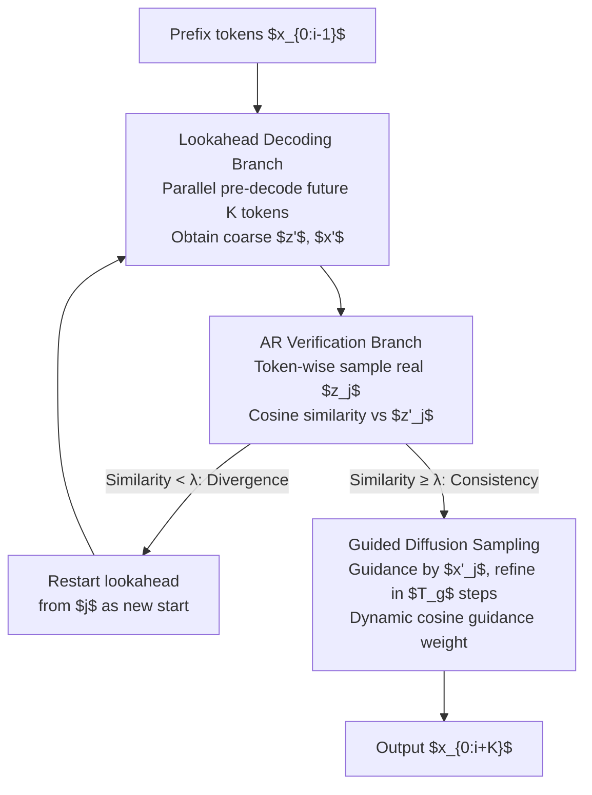

# FastHybrid: Accelerating Hybrid Autoregressive Image Generation with Lookahead and Guided Decoding

**Conference**: CVPR 2026  
**Paper**: [CVF Open Access](https://openaccess.thecvf.com/content/CVPR2026/html/Jiang_FastHybrid_Accelerating_Hybrid_Autoregressive_Image_Generation_with_Lookahead_and_Guided_CVPR_2026_paper.html)  
**Code**: None  
**Area**: Autoregressive Image Generation / Diffusion Models / Inference Acceleration  
**Keywords**: Hybrid Autoregressive Generation, Lookahead Decoding, Guided Diffusion Sampling, Inference Acceleration, MAR  

## TL;DR
Addressing the bottleneck of slow diffusion denoising in "Autoregressive + Diffusion Head" hybrid image generation, FastHybrid utilizes a **lookahead branch to parallelly pre-decode several future tokens** and an **autoregressive branch to verify/correct them via cosine similarity**. By employing **guided diffusion sampling**, the denoising steps for verified tokens are compressed from 100 to 10, achieving up to 1.97× inference acceleration for MAR without training, with an FID degradation of only approximately 0.11.

## Background & Motivation
**Background**: The mainstream of autoregressive (AR) image generation involves using Vector Quantization (VQ) to discretize image patches into tokens, followed by next-token prediction like language models. However, the VQ approach suffers from two chronic issues—codebook collapse (infrequent use of most codewords, leading to poor diversity) and reconstruction artifacts (loss of detail due to discretization). To circumvent these problems, the emerging **hybrid AR paradigm** (MAR, HART, DisCo-Diff, etc.) works in continuous space: the AR model predicts a **continuous semantic vector** $z_i = f(x_1, \dots, x_{i-1})$ for each position, which then serves as a condition for a **diffusion head** to perform multi-step denoising and generate high-fidelity patch details.

**Limitations of Prior Work**: While quality has improved, speed has collapsed. The diffusion head must run $T$ steps (where $T=100$ in the paper) of iterative denoising for every token generated, and since the AR part is serial, the total cost is approximately $T_{\text{MAR}} = (P + Q \cdot T) \cdot K$ (where $P$ and $Q$ are the costs of a single AR and diffusion step, respectively, and $K$ is the number of tokens). The bottleneck lies overwhelmingly in the $Q \cdot T$ term.

**Key Challenge**: Existing AR acceleration methods (such as speculative decoding in continuous space via CSpD or hierarchical caching via LazyMAR) focus almost exclusively on optimizing the AR-side $P$. In hybrid models, $P$ is not the dominant factor—diffusion denoising $Q \cdot T$ is. Consequently, these methods provide marginal speedups for hybrid models; CSpD also requires a draft-target model pair and sacrifices quality, while LazyMAR increases VRAM usage to $O(B \cdot L)$.

**Key Insight**: The authors conducted a probe experiment: during the $i$-th step of AR decoding, they masked all positions from $i$ to $n$ and allowed the diffusion head to parallelly decode these "not-yet-reached" tokens. They found that **in the early stages, the AR model has already determined the overall layout and semantic content for most patches** (due to the inherent continuity of image data and strong AR context modeling), although details are not yet refined. This implies that future tokens can be pre-decoded in parallel.

**Core Idea**: A training-free decomposition of generation into two complementary paths: a **lookahead branch** to produce coarse predictions and an **autoregressive branch** for serial verification and correction. Coarse predictions then **guide** the diffusion denoising, reducing the denoising steps per token from $T$ to $T_g \approx T/10$.

## Method

### Overall Architecture
FastHybrid does not modify any weights; it only alters the **inference pipeline** of the hybrid AR model (using MAR as the backbone). It rearranges the slow "serial per-token + multi-step denoising" loop into a cycle of "parallel pre-decoding a segment → serial verification of the segment → guided few-step denoising using pre-decoded results during verification." An outer loop advances by $K$ tokens each time: first, a **lookahead branch** decodes coarse results $x'$ for the next $K$ tokens at once. Then, the **autoregressive branch** samples ground-truth tokens $z_j$ from $i$ to $i+K-1$ and performs similarity verification against $z'_j$. If consistent, **guided diffusion sampling** is used to refine the token in only $T_g$ steps. If divergent, the lookahead is restarted using that position as the new starting point.

Theoretically, the cost of FastHybrid is $T_{\text{Ours}} = P \cdot K + Q \cdot T + Q \cdot T_g \cdot (K-1)$. The lookahead branch pays for one full denoising pass $Q \cdot T$ for the entire segment, while the remaining $K-1$ tokens each pay only $Q \cdot T_g$ ($T_g < T/10$). Compared to $T_{\text{MAR}} = (P + Q \cdot T) K$, this reduces the $Q \cdot T$ factor from a multiplier $K$ to nearly a single instance.

### Key Designs

**1. Lookahead Decoding Branch: Parallel pre-decoding of future tokens using early semantics**

This branch leverages the observation from the probe experiment—early AR stages determine the semantics of most patches. Conditioned on the generated prefix $x_{0:i-1}$, the AR model samples $k$ future continuous semantic vectors **all at once** (not sequentially). The diffusion head then parallelly denoises them into coarse images:
$$z'_{i:i+k} \sim p(z_{i:i+k}\mid x_{0:i-1}), \qquad x'_{t-1,\,i:i+k} \sim q(x_{t-1,\,i:i+k}\mid x_{t,\,i:i+k},\, z'_{i:i+k},\, t)$$
Crucially, denoising for these $k$ tokens is a shared full $T$-step parallel batch process, rather than $T$ steps per token, which reduces the $Q \cdot T$ overhead. The output $x'$ is a "rough draft"—the layout and semantics are correct, but details and inter-token dependencies are not yet synchronized, necessitating the verification step.

**2. AR Verification Branch: Correcting lookahead misalignments via cosine similarity**

During parallel decoding, the lookahead branch **does not explicitly model dependencies between tokens**, which may result in inconsistencies (e.g., misaligned facial features of an animal). This branch restores strict token-wise autoregression: for each position $i < j < i+k$, a "ground-truth" token $z_j \sim p(z_j \mid x_{0:j-1})$ is sampled from the true AR distribution and its cosine similarity with the lookahead prediction $z'_j$ is calculated. **If similarity falls below a threshold $\lambda$ (0.8 in the paper), it is deemed divergent.** The patch is re-masked, and the lookahead branch restarts from $j$. If consistent, it is kept and passed to guided diffusion sampling for fast refinement. This "verify-accept/restart" mechanism acts as a quality safety valve, harvesting parallel speedups while isolating and redoing the few tokens that break global consistency.

**3. Guided Diffusion Sampling: Using coarse drafts as priors to cut denoising steps by an order of magnitude**

For tokens that pass verification, the lookahead coarse draft $x'_0$ is already highly aligned with the target in terms of layout and semantics (lacking only fine details). Given this high-quality starting point, there is no need for the diffusion head to run the full $T$ steps from scratch. Guided diffusion sampling injects the coarse draft $x'_0$ as a prior into the denoising mean:
$$\mu'_\theta(x_t\mid x'_0, z, t) = (1-\gamma_t)\cdot \mu_\theta(x_t\mid z, t) + \gamma_t\cdot x'_0$$
The original reverse transition mean is replaced by $\mu'_\theta$. This prior **prevents deviation** (anchoring the denoising trajectory to the correct semantic structure) and **accelerates convergence** (providing a clearer direction, reducing exploration of the solution space), allowing the steps to drop from $T=100$ to $T_g=10$ while maintaining quality.

The **dynamic guidance weight** $\gamma_t$ is a key refinement. Different diffusion stages handle information at different scales: early stages (high noise) recover coarse color/layout, where $\mu_\theta(x_t \mid z, t)$ is less accurate and should **rely more** on the coarse draft. Late stages generate fine textures like fur, which depend on local interactions between adjacent patches and must come from the AR-provided $z$; **excessive guidance here may introduce incorrect details**. Thus, a monotonically decreasing cosine weight is used:
$$\gamma_t = 1 - \cos^2\!\Big(\frac{\pi t}{2 T_g}\Big)$$
The cosine schedule is chosen to align with the noise schedules typically used in diffusion training, ensuring more stable generation.

## Key Experimental Results
Evaluation was performed on ImageNet 256×256 using MAR as the backbone, with 64 AR steps and 100 diffusion sampling steps. Lookahead steps $k$ were 7/8/9 for MAR-B/-L/-H, $T_g=10$, $\lambda=0.8$, using 4×RTX 3090 with batch=8. FID/IS were calculated over 50k generated images.

### Main Results

| Model | #Param | FID↓ | IS↑ | VRAM(MB) | Runtime(s) | Speedup |
|------|--------|------|-----|----------|-------------|--------|
| MAR-B-64 (Baseline) | 208M | 2.32 | 281.1 | 2030 | 21.4 | 1× |
| MAR-B-32 (Reduced AR) | 208M | 2.47 | 273.1 | 2030 | 10.9 | ×1.96 |
| LazyMAR-B-64 | 208M | 2.45 | 281.3 | 3610 (×1.78) | 18.9 | ×1.13 |
| **FastHybrid-B-64** | 208M | 2.43 | 284.3 | 2640 (×1.30) | 10.8 | **×1.97** |
| MAR-L-64 (Baseline) | 479M | 1.82 | 296.1 | 3616 | 26.9 | 1× |
| CSpD-L-64 | 687M (+43%) | 3.45 | 259.5 | 4870 | 24.5 | ×1.09 |
| LazyMAR-L-64 | 479M | 1.93 | 297.4 | 6558 | 20.1 | ×1.33 |
| **FastHybrid-L-64** | 479M | 1.90 | 303.8 | 4120 (×1.14) | 13.9 | **×1.92** |
| MAR-H-64 (Baseline) | 943M | 1.59 | 299.1 | 6586 | 35.7 | 1× |
| CSpD-H-64 | 1151M (+22%) | 3.91 | 248.5 | 7884 | 26.5 | ×1.34 |
| LazyMAR-H-64 | 943M | 1.69 | 299.2 | 12094 | 26.8 | ×1.32 |
| **FastHybrid-H-64** | 943M | 1.70 | 309.2 | 7074 (×1.07) | 21.0 | **×1.69** |

FastHybrid achieves a speedup close to "halving AR steps" (MAR-32) but maintains significantly better quality—e.g., in the B-tier, it reaches ×1.97 speedup while FID only shifts from 2.32 to 2.43. Compared to CSpD (adds 22~43% parameters and degrades FID to 3.45/3.91) and LazyMAR (nearly doubles VRAM with only ×1.13~1.33 speedup), FastHybrid offers a superior balance of quality, memory, and speed. IS generally improved (e.g., 299.1 to 309.2 in H-tier). Notably, FastHybrid-H-64 outperforms the MAR-B-64 baseline in both speed and quality, suggesting that accelerating large models is more efficient than directly using small models.

### Ablation Study
Ablations were conducted on 10k images (FID/IS values are overall lower than main results) using MAR-Base.

**Verification Threshold + Guidance Necessity** (R-x: similarity filtering only; RG-x: plus guided diffusion sampling):

| Configuration | FID↓ | IS↑ | Time(s) | Description |
|------|------|-----|---------|------|
| MAR (Baseline) | 4.74 | 217.2 | 21.48 | No acceleration |
| R-0.8 (Filtering only) | 4.94 | 221.5 | 8.09 | No guidance -> texture artifacts |
| **RG-0.8** | 4.84 | 222.2 | 10.02 | Full: High threshold + guidance |
| RG-0.6 | 4.98 | 216.2 | 8.60 | Threshold decrease -> FID increase |
| RG-0.4 | 5.16 | 210.8 | 8.04 | Further degradation |
| RG-0.0 | 5.60 | 205.7 | 7.47 | No verification, worst quality |

**Guidance Method + Weight Schedule** (Baseline: MAR-D50):

| Guidance Method | FID↓ | IS↑ | Time(s) |
|----------|------|-----|---------|
| MAR-D50 | 4.75 | 216.9 | 11.88 |
| MAR-D30 (30 steps) | 5.04 | 216.7 | 7.76 |
| inverse(15*0.9) | 4.87 | 225.6 | 7.64 |
| Linear-up (Increasing) | 5.13 | 233.7 | 6.94 |
| Linear-down (Decreasing) | 4.99 | 221.7 | 6.87 |
| Square | 5.09 | 224.8 | 6.85 |
| **Cos (Ours)** | **4.84** | 222.2 | 6.99 |

### Key Findings
- **Higher Threshold is Better**: Increasing the similarity threshold from 0.0 to 0.8 monotonically decreases FID (5.60→4.84) and increases IS, proving that identifying and redoing divergent tokens is crucial.
- **Guidance is Essential**: Filtering alone (R-0.8, FID 4.94) leaves texture artifacts; adding guided diffusion sampling (RG-0.8, FID 4.84) corrects local inconsistencies.
- **Increasing Weight is Counter-effective**: Linear-up has high IS (233.7) but poor FID (5.13), contradicting the coarse-to-fine nature of denoising. The monotonically decreasing Cos schedule (FID 4.84) performs best, validating the "early guidance, late local fidelity" strategy.
- **Reducing Steps Alone is Insufficient**: MAR-D30 produces extreme patch anomalies (FID 5.04), indicating that step reduction must be paired with guidance.

## Highlights & Insights
- **Training-free and Plug-and-play**: The method requires no weight modification and purely rearranges the inference phase, making it highly practical for existing hybrid AR models.
- **Applying Speculative/Lookahead Concepts Strategically**: Unlike CSpD/LazyMAR which optimize AR latent sampling, FastHybrid targets the true bottleneck—diffusion denoising. The lookahead branch reduces the $Q \cdot T$ factor from $K$ to nearly one.
- **Coarse Drafts as Natural Priors**: Injecting AR semantic predictions into the diffusion mean prevents deviation and accelerates convergence more stably than "noise-then-denoise" alternatives.
- **Dynamic Cosine Weighting Leverages Scale Priors**: By trusting semantics early and local structure late, this annealing approach for guidance strength could be transferred to other tasks requiring external priors (e.g., controllable generation, super-resolution).
- **Orthogonality to LazyMAR**: LazyMAR reduces AR latency, while FastHybrid reduces diffusion latency. The two can be combined to further enhance performance.

## Limitations & Future Work
- **Speedup Decreases with Model Scale**: Acceleration drops from ×1.97 to ×1.69 across B/L/H tiers. Although lookahead steps $k$ increase for larger models, the gains diminish for reasons not fully explored.
- **Assumption of "Early Semantic Anchoring"**: The probe observation relies on high continuity in image data and early layout determination. For images with high local randomness or lacking global structure (e.g., texture/noise-dominant scenes), lookahead hit rates may drop, triggering more restarts.
- **Limited Evaluation**: Verified only on ImageNet 256×256 and the MAR backbone. Test results on text-to-image tasks, higher resolutions, or other hybrid backbones (HART, DisCo-Diff) are missing.
- **Hyperparameter Sensitivity**: $k$ is manually tuned (7/8/9) per model tier. Optimal parameters for other datasets/models have not been fully mapped.

## Related Work & Insights
- **vs CSpD (Continuous Space Speculative Decoding)**: CSpD requires an additional draft model for generation/verification and only optimizes the AR side, resulting in limited speedup (×1.09~1.34) and significant quality loss (FID 3.45/3.91) for hybrid models. FastHybrid requires no extra model and directly tackles the diffusion bottleneck without quality loss.
- **vs LazyMAR (Hierarchical Caching)**: LazyMAR caches activations to reduce AR computation, maintaining quality but causing VRAM to surge to $O(B \cdot L)$ (nearly doubling for deep models/large batches). FastHybrid has a smaller memory footprint (×1.07~1.30) and is functionally orthogonal.
- **vs PAR / LANTERN**: PAR parallelizes generation via token dependency but remains rigid; LANTERN applies LLM speculative decoding to visual AR. Both focus on AR-side parallelism, whereas FastHybrid identifies the diffusion head as the primary battlefield in the hybrid paradigm.

## Rating
- Novelty: ⭐⭐⭐⭐ Combining lookahead decoding with guided diffusion sampling to target the diffusion bottleneck in hybrid AR is a novel and training-free perspective.
- Experimental Thoroughness: ⭐⭐⭐⭐ Main results across three model tiers and comprehensive ablations on thresholds/guidance/weights are provided, though limited to a single dataset and backbone.
- Writing Quality: ⭐⭐⭐⭐ Clear logic from motivation to probe to method and ablation; includes helpful time analysis.
- Value: ⭐⭐⭐⭐ Plug-and-play acceleration for hybrid AR with orthogonality to other methods makes it highly practical.

<!-- RELATED:START -->

## Related Papers

- [\[CVPR 2026\] Parallel Jacobi Decoding for Fast Autoregressive Image Generation](parallel_jacobi_decoding_for_fast_autoregressive_image_generation.md)
- [\[CVPR 2026\] SJD-PAC: Accelerating Speculative Jacobi Decoding via Proactive Drafting and Adaptive Continuation](sjd-pac_accelerating_speculative_jacobi_decoding_via_proactive_drafting_and_adap.md)
- [\[AAAI 2026\] Annealed Relaxation of Speculative Decoding for Faster Autoregressive Image Generation](../../AAAI2026/image_generation/annealed_relaxation_of_speculative_decoding_for_faster_autor.md)
- [\[ICLR 2026\] Autoregressive Image Generation with Randomized Parallel Decoding](../../ICLR2026/image_generation/autoregressive_image_generation_with_randomized_parallel_decoding.md)
- [\[ICCV 2025\] Grouped Speculative Decoding for Autoregressive Image Generation](../../ICCV2025/image_generation/grouped_speculative_decoding_for_autoregressive_image_generation.md)

<!-- RELATED:END -->
