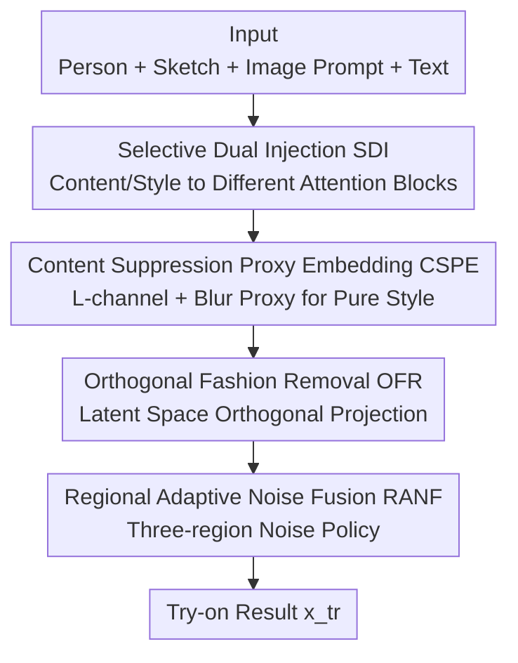

# FEAT: Fashion Editing and Try-On from Any Design

**Conference**: CVPR 2026  
**Paper**: [CVF Open Access](https://openaccess.thecvf.com/content/CVPR2026/html/Kwon_FEAT_Fashion_Editing_and_Try-On_from_Any_Design_CVPR_2026_paper.html)  
**Code**: The authors declare publicity (including code, results, and a new dataset), specific repository address TBD ⚠️  
**Area**: Diffusion Models / Image Editing / Virtual Try-On  
**Keywords**: Virtual Try-On, Content-Style Disentanglement, Orthogonal Projection, Regional Noise Fusion, Training-free

## TL;DR
FEAT integrates "obtaining design inspiration from any image (artistic paintings, natural photos, abstract images)" and "performing virtual try-ons for full outfits (including accessories)" into a single diffusion framework. It utilizes Disentangled Dual Injection (DDI) to separate content (shapes/contours) and style (color/texture) in image prompts, injecting them into different U-Net attention blocks to suppress content leakage. Furthermore, it employs a training-free Orthogonal-Guided Noise Fusion (OGNF) mechanism to remove original clothing via orthogonal projection and applies distinct noise strategies to three regions, surpassing existing methods in sketch fidelity, prompt consistency, and realism.

## Background & Motivation

**Background**: AI fashion design has evolved from "clothing image generation" to "integrated pipelines supporting Virtual Try-On (VTON)". Recent works (FashionTex, PICTURE, MGD) have begun accepting multimodal inputs—visual exemplars and text prompts—allowing users to express complex design intentions and preview apparel effects.

**Limitations of Prior Work**: Existing methods suffer from two specific shortcomings. (i) **Design sources are locked to "clothing images"**: reference can only be taken from a piece of clothing, failing to draw inspiration from broader creative sources like artwork, natural photos, or abstract concepts. (ii) **Focus only on clothing, ignoring full outfits**: accessories such as shoes, bags, and necklaces are neglected, limiting practical utility.

**Key Challenge**: Injecting image prompt features as a single entity (entangled content and style) via IP-Adapter leads to **over-amplification of content cues** (e.g., human faces), resulting in "content leakage"—where other conditions like sketches and text are suppressed. Existing solutions (InstantStyle) remove content information **entirely**, leaving only style, which is impractical for fashion where users often **want** content elements (shapes, structural lines) to manifest in the clothing. Simultaneously, the combination of ControlNet and IP-Adapter **cannot completely replace garments**, leaving artifacts of the original clothing, while relying on "clothing-specific datasets" for training faces issues of poor scalability and high acquisition costs.

**Goal**: (1) Enable design sources beyond garments to include non-clothing images; (2) Integrate various fashion items (including accessories) holistically in a dataset-agnostic manner.

**Key Insight**: Fashion design can be decomposed into two fundamental attributes: **content** (what it is: shapes, silhouettes, outlines) and **style** (how it is presented: colors, textures). The authors observe that different U-Net attention blocks possess distinct sensitivities to these attributes, allowing content and style to be injected "block-wise" rather than as an entangled whole.

**Core Idea**: **Selective block-wise injection after disentangling content and style** (addressing content leakage while retaining controllable content elements) combined with **orthogonal projection and tri-region noise strategies for training-free try-on** (thoroughly removing original clothing without paired training data).

## Method

### Overall Architecture
FEAT inputs a person image $x_p$, a sketch $s$, an image prompt $i$, and a text prompt $y$, outputting the try-on result $x_{tr}$. Each modality carries a scaling factor for fine-tuning intensity. The pipeline consists of two primary components: the first half, **DDI (Disentangled Dual Injection)**, handles clean injection of design intent by splitting content and style and routing them to sensitivity-specific U-Net blocks. The second half, **OGNF (Orthogonal-Guided Noise Fusion)**, is a **training-free** mechanism that removes original clothing via orthogonal projection in the latent space and synthesizes new items through localized noise strategies.

### Key Designs

**1. Selective Dual Injection (SDI): Block-wise Sensitivity-based Injection**

Scaling down the IP-Adapter image scale can mitigate content leakage but degrades style information simultaneously. SDI follows the observation that different U-Net blocks respond differently to attributes. In the **fashion domain**, the authors identify a **style block** (highest style response) and three **content blocks** (highest content response), assigning **independent style and content scale factors** to these groups. This allows content and style to be adjusted as separate knobs (e.g., tuning content from 0 to 1 leads from "no content" to "small elements" to "large structures like animals").

**2. Content Suppression Proxy Embedding (CSPE): Content Suppression in CLIP Space**

Block-wise assignment alone is insufficient as the "style block" still encodes significant content. CSPE suppresses content directly within the CLIP image embedding space. Given an image prompt $i$, a **content proxy** is created by retaining only the L (lightness) channel and applying global blurring (removing color and texture). This proxy's CLIP embedding is subtracted from the original:

$$\mathbf{e}_{\text{style}} = \phi(i) - \phi\!\left(\mathcal{B}_\sigma(\mathcal{L}(i))\right)$$

where $\mathcal{L}(\cdot)$ extracts the L channel, $\mathcal{B}_\sigma$ is global blurring with standard deviation $\sigma$, and $\phi$ is the CLIP image encoder. The resulting $\mathbf{e}_{\text{style}}$ retains style while attenuating structure, and is injected into the style block, while the original $\phi(i)$ serves the content blocks.

**3. Orthogonal Fashion Removal (OFR): Latent Space Directional Subtraction**

Unlike inpainting, VTON must preserve person identity/pose while removing the old garment. OFR uses a geometric solution: encoding the person $x_p$, clothing segmentation $g$, and a white image $w$ into $z^p, z^g, z^w$ using a VAE encoder. Subtracting $z^w$ from $z^g$ isolates the "clothing feature" direction:

$$v = z^g - z^w$$

With normalized $u = v/\lVert v \rVert$, the projection of $z^p$ onto $u$ is subtracted to obtain a garment-attenuated representation:

$$\tilde{z} = z^p - \alpha\,(z^p \cdot u)\,u$$

where $\alpha$ controls removal intensity. This **requires no paired training data** and leaves non-garment regions (face, background) intact.

**4. Regional Adaptive Noise Fusion (RANF): Tri-region Noise Strategy**

RANF manages the conflicting goals of identity preservation, garment removal, and new garment synthesis by dividing the space into three regions. Using the person mask $M^p$ and sketch mask $M^s$, it defines an operation area $M = M^p \cup M^s$. During $T$ denoising steps:

$$z'_{t-1} = \bar{M}\odot \mathrm{denoise}\!\left(z_t, s, y, i, t\right) + \left(\mathbf{1}-\bar{M}\right)\odot \mathrm{noise}\!\left(\tilde{z}, t\right)$$

Involved regions: $\bar{M}^s$ (**New Synthesis Area**) uses sketch guidance; $\bar{M}-\bar{M}^s$ (**Old Removal Area**) denoises without sketch guidance to erase original garments; $\mathbf{1}-\bar{M}$ (**Non-clothing Area**) uses noise re-injection to ensure visual consistency of the person and background.

### Loss & Training
Ours **introduces no new training losses**. DDI utilizes selective injection on existing SDXL + IP-Adapter, and OGNF is entirely **training-free**. The implementation uses SDXL as the backbone, ControlNet-Depth for control signals, DDIM sampling for 50 steps, and CFG=7.5. Default scales for sketch/image/text are 0.7/0.5/0.5.

## Key Experimental Results

### Main Results
Evaluation used 1,000 samples (900 garments, 100 accessories). Metrics include GPT-4V Elo (consistency + realism), Chamfer Distance (Sketch CD for alignment), style score (Image), and CLIP-T (Text).

| Setting | Method | GPT-4V Elo ↑ | Sketch CD ↓ | Image ↑ | Text ↑ | Human ↑ |
|------|------|------|------|------|------|------|
| Sketch+Image | ControlNet+IP-Adapter | 1037.39 | 10.42 | 0.33 | - | 19.23% |
| Sketch+Image | PICTURE | 883.80 | 14.54 | 0.31 | - | 3.85% |
| Sketch+Image | **Ours** | **1172.73** | **6.95** | **0.37** | - | **76.92%** |
| Sketch+Image+Text | **Ours** | **1087.86** | **4.83** | **0.36** | **28.40** | **80.77%** |

Ours leads across all modality combinations. The sharp drop in Sketch CD indicates original garments are effectively removed and sketch shapes are faithfully followed.

### Ablation Study
Ablation on DressCode (three-modality setting):

| Configuration | Sketch CD ↓ | Image ↑ | Text ↑ | Description |
|------|------|------|------|------|
| (a) ControlNet + IP (baseline) | 9.71 | 0.28 | 27.01 | Content leakage, original garment residues |
| (d) w/o OFR | 5.57 | 0.34 | 27.79 | Garment not removed, blended with new one |
| (f) **Ours (Full)** | **4.15** | **0.36** | **27.88** | Complete garment removal, harmonious integration |

### Key Findings
- **SDI and CSPE are mutually essential**: Removing either causes image content to overwhelm text signals, indicating incomplete disentanglement.
- **OFR + RANF Synergy**: OFR performs directional latent removal, while RANF manages regional noise; both are required to eliminate old clothing artifacts.
- **Cross-domain Generalization**: Due to the training-free design, FEAT generalizes to animations, game characters, and animals without artifacts.
- **User Study**: Ours was preferred in all categories, with **realism** improvements being particularly notable.

## Highlights & Insights
- **"Content Proxy Subtraction"**: Using L-channel + blur to create a lightness proxy for subtraction in CLIP space is more robust than subtracting text embeddings, avoiding alignment failures.
- **Directional Removal via Orthogonal Projection**: Modeling "clothing removal" as a specific latent direction subtraction is geometrically elegant and preserves non-target areas without training.
- **Tri-region Noise Decomposition**: Breaking down conflicting VTON goals into spatial regions with specific control policies is a practical engineering solution that prevents trade-offs during denoising.

## Limitations & Future Work
- **Small Accessories**: Rendering tiny accessories near the face (e.g., piercings) can be unstable, potentially requiring local refinement modules.
- **Dependency on External Signals**: The system relies on the quality of foreground segmentation and sketch masks; inaccuracies here impact the "clothing direction" estimation.
- **Hyperparameter Sensitivity**: The impact of removal intensity $\alpha$ and blurring $\sigma$ is not fully explored across all diverse scenarios ⚠️.

## Related Work & Insights
- **vs InstantStyle**: While InstantStyle deletes content entirely, FEAT argues that fashion design often requires partial content retention, solved via "block-wise injection + L-channel proxy".
- **vs PICTURE**: PICTURE limits design sources to garments; FEAT expands this to non-clothing images and extends try-on to accessories.

## Rating
- Novelty: ⭐⭐⭐⭐ Solving "any design source" is highly practical; the latent projection is an elegant innovation.
- Experimental Thoroughness: ⭐⭐⭐⭐ Robust multimodal evaluation and cross-domain testing, though hyperparameter robustness analysis is partially missing.
- Writing Quality: ⭐⭐⭐⭐ Clear motivation and well-defined components.
- Value: ⭐⭐⭐⭐ Training-free and dataset-agnostic properties make it highly valuable for real-world VTON deployment.

<!-- RELATED:START -->

## Related Papers

- [\[CVPR 2026\] SkyReels-Text: Fine-Grained Font-Controllable Text Editing for Poster Design](skyreels-text_fine-grained_font-controllable_text_editing_for_poster_design.md)
- [\[CVPR 2026\] PROMO: Promptable Outfitting for Efficient High-Fidelity Virtual Try-On](promo_promptable_virtual_tryon_efficient.md)
- [\[CVPR 2026\] Garments2Look: A Multi-Reference Dataset for High-Fidelity Outfit-Level Virtual Try-On with Clothing and Accessories](garments2look_a_multi-reference_dataset_for_high-fidelity_outfit-level_virtual_t.md)
- [\[CVPR 2026\] High-Fidelity Virtual Try-On beyond Paired Data Scarcity via Diffusion-based Cycle-Consistent Learning](high-fidelity_virtual_try-on_beyond_paired_data_scarcity_via_diffusion-based_cyc.md)
- [\[CVPR 2026\] PosterIQ: A Design Perspective Benchmark for Poster Understanding and Generation](posteriq_a_design_perspective_benchmark_for_poster_understanding_and_generation.md)

<!-- RELATED:END -->
