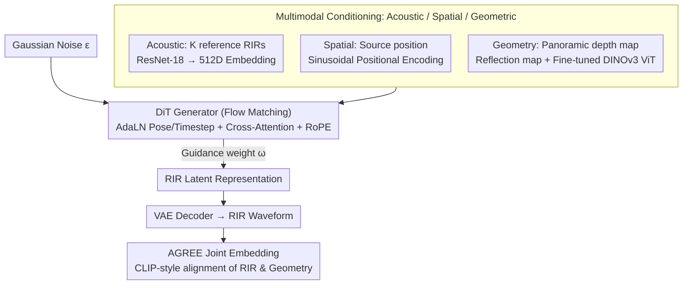

# Few-shot Acoustic Synthesis with Multimodal Flow Matching

**Conference**: CVPR2026  
**arXiv**: [2603.19176](https://arxiv.org/abs/2603.19176)  
**Code**: [Project Page](https://amandinebtto.github.io/FLAC/)  
**Area**: Image Generation (Audio Generation / Acoustic Synthesis)  
**Keywords**: flow matching, room impulse response, few-shot acoustic synthesis, diffusion transformer, multimodal conditioning, joint embedding

## TL;DR

Ours proposes FLAC, the first few-shot Room Impulse Response (RIR) generation framework based on flow matching. It synthesizes spatially consistent acoustic responses in unseen scenes from a single recording and introduces AGREE joint embedding for geometric-acoustic consistency evaluation.

## Background & Motivation

**Importance of Room Acoustic Modeling**: Immersive virtual environments require sound consistency with space. Room Impulse Response (RIR) describes sound propagation between source and receiver, which is key to spatial audio rendering.

**Limitations of Neural Acoustic Fields**: Existing methods (e.g., NeRAF, AV-GS) enable spatially continuous rendering in a single scene but require dense recordings and per-scene training, failing to generalize to new environments.

**Limitations of Prior Work in Few-shot Methods**: Few-shot methods like FewShotRIR, MAGIC, and xRIR require 8-20 reference recordings and rely on deterministic prediction, ignoring the inherent uncertainty of acoustic responses under sparse observations.

**Key Challenge of Deterministic Modeling**: With limited scene information, the same source-receiver configuration can correspond to multiple plausible RIRs (e.g., floor material differences like carpet vs. wood significantly alter acoustics). Deterministic methods fail to capture this ambiguity.

**Goal with Flow Matching**: As an efficient alternative to diffusion models, flow matching has performed excellently in text-to-speech/music generation but has not yet been applied to explicit RIR synthesis.

**Lack of Geometric Consistency Evaluation**: Traditional acoustic metrics (T60, C50, EDT) only measure perceptual quality, lacking means to measure the geometric consistency between generated RIRs and scene geometry.

## Method

### Overall Architecture

FLAC addresses few-shot RIR synthesis—synthesizing spatially consistent acoustic responses in unseen rooms using only a single recording. The core insight is that under sparse observations, one source-receiver configuration may correspond to multiple reasonable RIRs; thus, probabilistic generation is used to model this ambiguity. The model is a conditional latent generator: a VAE encoder compresses the RIR waveform into a latent representation $\mathbf{z}_0$ with a bottleneck dimension of 32. A multimodal conditioner fuses acoustic (reference RIR), spatial (source position), and geometric (panoramic depth map) modalities. The DiT generates RIR latent representations from noise using a flow matching objective. Training uses rectified flow matching for linear interpolation between data and noise $\mathbf{z}_t = (1-t)\mathbf{z}_0 + t\boldsymbol{\epsilon}$, with the model predicting the velocity field $\mathbf{v}_t = \boldsymbol{\epsilon} - \mathbf{z}_0$. During inference, the ODE is solved from Gaussian noise to obtain the RIR.

### Key Designs

**1. Timestep Sampling Strategy: Biased toward medium noise levels for efficiency**

The learning difficulty of flow matching varies across timesteps. FLAC samples from $\alpha \sim \mathcal{N}(-1.2, 4)$ mapped via sigmoid, concentrating samples on medium noise levels ($t \approx 0.7$-$0.8$). This focuses training on the most informative intervals, improving efficiency.

**2. Multimodal Condition Injection: Acoustic / Spatial / Geometric strengths**

No single modality is sufficient to determine RIR—local geometry lacks global reverberation context, and reference recordings lack spatial structure. FLAC encodes and injects three modalities: Acoustic conditions encode $K$ reference RIRs into 512D embeddings via ResNet-18; Spatial conditions use sinusoidal positional encoding of source coordinates; Geometric conditions convert panoramic depth maps to 3D coordinates via equirectangular projection to calculate reflection maps, followed by a fine-tuned DINOv3 ViT-S/16.

**3. DiT Architecture: AdaLN injection + Cross-Attention fusion**

The model uses a 12-layer Transformer with 8-head attention and a hidden dimension of 256. Target poses and timesteps are injected via AdaLN, multimodal contexts are fused via Cross-Attention, and RoPE is used for positional encoding.

**4. Classifier-free guidance: Controlling condition strength**

By randomly dropping conditions during training and adjusting the guidance weight $\omega$ during inference, the model balances between "strict adherence to observations" and "prior-based completion," which is vital for few-shot scenarios.

**5. AGREE Joint Embedding: CLIP-style dual encoder for RIR-Geometry alignment**

AGREE uses CLIP-style dual encoders to align RIR and scene geometry in a shared latent space. This fills the gap in geometric consistency evaluation and supports zero-shot cross-modal retrieval.

### Loss & Training

- **Flow Matching Loss**: $\mathcal{L}_{\text{RFM}} = \mathbb{E}[\|u(\mathbf{z}_t, t, \boldsymbol{\tau}) - \mathbf{v}_t\|^2]$
- **VAE Training Loss**: Multi-resolution STFT loss $\mathcal{L}_{\text{MR}}$ + Adversarial hinge loss $\mathcal{L}_{\text{adv}}$ + Feature matching loss $\mathcal{L}_{\text{feat}}$ + KL divergence $\mathcal{L}_{\text{KL}}$
- **AGREE Contrastive Loss**: Maximizes similarity for matched pairs and minimizes it for unmatched pairs.

## Key Experimental Results

### Main Results

**Unseen Scene 8-shot Generation (AcousticRooms)**:

| Method | K | T60 (%) ↓ | C50 (dB) ↓ | EDT (ms) ↓ | R@5 (%) ↑ |
|------|---|-----------|------------|------------|-----------|
| xRIR | 8 | 9.98 | 1.354 | 49.40 | 2.00 |
| **Ours** | **8** | **8.60** | **0.970** | **37.13** | **19.38** |
| xRIR | 1 | 14.47 | 1.961 | 74.45 | 1.36 |
| **Ours** | **1** | **9.95** | **1.046** | **40.04** | **18.92** |

**Sim-to-real Transfer (HAA)**:

| Method | K | T60 (%) ↓ | C50 (dB) ↓ | EDT (ms) ↓ |
|------|---|-----------|------------|------------|
| Diff-RIR† | 12 | 3.74 | 2.067 | 88.09 |
| **Ours** | **8** | **3.10** | **2.167** | **84.52** |
| **Ours** | **1** | **3.45** | **2.170** | **90.02** |

### Ablation Study

- **Modality Ablation**: Geometry-only yields better C50/EDT (early reflections determined by nearby surfaces); Acoustic-only yields better T60 (global reverb). The combination is optimal.
- **Geometric Encoder**: Fine-tuning DINOv3 ViT-S/16 outperforms training from scratch or frozen schemes and xRIR's ViT.
- **DiT Conditioning Strategy**: AdaLN + Cross-Attention significantly outperforms In-Context and pure Cross-Attention.

### Key Findings

- Ours 1-shot exceeds all 8-shot baselines. 93.01% of participants in subjective listening tests preferred FLAC.
- **Uncertainty Analysis**: Low-frequency samples show higher variance and longer duration, consistent with room acoustic theory where low-frequency responses are dominated by sparse modes while high frequencies stabilize above the Schröder frequency.
- **Diversity**: The within-condition diversity ratio is 4.5% (1.03 vs 22.96), showing the model introduces meaningful stochasticity while maintaining context consistency.

## Highlights & Insights

- **Novelty**: First application of flow matching to explicit RIR synthesis, modeling few-shot synthesis as a probabilistic generation problem.
- **Value**: High data efficiency where 1-shot performance exceeds previous 8-shot SOTA, reducing required recordings by $8\times$.
- **Experimental Thoroughness**: Introduction of AGREE framework fills the gap in geometric consistency evaluation and supports zero-shot cross-modal retrieval.
- **Mechanism**: Uncertainty modeling aligns with physical principles (high low-frequency uncertainty).

## Limitations & Future Work

- **Background**: The task actually belongs to audio/acoustic synthesis; the image generation classification is slightly inaccurate.
- **Limitations of Prior Work**: Geometric annotations in datasets like HAA are simplified, and the VAE has not been fine-tuned on real recordings, limiting sim-to-real transfer.
- **Design Constraints**: Currently supports only 22050 Hz and single-channel omnidirectional RIRs, without extension to binaural or multi-channel scenarios.
- **Data Scarcity**: Lack of large-scale diverse real-world audio-visual datasets restricts overall performance in real scenarios.

## Related Work & Insights

- **Neural Acoustic Fields**: NeRAF and AV-GS provide spatially continuous rendering but lack generalization across scenes.
- **Few-shot Acoustic Synthesis**: Progression from FewShotRIR (20-shot) to MAGIC (semantic) and xRIR (8-shot + depth) relied on deterministic methods.
- **Joint Embedding**: While CLIP exists for audio-visual/text, standard audio embeddings are unsuitable for RIR; AGREE is the first to align RIR with scene geometry.

## Rating

- Novelty: ⭐⭐⭐⭐⭐ 
- Experimental Thoroughness: ⭐⭐⭐⭐⭐ 
- Writing Quality: ⭐⭐⭐⭐ 
- Value: ⭐⭐⭐⭐ 

<!-- RELATED:START -->

## Related Papers

- [\[CVPR 2026\] Flow Matching for Multimodal Distributions](flow_matching_for_multimodal_distributions.md)
- [\[CVPR 2026\] BiFM: Bidirectional Flow Matching for Few-Step Image Editing and Generation](bifm_bidirectional_flow_matching_for_few-step_image_editing_and_generation.md)
- [\[CVPR 2026\] Beyond Patches: Global-aware Autoregressive Model for Multimodal Few-Shot Font Generation](beyond_patches_global-aware_autoregressive_model_for_multimodal_few-shot_font_ge.md)
- [\[ACL 2025\] OZSpeech: One-step Zero-shot Speech Synthesis with Learned-Prior-Conditioned Flow Matching](../../ACL2025/image_generation/ozspeech_one-step_zero-shot_speech_synthesis_with_learned-prior-conditioned_flow.md)
- [\[CVPR 2026\] EgoFlow: Gradient-Guided Flow Matching for Egocentric 6DoF Object Motion Generation](egoflow_gradient-guided_flow_matching_for_egocentric_6dof_object_motion_generati.md)

<!-- RELATED:END -->
