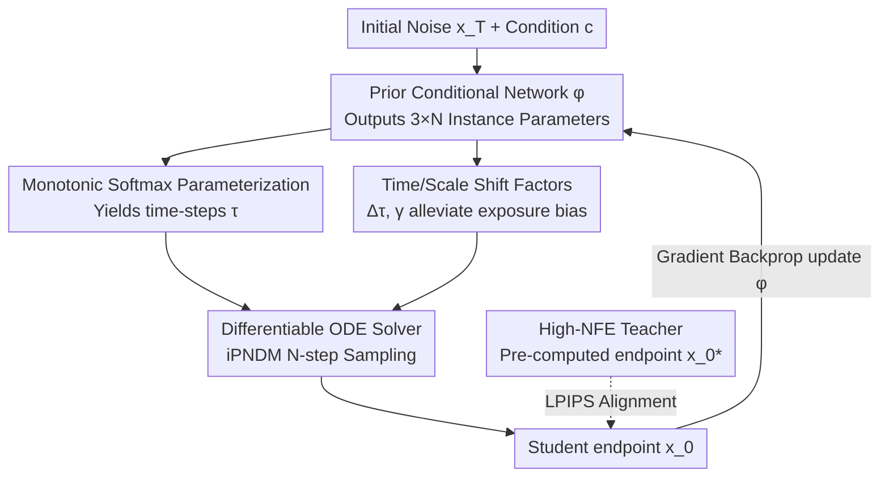

# Few-Step Diffusion Sampling Through Instance-Aware Discretizations

**Conference**: CVPR 2026  
**Paper**: [CVF Open Access](https://openaccess.thecvf.com/content/CVPR2026/html/Yuan_Few-Step_Diffusion_Sampling_Through_Instance_Aware_Discretizations_CVPR_2026_paper.html)  
**Code**: Not released  
**Area**: Image Generation / Diffusion Models  
**Keywords**: Diffusion acceleration, Time-step discretization, Instance-adaptive, Few-step sampling, Flow Matching  

## TL;DR
Addressing the sub-optimal issue of "sharing a single set of time-step discretizations for all samples" in diffusion/Flow Matching sampling, this paper proposes INDIS: training a lightweight network $\phi(\mathbf{x}_T, \mathbf{c})$ to generate instance-specific discretizations for each initial noise and condition. With nearly zero inference overhead, it significantly reduces FID for 3~7 step sampling (e.g., CIFAR10 NFE=3 FID drops from 16.5 to 9.3).

## Background & Motivation
**Background**: Diffusion models and Flow Matching generate data from a Gaussian prior by solving Probability Flow Ordinary Differential Equations (PF-ODEs). Acceleration usually follows two paths—model distillation (fewer steps but high tuning cost) and training-free acceleration (solvers + discretization strategies, architecture-agnostic/portable). In the training-free path, besides designing higher-order solvers (DPM-Solver, UniPC, iPNDM, etc.), the **time-step discretization strategy** (how to partition $[t_0, T]$ into $N$ steps) is an orthogonal but crucial component. Early methods used manual heuristics like uniform/logSNR, while recent works have turned to optimization-based searches (GITS, DMN, AYS, LD3).

**Limitations of Prior Work**: All these optimized discretization methods—whether based on trust-regions, Monte Carlo, or gradient search—enforce a **globally shared time-step schedule applied to all initial samples**. However, different initial noises traverse different sampling trajectories with varying complexities, and forcing a shared partition is inherently sub-optimal.

**Key Challenge**: The global optimum is merely an "average compromise." The authors formally state that the expected error of a globally shared schedule $\varepsilon_g$ is an **upper bound** of the per-instance optimal error $\varepsilon_i$ ($\varepsilon_g \ge \varepsilon_i$). Providing an optimal schedule for each sample is guaranteed to be no worse than the global optimum, whereas the reverse does not hold.

**Key Insight**: Controlled experiments were conducted on a synthetic recursive-tree-branch distribution (NFE=3, Euler). Using "overfitting 3 time-steps for each individual prior sample" as an oracle upper bound, its average MSE $\varepsilon_o=0.0122$ is **50.2% lower** than the global optimum $\varepsilon_g=0.0245$, with gains concentrated in high-density regions. This quantifiable gap serves as the motivation.

**Core Idea**: Directly **conditionalize the time-step strategy on the initial noise $\mathbf{x}_T$ (and condition $\mathbf{c}$)**. A lightweight network transforms "per-instance discretization" from a synthetic oracle into a learnable, scalable practical method for high-dimensional images/videos, named INDIS (Instance-Specific Discretization).

## Method

### Overall Architecture
INDIS is a **teacher-student distillation** framework, but it distills "how to partition time-steps" rather than the diffusion model itself. The input is the initial noise $\mathbf{x}_T$ and optional conditions $\mathbf{c}$ (class labels / text prompt embeddings), while the output is a set of **instance-specific discretization parameters** $\xi^\phi = \{\tau_n, \Delta\tau_n, \gamma_n\}_{n=1}^N$, which are then fed into an off-the-shelf differentiable ODE solver (iPNDM) for $N$-step sampling.

The pipeline consists of two phases: **offline teacher target preparation** (using a high-NFE teacher solver to calculate the "ground truth" endpoint $\mathbf{x}_0^*$ for each $\mathbf{x}_T$, caching RNG states instead of raw noise for near-zero memory); and **training the prior conditional network $\phi$** (forward pass calculates per-instance discretizations → execute student sampling → align student endpoint with teacher endpoint in the data domain using LPIPS → backpropagate to update $\phi$). During inference, only one lightweight forward pass of $\phi$ is required (taking only 2.3–2.5% of total sampling time at NFE=5), while other costs remain identical to standard sampling.

### Key Designs

**1. Instance-Aware Discretization Paradigm: Replacing global schedules with conditional schedules**

This is the core contribution. Previous gradient searches (e.g., LD3) solve a global objective: finding a fixed set of time-steps $\xi$ to approximate the teacher trajectory averaged over all prior samples:
$$\arg\min_{\xi}\ \mathbb{E}_{\mathbf{x}_T \sim \mathcal{N}(0,\sigma_T^2 \mathbf{I})}\big[\, d(\mathrm{ODE}(\mathbf{x}_T, \psi),\ \mathrm{ODE}(\mathbf{x}_T, \xi))\,\big],$$
where $\psi$ is the high-NFE teacher discretization and $d(\cdot,\cdot)$ is the MSE/LPIPS distance. INDIS replaces the fixed $\xi$ with a mapping $\phi$, rewriting the objective as:
$$\arg\min_{\phi}\ \mathbb{E}_{\mathbf{c}\sim\mathcal{C},\,\mathbf{x}_T \sim \mathcal{N}(0,\sigma_T^2\mathbf{I})}\big[\, d(\mathrm{ODE}(\mathbf{x}_T, \psi, \mathbf{c}),\ \mathrm{ODE}(\mathbf{x}_T, \xi^\phi, \mathbf{c}))\,\big],\quad \xi^\phi = \phi(\mathbf{x}_T,\mathbf{c}).$$
Mechanism of effectiveness: It makes the "per-instance oracle" (the upper bound that reduced MSE by 50.2% in synthetic experiments) learnable and generalizable. Compared to LD3—which treats noise $\mathbf{x}_T$ as learnable to "shift to better noise"—INDIS directly provides exclusive discretizations for each $\mathbf{x}_T$, offering stronger expressivity that continues to benefit even as sample counts exceed thousands.

**2. Prior Conditional Network and Monotonic Softmax: Stable generation of valid time-steps**

The network must output **monotonically increasing** valid time-steps within $[t_0, T]$. $\phi: \mathbb{R}^d \times \mathbb{R}^e \to \mathbb{R}^{3\times N}$ outputs three sets of logits $O=[o_\tau, o_{\Delta\tau}, o_\gamma]^T$. The primary time-steps $\tau$ are constructed using a cumulative sum of softmax outputs to enforce monotonicity:
$$\tau = \frac{f(\cdot)-f(0)}{f(N)-f(0)}\cdot(T-t_0) + t_0,\qquad f(i) = \sum_{n=i}^{N}\mathrm{softmax}(o_\tau)[n].$$
This ensures $\tau$ remains within the interval and monotonic regardless of network output. The condition $\mathbf{c}$ is integrated lightly: class indices are scaled by $1/\sqrt{\text{label\_dim}}$ before a linear layer; in text scenarios (FLUX.1-dev), T5 embeddings are mean-pooled and concatenated with CLIP embeddings. $\phi$ is a lightweight MLP structure with negligible overhead compared to the $N$ evaluations of the diffusion backbone $\epsilon_\theta$.

**3. Time/Scale Shift Factors: Mitigating exposure bias within the same framework**

The mismatch between training (where noise contains data information) and sampling (isotropic Gaussian) causes exposure bias. INDIS treats correction terms as **per-instance learnable parameters**: besides $\tau_n$, it predicts time shifts $\Delta\tau_n$ and scale factors $\gamma_n$, redefining function evaluation as:
$$\hat{\epsilon}_\theta(\mathbf{x}_n, \tau_n, \Delta\tau_n, \gamma_n) := \gamma_n \cdot \epsilon_\theta(\mathbf{x}_n,\ \tau_n + \Delta\tau_n).$$
These factors use bounded activations for stability: $\Delta\tau = b_{\Delta\tau}\cdot\tanh(o_{\Delta\tau}/2)$ and $\gamma = b_\gamma\cdot\tanh(o_\gamma/2)+1$. This allows exposure bias correction to be adaptive per instance rather than a global constant.

### Loss & Training
The objective is the distillation of $\phi$, using **LPIPS** for the data domain distance $d(\cdot,\cdot)$ to better align with perception.

1. **Data Preparation**: Sample $\mathbf{c}\sim\mathcal{C}, \mathbf{x}_T\sim\mathcal{N}(0,\sigma_T\mathbf{I})$. Use teacher discretization $\psi$ + high-NFE solver to compute target endpoints $\mathbf{x}_0^* = \Psi(\mathbf{x}_T,\psi,\mathbf{c})$, cached as a fixed teacher set (e.g., 10k images/latents generated by 30-step iPNDM).
2. **Iteration**: Draw $(\mathbf{x}_T,\mathbf{c},\mathbf{x}_0^*)$ → forward pass $\xi^\phi=\phi(\mathbf{x}_T,\mathbf{c})$ → student sampling $\mathbf{x}_0=\Psi(\mathbf{x}_T,\xi^\phi,\mathbf{c})$ → update $\phi$ via gradient step on $d(\mathbf{x}_0,\mathbf{x}_0^*)$. Optimizer: Adam with cosine learning rate.

Both teacher and student solvers use **iPNDM**, as it yielded optimal results in trials.

## Key Experimental Results

### Main Results
Experiments cover pixel-space diffusion (CIFAR10/FFHQ/AFHQv2/ImageNet64), latent-space diffusion (LSUN-Bedroom, Stable Diffusion), text-to-image Flow Matching (FLUX.1-dev), and video (LTX-Video). Main metric: FID (50k images).

Pixel-space FID (NFE=3, lower is better):

| Dataset | Best Heu. | AMED | GITS | LD3 | INDIS |
|--------|-----------|------|------|-----|-------|
| CIFAR10 32² | 57.39 | 18.49 | 25.98 | 16.52 | **9.26** |
| FFHQ 64² | 72.29 | 26.87 | 26.41 | 23.86 | **17.72** |
| AFHQv2 64² | 40.24 | 31.82 | 24.17 | 17.94 | **10.15** |
| ImageNet 64² | 44.93 | 28.06 | 26.41 | 27.82 | **18.96** |

Compared to the strongest baseline, the average FID Improvement for NFE=3 / 5 / 7 was **35.33% / 31.50% / 15.62%** respectively—gains are more pronounced at lower NFE. For LSUN-Bedroom (256²), INDIS reduced FID from 14.62 (LD3) to 12.44 at NFE=3.

FLUX.1-dev (T2I, MS-COCO) Metrics:

| Metric | Method | NFE=3 | NFE=5 | NFE=7 |
|------|------|-------|-------|-------|
| FID ↓ | RDS / GOD / INDIS | 64.50 / 56.82 / **44.35** | 30.12 / 28.52 / **24.89** | 22.58 / 22.77 / 22.70 |
| CLIP ↑ | RDS / GOD / INDIS | 23.29 / 24.41 / **26.33** | 29.66 / 29.70 / **30.01** | 30.76 / 30.80 / **30.86** |
| CMMD ↓ | RDS / GOD / INDIS | 1.75 / 1.72 / **1.69** | 0.86 / 0.79 / **0.75** | 0.89 / 0.75 / **0.73** |

While FLUX is robust to hyperparameters, INDIS consistently outperformed global baselines (RDS/GOD) in the few-step regime. Video results on LTX-Video also showed improvements in aesthetic and imaging quality.

### Ablation Study
Removing the three components observed via FID (FFHQ/LSUN/FLUX):

| Configuration | Performance | Description |
|------|------|------|
| Full | Best | Complete INDIS |
| w/o Instance Condition | **Worst drop** | Degenerates to global optimization; highest drop across all models—confirms this as the core contribution. |
| w/o Shift Factors | Model dependent | Significant drop on FFHQ, smaller on others (depends on noise schedule/exposure bias severity). |
| w/o Text Condition | Drop on FLUX | Discretization fails to adapt to prompts. |

### Key Findings
- **Instance-level conditioning is the primary contribution**: Removing it causes the most severe drop across all backbones, reverting to global optimal levels.
- **Maximum gains in low NFE range**: Contribution of per-instance discretization to KL/Wasserstein distance in synthetic experiments peaks at NFE=3~6.
- **Almost zero cost**: Inference only adds one $\phi$ forward pass, accounting for ~2.3–2.5% of total sampling time.

## Highlights & Insights
- **The "per-instance ≥ global" inequality is compelling**: Using $\varepsilon_g \ge \varepsilon_i$ plus the 50.2% MSE gap validates "global schedule sub-optimality" with quantitative proof rather than just intuition.
- **Exposure bias integrated into the same framework**: Predicting $\Delta\tau$ and $\gamma$ alongside time-steps allows a unified framework to solve two separate problems with bounded stability.
- **Monotonic softmax parameterization** is highly transferable: Any task requiring a set of monotonic scalars within a range can reuse the $f(i)=\sum_{n\ge i}\mathrm{softmax}$ construction.
- **Orthogonal plug-and-play**: The method is independent of solvers and backbones, making it a portable acceleration plugin rather than a custom trick.

## Limitations & Future Work
- For large models like FLUX, training relies on **gradient checkpointing** to fit memory, increasing training compute.
- $\phi$ takes the **full dimensionality of the initial noise $\mathbf{x}_T$** as input ($\mathbb{R}^d$), which is high for latent spaces. Scalability and robustness to noise perturbations were not fully explored in the main text.
- Diminishing returns at high NFE (e.g., NFE≥7 for FLUX), where different discretization strategies converge.

## Related Work & Insights
- **vs LD3**: Both use gradient-based discretization search with teacher supervision. LD3 treats $\mathbf{x}_T$ as learnable to "shift to a better noise" but uses a **global** schedule. INDIS gives each $\mathbf{x}_T$ a **specific** schedule, significantly outperforming LD3 on large datasets.
- **vs GITS/DMN/AYS**: These methods search for a **globally** optimal schedule, which INDIS identifies as a mere "average compromise."
- **vs Model Distillation (EPD/AdaSDE)**: Distillation modifies model weights at high cost; INDIS achieves better few-step results without moving the base model weights.

## Rating
- Novelty: ⭐⭐⭐⭐ Upgrading "global discretization" to "instance-conditional discretization" with clear motivation, though it builds upon gradient-based search foundations.
- Experimental Thoroughness: ⭐⭐⭐⭐⭐ Comprehensive coverage across pixel/latent/T2I/video backbones with rigorous baseline comparisons.
- Writing Quality: ⭐⭐⭐⭐ Strong logical flow; some architecture details are moved to the appendix.
- Value: ⭐⭐⭐⭐ A near-zero overhead, plug-and-play acceleration tool for few-step diffusion deployment.

<!-- RELATED:START -->

## Related Papers

- [\[CVPR 2026\] LogCD: Local-to-global Consistency Distillation for Few-step Image Generation](logcd_local-to-global_consistency_distillation_for_few-step_image_generation.md)
- [\[CVPR 2026\] InverFill: One-Step Inversion for Enhanced Few-Step Diffusion Inpainting](inverfill_one-step_inversion_for_enhanced_few-step_diffusion_inpainting.md)
- [\[CVPR 2026\] FlowSteer: Guiding Few-Step Image Synthesis with Authentic Trajectories](flowsteer_guiding_few-step_image_synthesis_with_authentic_trajectories.md)
- [\[CVPR 2026\] BiFM: Bidirectional Flow Matching for Few-Step Image Editing and Generation](bifm_bidirectional_flow_matching_for_few-step_image_editing_and_generation.md)
- [\[CVPR 2026\] Uni-DAD: Unified Distillation and Adaptation of Diffusion Models for Few-step Few-shot Image Generation](uni-dad_unified_distillation_and_adaptation_of_diffusion_models_for_few-step_few.md)

<!-- RELATED:END -->
