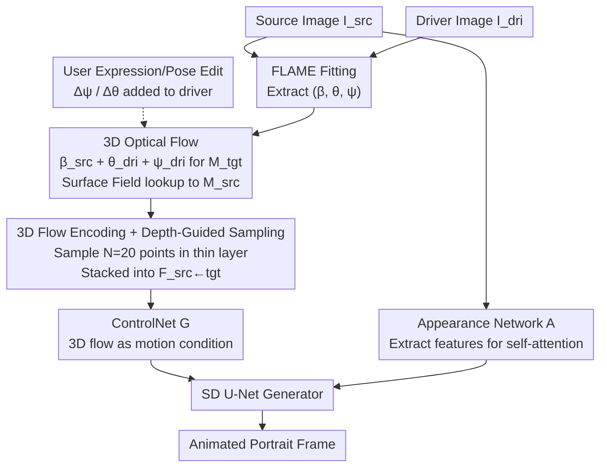

# FG-Portrait: 3D Flow Guided Editable Portrait Animation

**Conference**: CVPR 2026  
**arXiv**: [2603.23381](https://arxiv.org/abs/2603.23381)  
**Code**: None  
**Area**: Diffusion Models / Image Generation  
**Keywords**: Portrait Animation, 3D Optical Flow, Parametric Head Model, Diffusion Model, Expression Editing

## TL;DR

This paper proposes FG-Portrait, which introduces "3D optical flow" directly computed from FLAME parametric 3D head models as a learning-free geometric motion correspondence. Combined with depth-guided sampled 3D optical flow encoding as the motion condition for a diffusion-based ControlNet, it significantly improves motion transfer accuracy (reducing APD by 22%+) and supports inference-time editing of expressions and head poses.

## Background & Motivation

1.  **Background**: The goal of portrait animation is to transfer the expressions and head poses of a driver portrait to a source image. Current mainstream methods fall into two categories: (a) Diffusion-based methods (e.g., X-Portrait, Face-Adapter, HunyuanPortrait), which use landmarks or latent representations of the driver image as motion conditions; (b) Motion field prediction methods (e.g., FOMM, EMOPortrait), which learn dense motion correspondences between source and driver to warp source features.
2.  **Limitations of Prior Work**: Diffusion-based methods only perform conditional generation for the driver motion, lacking explicit motion correspondence between the source and driver, resulting in imprecise motion transfer (large pose/expression errors). Motion field prediction methods require massive data for self-supervised learning of 2D dense motion, but estimating 3D motion from 2D images is inherently an ill-posed problem that often fails under large pose variations or significant appearance differences.
3.  **Key Challenge**: How to introduce accurate, robust, and learning-free source-driver motion correspondence into a diffusion model framework?
4.  **Goal**: (a) Establish accurate 3D spatial motion correspondence; (b) Effectively encode 3D motion priors into 2D conditional signals usable by diffusion models; (c) Support user-specified editing during inference.
5.  **Key Insight**: Parametric 3D head models like FLAME naturally provide vertex-wise semantic correspondence—the same vertex index corresponds to the same facial structure regardless of pose or expression. This geometric property allows for the direct calculation of learning-free 3D displacements to serve as motion guidance.
6.  **Core Idea**: Use point-wise displacement (3D flow) on the FLAME 3D head model instead of learned motion fields as the motion condition for the diffusion ControlNet, achieving accurate and editable portrait animation.

## Method

### Overall Architecture

The core problem FG-Portrait addresses is that diffusion-based portrait animation treats driver information only as a condition without explicitly telling the network "where a point on the source image should move," leading to motion drift during large poses or expressions. The approach calculates this missing "source-to-target point-wise displacement" using a 3D parametric head model and encodes it into a 2D condition understandable by the diffusion model.

The pipeline comprises three branches: a Stable Diffusion U-Net as the generator; an Appearance Network $A$ (isomorphic to the U-Net) to extract appearance features from the source image and inject them into the generator's self-attention; and a ControlNet $G$ for motion control. The primary innovation is in the third branch—replacing traditional landmarks or driver images with the calculated **3D optical flow encoding** $F_{src \leftarrow tgt}$ as the motion condition. During training, $I_{src}$ and $I_{dri}$ are two frames from the same video, and the goal is to reconstruct $I_{dri}$.

### Key Designs

**1. 3D Optical Flow: Direct source-to-target displacement via FLAME topology, bypassing learned motion fields.**

Learned motion fields must infer 3D motion from 2D images, an ill-posed problem that breaks down with insufficient data or large pose changes. 3D optical flow takes a different route: the vertex indices in FLAME correspond to the same facial structure under any pose/expression; this semantic correspondence is geometric and requires no training. Specifically, FLAME parameters $(β_{src}, θ_{src}, ψ_{src})$ and $(β_{dri}, θ_{dri}, ψ_{dri})$ are fitted for the source and driver. A target head model $M_{tgt}$ is constructed using "source identity shape $β_{src}$ + driver pose $θ_{dri}$ + driver expression $ψ_{dri}$." A Surface Field (SF) function then finds point-wise correspondences between $M_{tgt}$ and $M_{src}$: for a target point $p_{tgt}$, the source corresponding point is $p_{src} = \text{SF}(p_{tgt}; M_{tgt}, M_{src})$. The 3D optical flow is:

$$f_{src \leftarrow tgt} = p_{src} - p_{tgt}.$$

Note that this is a **backward search** (looking from target back to source), ensuring every target pixel finds a correspondence without holes. Because it relies on geometric topology rather than appearance, the correspondence remains stable regardless of appearance differences or extreme poses.

**2. 3D Flow Encoding + Depth-Guided Sampling: Flattening 3D displacements into 2D maps focused on the true surface.**

3D optical flow exists in 3D space, but ControlNet requires 2D tensors. To resolve this, for each pixel $(u,v)$ in the target image, $N=20$ points $p_{tgt}^n = H[d_n(K^{-1}q_{tgt})^\top, 1]^\top$ are sampled along the back-projection ray. The 3D flows are queried and stacked to form $F_{src \leftarrow tgt} \in \mathbb{R}^{H \times W \times 3N}$.

The key lies in where these $N$ points are sampled. Uniform sampling along the entire ray would lead to many points far from the actual surface, causing queried flows to mismatch the true 2D motion. Depth-guided sampling first renders a depth map $\tilde{D}_{tgt} = \text{Render}(M_{tgt}; H, K)$ of the target head. For pixels in the head region, points are sampled only within a thin layer $[\tilde{D}_{tgt}[u,v] - \delta,\ \tilde{D}_{tgt}[u,v] + \delta]$ ($\delta = 0.01m$). Non-head regions revert to a predefined range $[d_{near}, d_{far}]$. This ensures sampling points are close to the actual surface, allowing the encoded flow to faithfully reflect 2D motion. Removing this step causes APD to jump from 2.682 to 9.659.

**3. User-Specified Expression and Pose Editing: Naturally supported by parameter-driven conditions.**

Traditional diffusion animation consumes a driver image, making it difficult to precisely modify specific expression intensities or rotation angles. Since FG-Portrait's motion conditions are derived from FLAME parameters, a user can provide an expression increment $\Delta\psi_{usr}$ or pose increment $\Delta\theta_{usr}$ at inference. These are added to the driver parameters $\psi_{dri} \leftarrow \psi_{dri} + \Delta\psi_{usr}$, and $M_{tgt}$ and the 3D flow are recomputed. The process is feed-forward, instantaneous, and requires no extra training.

### Loss & Training

The standard diffusion denoising loss is used: $\mathcal{L} = \mathbb{E}_{z_0,c,\epsilon,t}[\|\epsilon - U(z_t, t, c)\|_2^2]$. SD 1.5 serves as the backbone with frozen weights. The Appearance Network is initialized from X-Portrait, and ControlNet's extra input layers are randomly initialized. AdamW optimizer is used with a learning rate of $1e^{-5}$. After training the image diffusion pipeline, temporal layers are inserted and fine-tuned on video sequences for temporal consistency. Training data consists of 1K videos sampled from the VFHQ dataset.

## Key Experimental Results

### Main Results

VFHQ self-reenactment (512×512):

| Method | LPIPS↓ | CSIM↑ | APD↓ | AED↓ |
|------|--------|-------|------|------|
| EMOPortrait | 0.235 | 0.729 | 3.047 | 0.371 |
| X-Portrait | 0.195 | 0.777 | 3.660 | 0.357 |
| Follow-Your-Emoji | 0.162 | 0.774 | 3.570 | 0.402 |
| HunyuanPortrait | 0.162 | 0.781 | 3.440 | 0.341 |
| **Ours** | **0.158** | **0.807** | **2.682** | **0.327** |

VFHQ cross-reenactment:

| Method | FID↓ | CSIM↑ | APD↓ | AED↓ |
|------|------|-------|------|------|
| EMOPortrait | 100.6 | 0.386 | 7.860 | 0.660 |
| Face-Adapter | 94.6 | 0.424 | 7.785 | 0.688 |
| HunyuanPortrait | 92.7 | 0.455 | 9.220 | 0.658 |
| **Ours** | **87.0** | 0.462 | **7.764** | **0.652** |

FFHQ cross-dataset generalization: FID 99.4 (Best), APD 9.297 (Best), AED 0.714 (Best).

### Ablation Study

Motion condition comparison (Tab. 4):

| Motion Condition | S-APD↓ | S-AED↓ | C-APD↓ | C-AED↓ |
|----------|--------|--------|--------|--------|
| Driver Landmark | 4.001 | 0.373 | 8.588 | 0.688 |
| Predicted Flow | 4.232 | 0.384 | 12.430 | 0.778 |
| **Ours (3D Flow)** | **2.682** | **0.327** | **7.764** | **0.652** |

Depth-guided sampling ablation (Tab. 5):

| Configuration | LPIPS↓ | CSIM↑ | APD↓ | AED↓ |
|------|--------|-------|------|------|
| w/o Depth (Uniform) | 0.213 | 0.770 | 9.659 | 0.730 |
| **w/ Depth** | **0.158** | **0.807** | **2.682** | **0.327** |

Hyperparameter ablation: $N=20$ and $\delta=0.01m$ performed stably across configurations; $N=10$ caused a slight performance drop.

### Key Findings

- **3D Flow is decisive for motion transfer improvement**: Compared to landmark conditions, APD decreased by 33% (4.001→2.682), and by 37% compared to predicted flows. This demonstrates the superior advantage of geometric-driven, learning-free motion correspondence.
- **Depth-guided sampling is the key to 3D flow encoding**: Without depth guidance, APD is as high as 9.659; with it, it drops to 2.682, an improvement of ~72%. This proves querying flow at the correct 3D positions is critical.
- In cross-reenactment, CSIM is slightly lower than Follow-Your-Emoji (0.462 vs 0.484). This is a reasonable tradeoff: more accurate motion transfer naturally forces a balance between identity preservation and motion precision.
- Temporal consistency (FVD) is 412.1, second only to Follow-Your-Emoji (382.6), showing competitive temporal coherence.

## Highlights & Insights

- **Learning-free 3D motion correspondence** is the most significant innovation: FLAME's topological correspondence provides per-vertex semantic matching directly, requiring no self-supervised training and remaining robust under extreme poses. This concept can be transferred to human animation (using SMPL) or hand animation.
- **Encoding 3D information into 2D signals** is handled cleverly: by sampling and stacking flows from multiple 3D points along a ray, it preserves 3D information while remaining compatible with 2D diffusion inputs. Depth guidance further focuses the signal on valid regions.
- Support for **parameter-level editing during inference** is a major practical advantage—users can precisely control expression intensity and head rotation, something not possible with most diffusion animation methods.

## Limitations & Future Work

- The FLAME model's mesh resolution is limited, making it difficult to represent fine details (e.g., micro-expressions, wrinkles).
- The model is trained only on real portraits and performs poorly on cartoon/anime characters (e.g., artifacts in eyelid closure), requiring fine-tuning on stylized data.
- SD 1.5 is a relatively old backbone; upgrading to advanced DiTs (e.g., SD3, FLUX) may further improve quality.
- The quality of FLAME fitting directly impacts 3D flow accuracy; fitting may be inaccurate under occlusion or extreme lighting.

## Related Work & Insights

- **vs X-Portrait**: X-Portrait uses the driver image itself as a motion condition, hoping the model learns motion correspondence implicitly. It fails during large pose changes (APD 3.660 vs 2.682). FG-Portrait provides explicit geometric guidance, lowering the learning difficulty.
- **vs HunyuanPortrait**: HunyuanPortrait uses a stronger DiT backbone and video diffusion, yet remains less accurate in motion (APD 3.440 vs 2.682), suggesting that motion condition design is more important than the backbone itself.
- **vs EMOPortrait**: EMOPortrait represents learned motion field methods using GANs. FG-Portrait significantly outperforms it in both motion accuracy and image quality, validating the limitations of learned fields in generalization.

## Rating

- Novelty: ⭐⭐⭐⭐⭐ 3D flow as a learning-free motion correspondence is an elegant innovation.
- Experimental Thoroughness: ⭐⭐⭐⭐ Extensive self/cross reenactment on VFHQ/FFHQ with detailed ablations.
- Writing Quality: ⭐⭐⭐⭐⭐ Clear motivation, elegant method description, and intuitive diagrams.
- Value: ⭐⭐⭐⭐⭐ Establishes a new motion guidance paradigm for portrait animation with high transferability.

<!-- RELATED:START -->

## Related Papers

- [\[CVPR 2026\] ExpPortrait: Expressive Portrait Generation via Personalized Representation](expportrait_expressive_portrait_generation_via_personalized_representation.md)
- [\[CVPR 2025\] MVPortrait: Text-Guided Motion and Emotion Control for Multi-View Vivid Portrait Animation](../../CVPR2025/image_generation/mvportrait_text-guided_motion_and_emotion_control_for_multi-view_vivid_portrait_.md)
- [\[CVPR 2026\] 3D Space as a Scratchpad for Editable Text-to-Image Generation](3d_space_as_a_scratchpad_for_editable_text-to-image_generation.md)
- [\[CVPR 2026\] POLAR: A Portrait OLAT Dataset and Generative Framework for Illumination-Aware Face Modeling](polar_a_portrait_olat_dataset_and_generative_framework_for_illumination-aware_fa.md)
- [\[CVPR 2026\] Say Cheese! Detail-Preserving Portrait Collection Generation via Natural Language Edits](say_cheese_detail-preserving_portrait_collection_generation_via_natural_language.md)

<!-- RELATED:END -->
