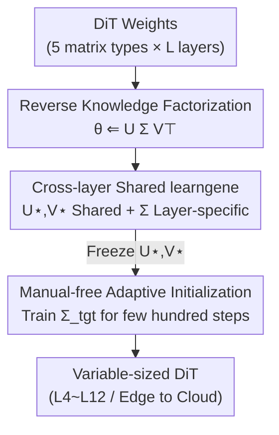

# FINE: Factorizing Knowledge for Initialization of Variable-sized Diffusion Models

**Conference**: CVPR 2026  
**Paper**: [CVF Open Access](https://openaccess.thecvf.com/content/CVPR2026/html/Xie_FINE_Factorizing_Knowledge_for_Initialization_of_Variable-sized_Diffusion_Models_CVPR_2026_paper.html)  
**Code**: None  
**Area**: Diffusion Models / Image Generation / Model Initialization  
**Keywords**: Diffusion model initialization, learngene, weight factorization, variable-sized models, DiT  

## TL;DR
FINE is a pre-training method for diffusion models: it formulates weights of each layer as $U_\star \Sigma^{(l)}_\star V_\star^\top$. The shared singular vectors $U_\star, V_\star$ (termed learngene) carry size-agnostic knowledge, while layer-specific singular values $\Sigma^{(l)}_\star$ adapt to each layer. For any target size, one can directly initialize by freezing the learngene and performing lightweight retraining of $\Sigma$ (approx. 0.3K steps vs. 300K steps for full pre-training). It reduces FID by up to 4.89 on ImageNet for variable-depth DiT models.

## Background & Motivation
**Background**: Training diffusion models is extremely expensive, making "pre-train + reuse" the mainstream approach. However, hardware in real-world deployment (mobile, edge, cloud) varies in VRAM and compute, requiring **various model sizes**. Yet, official pre-trained weights are usually limited to fixed configurations like DiT-B / DiT-L / DiT-XL.

**Limitations of Prior Work**: When the required size for deployment lacks a corresponding pre-trained version, one must either train from scratch (expensive) or resort to PEFT / distillation / pruning. These methods either depend heavily on a specific pre-trained backbone (lacking flexibility in size) or require re-distillation for every new size, leading to costs that expand linearly with the number of models.

**Key Challenge**: Existing Learngene-based methods propose "encapsulating reusable, size-agnostic knowledge into a learngene," but most are **heuristic and layer-picking based**—manually extracting certain layers from a pre-trained model to stack into a target model. This "layer-isolated" design ignores the essence of diffusion models: the denoising process exhibits **strong cross-layer dependencies and temporal coupling** across different noise levels and layers. Rigidly stacking layers via manual selection easily disrupts this inter-layer consistency.

**Goal**: Is it possible to pre-train **a unified model** whose knowledge can be flexibly decomposed into size-agnostic basic units, thereby directly initializing diffusion models of any size without repetitive pre-training?

**Key Insight**: The authors observe that Transformers are stacked from blocks with identical configurations, containing "size-agnostic" knowledge that does not vary with depth (previous works found diagonal patterns and inter-layer linear correlations in ViT). FINE transfers this observation to DiT and materializes "size-agnostic knowledge" as **shared singular vectors across weight matrices of different layers**.

**Core Idea**: Reconstruct weights using an SVD-like decomposition $W^{(l)}_\star = U_\star \Sigma^{(l)}_\star V_\star^\top$, but **in reverse**—not by applying SVD to pre-trained weights, but by defining shared $U_\star, V_\star$ (learngene) and layer-specific $\Sigma^{(l)}_\star$ first, and then training them jointly. When changing sizes, only $\Sigma$ is updated.

## Method

### Overall Architecture
FINE splits "training a knowledge-decomposable model" and "initializing for a new size" into two phases. **Phase 1 (Knowledge Factorization) is a one-time cost**: During pre-training on ImageNet, instead of optimizing standard parameters $\theta$, every layer's weights are constrained to be the product of shared singular vectors and layer-specific singular values. $U, V, S$ are trained jointly to obtain size-agnostic learngenes. **Phase 2 (Model Initialization) is cheap**: For any target size $\theta_{\text{tgt}}$, the learngenes $U, V$ are frozen, and only the layer-specific $\Sigma_{\text{tgt}}$ is randomly initialized and trained lightly. It converges in a few hundred steps, after which the model can be normally trained or deployed.

Each DiT layer contains MSA and PFF modules. FINE establishes shared decompositions for five categories of weight matrices $T=\{qkv, o, in, out, adaLN\}$: all layers of the same type share a pair of $U_\star, V_\star$, with each layer having its own $\Sigma^{(l)}_\star$.

### Key Designs

**1. Reverse Knowledge Factorization: Turning "SVD on weights" into "Weight reconstruction via shared factors"**

The pain point is that methods like KIND or SVDiff perform SVD on **already trained** weights layer by layer independently. The resulting singular vectors are layer-specific and uncoordinated, making them impossible to share across layers or reuse across sizes. FINE reverses this process—it doesn't decompose existing weights but declares a set of shared singular vectors to be learned $U_\star \in \mathbb{R}^{m_1\times r}$, $V_\star \in \mathbb{R}^{r\times m_2}$ and layer-specific diagonal matrices $\Sigma^{(l)}_\star = \mathrm{diag}(\sigma)$, then **reconstructs** the weights for each layer:

$$W^{(l)}_\star \Leftarrow U_\star \Sigma^{(l)}_\star V_\star^\top$$

The use of $\Leftarrow$ instead of $=$ for SVD emphasizes that "factorization is a reverse, constructed process." After aggregating all layers and types as $\theta = U S V^\top$, the pre-training objective is to minimize the diffusion denoising loss under this constraint:

$$\arg\min_{U,S,V} \; \mathcal{L}\big(\varepsilon_\theta(z_t,t,c),\,\varepsilon\big), \quad \text{s.t.}\; \theta = U S V^\top$$

Note that the loss only updates the three sets of factors $U, V, S$, while $\theta$ is "reconstructed" according to the equation during each iteration before the forward pass. This naturally allows gradients to flow back to shared factors, forcing $U, V$ to learn structures reusable by all layers. This is the fundamental mechanism by which FINE produces "decomposable knowledge": knowledge is organized into a shared + specific structure from the start, rather than being forcefully split post-hoc.

**2. Cross-layer shared learngene: Carrying size-agnostic knowledge in $U_\star, V_\star$ and inter-layer differences in $\Sigma^{(l)}_\star$**

This is the core difference between FINE and previous learngene methods. Previous methods were "layer-isolated"—picking certain layers as learngenes, which loses inter-layer dependencies; however, diffusion denoising requires cross-layer semantic consistency. FINE allows **all layers** of the same matrix type to share the **same pair** of $U_\star, V_\star$ (e.g., $W^{(1\sim L)}_{qkv}$ share one $U_{qkv}, V_{qkv}$), explicitly compressing "knowledge that doesn't change with depth" into these shared singular vectors. Each layer only retains a lightweight $\Sigma^{(l)}_\star$ to fine-tune this shared representation to fit the specific layer.

This offers two benefits: first, the shared $U, V$ naturally encode coordination across layers, avoiding inter-layer misalignment caused by manual layer stacking; second, because $U, V$ are size-agnostic, the target model can be "reassembled" from the same set of learngenes regardless of its required depth or width. The paper compares $U, V$ to heritable gene segments in biology, turning "resizing" into "recombining the same set of genes" instead of "re-training a new set of weights." The authors also found via PCA visualization that $\Sigma^{(l)}_\star$ is approximately **linearly arranged** across layers, and layers of small models align with corresponding segments of large models (e.g., Layer 1 of L4 corresponds to the first two layers of L8), validating the cross-scale coherence of this shared structure.

**3. Manual-free Adaptive Initialization: Training only layer-specific $\Sigma$ for new sizes, converging in hundreds of steps**

Traditional learngene initialization relies on manual rules to stack layers, which is subjective and lacks generality. In diffusion models, this is especially prone to breaking consistency due to dynamic inter-layer interactions. FINE changes this to a **data-driven, manual-free** step: given a target model $\theta_{\text{tgt}}$, the shared $U, V$ are frozen, and the layer-specific singular values $\Sigma_{\text{tgt}}$ are randomly initialized and then optimized:

$$\arg\min_{\Sigma_{\text{tgt}}} \; \mathcal{L}\big(\varepsilon_{\theta_{\text{tgt}}}(z_t,t,c),\,\varepsilon\big), \quad \text{s.t.}\; \theta_{\text{tgt}} = U \Sigma_{\text{tgt}} V^\top$$

Since $\Sigma$ is a diagonal matrix with very few parameters, it forms a **compact parameter space**. It can be adapted using very little data and few gradient steps (approx. 0.3K steps compared to 300K for full pre-training). Once $\Sigma$ is trained, initialization is complete, and the model can then be trained without constraints or deployed. Compared to rule-based initialization (identical / linear), the trainable $\Sigma$ provides customized adaptation for each size, "translating" the generality of the learngene into an optimal starting point for the specific dimensions.

### Loss & Training
Both phases reuse the standard denoising loss for latent diffusion: $\mathcal{L} = \mathbb{E}_{z,c,\varepsilon,t}\big[\lVert \varepsilon - \varepsilon_\theta(z_t,c,t)\rVert_2^2\big]$. The difference lies in **which variables are optimized and what constraints are applied**: Phase 1 updates $U, S, V$ jointly under the constraint $\theta=USV^\top$; Phase 2 freezes $U, V$ and only updates $\Sigma_{\text{tgt}}$. The backbones are DiT-B / DiT-L, patch size = 2, 256×256 resolution. The knowledge factorization phase is trained on ImageNet-1K for 300K steps with a batch size of 64, learning rate of $1\times10^{-4}$, AdamW, on a single RTX 4090.

## Key Experimental Results

### Main Results: Initializing Variable-depth DiT on ImageNet-1K
All target models were trained for 100K steps after initialization; lower FID is better. FINE consistently outperforms three categories of methods (direct initialization, transfer initialization, learngene initialization) across all L4~L12 depth levels of DiT-B / DiT-L, reducing FID by up to 4.89 (DiT-B L10) and 4.62 (DiT-L L10). The table below extracts comparisons with the strongest baseline, TLEG (FID):

| Model | TLEG | FINE | FID Gain |
|------|------|------|----------|
| DiT-B L8 | 49.04 | 45.34 | ↓3.70 |
| DiT-B L10 | 47.22 | 42.33 | ↓4.89 |
| DiT-B L12 | 45.02 | 42.74 | ↓2.28 |
| DiT-L L10 | 41.15 | 36.53 | ↓4.62 |
| DiT-L L12 | 39.72 | 35.59 | ↓4.13 |

Regarding efficiency: directly pre-training $n$ models of different sizes requires $300K\times n$ steps. FINE only requires $300K + 100K\times n$ steps (one factorization + lightweight adaptation per size), providing approx. $3n\times$ speedup. Furthermore, FINE-initialized models trained for 100K steps outperform models trained from scratch for 300K steps.

### Downstream Dataset Migration (Table 2)
The learngene is not only size-agnostic but also to some extent domain-agnostic. FINE leads across 6 significantly different downstream domains; FID is used for natural images and FDD for non-natural images:

| Dataset | Metric | 2nd Best (TLEG) | FINE | Gain |
|--------|------|-------------|------|------|
| CelebA (DiT-B) | FID | 8.27 | 7.99 | ↓0.28 |
| LSUN-Bedroom (DiT-B) | FID | 20.43 | 17.83 | ↓2.60 |
| LSUN-Church (DiT-B) | FID | 19.30 | 17.29 | ↓2.01 |

Notably, FINE migrates only about **35%** of the parameters yet outperforms "full parameter fine-tuning from a pre-trained model." This confirms that "migrating more parameters is not necessarily better"—especially when the gap between downstream (e.g., Hubble, MRI) and training domains is large, redundant knowledge can hinder adaptation.

### Ablation Study

**Whether knowledge factorization is shared across layers (Table 4)**: Replacing FINE with "performing SVD independently per layer and taking top singular vectors" significantly degrades reusability.

| Configuration | DiT-B L6 FID | DiT-L L6 FID |
|------|--------------|--------------|
| From Scratch | 80.37 | 72.57 |
| w/o Factorize (Independent SVD) | 62.86 | 56.42 |
| FINE (Cross-layer Shared) | 51.58 | 44.38 |

**Initialization methods for $\Sigma$ (Table 5, DiT-B L12 / DiT-L L12)**:

| Σ Initialization | DiT-B L12 FID | DiT-L L12 FID | Description |
|----------|---------------|---------------|------|
| Random | 77.70 | 73.58 | No reuse of shared knowledge, worst |
| Identical | 47.84 | 42.53 | Rule-based, same value for all layers |
| Linear | 46.71 | 39.34 | Rule-based, linear arrangement |
| Trainable (FINE) | 42.74 | 35.59 | Trainable Σ, best |

### Key Findings
- **Cross-layer sharing is the main source of performance**: Without cross-layer sharing (w/o Factorize), the FID of DiT-L L6 regresses from 44.38 to 56.42 (a drop of 12.04), indicating that "size-agnostic knowledge" is primarily provided by the shared $U, V$.
- **Trainable $\Sigma$ is significantly better than rule-based**: Compared to Linear initialization, trainable $\Sigma$ reduces FID by another 3.97 on DiT-B L12, proving that lightweight adaptation for each size is more effective than rigid rule-based stacking.
- **$\Sigma$ is approximately linear across layers and aligned across scales**: PCA visualization shows points of the same color (same model) arranged at near-equal intervals, with layers of small models aligning with corresponding segments of large models, revealing the structural coherence of learngene across scales.
- **Generalization to classification tasks**: FINE also leads on DeiT-Ti / DeiT-S, using deterministic reorganization + lightweight $\Sigma$ adjustment, which is more stable than LiGO's random transformations.

## Highlights & Insights
- **"Reverse SVD" is a masterstroke**: Instead of factorizing existing weights, defining shared factors first to reconstruct weights ensures that "decomposability, shareability, and transferability" are built-in attributes learned during pre-training, rather than being forced after the fact. This upgrades learngene from "layer selection" to "singular structure decomposition."
- **Compressing the cost of resizing into a diagonal matrix**: All heavy lifting across layers and sizes is pushed into the shared $U, V$. When changing sizes, only a diagonal $\Sigma$ needs to be learned. The minimal parameter count and rapid convergence are the sources of the $3n\times$ speedup.
- **The first framework to introduce learngene into diffusion/image generation**, accompanied by the first benchmark for diffusion model initialization, providing infrastructural value for future research.
- **Transferable design philosophy**: The structural decomposition of "shared singular vectors + layer-specific singular values" can be transferred to any Transformer scenario requiring knowledge reuse across multiple scales (verified on DeiT classification). It is conceptually similar to expanding LoRA's "Low-Rank Adaptation" into a "Cross-layer Shared Basis + Lightweight Layer-specific Coefficients" approach.

## Limitations & Future Work
- The authors acknowledge that the knowledge factorization phase itself has a **higher initial cost** (300K pre-training steps); it is only economical when reused across multiple sizes. It may not be superior when training for a single size.
- ⚠️ The number of initialization steps (approx. 0.3K) and the "evaluation after 100K steps" in charts might seem inconsistent: the former refers to the steps needed for $\Sigma$ adaptation to converge, while the latter is the evaluation budget after initialization. Readers should refer to the original text for clarification.
- Currently, variable size is mainly validated on the **depth** dimension (L4~L12). There is less exploration of other dimensions like width or number of attention heads, and the scalability limits (larger XL models, higher resolutions) haven't been fully explored.
- Shared $U, V$ are shared by "matrix type"; the authors do not deeply analyze if further sharing between different types is possible or how to choose the optimal rank $r$.

## Related Work & Insights
- **vs KIND / SVDiff**: They perform SVD **independently** per layer; singular vectors are layer-specific and uncoordinated, leading to size dependency and redundant storage. FINE introduces cross-layer sharing and reverse reconstruction, making singular vectors reusable across sizes.
- **vs Traditional learngene (Heur-LG / Auto-LG / TLEG)**: They use layer-isolated, heuristic stacking, ignoring the temporal coupling in diffusion. FINE uses data-driven initialization from decomposed shared factors, achieving globally lower FID.
- **vs LiGO**: LiGO transfers small model weights to large models as a whole, which can introduce random transformations and break inter-layer consistency; FINE uses deterministic reconstruction + lightweight $\Sigma$, which is more stable and superior for deeper architectures.
- **vs WAVE**: WAVE uses structural constraints like Kronecker / Tucker for scalable initialization; FINE takes the shared singular decomposition route, factorizing knowledge into shared basic units, offering higher flexibility and efficiency.
- **vs Distillation/Pruning (Laptop-Diff / BK-SDM)**: They have good structural tolerance but require re-execution for every new size, incurring high costs. Performance degrades significantly when the target size differs greatly from the teacher. FINE factorizes once and adapts on demand in a few hundred steps.

## Rating
- Novelty: ⭐⭐⭐⭐⭐ The "reverse factorization + cross-layer shared learngene" provides a clear structural solution for variable-sized initialization and is the first to introduce this to the diffusion/generation field.
- Experimental Thoroughness: ⭐⭐⭐⭐ Covers two backbones, 10 sizes, 6 downstream domains, classification tasks, and multiple ablations, though lacks width-dimension and larger-scale validation.
- Writing Quality: ⭐⭐⭐⭐ The Motivation-Mechanism-Experiment chain is clear, with effective formulas and diagrams; some step-count expressions are slightly confusing.
- Value: ⭐⭐⭐⭐⭐ Directly addresses the pain point of "heterogeneous hardware needing varied sizes without pre-trained weights." The $3n\times$ speedup and benchmark are highly practical.

<!-- RELATED:START -->

## Related Papers

- [\[CVPR 2026\] Reward Sharpness-Aware Fine-Tuning for Diffusion Models](reward_sharpness-aware_fine-tuning_for_diffusion_models.md)
- [\[CVPR 2026\] UniVerse: Empower Unified Generation with Reasoning and Knowledge](universe_empower_unified_generation_with_reasoning_and_knowledge.md)
- [\[CVPR 2026\] CRAFT: Aligning Diffusion Models with Fine-Tuning Is Easier Than You Think](craft_aligning_diffusion_models_with_finetuning_is_easier_than_you_think.md)
- [\[CVPR 2026\] Towards Fine-Grained Attribution: Instance-Aware Preference Optimization for Aligning Diffusion Models](towards_fine-grained_attribution_instance-aware_preference_optimization_for_alig.md)
- [\[CVPR 2026\] Fine-Grained GRPO for Precise Preference Alignment in Flow Models](fine-grained_grpo_for_precise_preference_alignment_in_flow_models.md)

<!-- RELATED:END -->
