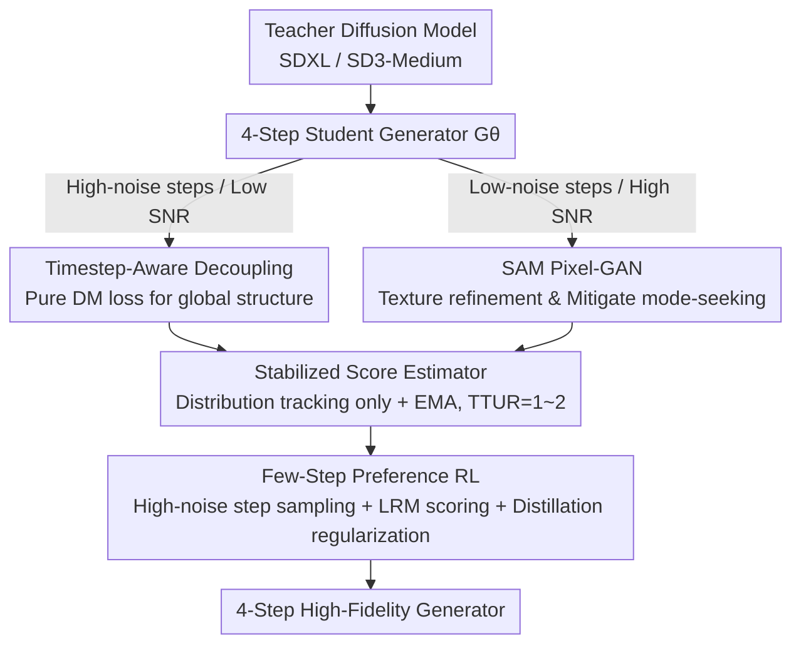

# Flash-DMD: Towards High-Fidelity Few-Step Image Generation with Efficient Distillation and Joint Reinforcement Learning

**Conference**: CVPR 2026  
**Paper**: [CVF Open Access](https://openaccess.thecvf.com/content/CVPR2026/html/Chen_Flash-DMD_Towards_High-Fidelity_Few-Step_Image_Generation_with_Efficient_Distillation_and_CVPR_2026_paper.html)  
**Code**: None (The original text states "Codes are coming soon")  
**Area**: Image Generation / Diffusion Model Distillation  
**Keywords**: Timestep Distillation, Distribution Matching Distillation (DMD), Few-step Generation, Adversarial Training, Reinforcement Learning Alignment

## TL;DR
Flash-DMD decouples the two losses of Distribution Matching Distillation (DMD) by timestep—using DM loss at high-noise steps to learn global structure, and SAM-based Pixel-GAN at low-noise steps to extract realistic textures. By performing preference reinforcement learning designed specifically for few-step models **simultaneously with distillation**, it distills SDXL into a 4-step generator using only about 2.1% of DMD2's training cost, while surpassing the teacher model in human preference scores.

## Background & Motivation

**Background**: Diffusion models generate high-quality images but require dozens of denoising steps, leading to slow deployment. Timestep distillation compresses multi-step teachers into 1-4 step students. Among these, the DMD series (DMD, DMD2, ADM, SenseFlow) achieves the best quality by aligning the output distributions of the teacher and student using the "variational score distillation / distribution matching" objective.

**Limitations of Prior Work**: The training cost of the DMD series is extremely high—distilling SD1.5 with the original DMD requires 20,000 iterations with a batch size of 2304, while distilling SDXL to 4 steps with DMD2 requires 24,000 iterations. The cost primarily stems from two factors:
- **Gradient Conflict**: In DMD2, the distribution matching gradient ($\nabla_\theta\mathcal{L}_{DMD}$) and the adversarial gradient ($\nabla_\theta\mathcal{L}_{AdvGen}$) are directly added at **every timestep**. These conflicting objective directions degrade the accuracy of distribution matching and slow down convergence.
- **The Score Estimator Doing Double Duty**: The generator's score estimator $\mu_{gen}^\psi$ must both track the student distribution using diffusion loss and serve as a discriminator to distinguish real/fake images, which constrains both functions. To suppress this instability, DMD2 uses TTUR=5 (updating the score estimator 5 times for every 1 generator update), further inflating the cost.

Furthermore, when aligning the distilled few-step model with human preferences using RL, methods like PSO and HyperSD suffer from severe **reward hacking**—overfitting to images characterized by an "oil-painting" style, overexposure, and smoothness with few details.

**Key Challenge**: The objectives of different stages of the denoising process are fundamentally different (high-noise steps govern global structure, while low-noise steps govern detailed texture). However, DMD2 applies a single, indiscriminately superimposed set of losses throughout the process. Meanwhile, performing RL as an independent stage is highly prone to collapse.

**Goal**: (Q1) How can one coordinate "distribution matching" and "perceptual realism enhancement" during the early stage to accelerate convergence? (Q2) How can details and human preferences be directly and stably improved in the later stage without suffering from reward hacking?

**Core Idea**: Early stage: **Decouple DM loss and adversarial loss by timestep** into their respective noise intervals where they excel. Later stage: **Jointly train preference RL tailored for few-step models** alongside distillation losses, using the continuously running stable distillation loss as a regularizer to stabilize RL and prevent policy collapse.

## Method

### Overall Architecture
Flash-DMD divides the process of "distilling a 4-step student generator $G_\theta$ from a teacher diffusion model" into two stages. **Stage 1 (Efficient Distillation)**: At high-noise (low SNR) timesteps, only DM loss is used to quickly align the student with the teacher's global distribution and ODE trajectory. At low-noise (high SNR) timesteps, a SAM-based Pixel-GAN is introduced to perform adversarial training against real images, focusing specifically on textures and realism. Meanwhile, the score estimator $\mu_{gen}^\psi$ is liberated from acting as a part-time discriminator and solely performs distribution tracking; paired with EMA, it tracks the generator with minimal updates (TTUR=1 or 2). **Stage 2 (Joint RL)**: Using a Latent Reward Model (LRM) that can score "noisy latents at any timestep", multiple candidates are sampled only at high-noise steps to construct win-lose pairs for preference optimization. This RL loss is **jointly and alternately updated** with the Stage 1 distillation losses, which act as a regularizer to stabilize the RL process.

### Key Designs

**1. Timestep-Aware Loss Decoupling: Assigning DM and Adversarial Losses to Specific Noise Intervals**

The inefficiency of DMD2 stems from indiscriminately adding the distribution matching gradient and the adversarial gradient at **every timestep**, resulting in conflicting directions. The authors conducted an observation experiment: completely removing the adversarial teacher and supervising solely with DM loss causes the generator to rapidly converge to a suboptimal domain characterized by "high contrast and lacking fine textures." This is caused by the **mode-seeking** nature of reverse KL divergence, showing that the adversarial loss is indispensable for perceptual realism. Therefore, the authors split the work based on target differences during the denoising stages: high-noise steps (low SNR) mainly build the global composition and structure, where the DM loss is most effective on noisy latents, so **only** the DM loss $\nabla_\theta\mathcal{L}_{DMD}^{AT}$ is used to align with the teacher; low-noise steps (high SNR) focus on detailed textures and tonal realism, where the **pixel-level adversarial loss** is instead employed. Specifically, for each generator update, only one high-noise step $t$ is sampled to calculate the DM loss, and the re-simulation forward process $B$ from DMD2 is used to project the denoised result to a clean image:

$$x_{t1}=G_\theta(x_t,t);\quad x_0=\text{Detach}(B(x_{t1},0))$$

Then, at a low-noise step $\hat t$, diffusion forward propagation is applied to $x_0$ to obtain $\hat x$, and the adversarial gradient is calculated:

$$\nabla_\theta\mathcal{L}_{AdvGen}^{TA}=\mathbb{E}_{\hat t,\hat x}\Big[\log D\big(V(G_\theta(\hat x,\hat t))\big)\frac{dG_\theta(\cdot)}{d\theta}\Big]$$

where $V$ is VAE decoding and $D$ is a pixel-level discriminator. Consequently, the two objectives no longer conflict at the same step, significantly boosting training efficiency.

**2. SAM-Based Pixel-GAN: Suppressing Mode-Seeking with Universal Visual Representations**

The mode-seeking behavior of the pure DM loss causes the model to converge early to blurry, simplified solutions. Unlike conventional latent-space GANs, this work constructs the discriminator directly in the **pixel space**, using a **frozen SAM (Segment Anything Model) visual encoder** as the backbone to extract multi-level features, followed by multiple trainable discriminator heads. The parameters $\omega$ are updated as follows:

$$\mathcal{L}_{AdvDisc}^{PG}=\mathbb{E}_{x_{real}}[-\log D_\omega(\cdot)]+\mathbb{E}_z[\log D_\omega(V(\cdot))]$$

The strong, universal representation of SAM makes the discriminator extremely sensitive to local geometric structures and fine-grained textures. From the earliest stages of training, it imposes strict realism constraints, forcing the generator to anchor to diverse and high-fidelity patterns in the data distribution as quickly as possible, thereby suppressing the "premature convergence to blurry solutions" style of mode-seeking at its source.

**3. Stabilized Score Estimator: Decoupling Discriminator Functions + Lightweight EMA Coupling**

In DMD2, the score estimator is required to simultaneously track the student distribution (via diffusion loss) and act as a discriminator (distinguishing real from fake), causing conflicting goals that necessitate TTUR=5. Flash-DMD restricts $\mu_{gen}^\psi$ to be trained **solely** via the diffusion loss $\mathcal{L}_{Diffusion}=\mathbb{E}\|\mu_{gen}^\psi(x_t,t)-\epsilon\|_2^2$, allowing it to focus on distribution tracking, while discrimination is handled by the aforementioned Pixel-GAN. Consequently, updating the score estimator only 1–2 times per generator update (TTUR=1,2) is sufficient for stability. In addition, borrowing from implicit distribution alignment, EMA is used to inject the latest generator parameters into the score estimator:

$$\psi\leftarrow\lambda_{ema}\psi+(1-\lambda_{ema})\theta$$

This enables $\mu_{gen}^\psi$ to closely track the generator's trajectory with extremely few additional updates, remaining stable while saving computation—this is one of the key factors that reduces the training cost to 2.1% of DMD2.

**4. Tailored Joint Preference RL for Few-Step Models: High-Noise Step Sampling + Distillation Regularization to Prevent Reward Hacking**

PSO/HyperSD perform preference optimization on clean images, backpropagating gradients only to low-noise steps, which causes the model to overfit to the surface biases of the reward model (e.g., specific color tones, oil-painting style). The authors' diagnosis is that "one must cover the sampling trajectory, especially high-noise steps." Two modifications are made: ① They employ an LRM capable of scoring **noisy latents at any timestep**, and discover that not all timesteps are necessary—under the same initial noise, images sampled at high-noise steps exhibit **better diversity** in layout and details, so random sampling is performed **only during the high-noise stage**. Given an initial latent $z_t$, $k$ candidates $\{z^1_{t-1},...,z^k_{t-1}\}$ are sampled at high-noise steps. After being scored by the LRM, the highest and lowest scoring samples form a win-lose pair $(z_t,z^w_{t-1},z^l_{t-1})$, minimizing:

$$\mathcal{L}_{rl}=-\mathbb{E}[\log\sigma(\beta H(w,l))]$$
$$H(w,l)=\log\frac{p_\theta(z^w_{t-1}|z_t,c)}{p_{ref}(z^w_{t-1}|z_t,c)}-\log\frac{p_\theta(z^l_{t-1}|z_t,c)}{p_{ref}(z^l_{t-1}|z_t,c)}$$

② They **jointly and alternately train** $\mathcal{L}_{rl}$ alongside the Stage 1 distillation losses of Flash-DMD, rather than running a separate RL phase. The continuously calculated and well-defined distillation loss acts as a strong regularizer. Combined with the constraints from distribution matching and Pixel-GAN, this firmly stabilizes the RL process, preventing policy collapse and reward hacking, while eliminating the extra overhead of a two-stage "distillation-then-RL" process.

## Key Experimental Results

Evaluation was conducted on 10K prompts from COCO-2014 following the DMD2 protocol. Metrics include CLIP (text-image similarity) and preference-based metrics such as ImageReward (ImgRwd), PickScore, HPSv2, and MPS. Cost = batch size $\times$ iterations.

### Main Results (Stage 1: SDXL Distillation, COCO-10k)

| Method | #NFE | ImgRwd↑ | Pick↑ | HPSv2↑ | MPS↑ | Cost↓ |
|------|------|---------|-------|--------|------|-------|
| SDXL (Teacher) | 100 | 0.7143 | 0.2265 | 0.2865 | 11.87 | - |
| SDXL-Turbo | 4 | 0.8338 | 0.2286 | 0.2899 | 12.25 | - |
| DMD2-SDXL | 4 | 0.8748 | 0.2309 | 0.2937 | 12.41 | 128×24k |
| **Flash-DMD TTUR1-1k** | 4 | 0.9509 | 0.2322 | 0.2968 | 12.67 | **64k (2.1%)** |
| **Flash-DMD TTUR2-8k** | 4 | **0.9740** | **0.2327** | **0.2981** | **12.71** | 64×8k |

Using only **2.1%** of DMD2's training cost (running TTUR1 for 1,000 steps), the method surpasses DMD2 in human preference scores, exceeding the teacher SDXL in all settings. On the flow-matching-based SD3-Medium (using LoRA, TTUR=2, 4k steps), it also outperforms the teacher (NFE=28) and SD3-Flash, validating its generalizability across both score-based and flow-matching models.

### Stage 2: Joint RL Comparison (COCO-10k)

| Method | #NFE | Pick↑ | MPS↑ | GPU Hours |
|------|------|-------|------|-----------|
| Hyper-SDXL | 4 | 0.2324 | 12.45 | 400 A100 |
| PSO-DMD2 | 4 | 0.2338 | 12.53 | 160 A100 |
| LPO-SDXL | 40 | 0.2342 | 12.58 | 92 A100 |
| **Flash-DMD** | 4 | **0.2346** | **12.84** | **12 H20** |

It achieves the highest scores in both PickScore and MPS while utilizing only 12 H20 GPU-hours (whereas competitors require over a hundred A100 GPUs). Although Hyper-SDXL yields higher ImgRwd/HPSv2 scores, its actual generations suffer from overexposure and an oil-painting look (typical reward hacking); LPO achieves the highest CLIP score but produces overly smooth images.

### Ablation Study (DMD2 base, A=Pixel-GAN, B=Aggressive TTUR, C=Timestep-Aware Optimization, RL=Joint RL)

| Configuration| Training Steps | ImgRwd↑ | Pick↑ | MPS↑ |
|------|--------|---------|-------|------|
| Base (DMD2) | 24k | 0.8748 | 0.2309 | 12.41 |
| +A | 8k | 0.8918 | 0.2314 | 12.50 |
| +B | 8k | 0.8871 | 0.2310 | 12.47 |
| +ABC | 1k | 0.9509 | 0.2322 | 12.67 |
| +ABC | 8k | 0.9740 | 0.2327 | 12.71 |
| +ABC+RL | 1k+2k | 1.0035 | **0.2346** | **12.84** |

### Key Findings
- **The three components are indispensable, achieving a qualitative leap only when combined**: Adding Pixel-GAN (A) or aggressive TTUR (B) in isolation yields only marginal improvements. Only when coupled with timestep-aware decoupling (C) to separate the objectives does the ImgRwd shoot up from 0.88 to 0.95, while simultaneously cutting iterations from 24k to 1k.
- **There exists an optimal RL training frequency**: Stage 2 employs alternate updates rather than weighted addition. The frequency ratio of RL loss to DM loss was tested across 1:1, 2:1, 5:1, and 10:1, with **5:1** yielding the best overall score. Ablation results also demonstrate that "sampling only at high-noise steps + incorporating Pixel-GAN" performs better than "all noise," which supports the hypothesis that high-noise step sampling yields higher diversity.
- **Stability**: Under TTUR=2, Flash-DMD shows stable improvement throughout, whereas DMD2 degrades rapidly after a minor initial improvement, verifying the training stability brought by the decoupled design.

## Highlights & Insights
- **"Division of labor by noise" is the core insight**: High-noise steps govern structure while low-noise steps govern texture. This elegant observation is leveraged to cleanly decouple two conflicting losses, which is far more sophisticated than a "naive weighted sum" and serves as the fundamental reason for cutting training costs by 50$\times$.
- **Using SAM as the discriminator backbone**: Utilizing the frozen visual encoder of a general-purpose Segmentation Foundation Model (SAM) as a pixel-level discriminator leverages its sensitivity to local geometry/texture to suppress mode-seeking. This is a highly transferable trick applicable to other GAN/对抗蒸馏 setups.
- **Distillation loss as an RL regularizer**: Forcing the "continuously running, well-defined distillation loss" to stabilize the highly volatile RL process integrates the two-stage "distillation-then-RL" pipeline into a single joint training framework. This approach saves compute and inherently prevents reward hacking—providing a valuable paradigm of using stable auxiliary losses to regularize RL that is transferable to other RLHF scenarios.
- **Preference sampling restricted to high-noise steps**: Noting that high-noise step sampling yields higher diversity, the authors focus the RL exploration there rather than across the entire trajectory, which saves compute and avoids the reward biases introduced by low-noise steps.

## Limitations & Future Work
- **The code is not yet released** ("coming soon"), and multiple key implementation details (the re-simulation process $B$, the exact architecture of the LRM, the discriminator head structure) rely on external references, raising the barrier to reproduction.
- Validation is limited to only two models (SDXL and SD3-Medium) on COCO 10k prompts, without exploring generalization to higher resolutions, video, or 3D generation scenarios.
- The RL frequency ratio of 5:1 is an empirically determined optimum obtained via grid search; whether it remains optimal across models/datasets and its sensitivity to hyperparameters like $\beta$ and $\lambda_{ema}$ are not sufficiently detailed in the paper.
- The evaluation heavily relies on preference-based metrics (ImgRwd/HPSv2/MPS), which might carry their own reward model biases. The authors also acknowledge that the competitors' reward hacking is partly due to these metrics being easily exploitable; since Flash-DMD itself uses an LRM as a training signal, whether it benefits from the same caveat under those evaluations is a point of concern.

## Related Work & Insights
- **vs. DMD2**: DMD2 naively adds the DM loss and adversarial loss at every timestep, employs the score estimator as a part-time discriminator, and uses TTUR=5. Flash-DMD decouples the losses by timestep, delegates discrimination to SAM Pixel-GAN, and restricts the score estimator to distribution tracking + EMA. Consequently, it reduces TTUR to 1–2, dropping training costs to 2.1% while achieving superior quality.
- **vs. ADM / SenseFlow**: Also belonging to the DMD/adversarial distillation family, ADM introduces a Hinge-loss-based GAN, and SenseFlow optimizes both the scorer and the discriminator. Flash-DMD's novelty lies in its three-in-one combination of "timestep-aware decoupling + pixel-level SAM discrimination + joint RL."
- **vs. PSO / HyperSD (Few-step RL)**: These methods implement preference optimization on clean images/low-noise steps, backpropagating gradients only to low-noise steps, resulting in overfitting to reward biases (leading to oil-painting effects and overexposure). Flash-DMD instead samples at high-noise steps, utilizes an LRM to score noisy latents, and performs joint training with distillation, significantly mitigating reward hacking.

## Rating
- Novelty: ⭐⭐⭐⭐ The combination of "timestep-aware loss decoupling + SAM pixel-level discrimination + distillation-regularized RL" is clean and effective. Individual innovations are moderate, but the overall engineering insight is exceptionally solid.
- Experimental Thoroughness: ⭐⭐⭐⭐ Covers both score-based and flow-matching models, includes main results and multiple ablation studies, and ablates the RL frequency as well as the sampling intervals.
- Writing Quality: ⭐⭐⭐⭐ The motivations (Q1/Q2) and the two-stage logic are explained clearly. There are minor typos in the mathematical formulations, but the overall readability is high.
- Value: ⭐⭐⭐⭐⭐ Drastically cuts DMD distillation cost to ~2% while surpassing the teacher model in human preference scores. It holds high practical value for few-step, high-fidelity generation in resource-constrained environments.

<!-- RELATED:START -->

## Related Papers

- [\[CVPR 2026\] LogCD: Local-to-global Consistency Distillation for Few-step Image Generation](logcd_local-to-global_consistency_distillation_for_few-step_image_generation.md)
- [\[CVPR 2026\] Uni-DAD: Unified Distillation and Adaptation of Diffusion Models for Few-step Few-shot Image Generation](uni-dad_unified_distillation_and_adaptation_of_diffusion_models_for_few-step_few.md)
- [\[CVPR 2026\] Refining Few-Step Text-to-Multiview Diffusion via Reinforcement Learning](refining_few-step_text-to-multiview_diffusion_via_reinforcement_learning.md)
- [\[CVPR 2026\] PROMO: Promptable Outfitting for Efficient High-Fidelity Virtual Try-On](promo_promptable_virtual_tryon_efficient.md)
- [\[CVPR 2026\] DiT360: High-Fidelity Panoramic Image Generation via Hybrid Training](dit360_high-fidelity_panoramic_image_generation_via_hybrid_training.md)

<!-- RELATED:END -->
