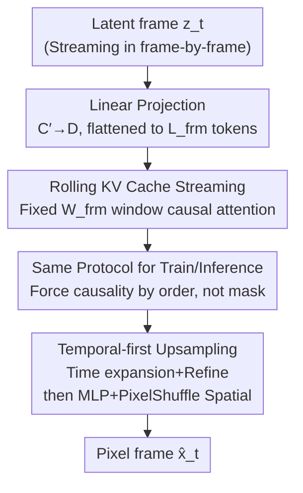

# FlashDecoder: Real-Time Latent-to-Pixel Streaming Decoder with Transformers

**Conference**: CVPR 2026  
**Paper**: [CVF Open Access](https://openaccess.thecvf.com/content/CVPR2026/html/Kang_FlashDecoder_Real-Time_Latent-to-Pixel_Streaming_Decoder_with_Transformers_CVPR_2026_paper.html)  
**Code**: None  
**Area**: Image Generation / Diffusion Models  
**Keywords**: Video decoder, latent-to-pixel, streaming generation, rolling KV cache, Transformer VAE  

## TL;DR
Addressing the issue in real-time video generation where "denoising is fast enough, but convolutional decoders have become the bottleneck," FlashDecoder uses a pure Transformer decoder to decode latents into pixels **frame-by-frame**. By looking only at the recent $W_{\text{frm}}$ frames via a fixed-length rolling KV cache, it achieves constant latency and bounded memory regardless of video length. On 1080p, it matches convolutional decoder reconstruction quality (41.55 vs. 41.49 dB PSNR) while being 3.6×–4.7× faster in throughput and saving up to 11× memory.

## Background & Motivation
**Background**: Latent diffusion is the dominant framework for image/video generation—encoders compress pixels into a low-dimensional latent space, diffusion models generate in this space, and decoders (VAE) map latents back to pixels. Acceleration efforts over recent years have focused almost entirely on the "generation stage": efficient DiT architectures, higher compression ratio VAEs, and few-step distillation have largely eliminated iterative denoising as the primary bottleneck.

**Limitations of Prior Work**: As generation approaches real-time, the bottleneck has shifted to the long-ignored decoder. Most existing video decoders are 3D causal convolutional networks, which offer good reconstruction but are slow and memory-intensive. On 720p, the Wan2.2 convolutional decoder accounts for 64.6% of total inference time, limiting end-to-end generation to 10.4 FPS. High-resolution decoding further requires spatial-temporal tiling, doubling decoder evaluations and latency.

**Key Challenge**: Replacing convolutional decoders with Transformers faces a tradeoff between "streaming vs. quality." Causal Transformer decoders (e.g., OmniTokenizer) require explicit causal masks during training, preventing the use of FlashAttention and hindering high-resolution training, which limits quality and causes latency to accumulate with temporal context. Bidirectional models (AToken, MAGI-1 VAE) achieve high quality by looking at all frames but cannot stream as they require access to future frames.

**Goal**: The authors define four essential properties for a "real-time video decoder": (1) frame-by-frame decoding without padding/blending, (2) reconstruction quality parity with convolutional decoders, (3) constant per-frame latency and bounded memory, and (4) high-resolution/long-video decoding without tiling. The goal is to satisfy all four simultaneously in one model.

**Key Insight**: In principle, Transformers can satisfy all four (sequential processing for framing, self-attention for high quality, window attention for bounded memory/compute). However, no existing Transformer decoder does. The key observation is that causality does not necessarily require a mask; it can be enforced by the **processing order** itself—if future frames haven't been fed in, the current frame naturally cannot see them.

**Core Idea**: Use a fixed-length rolling KV cache to decode video latents into pixels frame-by-frame. By using the **exact same** streaming protocol for both training and inference, the causal mask is eliminated. This enables high-resolution training and matches the quality of convolutional decoders.

## Method

### Overall Architecture
FlashDecoder is a pure Transformer latent-to-pixel decoder operating within the standard LDM framework. A pretrained encoder $E$ compresses video $x\in\mathbb{R}^{B\times C\times T\times H\times W}$ into latent $z\in\mathbb{R}^{B\times C'\times T'\times H'\times W'}$. FlashDecoder handles the $\hat{x}=D(z)$ step and is encoder-agnostic (trained on both Wan2.1 and Wan2.2 latent spaces).

The pipeline progresses frame-by-frame: each latent frame $z_t$ is linearly projected into $L_{\text{frm}}=H'W'$ spatial tokens and fed into a Transformer backbone with a **rolling KV cache** (caching only the most recent $W_{\text{frm}}$ frames). The backbone output undergoes **temporal-first upsampling**—first performing temporal upsampling and refinement via channel-to-time transformation, then spatial upsampling via MLP+PixelShuffle—to emit pixel frame $\hat{x}_t$. Since frames are processed sequentially, temporal causality is inherent without any attention mask.

### Key Designs

**1. Rolling KV Cache: Fixed-Window Frame-by-Frame Causal Streaming**

This ensures "constant latency and bounded memory" regardless of video length. FlashDecoder processes one latent frame at a time, maintaining a sliding window KV cache of size $W_{\text{frm}}$ (set to $W_{\text{frm}}=2$, looking at the current and previous frame). At step $t$: $L_{\text{frm}}$ tokens are projected; new $(K^{\text{new}}_t, V^{\text{new}}_t)$ are computed using 3D-RoPE with time offset $t\cdot L_{\text{frm}}$ and appended to the cache; the oldest frame is evicted if the window is exceeded; the current query attends to the entire cache. This creates a sliding window pattern—**bidirectional** attention across $L_{\text{frm}}$ spatial positions within frames, and **causal** attention along the temporal axis limited to $W_{\text{frm}}$ frames.

The efficiency stems from the fixed cache shape $K_t,V_t\in\mathbb{R}^{B\times G\times (W_{\text{frm}}L_{\text{frm}})\times D_h}$ (where $G$ is the number of KV groups in GQA). Per-frame attention cost is $O(N W_{\text{frm}} L_{\text{frm}}^2 D_h)$—linear relative to the temporal window and quadratic to spatial tokens. Because the window is fixed, computation and memory remain constant regardless of video length. This distinguishes it from "naive full-sequence causal Transformers" where KV cache grows linearly, causing throughput to drop from 331.4 FPS to 16.6 FPS.

**2. Train-Inference Same Protocol: Enforcing Causality via Order, Not Masks**

This is the core innovation distinguishing FlashDecoder from previous causal Transformer decoders, solving the "high-resolution training bottleneck." Previous methods (like OmniTokenizer) feed all $T'$ frames in a single forward pass with a full-sequence causal mask during training, only switching to KV caching during inference. This sequence-level mask requires FlexAttention to **materialize** it, which leads to OOM on H100 80GB at 480p/720p/1080p.

FlashDecoder employs the **exact same streaming protocol for training and inference**: at any stage, it sees at most $W_{\text{frm}}$ frames, performing $T'$ sequential forward passes. Each pass uses standard FlashAttention on at most $W_{\text{frm}}\cdot L_{\text{frm}}$ tokens, with step-wise memory of only $O(W_{\text{frm}}\cdot L_{\text{frm}})$. Since future frames are never fed, causality is "constructively" maintained without masks. Removing masks and utilizing FlashAttention breaks the memory wall for high-resolution training, making 1080p training feasible and matching convolutional decoder quality. This step (row e→f in ablations) shows the largest improvement: rFVD drops from 44.74 to 12.29.

**3. Temporal-first Upsampling: Time Dilatation Before Spatial Scaling**

Spatial upsampling in Transformers is computationally catastrophic: a spatial scale factor $r_s$ increases tokens per frame by $r_s^2$, causing attention costs to surge by $O(r_s^4)$ (65,536× for $r_s{=}16$). In contrast, temporal upsampling $r_t$ only incurs $O(r_t^2)$ cost (16× for $r_t{=}4$). Thus, the authors move the expensive spatial scaling outside the Transformer.

The three steps are: **① Temporal Upsampling**: backbone output $Y\in\mathbb{R}^{B\times L\times D}$ undergoes linear expansion $P_{\text{temp}}=\text{Linear}_{D\to D\cdot r_t}(Y)$, reinterpreting expanded channels as new temporal indices to get $P_{\text{full}}\in\mathbb{R}^{B\times(T'r_t H'W')\times D}$; **② Temporal Refine**: two Transformer blocks process $P_{\text{full}}$ using the same streaming mechanism, but with an expanded window $W^{\text{full}}_{\text{frm}}=r_t\cdot W_{\text{frm}}$ to maintain context; **③ Spatial Upsampling**: a 2-layer MLP projects features to $C\cdot r_s^2$ channels, followed by PixelShuffle to form the final $\hat{x}\in\mathbb{R}^{B\times C\times(T'r_t)\times(H'r_s)\times(W'r_s)}$. Ablations show that simply using channel expansion for time causes temporal inconsistency; the refinement step provides the largest architectural gain (rFVD 121.87→86.94).

### Loss & Training
The decoder is trained with a combination of pixel-level, perceptual, and adversarial losses:
$$\mathcal{L}_{\text{total}}=\lambda_{L1}\mathcal{L}_{L1}+\lambda_{\text{LPIPS}}\mathcal{L}_{\text{LPIPS}}+\lambda_{\text{adv}}\mathcal{L}_{\text{adv}}$$
Where $\mathcal{L}_{L1}$ ensures pixel fidelity, $\mathcal{L}_{\text{LPIPS}}$ measures perceptual similarity in pretrained feature space, and $\mathcal{L}_{\text{adv}}$ is computed by a 3D patch discriminator to sharpen high-frequency details. Training consists of three phases on image-video datasets (DataComp-small 12.8M pairs + Kinetics-600/Internal): Stage 1 at 224p for convergence, Stage 2 at 480p/720p/1080p, and Stage 3 with adversarial training.

## Key Experimental Results

Evaluation on UltraVideo (720x1280 resized/center-cropped, 25-frame segments). Metrics: PSNR (pixel fidelity), LPIPS (perceptual), rFVD (Content-Debiased FVD, measuring temporal consistency), FPS (throughput), and Mem (Peak Memory GB).

### Main Results
4×16×16 compression, 25 frames, single H100 (FlashDecoder-XL vs. Baselines):

| Resolution | Method | PSNR↑ | LPIPS↓ | rFVD↓ | FPS↑ | Mem(GB)↓ |
|------------|--------|-------|--------|-------|------|----------|
| 1080p | Wan2.2 (Conv) | 41.49 | 0.04 | 8.16 | 7.1 | 41.0 |
| 1080p | AToken (Bidirectional) | 40.18 | 0.09 | 25.67 | 10.1 | 3.3 |
| 1080p | **FlashDecoder-XL** | **41.55** | 0.05 | 12.08 | **25.4** | **3.7** |
| 720p | Wan2.2 (Conv) | 38.29 | 0.04 | 10.39 | 16.1 | 19.3 |
| 720p | **FlashDecoder-XL** | 38.38 | 0.05 | 12.75 | **76.3** | **2.4** |
| 720p | **FlashDecoder-XL-Opt** | 37.85 | 0.05 | 12.22 | **151.0** | **1.3** |

At 1080p, FlashDecoder matches Wan2.2's PSNR (41.55 vs 41.49) with 3.6× throughput and 11× memory savings (3.7 GB vs 41.0 GB). Compared to bidirectional Transformers (AToken/MAGI-1), it offers higher quality, streaming capability, and 2.5×–13× higher throughput. With inference optimization, FlashDecoder-XL-Opt reaches 12× the throughput of Wan2.2 at 480p with <2 GB memory.

### Ablation Study
Component ablation (480p, 17 frames):

| Configuration | PSNR↑ | rFVD↓ | FPS↑ | Note |
|---------------|-------|-------|------|------|
| Baseline (Sequence Causal) | 30.30 | 117.77 | 331.4→16.6 | KV cache bloat cripples throughput |
| + Sliding Window (SW-CA) | 30.20 | 136.08 | 333.8 | Constant throughput but OOM at high-res |
| + GQA | 30.13 | 121.87 | 340.7 | Reduces KV cache memory |
| + Temporal Refine (TR) | 31.05 | **86.94** | 260.3 | Major architectural gain |
| + Spatial Upsample (SU) | 31.49 | 96.19 | 262.1 | Improves fidelity |
| + Model Scaling | 32.56 | 44.74 | 166.0 | Consistent improvement |
| + Streaming Training | 37.52 | **12.29** | 166.0 | **Largest jump (Enables high-res)** |
| + Adversarial | 37.08 | 10.77 | 166.0 | Sharper output (slight PSNR drop) |

Window size ablation: $W_{\text{frm}}\in\{2,3,4\}$ yields stable quality (PSNR 38.13–38.49). $W_{\text{frm}}=2$ is most efficient for memory (2.4 GB) and throughput (76.3 FPS), proving that one previous frame provides sufficient temporal context for latent decoding.

### Key Findings
- **Streaming training and temporal refinement are critical**: Streaming training enables high-resolution fine-tuning, bridging the domain gap from 224p pretraining (rFVD 44.74→12.29). Temporal refine provides the largest single-component gain, correcting temporal inconsistencies from channel expansion.
- **Window size of 2 is optimal**: $W_{\text{frm}}=2$ matches the quality of $W_{\text{frm}}=4$ while optimizing memory and speed.
- **No degradation in long videos**: 3D-RoPE relative to the current window ensures position embeddings stay within the trained range, supporting infinite decoding length. Per-frame PSNR remains stable over 400+ frames with constant memory.
- **Natural fit for inference optimization**: Frame-by-frame decoding produces a fixed compute graph. Combining torch.compile, CUDA graphs, and FP8 quantization (with minimal PSNR loss) pushes throughput to 12× that of Wan2.2.

## Highlights & Insights
- **"Causality by order, not mask"** is a brilliant insight. It eliminates the memory barrier for high-resolution Transformer training—since future frames aren't available, masks are redundant. This observation is applicable to any causal sequence task where training uses masks and inference uses KV caching.
- **Offloading expensive operations**: The 4,096× complexity gap between spatial ($O(r_s^4)$) and temporal ($O(r_t^2)$) scaling suggests that decoders should avoid massive spatial upsampling inside Transformers, delegating it to PixelShuffle.
- **Train-Inference Protocol Alignment**: The fixed, data-independent compute graph per frame allows seamless application of CUDA graphs and FP8, contributing significantly to the final 12× speedup.

## Limitations & Future Work
- FlashDecoder-XL still lags slightly behind HunyuanVideo in the 4×8×8 compression group; rFVD is also slightly higher than convolutional baselines, though the authors attribute this to using significantly less training compute/data than production-grade decoders.
- The encoder remains the existing Wan encoder. Training a complete VAE with a streaming Transformer encoder is a potential future direction to further optimize the latent space for Transformer decoding.
- The adequacy of $W_{\text{frm}}=2$ was tested on latents with $4\times$ temporal compression; its sufficiency for weaker compression or extremely fast motion requires further study.

## Related Work & Insights
- **vs. OmniTokenizer**: Both are causal and use KV caching. However, OmniTokenizer's explicit masking during training limits high-res feasibility and causes per-frame latency to grow. FlashDecoder's unified streaming protocol unlocks higher quality and constant latency.
- **vs. AToken / MAGI-1 VAE**: These use bidirectional attention, which is non-streaming and whose throughput degrades with video length. FlashDecoder provides better quality while being 2.5×–13× faster.
- **vs. 3D Conv Decoders (Wan, Hunyuan)**: Conv decoders are slower and require tiling at high resolutions. FlashDecoder achieves parity in 1080p PSNR while significantly reducing memory and boosting throughput.

## Rating
- Novelty: ⭐⭐⭐⭐⭐ Enforcing causality via processing order to enable high-res training is a simple yet powerful insight.
- Experimental Thoroughness: ⭐⭐⭐⭐ Extensive ablations across resolutions, latent spaces, and window sizes.
- Writing Quality: ⭐⭐⭐⭐⭐ Clear categorization of properties and detailed algorithmic explanations.
- Value: ⭐⭐⭐⭐⭐ Directly addresses a major bottleneck in real-time video generation with high engineering utility.

<!-- RELATED:START -->

## Related Papers

- [\[CVPR 2026\] StreamDiT: Real-Time Streaming Text-to-Video Generation](streamdit_real-time_streaming_text-to-video_generation.md)
- [\[CVPR 2026\] StreamAvatar: Streaming Diffusion Models for Real-Time Interactive Human Avatars](streamavatar_streaming_diffusion_models_for_real-time_interactive_human_avatars.md)
- [\[CVPR 2026\] PixelDiT: Pixel Diffusion Transformers for Image Generation](pixeldit_pixel_diffusion_transformers_for_image_generation.md)
- [\[CVPR 2026\] Your Latent Mask is Wrong: Pixel-Equivalent Latent Compositing for Diffusion Models](your_latent_mask_is_wrong_pixel-equivalent_latent_compositing_for_diffusion_mode.md)
- [\[CVPR 2026\] DreamStereo: Towards Real-Time Stereo Inpainting for HD Videos](dreamstereo_towards_real-time_stereo_inpainting_for_hd_videos.md)

<!-- RELATED:END -->
