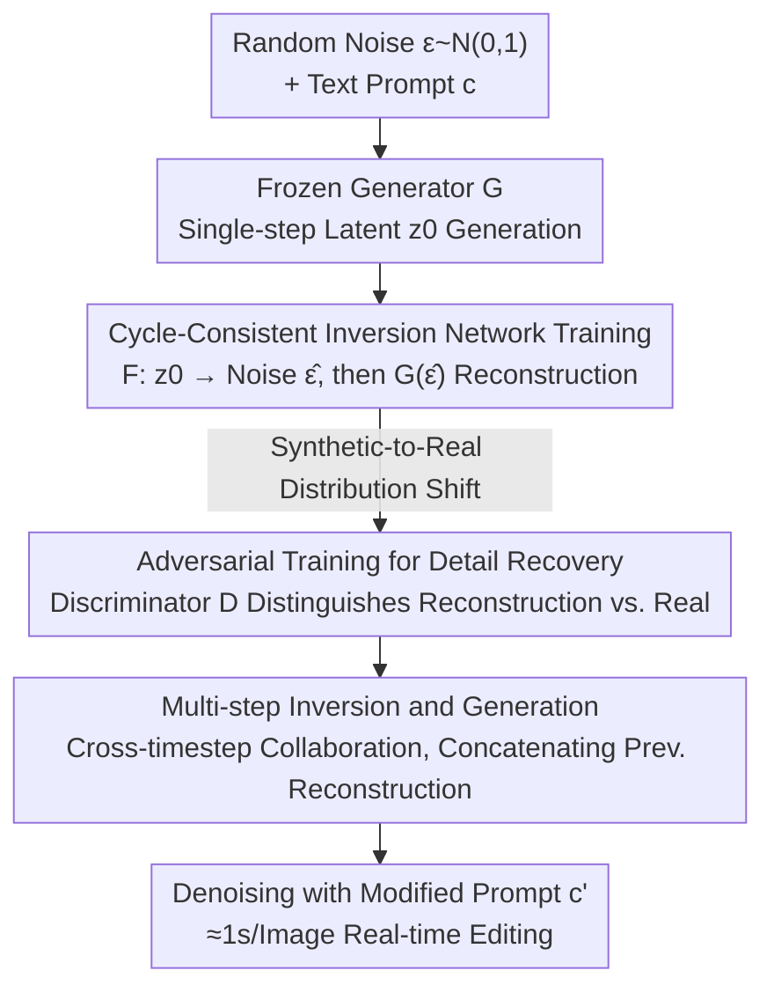

# FlashIn: Fast and Accurate Image Inversion for Real-time Image Editing

**Conference**: CVPR 2026  
**Paper**: [CVF Open Access](https://openaccess.thecvf.com/content/CVPR2026/html/Wang_FlashIn_Fast_and_Accurate_Image_Inversion_for_Real-time_Image_Editing_CVPR_2026_paper.html)  
**Code**: To be confirmed  
**Area**: Diffusion Models / Image Editing  
**Keywords**: Image Inversion, Real-time Editing, Cycle Consistency, Adversarial Training, Flux

## TL;DR
FlashIn uses a learnable neural network to **directly map an image back to its seed noise in a single step**. Combined with "synthetic data + cycle consistency loss" to provide explicit supervision, and adversarial training to recover details, it compresses diffusion image inversion from 30~50 steps to 1~4 steps, achieving SOTA background preservation and editing fidelity on PIE-Bench at a cost of approximately 1 second/image.

## Background & Motivation

**Background**: The dominant pipeline for image editing based on text-to-image diffusion models is "inversion then editing" — given an image and its text prompt, the initial noise capable of reconstructing the image is first inverted, and then editing is completed by denoising with the prompt modified to the edited version while preserving the unedited parts of the original image. The most commonly used inversion tool is DDIM Inversion, which approximates the initial noise by running the DDIM scheduler in reverse.

**Limitations of Prior Work**: DDIM inversion typically requires 30~50 steps, and errors accumulate progressively along the inversion trajectory, leading to artifacts and distortions in the reconstruction/editing results. Subsequent improvements each come with a cost: optimization-based methods (e.g., null-text inversion), architecturally-modified methods like EDICT, and fixed-point iteration methods like ReNoise can improve accuracy but introduce significant additional computational overhead. Recent rectified flow-based inversion methods (e.g., RF-solver) are accurate but require long inversion trajectories and are often bound to a specific scheduler, making them inapplicable when switching diffusion models.

**Key Challenge**: Inversion is inherently **intractable** — modern neural networks are non-invertible, and no ground-truth noise is known for any real image. This forces existing "encoder-based direct noise prediction" methods (e.g., TurboEdit, SwiftEdit) to rely on **weak constraints / implicit objectives** such as KL divergence and reconstruction loss during training, which leads to difficult optimization, unstable training, and inaccurate results.

**Goal**: To simultaneously achieve (1) **fast** inversion — compressed to single or few steps; (2) **accurate** inversion — high reconstruction fidelity and detail preservation; and (3) **generality** — not tied to any specific scheduler.

**Key Insight**: Since real images lack ground-truth noise, one can **reverse the process to generate data** — generate images from noise first and save the "noise $\rightarrow$ image" pairs. Thus, each (synthetic) image naturally has a known seed noise serving as an explicit supervision target, transforming the originally implicit and hard-to-optimize problem into a regression problem with a clear target.

**Core Idea**: Employ a learnable network to map the image back to the seed noise in a single step (replacing multi-step iterative inversion), and make single-step inversion accurate using "cycle-consistency loss for explicit supervision + adversarial training to recover real-image details."

## Method

### Overall Architecture
FlashIn reparameterizes "inversion" as a feedforward network $F$: given a clean latent $z_0$, a text condition $c$, and a timestep $T$, it directly outputs the seed noise $\hat\epsilon = F(z_0, c, T)$. Feeding $\hat\epsilon$ back into a frozen few-step generator $G$ (based on Flux-Schnell) with a new prompt $c'$ allows editing: $z'_0 = G(F(z_0, c, T), c', T)$. The entire method centers around one question — **how to train $F$ without ground-truth noise** — and provides a three-layer progressive solution: first, construct explicit supervision using "synthetic data + cycle-consistency loss"; next, use adversarial training to transfer the network learned on the synthetic domain to real images and recover details; and finally, extend single-step to multi-step collaborative inversion to further improve accuracy. During training, $G$ is frozen throughout, and only $F$ and the discriminator $D$ are optimized.

### Key Designs

**1. Cycle-Consistent Inversion Network Training: Creating Explicit Supervision Targets with Synthetic Noise-Image Pairs**

This step directly addresses the fundamental pain point of "inversion lacking ground-truth, relying only on weak constraint training." Existing works (TurboEdit, SwiftEdit) can only train using a reconstruction loss $L_{recon} = \|z_0 - G(F(z_0, c, T), c, T)\|_2^2$ plus a regularization term $L_{reg} = \mathrm{KL}(F(z_0, c, T), N(0,1))$ to constrain the output to be close to a Gaussian distribution. The problem is: $L_{reg}$ imposes only weak constraints on the output of $F$, while $L_{recon}$ propagates gradients all the way back from $G$ to $F$, acting as an **implicit optimization objective** without providing a clear target noise for each sample. This makes optimization highly difficult and training unstable.

FlashIn's breakthrough is to **actively construct paired data**: randomly sample $\epsilon \sim N(0,1)$ and text $c$, generate $z_0 = G(\epsilon, c, T)$ using the frozen single-step generator, so that this $z_0$ naturally possesses a **known ground-truth noise $\epsilon$**. Feeding $z_0$ to $F$ yields $\hat\epsilon = F(z_0, c, T)$, reconstruct $\hat z_0 = G(\hat\epsilon, c, T)$, and the authors define cycle consistency loss to constrain both "noise alignment" and "latent alignment":

$$L_{cycle} = L^1_{cycle} + L^2_{cycle} = \|\epsilon - \hat\epsilon\|_2^2 + \lambda \|z_0 - \hat z_0\|_2^2$$

where $\lambda$ balances the two terms (set to 1 in implementation). $L^1_{cycle}$ directly uses ground-truth noise for supervision, converting the originally implicit objective into an explicit regression, which is key to stable training and high accuracy. $L^2_{cycle}$ further ensures consistency in the image space. Compared with prior methods, the key difference lies in "whether ground-truth $\epsilon$ exists" — FlashIn constructs it via synthetic data.

**2. Adversarial Training for Real Image Detail Recovery: Bridging the Distribution Shift between Synthetic and Real Domains**

$F$ trained solely on synthetic data faces a potential issue: a distribution shift exists between synthetic and real images, making $F$ prone to **over-smoothing and detail loss** when handling real images. Borrowing the adversarial learning ideas common in few-step diffusion distillation, FlashIn treats the inversion network $F$ and generator $G$ as a unified generator, and additionally trains a discriminator $D$ to distinguish the "reconstructed latent $\hat z_0$" from the "real image latent $\tilde z_0$". The generator side aims to fool the discriminator to push the reconstruction closer to real images:

$$L^F_{adv} = -\mathbb{E}_{\hat z_0 \sim G(F(\cdot))}[D(G(F(\hat z_0, c, T)))]$$

The discriminator side separates the two:

$$L^D_{adv} = \mathbb{E}_{\hat z_0 \sim G(F(\cdot))}[D(G(F(\hat z_0, c, T)))] - \mathbb{E}_{\tilde z_0}[D(\tilde z_0)]$$

Adversarial pressure forces $F$ to output **such noise that carries richer information**, ensuring the reconstructed latent retains as many fine textures as the real image (as demonstrated by the recovery of grass textures and rock details in the ablation studies). The total training objective sums the four terms with equal weights (the authors note that performance is insensitive to these loss weights):

$$L_{full} = L_{cycle} + L_{reg} + L^D_{adv} + L^F_{adv}$$

**3. Multi-step Inversion and Generation: Enabling Cross-Timestep Collaboration to Trade Slight Time for Accuracy**

Single-step inversion is already feasible, but if one is willing to spend slightly more time, the authors extend the framework to multiple steps (e.g., 4 steps) to further improve accuracy. The core approach is to let each inversion step **reference the reconstruction result of the previous step**: at step $t$, use the noise predicted in the previous step $\hat\epsilon_{t-1}$ to reconstruct, re-noise according to the scheduler, and obtain $\hat z^{t-1}_0 = G(\mathrm{AddNoise}(z_0, \hat\epsilon_{t-1}, t-1), c, t-1)$ (initialized as all-zero latent at the first step $t=1$). Then, the real latent $z_0$ and the previous reconstruction latent are concatenated along the channel dimension and fed into the inversion network (requiring doubling the input channel size of $F$):

$$\hat\epsilon_t = F([z_0; \hat z^{t-1}_0], c, t)$$

In this way, $F$ corrects step-by-step by "looking at the previous results", improving accuracy with more steps (Ablation Figure 6 shows details get significantly clearer from 1 to 4 steps). When generating edited images, there are two noise-usage strategies: use the refined noise from the last step, or generate from the first-step noise and renoise using subsequent step inversion noises; the authors find that **the second strategy is slightly better** and adopt it in experiments. ⚠️ Please refer to the original paper for precise formula and symbol details.

### Loss & Training
Trained based on the few-step generation model Flux-Schnell. The inversion network $F$ is initialized with 10 double blocks + 20 single blocks of MMDiT; the discriminator is about half the size of $F$. The training data is a version of LAION with captions regenerated by Qwen-VL, at 512×512 resolution. Both $F$ and $D$ are trained for 100K steps with a learning rate of $1\times10^{-5}$, $\lambda=1$. The inversion network is trained using the 4-step version ($T$ is randomly sampled from $\{1.0, 0.75, 0.5, 0.25\}$). Inference uniformly uses 4 steps (aligning with Flux-Schnell).

## Key Experimental Results

The dataset is PIE-Bench (700 images, 10 editing types). Evaluation is split into two categories: background preservation (PSNR / LPIPS / MSE / SSIM, comparing source and edited images) and editing fidelity (CLIP similarity, reported for the whole image and the edited region), along with the costs of inversion and forward passes (single A100 GPU).

### Main Results

| Method | PSNR↑ | LPIPS(×10³)↓ | MSE(×10⁴)↓ | SSIM(×10²)↑ | CLIP Whole↑ | CLIP Edited↑ | Inversion(s)↓ | Forward(s)↓ |
|------|-------|--------------|------------|-------------|-----------|-------------|----------|----------|
| DirectInv | 27.22 | 54.55 | 32.86 | 84.76 | 25.02 | 22.10 | 10.14 | 4.3 |
| MasaCtrl | 22.17 | 106.62 | 86.97 | 79.67 | 23.96 | 21.16 | 4.14 | 4.83 |
| ReNoise | 27.11 | 49.25 | 31.23 | 72.30 | 23.98 | 21.26 | 5.41 | 0.445 |
| ExactDPM | 24.54 | 59.88 | 36.49 | 69.18 | 23.77 | 21.23 | 15.11 | 0.445 |
| TurboEdit-Deutch | 27.64 | 52.31 | 37.89 | 24.33⚠️ | 78.52⚠️ | 22.17 | 0.671 | 0.621 |
| TurboEdit-Wu | 29.52 | 44.74 | 26.08 | 91.59 | 25.05 | 22.34 | 0.668 | 0.508 |
| **FlashIn (Ours)** | **31.91** | **32.11** | **15.51** | 88.76 | **25.67** | **23.94** | 0.666 | **0.382** |

Note: The SSIM and CLIP Whole columns of the TurboEdit-Deutch row in the original table seem to be misplaced (⚠️ subject to the original text). FlashIn achieves the best performance in 3 out of 4 background preservation metrics (only SSIM 88.76 is second to TurboEdit-Wu's 91.59); PSNR reaches 31.91, which is about 8% higher than the runner-up; it ranks first in both CLIP Whole and CLIP Edited; the forward time is the fastest at 0.382s, while the inversion time is comparable to TurboEdit (only slightly slower than 4-step DDIM), yielding the lowest total time cost.

### Ablation Study

| cycle | adversarial | PSNR↑ | SSIM(×10²)↑ | CLIP Whole↑ | CLIP Edited↑ |
|-------|-------------|-------|-------------|-----------|-------------|
| ✗ | ✗ | 26.19 | 81.47 | 24.88 | 22.43 |
| ✓ | ✗ | 28.40 | 85.39 | 25.32 | 23.01 |
| ✓ | ✓ | 31.91 | 88.76 | 25.67 | 23.94 |

With cycle-consistent training, PSNR increases from 26.19 → 28.40 and SSIM from 81.47 → 85.39, improving both background preservation and editing fidelity, confirming that "providing an explicit target to the inversion network" is crucial. Adding adversarial learning further improves to PSNR 31.91 and SSIM 88.76, showing a particularly dramatic gain for background preservation (detail retention).

### Plug-and-Play Gains

| Noise | Editing Model | PSNR↑ | LPIPS(×10³)↓ | CLIP↑ | Time(s)↓ |
|------|----------|-------|--------------|-------|----------|
| Ours | Flux-Schnell | 31.91 | 32.11 | 23.94 | 1.04 |
| Random | Flux-Kontext | 33.45 | 38.44 | 28.43 | 16.42 |
| Ours | Flux-Kontext | 33.48 | 31.44 | 28.56 | 17.02 |
| Random | Qwen-Image-Edit | 34.52 | 36.14 | 29.67 | 34.01 |
| Ours | Qwen-Image-Edit | 34.67 | 31.22 | 29.85 | 34.67 |

Using FlashIn's inversion noise as an "anchor" and plugging it into instruction-based editing models (Flux-Kontext / Qwen-Image-Edit) consistently improves background preservation compared to random noise (e.g., LPIPS 38.44 → 31.44 on Flux-Kontext), proving that this inversion noise is useful even for general editors.

### Key Findings
- Among the two training strategies, **adversarial learning brings a larger increment to background preservation**: from cycle-only to cycle+adv, PSNR climbs by another 3.51 (28.40 → 31.91), mainly because it restores fine textures.
- Inference steps serve as a quality-speed knob: 1 step is slightly blurry with missing details, while 2, 3, and 4 steps get progressively clearer (Figure 6).
- FlashIn is slower in the inversion stage but fast in the forward stage, achieving the lowest total time and enabling interactive editing at ~1 second/image in combination with Flux-Schnell.

## Highlights & Insights
- **"Generating data to create supervision signals" is highly ingenious**: The inversion problem itself lacks ground-truth noise. The authors conversely exploit the controllability of "noise $\rightarrow$ image" generation, retaining the seed noise of each synthetic sample as the ground-truth to turn an implicit obstacle into an explicit regression — this is the root of stable training and high accuracy.
- **Re-parameterizing inversion from "iterative solving" to "feedforward prediction"**: Obtaining noise in a single forward pass naturally bypasses the error accumulation of DDIM multi-step inversion and the reliance on specific schedulers, making it transferable as an anchor to other editors.
- **Using adversarial training to "recover real-domain details" rather than "improve generation quality"**: The same tool is adapted for a different goal — specifically curing the over-smoothing caused by training on synthetic data. This concept is transferable to any inversion/encoding task trained on synthetic data and applied to real data.
- **The multi-step design is an elegant accuracy-time knob**: Channel concatenation with the previous reconstruction allows step-to-step collaboration. If higher fidelity is required, one can simply increase the step count without retraining.

## Limitations & Future Work
- Training relies heavily on "the generator being able to controllably produce noise-image pairs," thus it is **tightly bound to the chosen few-step generation model (Flux-Schnell)**. Changing the base generator likely requires retraining the inversion network.
- There is a suspected layout misplacement of SSIM / CLIP values in the TurboEdit-Deutch row in the main table; caution is advised during horizontal comparison (⚠️ subject to the original text).
- Single-step results are still slightly blurry; 2~4 steps are needed for good quality. Detail preservation heavily relies on adversarial training, but the authors do not deeply analyze its training stability and failure modes.
- Evaluation is concentrated on PIE-Bench (512×512). Performance in higher resolutions and more complex, multi-object editing scenarios is not fully verified.
- The authors envision extending the method to **video inversion and editing**.

## Related Work & Insights
- **vs. TurboEdit / SwiftEdit**: They also train encoders to directly output noise, but lack explicit optimization targets (relying on implicit supervision of KL + reconstruction). This leads to difficult training and limited reconstruction quality. FlashIn achieves higher accuracy by constructing ground-truth noise via synthetic data + cycle-consistency loss to provide an explicit target, and adding adversarial training to recover details.
- **vs. DDIM Inversion / DirectInv**: The latter approximates via multi-step backward scheduling (30~50 steps), where error accumulation causes artifacts. FlashIn completes it in 1~4 steps using a feedforward network, which is faster, more accurate, and independent of specific schedulers.
- **vs. Refined-type inversion like RF-solver / ReNoise**: They rely on high-order approximations or fixed-point iterations to improve accuracy, but suffer from long trajectories, high overhead, and specific scheduler bindings. FlashIn pushes the overhead to the training phase, requiring only a few steps for inference.
- **vs. ADD / LADD / SDXL-Lightning (Few-step Diffusion Distillation)**: FlashIn borrows their adversarial learning ideas, but the goal shifts from "improving generation quality" to "improving detail fidelity of inversion", serving a different purpose.

## Rating
- Novelty: ⭐⭐⭐⭐ Reparameterizing inversion as a feedforward network and providing explicit supervision via "synthetic data to create ground-truth noise + cycle consistency" is clearsighted and tackles the fundamental pain point.
- Experimental Thoroughness: ⭐⭐⭐⭐ The four sets of experiments (PIE-Bench main table + ablation + multi-step + plug-and-play) are relatively complete, but only evaluate on a single benchmark and a single resolution, with a suspected layout flaw in the main table.
- Writing Quality: ⭐⭐⭐⭐ The flow of motivation-method-experiment is smooth, and formulas are clearly stated (with minor symbol/table blemishes).
- Value: ⭐⭐⭐⭐ High practical value, enabling sub-second real-time editing and serving as an anchor for general editors.

<!-- RELATED:START -->

## Related Papers

- [\[ICML 2026\] DirectEdit: Step-Level Accurate Inversion for Flow-Based Image Editing](../../ICML2026/image_generation/directedit_step-level_accurate_inversion_for_flow-based_image_editing.md)
- [\[CVPR 2026\] From Scale to Speed: Adaptive Test-Time Scaling for Image Editing](from_scale_to_speed_adaptive_test-time_scaling_for_image_editing.md)
- [\[CVPR 2026\] NEAF: Natural Image Editing with Attention Fusion for Generalizable Test-time Optimization in Text-Guided Image Editing](neaf_natural_image_editing_with_attention_fusion_for_generalizable_test-time_opt.md)
- [\[CVPR 2026\] I2I-Bench: A Comprehensive Benchmark Suite for Image-to-Image Editing Models](i2i-bench_a_comprehensive_benchmark_suite_for_image-to-image_editing_models.md)
- [\[CVPR 2026\] DreamStereo: Towards Real-Time Stereo Inpainting for HD Videos](dreamstereo_towards_real-time_stereo_inpainting_for_hd_videos.md)

<!-- RELATED:END -->
