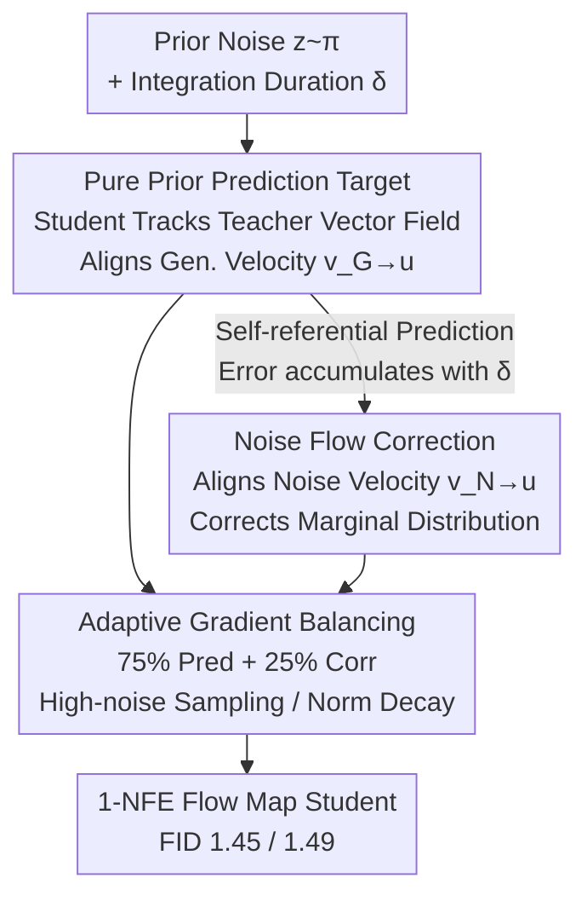

# Flow Map Distillation Without Data

**Conference**: CVPR 2026  
**Paper**: [CVF Open Access](https://openaccess.thecvf.com/content/CVPR2026/html/Tong_Flow_Map_Distillation_Without_Data_CVPR_2026_paper.html)  
**Code**: [data-free-flow-distill.github.io](https://data-free-flow-distill.github.io) (Project Page)  
**Area**: Diffusion Models / Model Compression  
**Keywords**: Flow map distillation, data-free distillation, one-step generation, predictor-corrector, diffusion acceleration  

## TL;DR
Conventional methods for distilling pretrained flow/diffusion teachers into "one-step" flow maps require sampling from external datasets, which this paper identifies as causing **Teacher-Data Mismatch** (where the data distribution differs from the teacher's true generation distribution). This work proposes sampling **exclusively from the prior noise** and using a "predictor-corrector" dual objective to keep the student on the teacher's vector field. This approach achieves FID scores of 1.45 and 1.49 on ImageNet 256/512 with a 1-NFE student, outperforming all data-based distillation baselines.

## Background & Motivation

**Background**: Diffusion and flow models achieve extremely high generation quality, but sampling requires dozens or hundreds of numerical integration steps of an ODE, which is slow. Flow maps (learning the ODE solution operator to jump directly from noise to data) are a recognized acceleration route, and the most successful approaches involve **distilling from a powerful pretrained teacher**. This allows the student to inherit advanced training/post-training techniques (REPA, CFG, guidance intervals, fine-tuning, etc.) from the teacher, offering more flexibility than training a flow map from scratch.

**Limitations of Prior Work**: Most mainstream distillation methods are **data-based**, requiring sampling of intermediate states $x_t \sim \tilde p_t$ from an external dataset $\tilde p$ during student training to align with teacher dynamics. This implicitly assumes that the data-noise distribution $\tilde p_t$ represents the states encountered during the teacher's sampling trajectory.

**Key Challenge**: The authors point out that this assumption often fails, a phenomenon they name **Teacher-Data Mismatch**: the teacher's true generation distribution is denoted as $\hat p_t$ (states along the teacher’s ODE solution trajectories), while the data-noise distribution is $\tilde p_t$, where $\tilde p_t \neq \hat p_t$. If the teacher generalizes beyond the original training set, uses CFG extrapolation, underwent post-training fine-tuning, or if the training data is simply unavailable, $\hat p_t$ deviates from $\tilde p_t$. Forcing the student to align with the teacher on mismatched data is equivalent to **distilling an incorrect process**—even if the student perfectly converges, it will fail to reproduce the teacher's actual output. Controlled experiments show that fixing the teacher while adding data augmentation during noise injection (artificially creating mismatch) leads to significant FID degradation as the augmentation strength increases.

**Key Insight**: Although $\hat p_t$ and $\tilde p_t$ diverge for $t\in[0,1)$, they **naturally coincide** at $t=1$: the endpoint of the noise-adding process is the prior $\pi$, which is also the starting point of the teacher's generation process. The prior is the only sampling point guaranteed to fall within the teacher's generation distribution.

**Core Idea**: Since only the prior is perfectly aligned, distillation should **sample solely from the prior**, structurally bypassing the risk of mismatch. The authors name this data-free framework **FreeFlow**, using dual objectives of "prediction" (tracking teacher trajectories) and "correction" (pulling back marginal distributions) to ensure high-fidelity one-step generation.

## Method

### Overall Architecture

FreeFlow is a distillation framework that **completely avoids external datasets**. It takes only the prior noise $z\sim\pi$ and an integration duration $\delta$ as input, outputting a "jump location" predicted by the student $f_\theta(z,\delta)$. The core principle is to maintain local consistency between the student and the teacher's instantaneous velocity field $u$ at points along the trajectory.

The framework combines why data-free distillation is feasible with how to make it stable: traditional data-based distillation samples starting points $x_t$ from $\tilde p_t$ and perturbs the **start point** to add constraints (the MeanFlow identity); whereas FreeFlow fixes the start point at the prior ($t=1, x_t=z$). Since perturbing the start point is no longer meaningful, it instead perturbs the **predicted endpoint** to obtain a data-free prediction target. However, this self-referential prediction acts like an autonomous ODE solver, leading to **error accumulation** where the student uses its own (potentially biased) state to query the teacher's velocity. To fix this, a **correction target** is added using the VSD concept to pull the marginal velocity of the student's generation back toward the teacher. Both objectives sample only from the prior and are trained via adaptive fusion.

### Key Designs

**1. Pure Prior Prediction Target: Tracking the Teacher's Vector Field from Noise**

This addresses the limitation where data-based distillation must sample intermediate states from a dataset. FreeFlow anchors the starting point at the prior ($t=1$) and defines duration $\delta=1-s$. The student $f_\theta(z,\delta)=z+\delta F_\theta(z,\delta)$ uses an average velocity $F_\theta$ to approximate the true solution $\phi_u(z,1,1-\delta)$. The optimal condition is $\delta F_{\theta^*}(z,\delta)=\int_1^{1-\delta}-u(x(\tau),\tau)\,d\tau$. By taking the derivative with respect to $\delta$, the authors derive a data-free identity:

$$F_{\theta^*}(z,\delta)+\delta\,\partial_\delta F_{\theta^*}(z,\delta)=u\big(f_{\theta^*}(z,\delta),\,1-\delta\big)$$

The key differences from MeanFlow are: this uses a **partial derivative** w.r.t. $\delta$ (as $z$ is independent of $\delta$), and $u$ is evaluated at the **student's predicted state** $f_\theta(z,\delta)$. This leads to the loss $\mathbb{E}_{z,\delta}\|F_\theta(z,\delta)-\mathrm{sg}(u_{\text{target}})\|^2$, where $u_{\text{target}}=u(f_\theta(z,\delta),1-\delta)-\delta\,\partial_\delta F_\theta(z,\delta)$, sampled entirely using $z\sim\pi$.

**Mechanism**: This loss is equivalent to $\mathbb{E}_{z,\delta}\|\partial_\delta f_\theta(z,\delta)-u(f_\theta(z,\delta),1-\delta)\|^2$, which is zero only if the student's **generation velocity** $v_G=\partial_\delta f_\theta$ matches the underlying velocity $u$. Intuitively, the student acts as an autonomous numerical solver, checking the teacher's derivative at its current estimated state to compute the next step, tracking the vector field from the prior to the data. 

**2. Noise Flow Correction: Using Predictor-Corrector to Rectify Accumulated Errors**

Design 1 is self-referential; small student errors are inherited by subsequent steps and accumulate as $\delta$ grows from 0 to 1. The prediction target alone has no mechanism to pull the student back to the correct path.

Adapting the predictor-corrector idea from Song et al., the authors add a **marginal distribution correction** target without re-introducing data dependency. Using Variational Score Distillation: they minimize the Integral-KL divergence $D_{\text{IKL}}(q\,\|\,p)$ between the student's marginal distribution $q$ and the true distribution $p$. The optimization gradient is formulated to sample only from priors ($z,n\sim\pi$):

$$\nabla_\theta\,\mathbb{E}_{z,n,r}\Big[F_\theta(z,1)^\top\,\mathrm{sg}\big(\Delta_{v_N,u}(I_r(f_\theta(z,1),n),r)\big)\Big]$$

Where $v_N$ is the **noise velocity** of the student's generation distribution after adding noise, and $\Delta_{v_N,u}=v_N-u$. $v_N$ is approximated online by a network $g_\psi$ using standard flow-matching loss.

**Mechanism**: The authors note that the prediction target aligns generation velocity $v_G\to u$, while the correction target aligns noise velocity $v_N\to u$. This unified velocity alignment view explains the student's optimality, with the corrector serving to fix error accumulation.

**3. Adaptive Gradient Balancing + High-Noise Sampling: Harmonic Co-training**

Prediction and correction are unstable if used alone. The authors' strategy: (1) Split mini-batches 75%/25% between prediction and correction. (2) Use an adaptive weight $\lambda=\alpha\frac{\mathbb{E}\|\Delta_{v_G,u}\|}{\mathbb{E}\|\Delta_{v_N,u}\|+\epsilon}$ to automatically align gradient magnitudes. (3) Apply a power-law decay weight $1/(\|\Delta_{v_G,u}\|^2/d+\varepsilon)^k$ to $\Delta_{v_G,u}$; larger $k$ provides stronger decay, which helps mitigate conflicts between the two signals.

For $r$ sampling in the correction target, **high-noise regions are weighted more heavily** (LogitNormal biased toward high $r$) because the difference between $p$ and $q$ accumulates from the prior.

## Key Experimental Results

Evaluated on ImageNet 256×256 / 512×512 using FID-50K. SiT-XL/2 series teachers were used for main results.

### Main Results (Table 2, All Data-Free)

| Teacher / Resolution | Method | NFE | FID ↓ | Remarks |
|---|---|---|---|---|
| SiT-XL/2+REPA / 256 | Teacher Model | 434 | 1.37 | Upper bound reference |
| SiT-XL/2+REPA / 256 | π-Flow | 1 | 2.85 | Data-based distillation |
| SiT-XL/2+REPA / 256 | FACM | 2 | 1.52 | Data-based distillation |
| SiT-XL/2+REPA / 256 | **FreeFlow-XL/2 (Ours)** | **1** | **1.45** | **New SOTA** |
| SiT-XL/2 / 256 | Teacher Model | 250×2 | 2.06 | — |
| SiT-XL/2 / 256 | **FreeFlow-XL/2 (Ours)** | **1** | **1.69** | Outperforms Teacher |
| SiT-XL/2+REPA / 512 | Teacher Model | 460 | 1.37 | Upper bound reference |
| SiT-XL/2+REPA / 512 | **FreeFlow-XL/2 (Ours)** | **1** | **1.49** | **New SOTA** |

### Ablation Study (Table 1, DiT-B/2, FID ↓)

| Dimension | Configuration | FID | Conclusion |
|---|---|---|---|
| Grad. Weight $k$ (Eq.9 Only) | $k=0.0 / 0.5 / 1.0$ | 11.91 / 11.71 / 12.40 | Prediction alone insensitive to $k$ |
| Grad. Weight $k$ (Eq.9+11) | $k=0.0 / 0.5 / 1.0$ | 43.53 / 10.58 / **5.58** | **Strong decay** is best for joint training |
| $r$ Range (Eq.11) | $[0,0.6]$ to $[0,1.0]$ | 91.82 → **6.02** | Removing high-noise fails; must cover 1.0 |
| $r$ Sampling (Eq.11) | LogitNormal bias 0.8 | **5.63** | High-noise bias is superior |

### Key Findings
- **Prediction and Correction are both essential**: Pure prediction plateaus at a suboptimal FID due to error accumulation. Pure correction leads to progressive mode collapse. Their combination is strictly superior to either alone.
- **Gradient decay is the switch for joint training**: While $k$ matters little for prediction alone, $k=1.0$ vs $k=0$ reduces FID from 43.53 to 5.58 during joint training by suppressing $\Delta_{v_G,u}$ and resolving signal conflicts.
- **Utility in Inference-time Extension**: The one-step student can be used for Best-of-N noise searching, handing the best noise to the teacher. This outperforms standard CFG sampling (128 NFE) with only 80 total NFE.

## Highlights & Insights
- **Questioning Data-Reliance**: The paper identifies "Teacher-Data Mismatch" as a long-overlooked issue in distillation, proving with controlled experiments that mismatched data degrades performance.
- **The Prior as an Anchor**: Observing that the prior $\pi$ is the only guaranteed point of alignment naturally leads to the "data-free" paradigm and the resulting identities.
- **Unified Velocity Alignment**: Explaining both trajectory consistency and distribution matching through the lens of aligning with teacher velocities ($v_G$ and $v_N$) provides a cohesive theoretical framework.
- **Ease of Deployment**: Because it only requires teacher weights, it "inherits" advanced features like REPA and specific guidance intervals without needing the original training code or data.

## Limitations & Future Work
- **Endpoint vs. Trajectory Correction**: The current corrector only reviews the generated endpoint ($t=0$). Full trajectory correction might be needed for higher-dimensional or more complex conditional distributions.
- **Teacher Dependence**: FreeFlow assumes the teacher is near-perfect; errors in the teacher's vector field are faithfully inherited by the student.
- **Online Network Overhead**: Training the online network $g_\psi$ for the corrector increases computational cost and implementation complexity compared to pure prediction.
- **Scope**: Verified primarily on ImageNet class-conditional generation; its effectiveness in text-to-video or long-tail text-to-image distributions remains to be seen.

## Related Work & Insights
- **Comparison with MeanFlow**: MeanFlow is data-based, perturbing the starting point sampled from data-noise. FreeFlow is data-free, fixing the start at the prior and perturbing the predicted endpoint.
- **Comparison with VSD**: While the corrector is based on VSD's IKL minimization, FreeFlow integrates it into a data-free framework and provides new design insights like high-noise sampling and guidance truncation.
- **Comparison with Training from Scratch**: Methods like Shortcut or IMM require reproducing the teacher's recipe; FreeFlow inherits the finished teacher's properties through distillation.

## Rating
- Novelty: ⭐⭐⭐⭐⭐ Proposes and proves Teacher-Data Mismatch; provides a complete data-free predictor-corrector paradigm.
- Experimental Thoroughness: ⭐⭐⭐⭐⭐ SOTA on ImageNet 256/512, comprehensive ablation, and inference-time search utility.
- Writing Quality: ⭐⭐⭐⭐⭐ Clear progression from motivation to mechanism with unified velocity alignment narrative.
- Value: ⭐⭐⭐⭐⭐ High potential for practical acceleration of large generative models without data access.

<!-- RELATED:START -->

## Related Papers

- [\[ICLR 2026\] RealUID: Supervising the Distillation of All Matching Models with Real Data (Without GAN)](../../ICLR2026/image_generation/universal_inverse_distillation_for_matching_models_with_real-data_supervision_no.md)
- [\[CVPR 2026\] RecTok: Reconstruction Distillation along Rectified Flow](rectok_reconstruction_distillation_along_rectified_flow.md)
- [\[ICLR 2026\] Flow Map Learning via Non-Gradient Vector Flow](../../ICLR2026/image_generation/flow_map_learning_via_non-gradient_vector_flow.md)
- [\[CVPR 2026\] Bidirectional Normalizing Flow: From Data to Noise and Back](bidirectional_normalizing_flow_from_data_to_noise_and_back.md)
- [\[CVPR 2026\] LogCD: Local-to-global Consistency Distillation for Few-step Image Generation](logcd_local-to-global_consistency_distillation_for_few-step_image_generation.md)

<!-- RELATED:END -->
