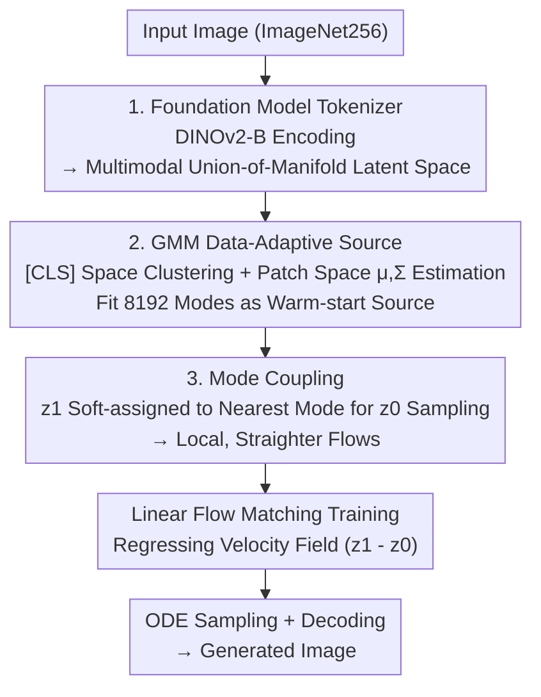

# Flow Matching for Multimodal Distributions

**Conference**: CVPR 2026  
**Paper**: [CVF Open Access](https://openaccess.thecvf.com/content/CVPR2026/html/Luo_Flow_Matching_for_Multimodal_Distributions_CVPR_2026_paper.html)  
**Code**: https://mm-flow.github.io  
**Area**: Image Generation / Flow Matching  
**Keywords**: Flow Matching, Multimodal Distributions, Gaussian Mixture Source, Mode Coupling, DINOv2 Latent Space  

## TL;DR
When adopting a vision foundation model (DINOv2-B) as a tokenizer, the latent space naturally exhibits a multimodal "union of manifolds" structure. This paper uses a Gaussian Mixture Model (GMM) fitted to the target distribution as the source distribution and performs data pairing based on the "nearest mode" (mode coupling). This ensures that probability mass is transported locally, accelerating flow matching training convergence by 30×, reducing sampling steps to 1/5, and achieving FID=2.74 on unconditional ImageNet256 generation (80 epochs).

## Background & Motivation
**Background**: Current SOTA generative models are mostly flow-based (Diffusion + Flow Matching FM). Flow matching gradually transforms a source distribution $p$ into a target distribution $q$ along a designed flow. Once the velocity field is learned, new source samples can be transformed into new target samples. Training is typically performed in a latent space compressed by a tokenizer; thus, the target distribution's complexity is entirely determined by the tokenizer.

**Limitations of Prior Work**: Traditional VAE-based tokenizers (SD-VAE, LDM-VAE) align the latent distribution toward a full-dimensional isotropic Gaussian. The sample complexity of density estimation grows exponentially with the effective dimension—hitting the curse of dimensionality and slowing down training. Recent works have found that using vision foundation models as tokenizers reveals a "Union of Manifolds Hypothesis" structure, significantly reducing the target distribution's complexity. However, these works only optimize the target distribution side.

**Key Challenge**: The learning difficulty of FM is determined by three factors: (1) target distribution complexity, (2) source-target distance, and (3) flow design. Since foundation models already transform the target distribution into a low-complexity **multimodal** distribution, continuing to use an isotropic unimodal Gaussian as the source is suboptimal. Gaussians are "target-blind": the source and target are far apart, requiring large-scale, cross-mode transport. To pull different modes of a multimodal target together, the velocity field inevitably becomes highly curved and difficult to learn.

**Goal**: Given that foundation models provide multimodal targets, redesign the **source distribution** and **data coupling** to make the source-target distance sufficiently close and the flow sufficiently local and straight.

**Key Insight**: A multimodal target suggests using a **multimodal source** (GMM) to approximate it. Once a GMM is fitted, it naturally assigns each target sample to a specific Gaussian mode. This assignment can be used for **mode-wise data pairing** (mode coupling), ensuring probability mass is transported "locally" rather than "across modes."

**Core Idea**: A **co-design** of source distribution and data coupling—a data-adaptive GMM warm-start source combined with mode-dependent coupling, termed **MM-FM (Mixture-Modeling Flow Matching)**.

## Method

### Overall Architecture
The MM-FM pipeline implements three insights to reduce FM learning difficulty: first, a foundation model is used as a tokenizer to reveal a **multimodal target**; second, a GMM is fitted to this multimodal latent distribution to serve as a **warm-start source distribution**, minimizing the source-target distance; third, the mode assignments from the GMM are used for **mode-wise coupling**, ensuring each target latent sample is paired only with noise sampled from its corresponding mode. The resulting flow is local and straight. During training, the standard linear flow matching loss is used with this new source and coupling. For sampling, a mode is first drawn from the GMM, followed by initial noise from that mode, which is then integrated via ODE and passed through a decoder.

### Key Designs

**1. Foundation Model Tokenizer: Shifting Target Distribution from "Full-dim Gaussian" to "Multimodal Union of Manifolds"**

This is the prerequisite for all subsequent steps, addressing the issue where VAE tokenizers flatten the latent distribution into a full-dimensional Gaussian, triggering the curse of dimensionality. The authors use DINOv2-B directly as the encoder (rather than just using foundation models to "regularize" a VAE encoder). The rationale is that DINOv2-B displays higher linear probing accuracy and clearer clusters in t-SNE visualizations, indicating the latent space indeed follows a "union of manifolds" multimodal structure with lower density complexity. The decoder is trained separately following the RAE recipe using $L = L_1(\hat x, x) + \lambda_L \mathrm{LPIPS}(\hat x, x) + \lambda_G \mathrm{GAN}(\hat x, x)$. The decoder is only used for final image generation and is not needed during FM training.

**2. GMM Data-Adaptive Source Distribution: Matching Multimodal Sources to Multimodal Targets**

This addresses the "target-blind" nature of isotropic Gaussian sources. Since the target is multimodal, the authors fit a Gaussian Mixture $p = \sum_{i=1}^{m} c_i\,\mathcal{N}(\mu_i, \Sigma_i)$ to the latent target distribution as the source distribution. The GMM is viewed as a "warm-start estimate" of the target, while FM training further refines it. By sharing modes $\{\mu_k, \Sigma_k\}$ and having "similar shapes" near each mode, the source-target distance is significantly smaller than that of a unimodal Gaussian.

The engineering challenge lies in **estimating GMM in high dimensions**: DINOv2-B encodes images into 768 patch tokens ($16\times16$) plus one 768-dim [CLS] token. Directly estimating GMM on $768\times16\times16$ dimensions is computationally prohibitive. The solution uses the [CLS] token as a global descriptor: GMM is first run in the lower-dimensional [CLS] space to determine cluster memberships; then, for each cluster, the mean and (diagonal) covariance are estimated in the patch-token space. By default, 8192 modes with diagonal covariance and soft assignment are used. The GMM fitting cost is negligible compared to FM training.

**3. Mode Coupling: Enabling Local Probability Transport for Straighter Flows**

This addresses the high curvature of velocity fields caused by cross-mode transport. In standard FM, the source sample $z_0$ and target sample $z_1$ are sampled independently, potentially resulting in flows that traverse the entire space. Ours uses mode-dependent coupling: given a target sample $z_1\sim q$, it is soft-assigned to modes using GMM **posterior responsibilities**, and $z_0$ is sampled from the corresponding mixture:

$$\gamma_{\mathrm{mode}}(z_0 \mid z_1) = \sum_{k=1}^{m} w_k(z_1)\,\mathcal{N}(z_0;\mu_k,\Sigma_k),\qquad w_k(z_1) = \frac{c_k\,\mathcal{N}(z_1;\mu_k,\Sigma_k)}{\sum_{i=1}^{m} c_i\,\mathcal{N}(z_1;\mu_i,\Sigma_i)}.$$

Intuitively, each target sample is paired with noise from "its most likely mode," ensuring mass moves locally within a mode. The training loss remains the Optimal Transport (OT) form of linear flow matching $L^{\mathrm{OT}}_{\mathrm{CFM}}(\theta) = \mathbb{E}_{t,(Z_0,Z_1)\sim\gamma}\,\lVert u^\theta_t(Z_t) - (Z_1 - Z_0)\rVert^2$, where $Z_t = (1-t)Z_0 + tZ_1$. This coupling adds almost no GPU overhead. Unlike BatchOT, which solves mini-batch OT online, mode coupling achieves "locality" directly via GMM assignments.

> ⚠️ A variant is provided where the mode index $k$ is fed as an additional condition to the network to better guide samples at mode boundaries.

### Loss & Training
The objective is the linear FM OT loss $L^{\mathrm{OT}}_{\mathrm{CFM}}$ described above. The only modification is sampling $(Z_0, Z_1)$ via mode coupling. The backbone is DiTDH-XL (Diffusion Transformer acting on structured DINOv2-B latent space). The training budget is 80 epochs. Sampling uses 50-step Euler ODE; in the unconditional setting, AutoGuidance is used instead of classifier-free guidance.

**Mechanism**: Under the assumption that the target is a uniform mixture of affine-translated unimodal densities, the authors prove that with a multimodal source and mode coupling, the complexity measures—straightness, total length (Len), and the Lipschitz constant of the velocity field—do not exceed those of the corresponding unimodal problem, scaled by a constant $\frac{1}{m}\sum_k\lVert\Sigma_k\rVert_{\mathrm{op}}\le 1$ (Thm 3.1). Conversely (Thm 3.2), using a unimodal source with independent coupling can lead to an arbitrarily large average Lipschitz constant.

## Key Experimental Results

### Main Results
Unconditional generation on ImageNet-256 using DiTDH-XL (839M), 50-step ODE, evaluated with FID (lower is better) and IS. The baseline uses the same backbone with a Gaussian source and independent coupling.

| Config | Epoch | Source / Coupling | FID (No Guidance) | FID (AutoGuidance) | IS (No Guidance) |
|------|-------|-----------|---------------|----------------------|---------------|
| DiTDH-XL baseline | 80 | Gaussian / Indep. | 9.33 | 5.82 | 90.6 |
| DiTDH-XL baseline | 200 | Gaussian / Indep. | — | 4.96 | — |
| MM-FM | 80 | GMM / Indep. | 3.82 | 3.23 | 192.3 |
| **MM-FM** | **80** | **GMM / Mode** | **3.18** | **2.74** | **211.2** |

At 80 epochs, switching from "Gaussian+Indep" to "GMM+Mode" improves unguided FID from 9.33 to 3.18 (2.44×). With AutoGuidance, it reaches **2.74**, outperforming the fully-trained RCG and surpassing DLC by 45%—all in an **unlabeled** unconditional setting. The paper claims a 30× faster convergence relative to the classic FM recipe.

### Ablation Study: Synergy of Source and Coupling + Number of Modes
Toy experiments ($\mathbb{R}^{10}$) demonstrate that "replacing the source with GMM is insufficient without mode coupling":

| Setting | Source | Coupling | Len ↓ | $W_2^2$ ↓ |
|------|----|------|-------|-----------|
| Compact | Gaussian | Indep. | 1.88 | 1.252 |
| Compact | GMM | Indep. | 1.82 | 1.251 |
| Compact | GMM | Mode | **1.67** | **1.248** |
| Spread | Gaussian | Indep. | 2.35 | 1.582 |
| Spread | GMM | Indep. | 2.30 | 1.631 |
| Spread | GMM | Mode | **2.00** | **1.556** |

Only using GMM source with independent coupling barely changes the path length (Len). Only with mode coupling do both the path length and Wasserstein distance decrease, validating the necessity of **co-design**. On real data, more modes lead to faster convergence, benefiting even when the mode count far exceeds the ImageNet class count.

### Key Findings
- **Synergy is Essential**: Changing the GMM source alone is ineffective; mode coupling is required to implement "local transport."
- **More Modes, Better Performance**: Performance scales with mode count beyond 1000, showing latent structures are richer than human labels.
- **Data Efficiency**: Under a 10% data constraint, MM-FM reduces FID from 24.65 to 8.04 (~3× lower), confirming that lower learning complexity reduces data requirements.

## Highlights & Insights
- **The Ignored Axis of "Source-Target Distance"**: While many works focus on target complexity (tokenizers), this work points out that once a foundation model provides a multimodal target, the source should naturally follow suit.
- **GMM Fitting Naturally Generates Coupling**: Mode assignment, a byproduct of GMM fitting, is used to define mode coupling. Source and coupling design become a single unified task.
- **[CLS]→Patch High-dimensional GMM**: The sub-routine of clustering in low-dim global space then estimating Gaussians in patch space is a key engineering trick for handling high-dim latent spaces.
- **Theoretical-Empirical Alignment**: Complexity bounds (straightness/length/Lipschitz) explain why the method allows for fewer sampling steps and easier learning.

## Limitations & Future Work
- **Dependency on Tokenizer Multimodality**: The method assumes a clear union-of-manifold structure in the latent space. If the tokenizer does not provide this, the gains from GMM and mode coupling diminish.
- **Strong Theoretical Assumptions**: Theorem 3.1 assumes specific mixture structures and separate modes, which may not fully capture real latent distributions.
- **Unconditional Focus**: The evaluation is limited to unconditional ImageNet256. Scaling to higher resolutions or text-to-image conditional generation remains unexplored.
- **Adaptive Updates**: A potential improvement is to update the GMM adaptively during training rather than using a one-time fit.

## Related Work & Insights
- **vs. Classic FM**: Standard FM uses target-blind sources and curved flows; Ours uses GMM source + mode coupling to make flows local and straight.
- **vs. CondPrior**: Both use GMM sources, but CondPrior relies on VAE latents and human class labels. VAE latents are often poorly clustered, whereas foundation models reveal true multimodal structures without labels.
- **vs. MixSGM**: Share the local coupling idea but MixSGM is limited to pixel space (MNIST/CIFAR); Ours scales to high-resolution natural images via foundation models.

## Rating
- Novelty: ⭐⭐⭐⭐ Target-aware co-design of source and coupling is a fresh perspective with solid theory.
- Experimental Thoroughness: ⭐⭐⭐⭐ Extensive ablations and efficiency metrics, though limited to unconditional ImageNet.
- Writing Quality: ⭐⭐⭐⭐ Clear progression from insights to implementation.
- Value: ⭐⭐⭐⭐ Significant gains in training, inference, and data efficiency for resource-constrained scenarios.

<!-- RELATED:START -->

## Related Papers

- [\[CVPR 2026\] Few-shot Acoustic Synthesis with Multimodal Flow Matching](few-shot_acoustic_synthesis_with_multimodal_flow_matching.md)
- [\[CVPR 2026\] Stable Mean Flow: Lyapunov-Inspired One-Step Flow Matching](stable_mean_flow_lyapunov-inspired_one-step_flow_matching.md)
- [\[CVPR 2026\] Spatiotemporal Pyramid Flow Matching for Climate Emulation](spatiotemporal_pyramid_flow_matching_for_climate_emulation.md)
- [\[CVPR 2026\] Frequency-Aware Flow Matching for High-Quality Image Generation](freqflow_frequency_aware_flow_matching.md)
- [\[CVPR 2026\] RenderFlow: Single-Step Neural Rendering via Flow Matching](renderflow_single-step_neural_rendering_via_flow_matching.md)

<!-- RELATED:END -->
